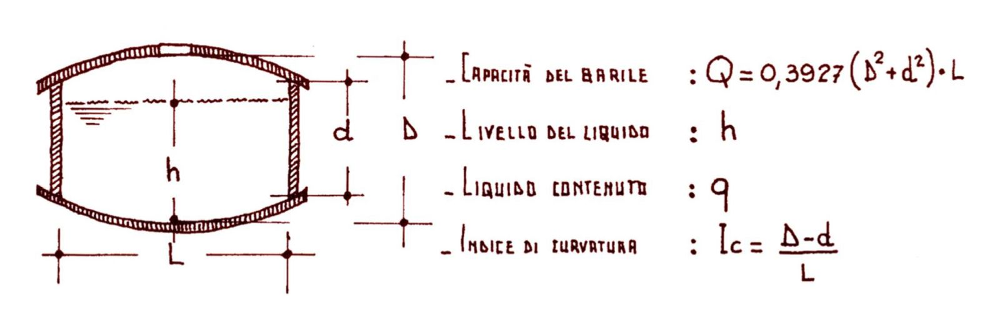

```{=html}
<p class="eyebrow"><span class="l" lang="it">L'acetaia</span><span class="l" lang="en">The acetaia</span><span class="l" lang="de">Die Acetaia</span><span class="l" lang="es">La acetaia</span><span class="l" lang="fr">L'acetaia</span><span class="l" lang="pt">A acetaia</span></p>
<h1><span class="l" lang="it">Tre batterie, sedici botti, un fienile ristrutturato a Ponte Motta di Cavezzo</span><span class="l" lang="en">Three batteries, sixteen barrels, one restored hayloft in Ponte Motta, Cavezzo</span><span class="l" lang="de">Drei Batterien, sechzehn Fässer, eine restaurierte Scheune in Ponte Motta, Cavezzo</span><span class="l" lang="es">Tres baterías, dieciséis barriles, un pajar restaurado en Ponte Motta, Cavezzo</span><span class="l" lang="fr">Trois batteries, seize fûts, une grange restaurée à Ponte Motta, Cavezzo</span><span class="l" lang="pt">Três baterias, dezesseis barris, um celeiro restaurado em Ponte Motta, Cavezzo</span></h1>
```

::: {.l lang=it}
L'Acetaia Insieme è composta da tre batterie, A, B e C, acquisite nel 2024 e seguite con misure regolari di acidità e densità. Le botti sono numerate dalla più piccola alla più grande (A1 è la botte da 15 litri, A5 quella da 50). Qui trovate i parametri di ogni batteria, i legni, i volumi stimati, le condizioni all'interno dell'acetaia e la cronologia dei lavori. I grafici dell'andamento di densità e acidità sono nella scheda **Misure e grafici**; temperatura e umidità nella scheda **Temperatura e umidità**.

::: {.callout-ai}
**Produzione familiare.** La nostra è un'acetaia di famiglia. Non siamo associati al [Consorzio Tutela Aceto Balsamico Tradizionale di Modena](https://www.balsamicotradizionale.it/il-consorzio/) e il nostro aceto non è un prodotto DOP. Facciamo parte di un grande insieme di famiglie che producono aceto per le proprie necessità, per regalarlo agli amici e per condividere conoscenza: la [community del Balsamico familiare al vasèl](https://www.alvasel.com).
:::
:::

::: {.l lang=en}
Acetaia Insieme consists of three batteries, A, B and C, acquired in 2024 and followed with regular measurements of acidity and density. Barrels are numbered from the smallest to the largest (A1 is the 15-litre barrel, A5 the 50-litre one). Here you find the parameters of each battery, the woods, the estimated volumes, the conditions inside the acetaia and the timeline of the work. The charts of density and acidity over time are in the **Measurements and charts** tab; temperature and humidity in the **Temperature and humidity** tab.

::: {.callout-ai}
**Family production.** Ours is a family acetaia. We are not associated with the [Consorzio Tutela Aceto Balsamico Tradizionale di Modena](https://www.balsamicotradizionale.it/il-consorzio/) and our vinegar is not a PDO product. We belong to a large gathering of families who make vinegar for their own needs, to give to friends and to share knowledge: the [al vasèl community of family balsamic makers](https://www.alvasel.com).
:::
:::

::: {.l lang=de}
Die Acetaia Insieme besteht aus drei Batterien, A, B und C, die 2024 erworben wurden und regelmäßig auf Säure und Dichte gemessen werden. Die Fässer sind vom kleinsten zum größten nummeriert (A1 ist das 15-Liter-Fass, A5 das 50-Liter-Fass). Hier findet ihr die Parameter jeder Batterie, die Hölzer, die geschätzten Volumen, die Bedingungen im Inneren der Acetaia und die Chronik der Arbeiten. Die Grafiken zum Verlauf von Dichte und Säure sind im Reiter **Messungen und Grafiken**; Temperatur und Luftfeuchte im Reiter **Temperatur und Luftfeuchte**.

::: {.callout-ai}
**Familienproduktion.** Unsere Acetaia ist eine Familien-Acetaia. Wir sind nicht Mitglied des [Consorzio Tutela Aceto Balsamico Tradizionale di Modena](https://www.balsamicotradizionale.it/il-consorzio/) und unser Essig ist kein DOP-Produkt. Wir gehören zu einem großen Kreis von Familien, die Essig für den Eigenbedarf, als Geschenk für Freunde und zum Wissensaustausch herstellen: der [al vasèl-Community des familiären Balsamico](https://www.alvasel.com).
:::
:::
::: {.l lang=es}
La Acetaia Insieme está compuesta por tres baterías, A, B y C, adquiridas en 2024 y seguidas con medidas regulares de acidez y densidad. Los barriles están numerados del más pequeño al más grande (A1 es el barril de 15 litros, A5 el de 50). Aquí encontraréis los parámetros de cada batería, las maderas, los volúmenes estimados, las condiciones en el interior de la acetaia y la cronología de los trabajos. Los gráficos de la evolución de densidad y acidez están en la pestaña **Medidas y gráficos**; temperatura y humedad en la pestaña **Temperatura y humedad**.

::: {.callout-ai}
**Producción familiar.** La nuestra es una acetaia de familia. No estamos asociados al [Consorzio Tutela Aceto Balsamico Tradizionale di Modena](https://www.balsamicotradizionale.it/il-consorzio/) y nuestro vinagre no es un producto DOP. Formamos parte de un gran conjunto de familias que producen vinagre para sus propias necesidades, para regalarlo a los amigos y para compartir conocimiento: la [comunidad del Balsámico familiar al vasèl](https://www.alvasel.com).
:::
:::
::: {.l lang=fr}
L'Acetaia Insieme se compose de trois batteries, A, B et C, acquises en 2024 et suivies par des mesures régulières d'acidité et de densité. Les fûts sont numérotés du plus petit au plus grand (A1 est le fût de 15 litres, A5 celui de 50). Vous trouverez ici les paramètres de chaque batterie, les bois, les volumes estimés, les conditions à l'intérieur de l'acetaia et la chronologie des travaux. Les graphiques de l'évolution de la densité et de l'acidité sont dans l'onglet **Mesures et graphiques** ; la température et l'humidité dans l'onglet **Température et humidité**.

::: {.callout-ai}
**Production familiale.** Notre acetaia est une acetaia de famille. Nous ne sommes pas membres du [Consorzio Tutela Aceto Balsamico Tradizionale di Modena](https://www.balsamicotradizionale.it/il-consorzio/) et notre vinaigre n'est pas un produit AOP (DOP). Nous faisons partie d'un grand ensemble de familles qui produisent du vinaigre pour leurs propres besoins, pour l'offrir aux amis et pour partager leurs connaissances : la [communauté du Balsamique familial al vasèl](https://www.alvasel.com).
:::
:::
::: {.l lang=pt}
A Acetaia Insieme é composta por três baterias, A, B e C, adquiridas em 2024 e acompanhadas com medições regulares de acidez e densidade. Os barris são numerados do menor ao maior (A1 é o barril de 15 litros, A5 o de 50). Aqui vocês encontram os parâmetros de cada bateria, as madeiras, os volumes estimados, as condições no interior da acetaia e a cronologia dos trabalhos. Os gráficos da evolução de densidade e acidez estão na aba **Medições e gráficos**; temperatura e umidade na aba **Temperatura e umidade**.

::: {.callout-ai}
**Produção familiar.** A nossa é uma acetaia de família. Não somos associados ao [Consorzio Tutela Aceto Balsamico Tradizionale di Modena](https://www.balsamicotradizionale.it/il-consorzio/) e o nosso vinagre não é um produto DOP. Fazemos parte de um grande conjunto de famílias que produzem vinagre para as próprias necessidades, para presentear os amigos e para compartilhar conhecimento: a [comunidade do Balsâmico familiar al vasèl](https://www.alvasel.com).
:::
:::

::: {.panel-tabset}

## [Batterie]{.l lang=it}[Batteries]{.l lang=en}[Batterien]{.l lang=de}[Baterías]{.l lang=es}[Batteries]{.l lang=fr}[Baterias]{.l lang=pt}

::: {.l lang=it}
Ogni batteria è una fila di botti di volume decrescente: ogni anno si preleva dalla più piccola e si rincalza a cascata dalla più grande, che riceve il mosto cotto nuovo. I disegni mostrano la composizione delle nostre tre batterie; i colori indicano il legno. Le batterie A e C offrono un aceto invecchiato tra 12 e 24 anni; la batteria B un extravecchio con più di 25 anni. Castagno e rovere sono i legni basilari; ciliegio, gelso, acacia e frassino aggiungono le loro note. Il ruolo di ogni legno è spiegato nella pagina [Imparare](imparare.qmd).
:::
::: {.l lang=en}
Each battery is a row of barrels of decreasing volume: every year vinegar is drawn from the smallest, and each barrel is topped up in cascade from the next larger one, the largest receiving the new cooked must. The drawings show the composition of our three batteries; colours indicate the wood. Batteries A and C offer vinegar aged between 12 and 24 years; battery B an extra-aged vinegar of more than 25 years. Chestnut and oak are the basic woods; cherry, mulberry, acacia and ash add their notes. The role of each wood is explained on the [Learn](imparare.qmd) page.
:::
::: {.l lang=de}
Jede Batterie ist eine Reihe von Fässern mit abnehmendem Volumen: jedes Jahr wird aus dem kleinsten entnommen und in Kaskade aus dem jeweils größeren nachgefüllt; das größte bekommt den neuen gekochten Most. Die Zeichnungen zeigen die Zusammensetzung unserer drei Batterien; die Farben stehen für das Holz. Die Batterien A und C liefern einen 12 bis 24 Jahre gereiften Essig; Batterie B einen Extravecchio mit über 25 Jahren. Kastanie und Eiche sind die Grundhölzer; Kirsche, Maulbeere, Akazie und Esche steuern ihre Noten bei. Die Rolle jedes Holzes wird auf der Seite [Lernen](imparare.qmd) erklärt.
:::
::: {.l lang=es}
Cada batería es una hilera de barriles de volumen decreciente: cada año se extrae del más pequeño y se rellena en cascada desde el más grande, que recibe el mosto cocido nuevo. Los dibujos muestran la composición de nuestras tres baterías; los colores indican la madera. Las baterías A y C ofrecen un vinagre envejecido entre 12 y 24 años; la batería B un extraviejo de más de 25 años. Castaño y roble son las maderas básicas; el cerezo, la morera, la acacia y el fresno añaden sus notas. El papel de cada madera se explica en la página [Aprender](imparare.qmd).
:::
::: {.l lang=fr}
Chaque batterie est une rangée de fûts de volume décroissant : chaque année, on prélève dans le plus petit et on remplit en cascade à partir du plus grand, qui reçoit le moût cuit nouveau. Les dessins montrent la composition de nos trois batteries ; les couleurs indiquent le bois. Les batteries A et C donnent un vinaigre vieilli de 12 à 24 ans ; la batterie B un extra-vieux de plus de 25 ans. Le châtaignier et le chêne sont les bois de base ; le cerisier, le mûrier, l'acacia et le frêne ajoutent leurs notes. Le rôle de chaque bois est expliqué sur la page [Apprendre](imparare.qmd).
:::
::: {.l lang=pt}
Cada bateria é uma fileira de barris de volume decrescente: todo ano se retira do menor e se faz a reposição em cascata a partir do maior, que recebe o mosto cozido novo. Os desenhos mostram a composição das nossas três baterias; as cores indicam a madeira. As baterias A e C oferecem um vinagre envelhecido entre 12 e 24 anos; a bateria B, um extravelho com mais de 25 anos. Castanheira e carvalho são as madeiras básicas; a cerejeira, a amoreira, a acácia e o freixo acrescentam as suas notas. O papel de cada madeira é explicado na página [Aprender](imparare.qmd).
:::



```{=html}

```

## [Misure e grafici]{.l lang=it}[Measurements and charts]{.l lang=en}[Messungen und Grafiken]{.l lang=de}[Medidas y gráficos]{.l lang=es}[Mesures et graphiques]{.l lang=fr}[Medições e gráficos]{.l lang=pt}

::: {.l lang=it}
Seguiamo le tre batterie con due parametri fondamentali, misurati botte per botte.

**Densità, in gradi Brix (°Brix).** Il grado Brix indica quanti grammi di zucchero ci sono in 100 grammi di soluzione: un mosto a 30 °Brix ha circa il 30 % di zuccheri. Lo misuriamo con il rifrattometro, che legge quanto la luce si piega attraversando una goccia di liquido. Nelle botti la densità cresce anno dopo anno, perché l'acqua evapora attraverso il legno e gli zuccheri si concentrano; oltre 72–73 °Brix il balsamico comincia a cristallizzare.

**Acidità totale, in % (grammi di acido acetico per 100 ml).** La misuriamo per titolazione: a 1 ml di aceto diluito in acqua distillata aggiungiamo poche gocce di fenolftaleina e poi soda (NaOH 0,1 N) goccia a goccia finché la soluzione vira al rosa; i millilitri di soda usati, moltiplicati per 0,6, danno la percentuale di acidità. Il procedimento passo per passo è nella pagina [Imparare](imparare.qmd). Un'acidità sempre sopra il 3 % protegge dalle muffe; nelle botti si assesta col tempo, mentre la parte volatile evapora.

Le analisi indicate come *Enologica* sono fatte da <a href="https://www.enologicamodenese.it">Enologica Modenese</a>, il negozio di Modena dove ci riforniamo e che esegue le analisi; le altre le facciamo in casa. Ultimo controllo: 14 marzo 2026.
:::
::: {.l lang=en}
We follow the three batteries with two fundamental parameters, measured barrel by barrel.

**Density, in degrees Brix (°Brix).** The Brix degree tells how many grams of sugar there are in 100 grams of solution: a must at 30 °Brix has about 30 % sugar. We measure it with a refractometer, which reads how much light bends passing through a drop of liquid. In the barrels density rises year after year, because water evaporates through the wood and sugars concentrate; above 72–73 °Brix balsamic vinegar starts to crystallise.

**Total acidity, in % (grams of acetic acid per 100 ml).** We measure it by titration: to 1 ml of vinegar diluted in distilled water we add a few drops of phenolphthalein and then sodium hydroxide (NaOH 0.1 N) drop by drop until the solution turns pink; the millilitres of NaOH used, multiplied by 0.6, give the acidity percentage. The step-by-step procedure is on the [Learn](imparare.qmd) page. An acidity always above 3 % protects against moulds; in the barrels it settles over time, while the volatile part evaporates.

Analyses marked *Enologica* are done by <a href="https://www.enologicamodenese.it">Enologica Modenese</a>, the shop in Modena where we buy supplies and which runs the analyses; the others we do at home. Last check: 14 March 2026.
:::
::: {.l lang=de}
Wir begleiten die drei Batterien mit zwei grundlegenden Parametern, Fass für Fass gemessen.

**Dichte, in Grad Brix (°Brix).** Der Brix-Grad gibt an, wie viele Gramm Zucker in 100 Gramm Lösung enthalten sind: ein Most mit 30 °Brix hat etwa 30 % Zucker. Wir messen ihn mit dem Refraktometer, das misst, wie stark Licht beim Durchgang durch einen Tropfen gebrochen wird. In den Fässern steigt die Dichte Jahr für Jahr, weil Wasser durch das Holz verdunstet und der Zucker sich konzentriert; über 72–73 °Brix beginnt der Balsamico zu kristallisieren.

**Gesamtsäure, in % (Gramm Essigsäure pro 100 ml).** Wir messen sie durch Titration: zu 1 ml Essig, verdünnt in destilliertem Wasser, geben wir einige Tropfen Phenolphthalein und dann tropfenweise Natronlauge (NaOH 0,1 N), bis die Lösung rosa wird; die verbrauchten Milliliter NaOH mal 0,6 ergeben den Säuregehalt in Prozent. Die Schritt-für-Schritt-Anleitung steht auf der Seite [Lernen](imparare.qmd). Eine Säure stets über 3 % schützt vor Schimmel; in den Fässern pendelt sie sich mit der Zeit ein, während der flüchtige Teil verdunstet.

Als *Enologica* markierte Analysen stammen von <a href="https://www.enologicamodenese.it">Enologica Modenese</a>, dem Geschäft in Modena, wo wir einkaufen und das die Analysen durchführt; die übrigen machen wir zu Hause. Letzte Kontrolle: 14. März 2026.
:::
::: {.l lang=es}
Seguimos las tres baterías con dos parámetros fundamentales, medidos barril por barril.

**Densidad, en grados Brix (°Brix).** El grado Brix indica cuántos gramos de azúcar hay en 100 gramos de solución: un mosto a 30 °Brix tiene aproximadamente un 30 % de azúcares. La medimos con el refractómetro, que lee cuánto se desvía la luz al atravesar una gota de líquido. En los barriles la densidad crece año tras año, porque el agua se evapora a través de la madera y los azúcares se concentran; por encima de 72–73 °Brix el balsámico empieza a cristalizar.

**Acidez total, en % (gramos de ácido acético por 100 ml).** La medimos por titulación: a 1 ml de vinagre diluido en agua destilada le añadimos unas gotas de fenolftaleína y después sosa (NaOH 0,1 N) gota a gota hasta que la solución vira a rosa; los mililitros de sosa empleados, multiplicados por 0,6, dan el porcentaje de acidez. El procedimiento paso a paso está en la página [Aprender](imparare.qmd). Una acidez siempre por encima del 3 % protege de los mohos; en los barriles se estabiliza con el tiempo, mientras la parte volátil se evapora.

Los análisis indicados como *Enologica* los realiza <a href="https://www.enologicamodenese.it">Enologica Modenese</a>, la tienda de Módena donde nos abastecemos y que efectúa los análisis; los demás los hacemos en casa. Último control: 14 de marzo de 2026.
:::
::: {.l lang=fr}
Nous suivons les trois batteries avec deux paramètres fondamentaux, mesurés fût par fût.

**Densité, en degrés Brix (°Brix).** Le degré Brix indique combien de grammes de sucre il y a dans 100 grammes de solution : un moût à 30 °Brix contient environ 30 % de sucres. Nous le mesurons avec le réfractomètre, qui lit à quel point la lumière se courbe en traversant une goutte de liquide. Dans les fûts, la densité augmente d'année en année, parce que l'eau s'évapore à travers le bois et que les sucres se concentrent ; au-delà de 72–73 °Brix, le balsamique commence à cristalliser.

**Acidité totale, en % (grammes d'acide acétique pour 100 ml).** Nous la mesurons par titrage : à 1 ml de vinaigre dilué dans de l'eau distillée, nous ajoutons quelques gouttes de phénolphtaléine, puis de la soude (NaOH 0,1 N) goutte à goutte jusqu'à ce que la solution vire au rose ; les millilitres de soude utilisés, multipliés par 0,6, donnent le pourcentage d'acidité. La procédure pas à pas est sur la page [Apprendre](imparare.qmd). Une acidité toujours supérieure à 3 % protège des moisissures ; dans les fûts, elle se stabilise avec le temps, tandis que la partie volatile s'évapore.

Les analyses indiquées comme *Enologica* sont réalisées par <a href="https://www.enologicamodenese.it">Enologica Modenese</a>, la boutique de Modène où nous nous fournissons et qui effectue les analyses ; les autres, nous les faisons à la maison. Dernier contrôle : 14 mars 2026.
:::
::: {.l lang=pt}
Acompanhamos as três baterias com dois parâmetros fundamentais, medidos barril por barril.

**Densidade, em graus Brix (°Brix).** O grau Brix indica quantos gramas de açúcar há em 100 gramas de solução: um mosto a 30 °Brix tem cerca de 30 % de açúcares. Nós a medimos com o refratômetro, que lê o quanto a luz se desvia ao atravessar uma gota de líquido. Nos barris a densidade cresce ano após ano, porque a água evapora através da madeira e os açúcares se concentram; acima de 72–73 °Brix o balsâmico começa a cristalizar.

**Acidez total, em % (gramas de ácido acético por 100 ml).** Nós a medimos por titulação: a 1 ml de vinagre diluído em água destilada acrescentamos algumas gotas de fenolftaleína e depois soda (NaOH 0,1 N) gota a gota até a solução virar para o rosa; os mililitros de soda usados, multiplicados por 0,6, dão a porcentagem de acidez. O procedimento passo a passo está na página [Aprender](imparare.qmd). Uma acidez sempre acima de 3 % protege contra os mofos; nos barris ela se estabiliza com o tempo, enquanto a parte volátil evapora.

As análises indicadas como *Enologica* são feitas pela <a href="https://www.enologicamodenese.it">Enologica Modenese</a>, a loja de Módena onde nos abastecemos e que realiza as análises; as outras fazemos em casa. Último controle: 14 de março de 2026.
:::

```{=html}


<h3><span class="l" lang="it">Andamento nel tempo, botte per botte</span><span class="l" lang="en">Evolution over time, barrel by barrel</span><span class="l" lang="de">Verlauf im Zeitablauf, Fass für Fass</span><span class="l" lang="es">Evolución en el tiempo, barril por barril</span><span class="l" lang="fr">Évolution dans le temps, fût par fût</span><span class="l" lang="pt">Evolução no tempo, barril por barril</span></h3>
<p><small><span class="l" lang="it">Un riquadro per ogni botte, con il disegno della botte (colore del legno, dimensione proporzionale al volume) e gli ultimi valori misurati: la linea piena è la densità (°Brix, asse sinistro), quella tratteggiata l'acidità totale (%, asse destro). Passando il mouse si legge il valore. La prima misura del 21 settembre 2024 riguarda solo la batteria B; il 15 febbraio 2025 è stata misurata solo la densità.</span><span class="l" lang="en">One panel per barrel, with the barrel drawing (wood colour, size proportional to volume) and the latest measured values: the solid line is density (°Brix, left axis), the dashed line total acidity (%, right axis). Hover to read the value. The first measurement of 21 September 2024 covers battery B only; on 15 February 2025 only density was measured.</span><span class="l" lang="de">Ein Feld pro Fass, mit der Fasszeichnung (Holzfarbe, Größe proportional zum Volumen) und den zuletzt gemessenen Werten: die durchgezogene Linie ist die Dichte (°Brix, linke Achse), die gestrichelte die Gesamtsäure (%, rechte Achse). Beim Überfahren mit der Maus wird der Wert angezeigt. Die erste Messung vom 21. September 2024 betrifft nur Batterie B; am 15. Februar 2025 wurde nur die Dichte gemessen.</span><span class="l" lang="es">Un recuadro para cada barril, con el dibujo del barril (color de la madera, tamaño proporcional al volumen) y los últimos valores medidos: la línea continua es la densidad (°Brix, eje izquierdo), la discontinua la acidez total (%, eje derecho). Al pasar el ratón se lee el valor. La primera medida del 21 de septiembre de 2024 se refiere solo a la batería B; el 15 de febrero de 2025 se midió solo la densidad.</span><span class="l" lang="fr">Un encadré pour chaque fût, avec le dessin du fût (couleur du bois, taille proportionnelle au volume) et les dernières valeurs mesurées : la ligne pleine est la densité (°Brix, axe de gauche), la ligne en pointillés l'acidité totale (%, axe de droite). En passant la souris, on lit la valeur. La première mesure du 21 septembre 2024 ne concerne que la batterie B ; le 15 février 2025, seule la densité a été mesurée.</span><span class="l" lang="pt">Um quadro para cada barril, com o desenho do barril (cor da madeira, tamanho proporcional ao volume) e os últimos valores medidos: a linha cheia é a densidade (°Brix, eixo esquerdo), a tracejada é a acidez total (%, eixo direito). Passando o mouse, lê-se o valor. A primeira medida, de 21 de setembro de 2024, refere-se apenas à bateria B; em 15 de fevereiro de 2025 foi medida apenas a densidade.</span></small></p>
<div class="chart-legend"><span class="lg-brix">— °Brix</span> <span class="lg-acid">- - <span class="l" lang="it">acidità %</span><span class="l" lang="en">acidity %</span><span class="l" lang="de">Säure %</span><span class="l" lang="es">acidez %</span><span class="l" lang="fr">acidité %</span><span class="l" lang="pt">acidez %</span></span></div>
<h4><span class="l" lang="it">Batteria A</span><span class="l" lang="en">Battery A</span><span class="l" lang="de">Batterie A</span><span class="l" lang="es">Batería A</span><span class="l" lang="fr">Batterie A</span><span class="l" lang="pt">Bateria A</span></h4>
<div class="mini-grid" id="grid-A"></div>
<h4><span class="l" lang="it">Batteria B</span><span class="l" lang="en">Battery B</span><span class="l" lang="de">Batterie B</span><span class="l" lang="es">Batería B</span><span class="l" lang="fr">Batterie B</span><span class="l" lang="pt">Bateria B</span></h4>
<div class="mini-grid" id="grid-B"></div>
<h4><span class="l" lang="it">Batteria C</span><span class="l" lang="en">Battery C</span><span class="l" lang="de">Batterie C</span><span class="l" lang="es">Batería C</span><span class="l" lang="fr">Batterie C</span><span class="l" lang="pt">Bateria C</span></h4>
<div class="mini-grid" id="grid-C"></div>

<h3 id="dati"><span class="l" lang="it">Dati aperti: consulta e scarica</span><span class="l" lang="en">Open data: consult and download</span><span class="l" lang="de">Offene Daten: ansehen und herunterladen</span><span class="l" lang="es">Datos abiertos: consulta y descarga</span><span class="l" lang="fr">Données ouvertes : consultez et téléchargez</span><span class="l" lang="pt">Dados abertos: consulte e baixe</span></h3>
<p class="l" lang="it">Crediamo nella trasparenza: tutti i dati delle batterie e delle misure di temperatura e umidità sono a disposizione di chiunque voglia consultarli, verificarli o darci suggerimenti. I file sono aggiornati a ogni campagna di misure.</p>
<p class="l" lang="en">We believe in transparency: all the batteries' data and the temperature and humidity measurements are available to anyone who wants to consult them, check them or give us suggestions. The files are updated after every measurement campaign.</p>
<p class="l" lang="de">Wir glauben an Transparenz: alle Daten der Batterien und die Temperatur- und Luftfeuchtemessungen stehen jedem zur Verfügung, der sie einsehen, prüfen oder uns Vorschläge machen möchte. Die Dateien werden nach jeder Messkampagne aktualisiert.</p><p class="l" lang="es">Creemos en la transparencia: todos los datos de las baterías y las medidas de temperatura y humedad están a disposición de cualquiera que quiera consultarlos, verificarlos o darnos sugerencias. Los archivos se actualizan en cada campaña de medidas.</p><p class="l" lang="fr">Nous croyons à la transparence : toutes les données des batteries et les mesures de température et d'humidité sont à la disposition de quiconque souhaite les consulter, les vérifier ou nous faire des suggestions. Les fichiers sont mis à jour à chaque campagne de mesures.</p><p class="l" lang="pt">Acreditamos na transparência: todos os dados das baterias e as medições de temperatura e umidade estão à disposição de quem quiser consultá-los, verificá-los ou nos dar sugestões. Os arquivos são atualizados a cada campanha de medições.</p>
<p class="downloads">
  <a class="btn-ai" href="assets/dati_batterie_acetaia_insieme.csv" download>⬇ <span class="l" lang="it">Dati batterie (CSV)</span><span class="l" lang="en">Battery data (CSV)</span><span class="l" lang="de">Daten der Batterien (CSV)</span><span class="l" lang="es">Datos baterías (CSV)</span><span class="l" lang="fr">Données batteries (CSV)</span><span class="l" lang="pt">Dados baterias (CSV)</span></a>
</p>
<p><small><span class="l" lang="it">Licenza: dati liberamente riutilizzabili citando "Acetaia Insieme, Cavezzo". Suggerimenti e correzioni: scriveteci dalla pagina Contatti.</span><span class="l" lang="en">Licence: data freely reusable citing "Acetaia Insieme, Cavezzo". Suggestions and corrections: write to us from the Contact page.</span><span class="l" lang="de">Lizenz: Daten frei nutzbar unter Angabe von „Acetaia Insieme, Cavezzo". Vorschläge und Korrekturen: schreibt uns über die Kontaktseite.</span><span class="l" lang="es">Licencia: datos libremente reutilizables citando "Acetaia Insieme, Cavezzo". Sugerencias y correcciones: escribidnos desde la página Contacto.</span><span class="l" lang="fr">Licence : données librement réutilisables en citant « Acetaia Insieme, Cavezzo ». Suggestions et corrections : écrivez-nous depuis la page Contacts.</span><span class="l" lang="pt">Licença: dados livremente reutilizáveis citando "Acetaia Insieme, Cavezzo". Sugestões e correções: escrevam para nós pela página Contatos.</span></small></p>
```

## [Volume delle botti]{.l lang=it}[Barrel volume]{.l lang=en}[Fassvolumen]{.l lang=de}[Volumen de los barriles]{.l lang=es}[Volume des fûts]{.l lang=fr}[Volume dos barris]{.l lang=pt}

::: {.l lang=it}
Il volume nominale scritto su una botte raramente coincide con quello reale. Per stimarlo abbiamo misurato il diametro delle teste (d), il diametro della pancia (D), la lunghezza (L) e lo spessore delle doghe, e applicato la formula del cilindro equivalente riportata nel [Notiziario della Consorteria dell'Aceto Balsamico Tradizionale](https://www.consorteria-abtm.it/notiziario/) (aprile 1998, formula n. 3): la capacità è quella di un cilindro con base pari alla media delle superfici dei due cerchi.
:::
::: {.l lang=en}
The nominal volume written on a barrel rarely matches the real one. To estimate it we measured the head diameter (d), the belly diameter (D), the length (L) and the stave thickness, and applied the equivalent-cylinder formula from the [Newsletter of the Consorteria dell'Aceto Balsamico Tradizionale](https://www.consorteria-abtm.it/notiziario/) (April 1998, formula no. 3): the capacity is that of a cylinder whose base is the mean of the areas of the two circles.
:::
::: {.l lang=de}
Das auf einem Fass angegebene Nennvolumen stimmt selten mit dem tatsächlichen überein. Zur Schätzung haben wir den Bodendurchmesser (d), den Bauchdurchmesser (D), die Länge (L) und die Daubenstärke gemessen und die Formel des äquivalenten Zylinders aus dem [Notiziario der Consorteria dell'Aceto Balsamico Tradizionale](https://www.consorteria-abtm.it/notiziario/) (April 1998, Formel Nr. 3) angewendet: das Fassungsvermögen entspricht einem Zylinder, dessen Grundfläche der Mittelwert der beiden Kreisflächen ist.
:::
::: {.l lang=es}
El volumen nominal escrito en un barril raramente coincide con el real. Para estimarlo hemos medido el diámetro de las cabezas (d), el diámetro de la panza (D), la longitud (L) y el grosor de las duelas, y hemos aplicado la fórmula del cilindro equivalente recogida en el [Notiziario de la Consorteria dell'Aceto Balsamico Tradizionale](https://www.consorteria-abtm.it/notiziario/) (abril de 1998, fórmula n.º 3): la capacidad es la de un cilindro cuya base es la media de las superficies de los dos círculos.
:::
::: {.l lang=fr}
Le volume nominal inscrit sur un fût coïncide rarement avec le volume réel. Pour l'estimer, nous avons mesuré le diamètre des fonds (d), le diamètre du bouge (D), la longueur (L) et l'épaisseur des douelles, puis appliqué la formule du cylindre équivalent publiée dans le [Notiziario de la Consorteria dell'Aceto Balsamico Tradizionale](https://www.consorteria-abtm.it/notiziario/) (avril 1998, formule n° 3) : la capacité est celle d'un cylindre dont la base est la moyenne des surfaces des deux cercles.
:::
::: {.l lang=pt}
O volume nominal escrito em um barril raramente coincide com o real. Para estimá-lo, medimos o diâmetro dos fundos (d), o diâmetro do bojo (D), o comprimento (L) e a espessura das aduelas, e aplicamos a fórmula do cilindro equivalente publicada no [Notiziario della Consorteria dell'Aceto Balsamico Tradizionale](https://www.consorteria-abtm.it/notiziario/) (abril de 1998, fórmula n. 3): a capacidade é a de um cilindro cuja base é a média das superfícies dos dois círculos.
:::

```{=html}
<figure class="plain"></figure>
<p><span class="formula">Q = 0,3927 · (D² + d²) · L</span> &nbsp; <span class="formula">Ic = (D − d) / L</span></p>
<p><small><span class="l" lang="it">Q in litri con D, d, L in decimetri (misure interne). Ic è l'indice di curvatura delle doghe. h è il livello del liquido misurato dal bordo superiore. Le dimensioni sono stime (spessore doghe 3,2 cm); il liquido contenuto è stimato considerando la botte come un cilindro di diametro medio riempito fino al livello misurato.</span><span class="l" lang="en">Q in litres with D, d, L in decimetres (inner measurements). Ic is the stave curvature index. h is the liquid level measured from the top rim. Dimensions are estimates (stave thickness 3.2 cm); the liquid content is estimated treating the barrel as a cylinder of mean diameter filled to the measured level.</span><span class="l" lang="de">Q in Litern mit D, d, L in Dezimetern (Innenmaße). Ic ist der Krümmungsindex der Dauben. h ist der Füllstand, gemessen ab dem oberen Rand. Die Maße sind Schätzungen (Daubenstärke 3,2 cm); der Inhalt wird geschätzt, indem das Fass als Zylinder mit mittlerem Durchmesser bis zum gemessenen Füllstand betrachtet wird.</span><span class="l" lang="es">Q en litros con D, d, L en decímetros (medidas interiores). Ic es el índice de curvatura de las duelas. h es el nivel del líquido medido desde el borde superior. Las dimensiones son estimaciones (grosor de las duelas 3,2 cm); el líquido contenido se estima considerando el barril como un cilindro de diámetro medio lleno hasta el nivel medido.</span><span class="l" lang="fr">Q en litres avec D, d, L en décimètres (mesures internes). Ic est l'indice de courbure des douelles. h est le niveau du liquide mesuré depuis le bord supérieur. Les dimensions sont des estimations (épaisseur des douelles 3,2 cm) ; le liquide contenu est estimé en considérant le fût comme un cylindre de diamètre moyen rempli jusqu'au niveau mesuré.</span><span class="l" lang="pt">Q em litros com D, d, L em decímetros (medidas internas). Ic é o índice de curvatura das aduelas. h é o nível do líquido medido a partir da borda superior. As dimensões são estimativas (espessura das aduelas 3,2 cm); o líquido contido é estimado considerando o barril como um cilindro de diâmetro médio cheio até o nível medido.</span></small></p>

<div class="table-wrap"><table class="ai">
<thead><tr><th class="txt"><span class="l" lang="it">Botte</span><span class="l" lang="en">Barrel</span><span class="l" lang="de">Fass</span><span class="l" lang="es">Barril</span><span class="l" lang="fr">Fût</span><span class="l" lang="pt">Barril</span></th><th><span class="l" lang="it">Nominale (L)</span><span class="l" lang="en">Nominal (L)</span><span class="l" lang="de">Nenn (L)</span><span class="l" lang="es">Nominal (L)</span><span class="l" lang="fr">Nominal (L)</span><span class="l" lang="pt">Nominal (L)</span></th><th>d (cm)</th><th>D (cm)</th><th>L (cm)</th><th>Q (L)</th><th>Ic</th><th>h (cm)</th><th><span class="l" lang="it">Riempimento</span><span class="l" lang="en">Fill</span><span class="l" lang="de">Füllung</span><span class="l" lang="es">Llenado</span><span class="l" lang="fr">Remplissage</span><span class="l" lang="pt">Enchimento</span></th><th><span class="l" lang="it">Liquido stimato (L)</span><span class="l" lang="en">Est. liquid (L)</span><span class="l" lang="de">Gesch. Inhalt (L)</span><span class="l" lang="es">Líquido estimado (L)</span><span class="l" lang="fr">Liquide estimé (L)</span><span class="l" lang="pt">Líquido estimado (L)</span></th></tr></thead>
<tbody>
<tr><td>A1</td><td>15</td><td>31</td><td>35</td><td>38</td><td>17.9</td><td>0.11</td><td>6</td><td>83 %</td><td>14.9</td></tr>
<tr><td>A2 *</td><td>20</td><td>34</td><td>48</td><td>41</td><td>34.2</td><td>0.34</td><td>8</td><td>82 %</td><td>28.2</td></tr>
<tr><td>A3</td><td>30</td><td>38</td><td>42</td><td>46</td><td>35.6</td><td>0.09</td><td>6</td><td>88 %</td><td>31.3</td></tr>
<tr><td>A4</td><td>40</td><td>41</td><td>44</td><td>51</td><td>46.2</td><td>0.06</td><td>13</td><td>68 %</td><td>31.2</td></tr>
<tr><td>A5</td><td>50</td><td>43</td><td>47</td><td>53</td><td>55.2</td><td>0.08</td><td>8</td><td>85 %</td><td>46.9</td></tr>
<tr><td>B1 *</td><td>20</td><td>34</td><td>48</td><td>41</td><td>34.2</td><td>0.34</td><td>3</td><td>96 %</td><td>32.7</td></tr>
<tr><td>B2</td><td>30</td><td>38</td><td>42</td><td>46</td><td>35.6</td><td>0.09</td><td>4</td><td>93 %</td><td>33.2</td></tr>
<tr><td>B3</td><td>30</td><td>38</td><td>42</td><td>46</td><td>35.6</td><td>0.09</td><td>5</td><td>91 %</td><td>32.3</td></tr>
<tr><td>B4</td><td>40</td><td>41</td><td>44</td><td>51</td><td>46.2</td><td>0.06</td><td>7</td><td>86 %</td><td>39.9</td></tr>
<tr><td>B5</td><td>50</td><td>43</td><td>47</td><td>53</td><td>55.2</td><td>0.08</td><td>8</td><td>85 %</td><td>46.9</td></tr>
<tr><td>B6</td><td>60</td><td>46</td><td>49</td><td>55</td><td>65.2</td><td>0.05</td><td>10</td><td>81 %</td><td>52.9</td></tr>
<tr><td>C1 *</td><td>20</td><td>34</td><td>48</td><td>41</td><td>34.2</td><td>0.34</td><td>5</td><td>91 %</td><td>31.1</td></tr>
<tr><td>C2</td><td>30</td><td>38</td><td>42</td><td>46</td><td>35.6</td><td>0.09</td><td>10</td><td>75 %</td><td>26.7</td></tr>
<tr><td>C3</td><td>40</td><td>41</td><td>44</td><td>51</td><td>46.2</td><td>0.06</td><td>11</td><td>74 %</td><td>34.3</td></tr>
<tr><td>C4</td><td>50</td><td>43</td><td>47</td><td>53</td><td>55.2</td><td>0.08</td><td>16</td><td>61 %</td><td>33.6</td></tr>
<tr><td>C5</td><td>60</td><td>46</td><td>49</td><td>55</td><td>65.2</td><td>0.05</td><td>6</td><td>91 %</td><td>59.3</td></tr>
</tbody></table></div>
<p><small>* <span class="l" lang="it">Per le botti da 20 L il diametro di pancia rilevato (48 cm) è maggiore di quello delle botti da 30 L: il volume calcolato (34 L) va verificato con una nuova misura.</span><span class="l" lang="en">For the 20 L barrels the measured belly diameter (48 cm) is larger than that of the 30 L barrels: the computed volume (34 L) should be checked with a new measurement.</span><span class="l" lang="de">Bei den 20-L-Fässern ist der gemessene Bauchdurchmesser (48 cm) größer als bei den 30-L-Fässern: das berechnete Volumen (34 L) sollte mit einer neuen Messung überprüft werden.</span><span class="l" lang="es">En los barriles de 20 L el diámetro de la panza medido (48 cm) es mayor que el de los barriles de 30 L: el volumen calculado (34 L) debe verificarse con una nueva medida.</span><span class="l" lang="fr">Pour les fûts de 20 L, le diamètre de bouge relevé (48 cm) est supérieur à celui des fûts de 30 L : le volume calculé (34 L) devra être vérifié par une nouvelle mesure.</span><span class="l" lang="pt">Para os barris de 20 L, o diâmetro do bojo medido (48 cm) é maior do que o dos barris de 30 L: o volume calculado (34 L) precisa ser verificado com uma nova medição.</span></small></p>
```

## [Temperatura e umidità]{.l lang=it}[Temperature and humidity]{.l lang=en}[Temperatur und Luftfeuchte]{.l lang=de}[Temperatura y humedad]{.l lang=es}[Température et humidité]{.l lang=fr}[Temperatura e umidade]{.l lang=pt}

::: {.l lang=it}
Dal 20 ottobre 2024 un datalogger registra ogni due ore temperatura e umidità relativa in acetaia. Il balsamico ha bisogno proprio di questa escursione: inverni freddi che fermano la fermentazione e fanno decantare, estati calde che concentrano ed evaporano. Il grafico mostra le medie giornaliere (fascia: minima e massima del giorno).
:::
::: {.l lang=en}
Since 20 October 2024 a data logger records temperature and relative humidity in the acetaia every two hours. Balsamic vinegar needs exactly this range: cold winters that stop fermentation and let the vinegar settle, hot summers that concentrate and evaporate. The chart shows daily means (band: daily minimum and maximum).
:::
::: {.l lang=de}
Seit dem 20. Oktober 2024 zeichnet ein Datenlogger alle zwei Stunden Temperatur und relative Luftfeuchte in der Acetaia auf. Balsamessig braucht genau diese Spanne: kalte Winter, die die Gärung stoppen und den Essig klären lassen, heiße Sommer, die konzentrieren und verdunsten. Die Grafik zeigt Tagesmittel (Band: Tagesminimum und -maximum).
:::
::: {.l lang=es}
Desde el 20 de octubre de 2024 un registrador de datos mide cada dos horas la temperatura y la humedad relativa en la acetaia. El balsámico necesita precisamente esta oscilación: inviernos fríos que detienen la fermentación y hacen decantar, veranos cálidos que concentran y evaporan. El gráfico muestra las medias diarias (banda: mínima y máxima del día).
:::
::: {.l lang=fr}
Depuis le 20 octobre 2024, un enregistreur relève toutes les deux heures la température et l'humidité relative dans l'acetaia. Le balsamique a justement besoin de cette amplitude : des hivers froids qui arrêtent la fermentation et font décanter, des étés chauds qui concentrent et font évaporer. Le graphique montre les moyennes quotidiennes (bande : minimum et maximum du jour).
:::
::: {.l lang=pt}
Desde 20 de outubro de 2024 um datalogger registra a cada duas horas a temperatura e a umidade relativa na acetaia. O balsâmico precisa justamente dessa amplitude: invernos frios que param a fermentação e fazem decantar, verões quentes que concentram e evaporam. O gráfico mostra as médias diárias (faixa: mínima e máxima do dia).
:::

```{=html}
<div class="callout-ai gold fienile">
  <div class="fienile-icon"><svg viewBox="0 0 64 64" width="56" height="56" aria-hidden="true"><path d="M8 30 L32 10 L56 30 V56 H8 Z" fill="#b98a4b" stroke="#3b2414" stroke-width="2.5" stroke-linejoin="round"/><path d="M8 30 L32 10 L56 30" fill="none" stroke="#3b2414" stroke-width="3"/><rect x="24" y="34" width="16" height="22" rx="2" fill="#5a1e26"/><path d="M24 34 L40 56 M40 34 L24 56" stroke="#f7efe3" stroke-width="2"/><path d="M32 4 v6" stroke="#3b2414" stroke-width="2.5"/><text x="32" y="30" text-anchor="middle" font-size="9" font-weight="700" fill="#2b1a10" font-family="Source Sans 3, sans-serif">6 m</text></svg></div>
  <div><p class="eyebrow"><span class="l" lang="it">Dove stanno le botti</span><span class="l" lang="en">Where the barrels are</span><span class="l" lang="de">Wo die Fässer stehen</span><span class="l" lang="es">Dónde están los barriles</span><span class="l" lang="fr">Où sont les fûts</span><span class="l" lang="pt">Onde ficam os barris</span></p>
  <p><span class="l" lang="it"><strong>Un antico fienile a sei metri di altezza.</strong> L'acetaia è situata a 6 metri di altezza, in un antico fienile ristrutturato. Non è una soffitta, e questo cambia le cose: d'estate non soffre delle temperature estreme, oltre i 35 °C, che si creano nelle soffitte; d'inverno può ricevere più umidità e temperature più basse rispetto a una soffitta. Sono condizioni uniche per l'invecchiamento del balsamico, che seguiamo con le misure di temperatura e umidità.</span><span class="l" lang="en"><strong>An old hayloft six metres up.</strong> The acetaia sits 6 metres above the ground, in an old restored hayloft. It is not an attic, and that changes things: in summer it does not suffer the extreme temperatures, above 35 °C, that build up in attics; in winter it can receive more humidity and lower temperatures than an attic. These are unique conditions for ageing balsamic vinegar, which we follow with temperature and humidity measurements.</span><span class="l" lang="de"><strong>Eine alte Scheune in sechs Metern Höhe.</strong> Die Acetaia liegt 6 Meter über dem Boden, in einer alten, restaurierten Scheune. Es ist kein Dachboden, und das macht den Unterschied: im Sommer leidet sie nicht unter den extremen Temperaturen über 35 °C, die in Dachböden entstehen; im Winter kann sie mehr Feuchtigkeit und niedrigere Temperaturen aufnehmen als ein Dachboden. Das sind einzigartige Bedingungen für die Reifung des Balsamico, die wir mit Temperatur- und Luftfeuchtemessungen verfolgen.</span><span class="l" lang="es"><strong>Un antiguo pajar a seis metros de altura.</strong> La acetaia está situada a 6 metros de altura, en un antiguo pajar restaurado. No es un desván, y eso cambia las cosas: en verano no sufre las temperaturas extremas, por encima de 35 °C, que se crean en los desvanes; en invierno puede recibir más humedad y temperaturas más bajas que un desván. Son condiciones únicas para el envejecimiento del balsámico, que seguimos con las medidas de temperatura y humedad.</span><span class="l" lang="fr"><strong>Une ancienne grange à six mètres de hauteur.</strong> L'acetaia est située à 6 mètres de hauteur, dans une ancienne grange restaurée. Ce n'est pas un grenier, et cela change tout : en été, elle ne subit pas les températures extrêmes, au-delà de 35 °C, qui se créent dans les greniers ; en hiver, elle peut recevoir plus d'humidité et des températures plus basses qu'un grenier. Ce sont des conditions uniques pour le vieillissement du balsamique, que nous suivons avec les mesures de température et d'humidité.</span><span class="l" lang="pt"><strong>Um antigo celeiro a seis metros de altura.</strong> A acetaia fica a 6 metros de altura, em um antigo celeiro restaurado. Não é um sótão, e isso muda tudo: no verão não sofre as temperaturas extremas, acima de 35 °C, que se formam nos sótãos; no inverno pode receber mais umidade e temperaturas mais baixas do que um sótão. São condições únicas para o envelhecimento do balsâmico, que acompanhamos com as medições de temperatura e umidade.</span></p></div>
</div>
<div id="chart-clima" class="chart" style="min-height:420px"></div>

```

## [Cronologia]{.l lang=it}[Timeline]{.l lang=en}[Chronik]{.l lang=de}[Cronología]{.l lang=es}[Chronologie]{.l lang=fr}[Cronologia]{.l lang=pt}

```{=html}
<ul class="timeline">
  <li><time>2024</time><span class="l" lang="it">Nasce l'Acetaia Insieme: Nara, Leonardo e Talita acquistano le tre batterie A, B e C e da allora le seguono con attenzione e affetto.</span><span class="l" lang="en">Acetaia Insieme is born: Nara, Leonardo and Talita buy the three batteries A, B and C and have followed them with care and affection ever since.</span><span class="l" lang="de">Die Acetaia Insieme entsteht: Nara, Leonardo und Talita kaufen die drei Batterien A, B und C und begleiten sie seitdem mit Aufmerksamkeit und Zuneigung.</span><span class="l" lang="es">Nace la Acetaia Insieme: Nara, Leonardo y Talita compran las tres baterías A, B y C y desde entonces las siguen con atención y cariño.</span><span class="l" lang="fr">Naissance de l'Acetaia Insieme : Nara, Leonardo et Talita achètent les trois batteries A, B et C et, depuis, les suivent avec attention et affection.</span><span class="l" lang="pt">Nasce a Acetaia Insieme: Nara, Leonardo e Talita compram as três baterias A, B e C e desde então cuidam delas com atenção e carinho.</span></li>
  <li><time>24/04/2024</time><span class="l" lang="it">Innesto delle batterie con mosto cotto acetificato di <a href="https://www.enologicamodenese.it">Enologica Modenese</a>: 26,5 °Brix, acidità 8 %.</span><span class="l" lang="en">The batteries are started with acetified cooked must from <a href="https://www.enologicamodenese.it">Enologica Modenese</a>: 26.5 °Brix, acidity 8 %.</span><span class="l" lang="de">Die Batterien werden mit essigsauer vergorenem gekochtem Most von <a href="https://www.enologicamodenese.it">Enologica Modenese</a> angesetzt: 26,5 °Brix, Säure 8 %.</span><span class="l" lang="es">Injerto de las baterías con mosto cocido acetificado de <a href="https://www.enologicamodenese.it">Enologica Modenese</a>: 26,5 °Brix, acidez 8 %.</span><span class="l" lang="fr">Ensemencement des batteries avec du moût cuit acétifié d'<a href="https://www.enologicamodenese.it">Enologica Modenese</a> : 26,5 °Brix, acidité 8 %.</span><span class="l" lang="pt">Inoculação das baterias com mosto cozido acetificado da <a href="https://www.enologicamodenese.it">Enologica Modenese</a>: 26,5 °Brix, acidez 8 %.</span></li>
  <li><time>21/09/2024</time><span class="l" lang="it">Prime analisi di laboratorio (<a href="https://www.enologicamodenese.it">Enologica Modenese</a>) sulla batteria B.</span><span class="l" lang="en">First laboratory analyses (<a href="https://www.enologicamodenese.it">Enologica Modenese</a>) on battery B.</span><span class="l" lang="de">Erste Laboranalysen (<a href="https://www.enologicamodenese.it">Enologica Modenese</a>) an Batterie B.</span><span class="l" lang="es">Primeros análisis de laboratorio (<a href="https://www.enologicamodenese.it">Enologica Modenese</a>) en la batería B.</span><span class="l" lang="fr">Premières analyses de laboratoire (<a href="https://www.enologicamodenese.it">Enologica Modenese</a>) sur la batterie B.</span><span class="l" lang="pt">Primeiras análises de laboratório (<a href="https://www.enologicamodenese.it">Enologica Modenese</a>) na bateria B.</span></li>
  <li><time>20/10/2024</time><span class="l" lang="it">Installato il datalogger di temperatura e umidità: una misura ogni due ore.</span><span class="l" lang="en">Temperature and humidity data logger installed: one reading every two hours.</span><span class="l" lang="de">Datenlogger für Temperatur und Luftfeuchte installiert: eine Messung alle zwei Stunden.</span><span class="l" lang="es">Instalado el registrador de temperatura y humedad: una medida cada dos horas.</span><span class="l" lang="fr">Installation de l'enregistreur de température et d'humidité : une mesure toutes les deux heures.</span><span class="l" lang="pt">Instalado o datalogger de temperatura e umidade: uma medição a cada duas horas.</span></li>
  <li><time>15/02/2025</time><span class="l" lang="it">Controllo della densità di tutte le botti (Leonardo e Raffaele).</span><span class="l" lang="en">Density check of all barrels (Leonardo and Raffaele).</span><span class="l" lang="de">Dichtekontrolle aller Fässer (Leonardo und Raffaele).</span><span class="l" lang="es">Control de la densidad de todos los barriles (Leonardo y Raffaele).</span><span class="l" lang="fr">Contrôle de la densité de tous les fûts (Leonardo et Raffaele).</span><span class="l" lang="pt">Controle da densidade de todos os barris (Leonardo e Raffaele).</span></li>
  <li><time>17/04/2025</time><span class="l" lang="it">Controllo di acidità e densità di tutte le botti (Leonardo e Talita).</span><span class="l" lang="en">Acidity and density check of all barrels (Leonardo and Talita).</span><span class="l" lang="de">Säure- und Dichtekontrolle aller Fässer (Leonardo und Talita).</span><span class="l" lang="es">Control de acidez y densidad de todos los barriles (Leonardo y Talita).</span><span class="l" lang="fr">Contrôle de l'acidité et de la densité de tous les fûts (Leonardo et Talita).</span><span class="l" lang="pt">Controle de acidez e densidade de todos os barris (Leonardo e Talita).</span></li>
  <li><time>07/05/2025</time><span class="l" lang="it">Analisi di laboratorio (<a href="https://www.enologicamodenese.it">Enologica Modenese</a>) di tutte le botti.</span><span class="l" lang="en">Laboratory analyses (<a href="https://www.enologicamodenese.it">Enologica Modenese</a>) of all barrels.</span><span class="l" lang="de">Laboranalysen (<a href="https://www.enologicamodenese.it">Enologica Modenese</a>) aller Fässer.</span><span class="l" lang="es">Análisis de laboratorio (<a href="https://www.enologicamodenese.it">Enologica Modenese</a>) de todos los barriles.</span><span class="l" lang="fr">Analyses de laboratoire (<a href="https://www.enologicamodenese.it">Enologica Modenese</a>) de tous les fûts.</span><span class="l" lang="pt">Análises de laboratório (<a href="https://www.enologicamodenese.it">Enologica Modenese</a>) de todos os barris.</span></li>
  <li><time>14/03/2026</time><span class="l" lang="it">Analisi di laboratorio (<a href="https://www.enologicamodenese.it">Enologica Modenese</a>), rilievo dei livelli e delle dimensioni delle botti, calcolo dei volumi.</span><span class="l" lang="en">Laboratory analyses (<a href="https://www.enologicamodenese.it">Enologica Modenese</a>), survey of levels and barrel dimensions, volume calculation.</span><span class="l" lang="de">Laboranalysen (<a href="https://www.enologicamodenese.it">Enologica Modenese</a>), Erfassung der Füllstände und Fassmaße, Volumenberechnung.</span><span class="l" lang="es">Análisis de laboratorio (<a href="https://www.enologicamodenese.it">Enologica Modenese</a>), medición de los niveles y de las dimensiones de los barriles, cálculo de los volúmenes.</span><span class="l" lang="fr">Analyses de laboratoire (<a href="https://www.enologicamodenese.it">Enologica Modenese</a>), relevé des niveaux et des dimensions des fûts, calcul des volumes.</span><span class="l" lang="pt">Análises de laboratório (<a href="https://www.enologicamodenese.it">Enologica Modenese</a>), levantamento dos níveis e das dimensões dos barris, cálculo dos volumes.</span></li>
</ul>
```

:::

```{=html}
<script>
(function(){
  var M = {
    "2024-09-21":{B:[[6.0,77.3],[7.0,77.0],[9.0,72.9],[9.0,65.9],[9.0,47.1],[8.0,36.7]]},
    "2025-02-15":{A:[[null,62.3],[null,59.5],[null,62.4],[null,56.1],[null,47.4]],B:[[null,72.7],[null,70.8],[null,74.1],[null,66.5],[null,48.2],[null,39.3]],C:[[null,64.3],[null,62.5],[null,56.6],[null,47.6],[null,51.9]]},
    "2025-04-17":{A:[[11.0,62.1],[11.8,58.9],[10.6,61.6],[9.2,55.9],[8.2,47.3]],B:[[9.0,76.1],[8.2,75.3],[8.4,73.0],[10.0,66.4],[9.2,48.4],[8.0,39.3]],C:[[10.6,63.6],[10.4,62.1],[10.0,56.1],[8.0,47.3],[7.2,51.2]]},
    "2025-05-07":{A:[[10.4,60.0],[10.8,59.3],[8.8,56.7],[9.2,48.3],[5.2,26.4]],B:[[8.8,64.6],[9.0,60.5],[8.2,61.1],[8.8,53.0],[8.0,42.9],[4.4,28.1]],C:[[10.4,61.5],[10.8,56.8],[9.4,48.5],[8.4,49.2],[6.6,30.0]]},
    "2026-03-14":{A:[[10.6,62.4],[11.0,61.8],[9.8,59.7],[9.2,52.1],[5.8,29.3]],B:[[9.0,67.3],[10.0,64.3],[9.0,64.9],[9.4,59.2],[8.6,46.3],[6.6,32.3]],C:[[9.8,68.5],[11.0,60.0],[10.0,51.9],[8.4,51.1],[7.8,33.0]]}
  };
  var NOM={A:[15,20,30,40,50],B:[20,30,30,40,50,60],C:[20,30,40,50,60]};
  var COL={A:['#f2c14e','#e0a72e','#c98d1a','#a8720f','#7f5408'],B:['#e8a0a0','#d97b7b','#c85858','#a83b3b','#7f2626','#5a1e26'],C:['#9fd3c7','#6fb8a8','#4a9c8b','#2f7c6d','#1f5a4e']};
  var L={it:{brix:'Densità (°Brix)',acid:'Acidità (% ac. acetico)',date:'Data',t:'Temperatura (°C)',rh:'Umidità relativa (%)',tm:'T media',rng:'min–max giornaliero',rhm:'UR media',last:'Ultima misura'},
         en:{brix:'Density (°Brix)',acid:'Acidity (% acetic acid)',date:'Date',t:'Temperature (°C)',rh:'Relative humidity (%)',tm:'Mean T',rng:'daily min–max',rhm:'Mean RH',last:'Last measurement'},
         de:{brix:'Dichte (°Brix)',acid:'Säure (% Essigsäure)',date:'Datum',t:'Temperatur (°C)',rh:'Relative Luftfeuchte (%)',tm:'Mittel-T',rng:'Tages-Min–Max',rhm:'Mittlere RF',last:'Letzte Messung'},
         es:{brix:'Densidad (°Brix)',acid:'Acidez (% ác. acético)',date:'Fecha',t:'Temperatura (°C)',rh:'Humedad relativa (%)',tm:'T media',rng:'mín–máx diario',rhm:'HR media',last:'Última medición'},
         fr:{brix:'Densité (°Brix)',acid:'Acidité (% ac. acétique)',date:'Date',t:'Température (°C)',rh:'Humidité relative (%)',tm:'T moyenne',rng:'min–max journalier',rhm:'HR moyenne',last:'Dernière mesure'},
         pt:{brix:'Densidade (°Brix)',acid:'Acidez (% ác. acético)',date:'Data',t:'Temperatura (°C)',rh:'Umidade relativa (%)',tm:'T média',rng:'mín–máx diário',rhm:'UR média',last:'Última medição'}};
  function lang(){return (window.aiLang&&window.aiLang())||'it';}
  function dark(){return document.body.classList.contains('quarto-dark');}
  function base(){var d=dark();return {paper_bgcolor:'rgba(0,0,0,0)',plot_bgcolor:d?'rgba(255,255,255,.03)':'rgba(0,0,0,.02)',font:{color:d?'#ece3d6':'#2b2118',family:'Source Sans 3, sans-serif'},margin:{t:20,r:20,l:55,b:50},legend:{orientation:'h',y:-0.2},hovermode:'x unified'};}
  function series(b,idx){
    var tr=[]; var dates=Object.keys(M).sort();
    NOM[b].forEach(function(n,i){
      var x=[],y=[]; dates.forEach(function(d){ var r=M[d][b]; if(r&&r[i]&&r[i][idx]!=null){x.push(d);y.push(r[i][idx]);} });
      tr.push({x:x,y:y,name:b+(i+1)+' · '+n+' L',mode:'lines+markers',line:{color:COL[b][i],width:2},marker:{size:7}});
    });
    return tr;
  }
  var IDS=['chart-clima'];
  var built=false;
  var WOOD={A:['rovere','rovere','ciliegio','gelso','acacia'],B:['rovere','rovere','frassino','ciliegio','castagno','rovere'],C:['rovere','ciliegio','gelso','acacia','rovere']};
  var WCOL={rovere:'#b98a4b',castagno:'#8b5a2b',ciliegio:'#a5493a',frassino:'#d9c18f',gelso:'#c8862b',acacia:'#efe0b0',nd:'#c9b08a'};
  var WNAME={rovere:{it:'rovere',en:'oak',de:'Eiche',es:'roble',fr:'chêne',pt:'carvalho'},castagno:{it:'castagno',en:'chestnut',de:'Kastanie',es:'castaño',fr:'châtaignier',pt:'castanheira'},ciliegio:{it:'ciliegio',en:'cherry',de:'Kirsche',es:'cerezo',fr:'cerisier',pt:'cerejeira'},frassino:{it:'frassino',en:'ash',de:'Esche',es:'fresno',fr:'frêne',pt:'freixo'},gelso:{it:'gelso',en:'mulberry',de:'Maulbeere',es:'morera',fr:'mûrier',pt:'amoreira'},acacia:{it:'acacia',en:'acacia',de:'Akazie',es:'acacia',fr:'acacia',pt:'acácia'},nd:{it:'legno da confermare',en:'wood to be confirmed',de:'Holzart zu bestätigen',es:'madera por confirmar',fr:'bois à confirmer',pt:'madeira a confirmar'}};
  function barrelIcon(vol,col){
    var sz=26+Math.round(Math.sqrt(vol)*3.2); var w=sz, h=sz*0.95, r=h*0.12;
    return '<svg class="mini-icon" width="'+w+'" height="'+(h+6)+'" viewBox="0 0 '+w+' '+(h+6)+'"><g transform="translate(0,5)">'+
      '<path d="M0,'+r+' Q'+(w/2)+','+(-r*0.9)+' '+w+','+r+' L'+w+','+(h-r)+' Q'+(w/2)+','+(h+r*0.9)+' 0,'+(h-r)+' Z" fill="'+col+'" stroke="#3b2414" stroke-width="1.5"/>'+
      '<path d="M'+(w*0.3)+','+(r*0.35)+' L'+(w*0.3)+','+(h-r*0.35)+' M'+(w*0.7)+','+(r*0.35)+' L'+(w*0.7)+','+(h-r*0.35)+'" stroke="#3b2414" stroke-width="1.8" opacity=".6"/>'+
      '<rect x="'+(w/2-3)+'" y="'+(-r*0.9-4)+'" width="6" height="4" rx="1" fill="#3b2414"/></g></svg>';
  }
  function latest(b,i){ var dates=Object.keys(M).sort(); for(var k=dates.length-1;k>=0;k--){ var r=M[dates[k]][b]; if(r&&r[i]) return {d:dates[k],a:r[i][0],x:r[i][1]}; } return null; }
  function mini(b,i,n){
    var dates=Object.keys(M).sort(); var xb=[],yb=[],xa=[],ya=[];
    dates.forEach(function(d){ var r=M[d][b]; if(r&&r[i]){ if(r[i][1]!=null){xb.push(d);yb.push(r[i][1]);} if(r[i][0]!=null){xa.push(d);ya.push(r[i][0]);} } });
    var l=L[lang()]; var id='mini-'+b+(i+1); IDS.indexOf(id)<0&&IDS.push(id);
    var tr=[{x:xb,y:yb,name:'°Brix',mode:'lines+markers',line:{color:'#7a2a35',width:2.5},marker:{size:6},hovertemplate:'%{y:.1f} °Brix<extra></extra>'},
            {x:xa,y:ya,name:l.acid,mode:'lines+markers',yaxis:'y2',line:{color:'#2e86ab',width:2,dash:'dot'},marker:{size:6},hovertemplate:'%{y:.1f} % <extra></extra>'}];
    var lay=Object.assign(base(),{showlegend:false,hovermode:'x unified',margin:{t:10,r:38,l:38,b:34},
      xaxis:{tickformat:'%b %y',tickfont:{size:10},nticks:4},yaxis:{range:[20,80],tickfont:{size:10},title:{text:'°Brix',font:{size:10}}},
      yaxis2:{range:[3,13],overlaying:'y',side:'right',tickfont:{size:10},title:{text:'%',font:{size:10}},showgrid:false}});
    Plotly.react(id,tr,lay,{responsive:true,displayModeBar:false});
  }
  function drawMeas(){
    ['A','B','C'].forEach(function(b){
      var g=document.getElementById('grid-'+b); if(!g) return;
      if(!built){ NOM[b].forEach(function(n,i){
        var card=document.createElement('div'); card.className='mini-card';
        var wd=WOOD[b][i], lt=latest(b,i), l=L[lang()];
        card.innerHTML='<div class="mini-head">'+barrelIcon(n,WCOL[wd])+'<div><strong>'+b+(i+1)+' · '+n+' L</strong><br><small class="mini-wood"></small><br><small class="mini-last"></small></div></div>';
        var d=document.createElement('div'); d.id='mini-'+b+(i+1); d.className='mini'; card.appendChild(d); g.appendChild(card);
      }); }
      NOM[b].forEach(function(n,i){ var card=document.getElementById('mini-'+b+(i+1)).parentElement; var l=L[lang()]; var lt=latest(b,i); var wd=WOOD[b][i];
        card.querySelector('.mini-wood').textContent=WNAME[wd][lang()];
        card.querySelector('.mini-last').textContent=lt?(l.last+' '+lt.d+': '+lt.x+' °Brix · '+(lt.a!=null?lt.a+' %':'–')):''; });
      NOM[b].forEach(function(n,i){ mini(b,i,n); });
    });
    built=true;
  }
  var clima={"date":["2024-10-20","2024-10-21","2024-10-22","2024-10-23","2024-10-24","2024-10-25","2024-10-26","2024-10-27","2024-10-28","2024-10-29","2024-10-30","2024-10-31","2024-11-01","2024-11-02","2024-11-03","2024-11-04","2024-11-05","2024-11-06","2024-11-07","2024-11-08","2024-11-09","2024-11-10","2024-11-11","2024-11-12","2024-11-13","2024-11-14","2024-11-15","2024-11-16","2024-11-17","2024-11-18","2024-11-19","2024-11-20","2024-11-21","2024-11-22","2024-11-23","2024-11-24","2024-11-25","2024-11-26","2024-11-27","2024-11-28","2024-11-29","2024-11-30","2024-12-01","2024-12-02","2024-12-03","2024-12-04","2024-12-05","2024-12-06","2024-12-07","2024-12-08","2024-12-09","2024-12-10","2024-12-11","2024-12-12","2024-12-13","2024-12-14","2024-12-15","2024-12-16","2024-12-17","2024-12-18","2024-12-19","2024-12-20","2024-12-21","2024-12-22","2024-12-23","2024-12-24","2024-12-25","2024-12-26","2024-12-27","2024-12-28","2024-12-29","2024-12-30","2024-12-31","2025-01-01","2025-01-02","2025-01-03","2025-01-04","2025-01-05","2025-01-06","2025-01-07","2025-01-08","2025-01-09","2025-01-10","2025-01-11","2025-01-12","2025-01-13","2025-01-14","2025-01-15","2025-01-16","2025-01-17","2025-01-18","2025-01-19","2025-01-20","2025-01-21","2025-01-22","2025-01-23","2025-01-24","2025-01-25","2025-01-26","2025-01-27","2025-01-28","2025-01-29","2025-01-30","2025-01-31","2025-02-01","2025-02-02","2025-02-03","2025-02-04","2025-02-05","2025-02-06","2025-02-07","2025-02-08","2025-02-09","2025-02-10","2025-02-11","2025-02-12","2025-02-13","2025-02-14","2025-02-15","2025-02-16","2025-02-17","2025-02-18","2025-02-19","2025-02-20","2025-02-21","2025-02-22","2025-02-23","2025-02-24","2025-02-25","2025-02-26","2025-02-27","2025-02-28","2025-03-01","2025-03-02","2025-03-03","2025-03-04","2025-03-05","2025-03-06","2025-03-07","2025-03-08","2025-03-09","2025-03-10","2025-03-11","2025-03-12","2025-03-13","2025-03-14","2025-03-15","2025-03-16","2025-03-17","2025-03-18","2025-03-19","2025-03-20","2025-03-21","2025-03-22","2025-03-23","2025-03-24","2025-03-25","2025-03-26","2025-03-27","2025-03-28","2025-03-29","2025-03-30","2025-03-31","2025-04-01","2025-04-02","2025-04-03","2025-04-04","2025-04-05","2025-04-06","2025-04-07","2025-04-08","2025-04-09","2025-04-10","2025-04-11","2025-04-12","2025-04-13","2025-04-14","2025-04-15","2025-04-16","2025-04-17","2025-04-18","2025-04-19","2025-04-20","2025-04-21","2025-04-22","2025-04-23","2025-04-24","2025-04-25","2025-04-26","2025-04-27","2025-04-28","2025-04-29","2025-04-30","2025-05-01","2025-05-02","2025-05-03","2025-05-04","2025-05-05","2025-05-06","2025-05-07","2025-05-08","2025-05-09","2025-05-10","2025-05-11","2025-05-12","2025-05-13","2025-05-14","2025-05-15","2025-05-16","2025-05-17","2025-05-18","2025-05-19","2025-05-20","2025-05-21","2025-05-22","2025-05-23","2025-05-24","2025-05-25","2025-05-26","2025-05-27","2025-05-28","2025-05-29","2025-05-30","2025-05-31","2025-06-01","2025-06-02","2025-06-03","2025-06-04","2025-06-05","2025-06-06","2025-06-07","2025-06-08","2025-06-09","2025-06-10","2025-06-11","2025-06-12","2025-06-13","2025-06-14","2025-06-15","2025-06-16","2025-06-17","2025-06-18","2025-06-19","2025-06-20","2025-06-21","2025-06-22","2025-06-23","2025-06-24","2025-06-25","2025-06-26","2025-06-27","2025-06-28","2025-06-29","2025-06-30","2025-07-01","2025-07-02","2025-07-03","2025-07-04","2025-07-05","2025-07-06","2025-07-07","2025-07-08","2025-07-09","2025-07-10","2025-07-11","2025-07-12","2025-07-13","2025-07-14","2025-07-15","2025-07-16","2025-07-17","2025-07-18","2025-07-19","2025-07-20","2025-07-21","2025-07-22","2025-07-23","2025-07-24","2025-07-25","2025-07-26","2025-07-27","2025-07-28","2025-07-29","2025-07-30","2025-07-31","2025-08-01","2025-08-02","2025-08-03","2025-08-04","2025-08-05","2025-08-06","2025-08-07","2025-08-08","2025-08-09","2025-08-10","2025-08-11","2025-08-12","2025-08-13","2025-08-14","2025-08-15","2025-08-16","2025-08-17","2025-08-18","2025-08-19","2025-08-20","2025-08-21","2025-08-22","2025-08-23","2025-08-24","2025-08-25","2025-08-26","2025-08-27","2025-08-28","2025-08-29","2025-08-30","2025-08-31","2025-09-01","2025-09-02","2025-09-03","2025-09-04","2025-09-05","2025-09-06","2025-09-07","2025-09-08","2025-09-09","2025-09-10","2025-09-11","2025-09-12"],"t":[19.3,17.3,17.6,17.9,17.4,16.7,17.1,17.8,18.2,17.6,16.9,16.2,15.5,14.9,14.6,13.7,12.9,11.8,11.1,10.4,10.1,10.4,10.1,9.6,8.7,8.8,7.9,6.9,6.7,7.0,7.3,7.6,7.0,6.7,5.9,5.9,6.2,6.7,7.4,8.8,9.5,8.4,7.3,6.2,5.4,5.6,5.9,5.3,4.0,4.0,5.0,5.6,6.0,5.5,4.9,4.9,4.8,4.2,4.0,3.5,4.1,5.2,4.7,3.7,3.4,3.4,3.5,3.0,2.6,3.0,3.6,3.9,3.8,3.7,4.1,5.0,5.0,4.5,4.8,5.3,5.1,5.5,5.8,5.7,4.0,2.9,2.6,2.0,2.3,2.5,2.2,2.8,4.1,5.2,5.7,6.1,6.2,6.3,6.7,6.5,7.9,8.5,8.1,7.1,7.2,8.0,7.8,7.1,6.2,5.4,4.7,5.1,5.4,6.1,7.2,8.0,8.5,10.1,7.4,6.2,5.2,4.4,4.1,4.1,4.6,6.0,7.6,8.7,9.3,9.5,9.7,9.7,9.6,8.9,8.4,8.5,8.9,9.4,9.7,9.9,10.5,11.6,12.4,12.7,12.5,12.5,12.4,12.5,11.5,10.8,9.0,8.7,9.1,9.8,10.8,12.0,13.0,12.6,12.8,13.1,13.2,13.5,13.9,12.7,12.8,13.6,14.4,15.2,15.5,13.4,12.3,12.6,13.9,15.1,16.3,16.6,15.3,15.2,16.0,16.1,16.2,15.8,15.9,16.7,17.2,18.4,18.4,18.5,18.0,18.1,18.2,19.1,19.6,20.3,21.4,22.1,21.8,21.1,19.8,18.8,17.6,17.6,17.9,18.7,19.2,19.4,19.4,20.2,20.1,19.2,19.0,19.8,20.7,20.3,20.2,19.0,18.6,19.1,20.7,20.9,20.1,21.3,22.8,23.6,24.9,25.9,26.1,26.3,25.9,25.6,26.0,26.6,26.4,25.8,26.6,27.7,28.3,29.1,29.8,29.2,26.4,26.1,27.2,28.5,29.0,28.5,28.8,29.5,30.3,31.2,31.2,31.1,31.3,31.3,31.6,31.7,31.8,32.0,31.7,29.5,28.3,26.4,24.0,24.4,25.4,26.1,26.4,26.1,27.6,28.8,28.7,28.2,28.3,28.9,29.4,29.3,29.8,29.4,27.5,25.1,24.8,24.0,23.1,23.5,24.1,24.8,24.2,23.4,23.9,25.0,25.8,26.5,27.4,28.6,29.8,30.3,30.4,30.7,30.6,30.5,30.4,30.2,29.5,29.0,28.2,26.2,24.7,24.8,23.9,23.3,23.9,24.8,25.2,24.3,23.4,22.7,23.4,23.4,22.8,23.4,24.2,23.7,23.4,23.6,24.0,23.4,22.7,22.8],"tmin":[17.7,16.9,17.4,17.8,17.1,16.6,16.8,17.5,17.8,17.1,16.4,15.7,15.0,14.3,14.1,13.2,12.6,11.6,10.9,10.1,9.9,10.2,9.7,9.1,8.1,8.5,7.3,6.4,6.4,6.6,7.0,7.3,6.5,6.4,5.4,5.5,5.9,6.5,7.1,8.2,9.4,8.1,7.0,5.8,4.9,5.2,5.7,4.8,3.4,3.5,4.7,5.5,5.8,5.0,4.7,4.8,4.6,3.9,3.6,3.3,3.9,4.7,4.2,3.4,3.2,3.0,3.2,2.6,2.3,2.6,3.2,3.5,3.4,3.3,3.8,4.8,4.9,4.3,4.6,5.1,5.0,5.2,5.4,5.4,3.3,2.4,2.3,1.4,2.0,2.1,1.9,2.2,3.7,4.8,5.6,5.9,6.0,6.1,6.5,6.2,7.0,8.0,7.6,6.7,6.9,7.7,7.2,6.5,5.6,4.9,4.3,5.0,5.2,5.6,6.9,7.9,8.3,8.1,6.8,5.7,4.8,4.1,3.9,3.6,4.0,5.5,7.2,8.4,9.2,9.4,9.2,9.3,9.4,8.2,7.6,7.6,8.0,8.6,8.9,9.0,10.2,11.0,12.0,12.5,12.1,12.4,12.1,12.1,10.7,10.3,8.2,7.8,8.6,9.5,10.1,11.4,12.8,12.0,12.5,12.8,13.0,12.8,13.3,12.2,12.2,12.7,13.5,14.3,14.9,12.7,11.5,11.4,13.0,14.1,15.6,16.1,15.0,14.7,15.9,15.9,15.4,15.0,15.4,16.1,15.9,17.8,17.8,17.9,17.2,17.5,17.2,17.9,18.4,19.0,20.1,21.2,21.0,20.7,19.4,18.1,16.8,16.8,17.0,17.6,18.1,18.6,18.3,18.9,19.5,18.2,17.9,18.5,20.3,19.5,19.6,18.5,17.6,17.8,19.4,20.3,19.0,20.1,21.6,22.2,23.4,24.8,24.8,25.3,25.0,24.6,24.6,25.3,25.6,24.4,25.3,26.6,27.2,27.9,28.7,27.8,25.7,24.9,25.8,27.3,28.3,27.6,27.6,28.3,29.2,30.2,30.2,29.9,30.4,30.2,30.6,30.6,30.7,30.8,30.9,29.0,27.6,25.3,22.8,23.1,24.1,25.1,26.1,25.0,26.4,27.9,27.8,27.3,27.5,27.8,28.6,28.2,28.8,28.8,26.1,24.5,23.5,22.5,22.1,22.3,23.1,24.2,23.8,22.5,23.0,23.9,25.0,25.5,26.2,27.5,28.7,29.4,29.4,29.8,29.8,29.6,29.5,29.5,28.4,28.3,27.5,25.3,23.8,24.2,23.4,22.6,23.1,24.2,24.9,23.8,23.0,21.8,22.6,23.1,22.0,22.4,23.4,22.9,22.5,22.7,23.7,23.1,21.9,22.3],"tmax":[22.3,17.6,18.0,18.0,17.7,17.0,17.5,18.2,18.5,18.4,17.4,17.0,16.2,15.6,15.2,14.6,13.2,12.6,11.6,10.8,10.4,10.8,10.7,10.3,9.5,9.2,9.0,7.8,6.9,7.7,7.7,8.1,8.0,6.9,6.6,6.4,6.5,7.0,8.1,9.6,9.6,9.2,7.8,6.9,6.3,6.0,6.2,6.0,5.1,4.6,5.4,5.9,6.5,6.4,5.2,5.2,5.2,4.6,4.6,3.8,4.6,5.7,5.6,4.4,3.7,3.9,4.0,3.7,3.0,3.8,4.3,4.4,4.4,4.1,4.7,5.4,5.3,4.9,5.1,5.5,5.4,6.0,6.1,6.2,5.2,3.6,3.0,2.5,2.8,2.9,2.7,3.6,4.7,5.8,5.8,7.6,6.4,6.5,6.9,6.9,9.2,9.2,8.8,7.9,7.7,8.5,8.4,8.0,7.1,6.2,5.4,5.4,5.6,6.8,7.7,8.3,9.0,26.2,7.8,7.2,6.0,4.9,4.3,4.8,5.5,7.1,8.3,9.3,9.5,9.7,10.3,10.2,9.7,9.5,9.0,9.3,9.7,10.2,10.3,10.6,11.0,12.3,12.9,12.9,12.8,12.7,12.7,12.8,12.3,11.6,9.9,9.5,9.4,10.1,11.8,13.0,13.2,13.1,13.1,13.5,13.5,14.4,14.3,13.7,13.6,14.6,15.3,16.2,16.1,14.5,13.0,13.7,15.2,16.5,17.1,17.1,16.0,16.1,16.2,16.4,21.8,16.4,16.3,17.8,18.9,18.9,18.9,18.9,18.5,18.6,19.1,20.2,21.0,21.7,22.8,22.8,22.4,21.5,20.7,19.2,18.1,18.2,18.8,19.8,20.1,20.2,20.6,21.6,20.8,19.9,20.1,21.2,21.2,21.0,20.7,19.3,19.6,20.3,22.2,21.7,21.0,22.6,24.0,24.9,26.3,26.9,27.1,27.0,26.5,26.4,27.3,27.5,28.6,26.9,28.0,28.9,29.6,30.3,30.8,30.3,27.3,27.4,28.6,29.7,29.6,29.3,29.9,30.6,31.6,32.3,32.1,32.2,32.2,32.2,32.4,32.6,32.8,33.0,32.7,30.5,28.8,27.5,24.8,25.7,26.7,27.2,26.9,27.2,29.0,29.7,29.5,29.1,29.0,30.1,30.2,30.4,30.6,30.0,28.9,25.8,26.1,25.7,24.2,24.5,25.2,25.2,24.9,24.2,25.0,26.2,26.6,27.7,28.7,30.0,31.0,31.2,31.4,31.6,31.3,31.4,31.3,30.9,30.4,29.5,28.8,27.2,25.3,25.4,24.7,24.0,24.8,25.4,25.6,24.9,23.9,23.6,24.1,23.8,23.6,24.4,25.0,24.5,24.2,24.2,24.2,24.0,23.6,23.3],"rh":[74.9,74.4,74.1,74.1,74.0,73.8,73.8,73.9,73.9,74.1,74.1,74.3,74.3,74.4,74.5,74.5,74.5,74.4,74.4,74.4,74.4,74.7,74.7,74.6,74.5,74.6,74.5,74.5,74.6,74.6,74.7,74.8,74.5,74.0,73.3,73.8,74.0,74.1,74.4,74.6,75.0,74.8,74.7,74.6,74.7,74.8,74.9,74.9,74.6,74.9,75.4,75.4,75.4,75.3,75.3,75.3,75.4,75.3,75.5,75.3,75.4,75.9,75.6,75.4,75.4,75.0,75.1,75.1,75.0,75.1,75.3,75.6,75.7,75.7,75.7,76.1,76.1,75.9,75.8,76.2,76.2,76.4,76.4,76.5,76.2,76.9,79.5,77.1,77.6,77.6,77.2,77.6,78.0,78.0,78.0,77.8,78.2,78.1,78.1,78.0,77.9,78.2,78.1,77.9,77.8,77.9,77.9,77.8,77.7,77.6,77.5,77.5,77.8,77.9,78.0,78.1,78.3,76.2,76.8,76.9,76.9,76.8,77.0,77.1,77.4,78.0,78.9,79.0,79.2,79.2,78.8,78.8,78.7,78.2,78.0,78.1,78.3,78.4,78.5,78.3,78.8,79.3,79.5,79.5,79.1,79.2,79.7,79.4,78.4,78.1,77.5,77.6,78.1,78.7,79.2,79.6,79.9,79.2,79.2,79.1,79.3,79.2,79.4,78.6,78.6,79.0,79.2,79.0,78.8,77.5,77.4,76.2,76.8,77.4,77.9,78.6,78.3,78.2,79.2,79.2,78.0,78.6,78.9,78.5,76.1,77.6,77.6,77.7,77.5,77.8,77.6,75.8,70.2,67.3,67.0,62.4,62.5,66.3,68.7,71.6,70.9,71.4,70.9,69.6,68.4,70.5,66.7,64.9,63.9,61.2,61.8,63.2,65.9,69.2,68.9,66.2,65.1,61.7,65.1,68.8,68.9,67.7,66.8,63.8,63.8,61.0,57.9,62.2,62.7,60.8,58.3,56.5,57.4,56.0,60.2,60.2,58.4,58.8,59.7,58.1,57.9,57.4,58.9,60.3,58.4,57.5,57.7,57.2,60.5,59.4,54.4,54.7,54.8,53.7,54.5,55.0,53.9,55.0,54.2,58.1,58.4,52.6,52.2,52.3,53.0,55.2,59.6,61.7,62.3,61.0,57.3,55.6,57.9,60.0,56.2,53.5,55.4,54.4,57.4,60.2,58.3,63.9,60.4,60.5,60.5,61.3,62.4,62.3,59.9,59.8,60.6,61.2,59.6,61.4,61.0,58.1,56.5,56.9,55.6,54.1,51.8,53.5,53.6,54.3,59.1,62.4,61.8,64.3,64.7,66.4,67.0,69.2,70.0,66.8,63.8,64.2,64.5,66.0,65.9,66.3,65.4,59.1,60.3,63.7,67.4,69.2,66.9,62.8]};
  function drawClima(){
    if(!clima) return; var l=L[lang()], cfg={responsive:true,displayModeBar:false};
    var tr=[
      {x:clima.date.concat(clima.date.slice().reverse()),y:clima.tmax.concat(clima.tmin.slice().reverse()),fill:'toself',fillcolor:'rgba(200,120,60,.18)',line:{width:0},name:l.rng,hoverinfo:'skip'},
      {x:clima.date,y:clima.t,name:l.tm,line:{color:'#c0392b',width:2}},
      {x:clima.date,y:clima.rh,name:l.rhm,yaxis:'y2',line:{color:'#2e86ab',width:1.5,dash:'dot'}}
    ];
    Plotly.react('chart-clima',tr,Object.assign(base(),{xaxis:{title:l.date},yaxis:{title:l.t,range:[0,36]},yaxis2:{title:l.rh,overlaying:'y',side:'right',range:[40,100]},margin:{t:20,r:60,l:55,b:50}}),cfg);
  }
  function drawAll(){ if(!window.Plotly) return; drawMeas(); drawClima(); IDS.forEach(function(id){var el=document.getElementById(id); if(el&&el.offsetWidth>0&&el._fullLayout) Plotly.Plots.resize(el);}); }
  document.addEventListener('DOMContentLoaded', drawAll);
  document.addEventListener('ai-lang', drawAll);
  new MutationObserver(function(){drawAll();}).observe(document.body,{attributes:true,attributeFilter:['class']});
  document.querySelectorAll('.panel-tabset .nav-link').forEach(function(a){a.addEventListener('shown.bs.tab',function(){setTimeout(drawAll,50);});});
  if(window.ResizeObserver){ IDS.forEach(function(id){var el=document.getElementById(id); if(el) new ResizeObserver(function(){ if(el.offsetWidth>0&&el._fullLayout) Plotly.Plots.resize(el); }).observe(el);}); }
})();
</script>
```
