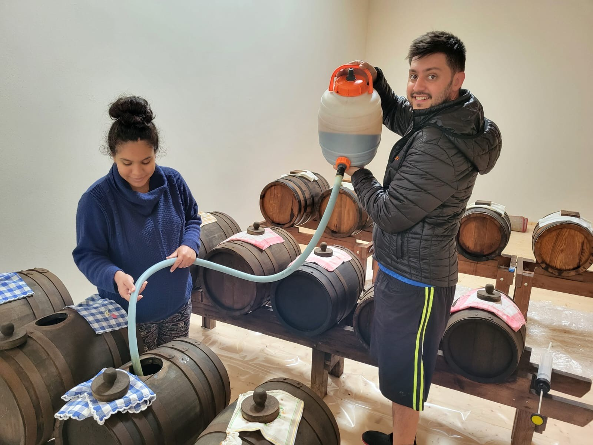
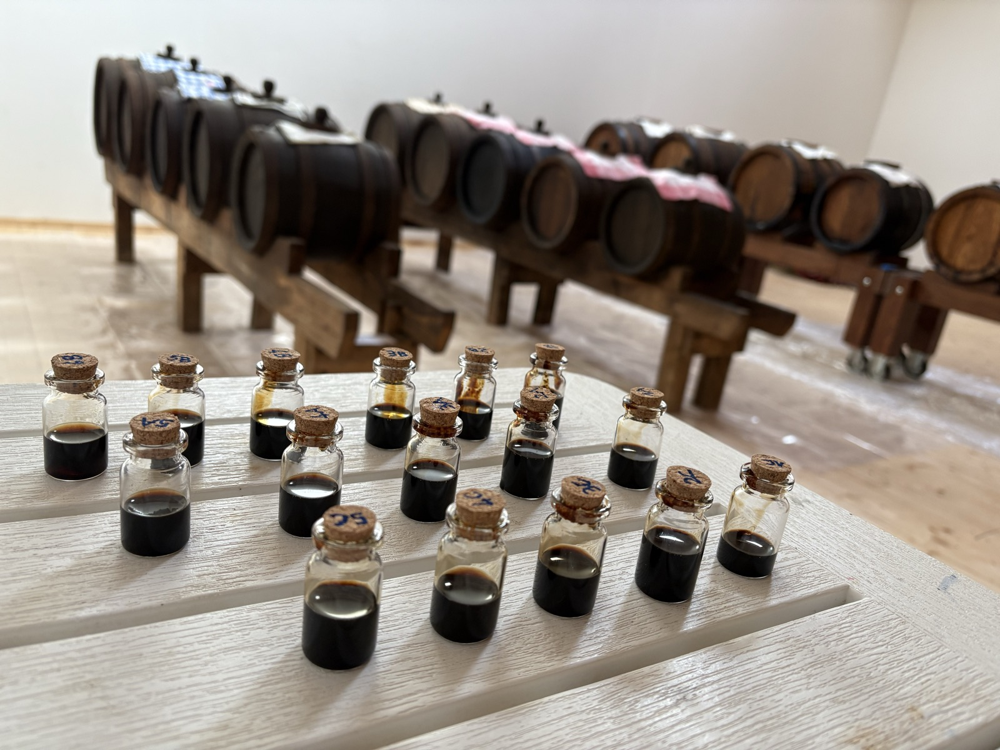
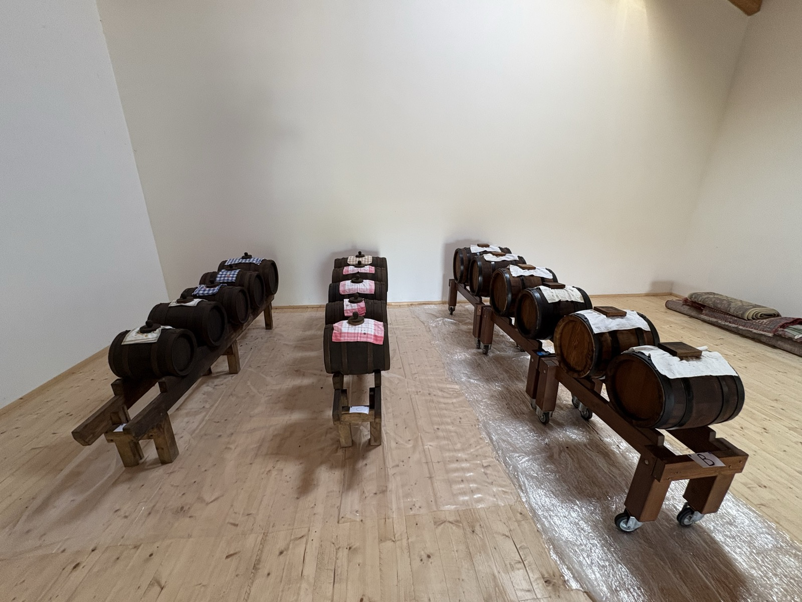
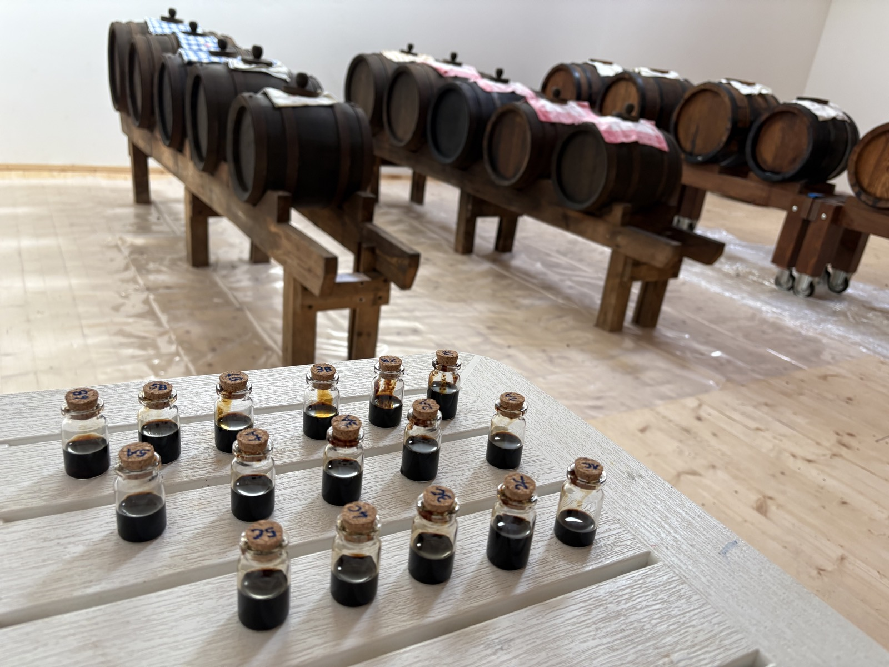
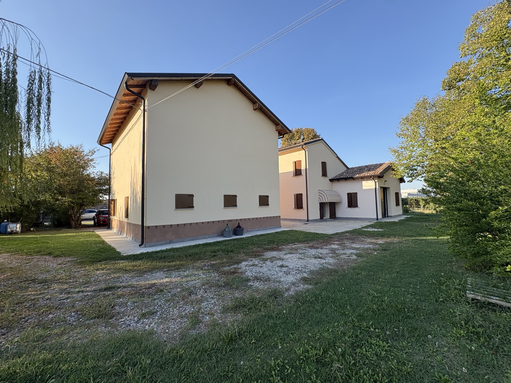
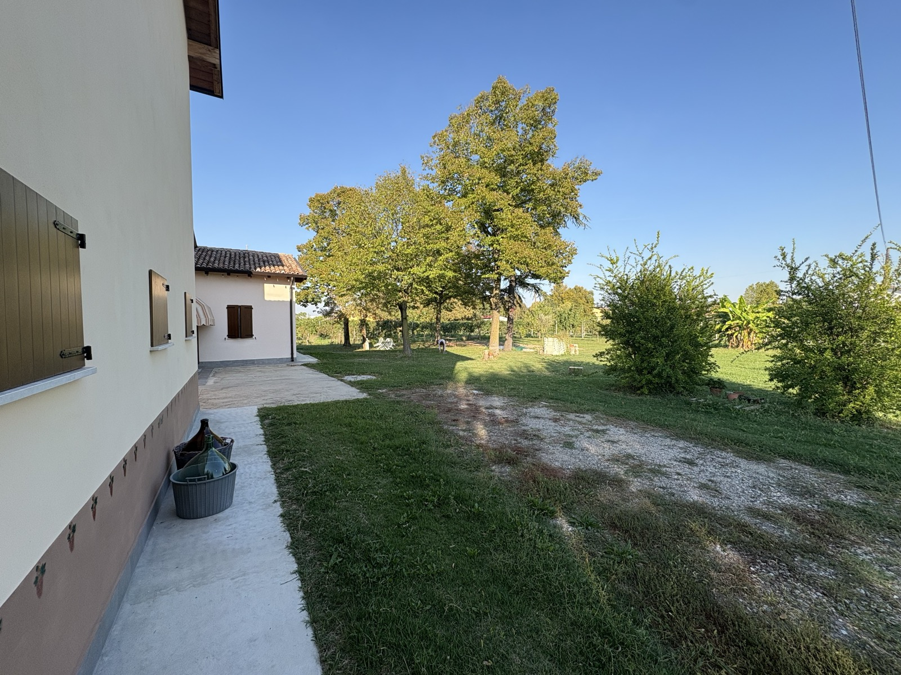
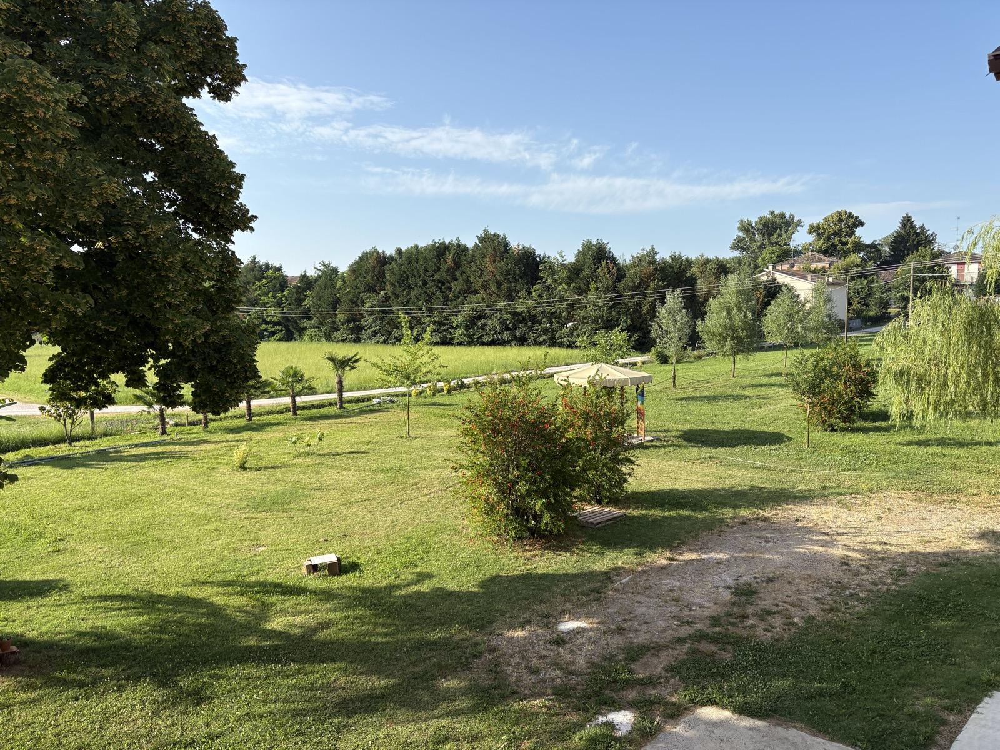
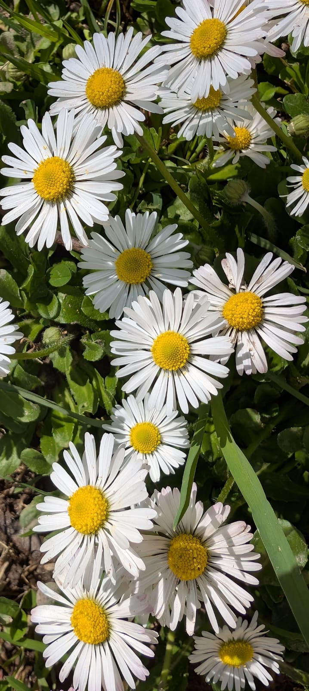

```{=html}
<p class="eyebrow"><span class="l" lang="it">Album fotografico</span><span class="l" lang="en">Photo album</span><span class="l" lang="de">Fotoalbum</span><span class="l" lang="es">Álbum fotográfico</span><span class="l" lang="fr">Album photo</span><span class="l" lang="pt">Álbum de fotos</span></p>
<h1><span class="l" lang="it">Le stagioni dell'acetaia</span><span class="l" lang="en">The seasons of the acetaia</span><span class="l" lang="de">Die Jahreszeiten der Acetaia</span><span class="l" lang="es">Las estaciones de la acetaia</span><span class="l" lang="fr">Les saisons de l'acetaia</span><span class="l" lang="pt">As estações da acetaia</span></h1>
<p class="lead">
<span class="l" lang="it">Benvenuti nell'album della nostra acetaia: la famiglia, i controlli in acetaia, il fiume e i fiori della pianura.</span>
<span class="l" lang="en">Welcome to the album of our acetaia: the family, the checks in the acetaia, the river and the flowers of the plain.</span>
<span class="l" lang="de">Willkommen im Album unserer Acetaia: die Familie, die Kontrollen in der Acetaia, der Fluss und die Blumen der Ebene.</span><span class="l" lang="es">Bienvenidos al álbum de nuestra acetaia: la familia, los controles en la acetaia, el río y las flores de la llanura.</span><span class="l" lang="fr">Bienvenue dans l'album de notre acetaia : la famille, les contrôles dans l'acetaia, le fleuve et les fleurs de la plaine.</span><span class="l" lang="pt">Bem-vindos ao álbum da nossa acetaia: a família, os controles na acetaia, o rio e as flores da planície.</span>
</p>

<h2><span class="l" lang="it">Controlli e travasi in acetaia</span><span class="l" lang="en">Checks and transfers in the acetaia</span><span class="l" lang="de">Kontrollen und Umfüllen in der Acetaia</span><span class="l" lang="es">Controles y trasiegos en la acetaia</span><span class="l" lang="fr">Contrôles et transvasements dans l'acetaia</span><span class="l" lang="pt">Controles e trasfegas na acetaia</span></h2>
<div class="gallery">
  <figure class="wide tall"><figcaption><span class="l" lang="it">Leonardo e Talita durante i travasi e i rincalzi delle botti, aprile 2025</span><span class="l" lang="en">Leonardo and Talita during the transfers and topping up of the barrels, April 2025</span><span class="l" lang="de">Leonardo und Talita beim Umfüllen und Nachfüllen der Fässer, April 2025</span><span class="l" lang="es">Leonardo y Talita durante los trasiegos y rellenos de los barriles, abril de 2025</span><span class="l" lang="fr">Leonardo et Talita pendant les transvasements et le remplissage des fûts, avril 2025</span><span class="l" lang="pt">Leonardo e Talita durante as trasfegas e reposições dos barris, abril de 2025</span></figcaption></figure>
  <figure class="wide"><figcaption><span class="l" lang="it">I campioni di ogni botte, pronti per i controlli</span><span class="l" lang="en">Samples from every barrel, ready for the checks</span><span class="l" lang="de">Proben aus jedem Fass, bereit für die Kontrollen</span><span class="l" lang="es">Las muestras de cada barril, listas para los controles</span><span class="l" lang="fr">Les échantillons de chaque fût, prêts pour les contrôles</span><span class="l" lang="pt">As amostras de cada barril, prontas para os controles</span></figcaption></figure>
  <figure><figcaption><span class="l" lang="it">Raffaele durante i travasi</span><span class="l" lang="en">Raffaele during the transfers</span><span class="l" lang="de">Raffaele beim Umfüllen</span><span class="l" lang="es">Raffaele durante los trasiegos</span><span class="l" lang="fr">Raffaele pendant les transvasements</span><span class="l" lang="pt">Raffaele durante as trasfegas</span></figcaption></figure>
  <figure><figcaption><span class="l" lang="it">Le tre batterie</span><span class="l" lang="en">The three batteries</span><span class="l" lang="de">Die drei Batterien</span><span class="l" lang="es">Las tres baterías</span><span class="l" lang="fr">Les trois batteries</span><span class="l" lang="pt">As três baterias</span></figcaption></figure>
  <figure><figcaption><span class="l" lang="it">Le batterie, altra vista</span><span class="l" lang="en">The batteries, another view</span><span class="l" lang="de">Die Batterien, andere Ansicht</span><span class="l" lang="es">Las baterías, otra vista</span><span class="l" lang="fr">Les batteries, autre vue</span><span class="l" lang="pt">As baterias, outra vista</span></figcaption></figure>
  <figure class="wide tall"><figcaption><span class="l" lang="it">Controlli dei valori di acidità e densità</span><span class="l" lang="en">Checking acidity and density values</span><span class="l" lang="de">Kontrolle von Säure- und Dichtewerten</span><span class="l" lang="es">Controles de los valores de acidez y densidad</span><span class="l" lang="fr">Contrôles des valeurs d'acidité et de densité</span><span class="l" lang="pt">Controles dos valores de acidez e densidade</span></figcaption></figure>
</div>

<h2><span class="l" lang="it">L'acetaia vista dall'esterno</span><span class="l" lang="en">The acetaia from outside</span><span class="l" lang="de">Die Acetaia von außen</span><span class="l" lang="es">La acetaia vista desde fuera</span><span class="l" lang="fr">L'acetaia vue de l'extérieur</span><span class="l" lang="pt">A acetaia vista de fora</span></h2>
<div class="gallery">
  <figure class="wide"><figcaption><span class="l" lang="it">La struttura dell'acetaia</span><span class="l" lang="en">The acetaia building</span><span class="l" lang="de">Das Gebäude der Acetaia</span><span class="l" lang="es">La estructura de la acetaia</span><span class="l" lang="fr">La structure de l'acetaia</span><span class="l" lang="pt">A estrutura da acetaia</span></figcaption></figure>
  <figure><figcaption><span class="l" lang="it">L'acetaia dal retro</span><span class="l" lang="en">The acetaia from the back</span><span class="l" lang="de">Die Acetaia von hinten</span><span class="l" lang="es">La acetaia desde atrás</span><span class="l" lang="fr">L'acetaia vue de l'arrière</span><span class="l" lang="pt">A acetaia vista de trás</span></figcaption></figure>
  <figure><figcaption><span class="l" lang="it">Lo spazio esterno: damigiane, giochi e orto</span><span class="l" lang="en">The outdoor space: carboys, play and vegetable garden</span><span class="l" lang="de">Der Außenbereich: Glasballons, Spielen und Gemüsegarten</span><span class="l" lang="es">El espacio exterior: damajuanas, juegos y huerto</span><span class="l" lang="fr">L'espace extérieur : dames-jeannes, jeux et potager</span><span class="l" lang="pt">O espaço externo: garrafões, brinquedos e horta</span></figcaption></figure>
  <figure class="wide"><figcaption><span class="l" lang="it">L'area picnic per i rinfreschi</span><span class="l" lang="en">The picnic area for refreshments</span><span class="l" lang="de">Der Picknickbereich für Erfrischungen</span><span class="l" lang="es">La zona de picnic para los refrigerios</span><span class="l" lang="fr">L'aire de pique-nique pour les collations</span><span class="l" lang="pt">A área de piquenique para os lanches</span></figcaption></figure>
</div>

<h2><span class="l" lang="it">Il territorio</span><span class="l" lang="en">The land</span><span class="l" lang="de">Die Gegend</span><span class="l" lang="es">El territorio</span><span class="l" lang="fr">Le territoire</span><span class="l" lang="pt">O território</span></h2>
<div class="gallery">
  <figure class="wide"><figcaption><span class="l" lang="it">Il Secchia nel suo momento di piena, marzo 2025</span><span class="l" lang="en">The Secchia at its flood peak, March 2025</span><span class="l" lang="de">Der Secchia bei Hochwasser, März 2025</span><span class="l" lang="es">El Secchia en su momento de crecida, marzo de 2025</span><span class="l" lang="fr">Le Secchia au moment de sa crue, mars 2025</span><span class="l" lang="pt">O Secchia no seu momento de cheia, março de 2025</span></figcaption></figure>
  <figure class="tall"><figcaption><span class="l" lang="it">Margherite</span><span class="l" lang="en">Daisies</span><span class="l" lang="de">Gänseblümchen</span><span class="l" lang="es">Margaritas</span><span class="l" lang="fr">Marguerites</span><span class="l" lang="pt">Margaridas</span></figcaption></figure>
  <figure class="tall"><figcaption><span class="l" lang="it">Fiore di pesco</span><span class="l" lang="en">Peach blossom</span><span class="l" lang="de">Pfirsichblüte</span><span class="l" lang="es">Flor de melocotonero</span><span class="l" lang="fr">Fleur de pêcher</span><span class="l" lang="pt">Flor de pessegueiro</span></figcaption></figure>
  <figure><figcaption><span class="l" lang="it">Ape sul tarassaco</span><span class="l" lang="en">Bee on a dandelion</span><span class="l" lang="de">Biene auf Löwenzahn</span><span class="l" lang="es">Abeja sobre el diente de león</span><span class="l" lang="fr">Abeille sur un pissenlit</span><span class="l" lang="pt">Abelha no dente-de-leão</span></figcaption></figure>
  <figure><figcaption><span class="l" lang="it">Cotogno del Giappone in fiore</span><span class="l" lang="en">Japanese quince in bloom</span><span class="l" lang="de">Japanische Zierquitte in Blüte</span><span class="l" lang="es">Membrillo del Japón en flor</span><span class="l" lang="fr">Cognassier du Japon en fleurs</span><span class="l" lang="pt">Marmeleiro-do-japão em flor</span></figcaption></figure>
</div>

```
