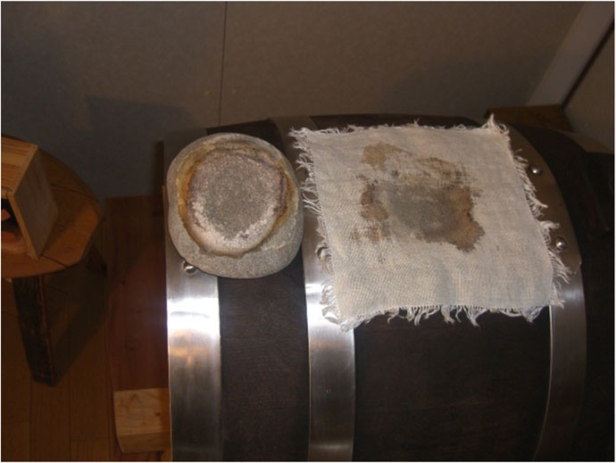

```{=html}
<p class="eyebrow"><span class="l" lang="it">Imparare</span><span class="l" lang="en">Learn</span><span class="l" lang="de">Lernen</span><span class="l" lang="es">Aprender</span><span class="l" lang="fr">Apprendre</span><span class="l" lang="pt">Aprender</span></p>
<h1><span class="l" lang="it">Quello che abbiamo imparato, e che condividiamo</span><span class="l" lang="en">What we have learned, and share</span><span class="l" lang="de">Was wir gelernt haben, und teilen</span><span class="l" lang="es">Lo que hemos aprendido, y que compartimos</span><span class="l" lang="fr">Ce que nous avons appris, et que nous partageons</span><span class="l" lang="pt">O que aprendemos, e que compartilhamos</span></h1>
<p class="lead"><span class="l" lang="it">Il balsamico si impara facendolo e parlandone. Qui raccogliamo le basi, la geografia, le formule e le regole che ci sono servite.</span><span class="l" lang="en">Balsamic vinegar is learned by making it and talking about it. Here we collect the basics, the geography, the formulas and the rules that helped us.</span><span class="l" lang="de">Balsamessig lernt man, indem man ihn macht und darüber spricht. Hier sammeln wir die Grundlagen, die Geografie, die Formeln und die Regeln, die uns geholfen haben.</span><span class="l" lang="es">El balsámico se aprende haciéndolo y hablando de él. Aquí recogemos las bases, la geografía, las fórmulas y las reglas que nos han sido útiles.</span><span class="l" lang="fr">Le balsamique s'apprend en le faisant et en en parlant. Nous rassemblons ici les bases, la géographie, les formules et les règles qui nous ont été utiles.</span><span class="l" lang="pt">O balsâmico se aprende fazendo e conversando sobre ele. Aqui reunimos as bases, a geografia, as fórmulas e as regras que nos foram úteis.</span></p>
```

::: {.panel-tabset}

## [Il balsamico]{.l lang=it}[Balsamic vinegar]{.l lang=en}[Der Balsamico]{.l lang=de}[El balsámico]{.l lang=es}[Le balsamique]{.l lang=fr}[O balsâmico]{.l lang=pt}

::: {.l lang=it}
### Le fasi della produzione

Dall'uva alla botticella: sei fasi, scandite dalle stagioni. È il percorso del balsamico tradizionale, lo stesso che seguiamo in famiglia. Il 24 aprile 2024 abbiamo innestato le nostre batterie con mosto cotto acetificato di <a href="https://www.enologicamodenese.it">Enologica Modenese</a> (26,5 °Brix, acidità 8 %), saltando quindi le prime fasi che si fanno in vigna e nel paiolo.
:::
::: {.l lang=en}
### The production phases

From the grape to the small cask: six phases, set by the seasons. It is the path of traditional balsamic vinegar, the same we follow as a family. On 24 April 2024 we started our batteries with acetified cooked must from <a href="https://www.enologicamodenese.it">Enologica Modenese</a> (26.5 °Brix, acidity 8 %), thus skipping the first phases that happen in the vineyard and in the cooking pot.
:::
::: {.l lang=de}
### Die Phasen der Herstellung

Von der Traube zum Fässchen: sechs Phasen, vorgegeben von den Jahreszeiten. Es ist der Weg des traditionellen Balsamessigs, dem auch wir als Familie folgen. Am 24. April 2024 haben wir unsere Batterien mit essigsauer vergorenem gekochtem Most von <a href="https://www.enologicamodenese.it">Enologica Modenese</a> angesetzt (26,5 °Brix, Säure 8 %) und damit die ersten Phasen im Weinberg und im Kochkessel übersprungen.
:::
::: {.l lang=es}
### Las fases de la producción

De la uva al barrilito: seis fases, marcadas por las estaciones. Es el recorrido del balsámico tradicional, el mismo que seguimos en familia. El 24 de abril de 2024 injertamos nuestras baterías con mosto cocido acetificado de <a href="https://www.enologicamodenese.it">Enologica Modenese</a> (26,5 °Brix, acidez 8 %), saltándonos así las primeras fases, que se hacen en la viña y en el caldero.
:::
::: {.l lang=fr}
### Les phases de la production

Du raisin au petit fût : six phases, rythmées par les saisons. C'est le parcours du balsamique traditionnel, le même que nous suivons en famille. Le 24 avril 2024, nous avons ensemencé nos batteries avec du moût cuit acétifié d'<a href="https://www.enologicamodenese.it">Enologica Modenese</a> (26,5 °Brix, acidité 8 %), en sautant donc les premières phases qui se font à la vigne et dans le chaudron.
:::
::: {.l lang=pt}
### As fases da produção

Da uva ao barrilete: seis fases, marcadas pelas estações. É o percurso do balsâmico tradicional, o mesmo que seguimos em família. Em 24 de abril de 2024 inoculamos as nossas baterias com mosto cozido acetificado da <a href="https://www.enologicamodenese.it">Enologica Modenese</a> (26,5 °Brix, acidez 8 %), pulando assim as primeiras fases, que se fazem na vinha e no caldeirão.
:::



```{=html}
<h3><span class="l" lang="it">I quattro passi, in uno schema</span><span class="l" lang="en">The four steps, in one diagram</span><span class="l" lang="de">Die vier Schritte, in einem Schema</span><span class="l" lang="es">Los cuatro pasos, en un esquema</span><span class="l" lang="fr">Les quatre étapes, en un schéma</span><span class="l" lang="pt">Os quatro passos, em um esquema</span></h3>
<p><small><span class="l" lang="it">Schema rielaborato dalla Fig. 5.1 di Giudici, Lemmetti e Mazza (2015): cottura del mosto, fermentazione alcolica del mosto cotto, ossidazione acetica del vino base e maturazione. Lieviti e batteri acetici non convivono: l'acido acetico inibisce i lieviti e i lieviti tolgono l'ossigeno ai batteri, per questo i due passi biologici vanno tenuti separati.</span><span class="l" lang="en">Diagram adapted from Fig. 5.1 in Giudici, Lemmetti and Mazza (2015): must cooking, alcoholic fermentation of the cooked must, acetic oxidation of the base wine and maturing. Yeasts and acetic acid bacteria do not coexist: acetic acid inhibits yeasts and yeasts deprive the bacteria of oxygen, which is why the two biological steps are kept separate.</span><span class="l" lang="de">Schema nach Abb. 5.1 in Giudici, Lemmetti und Mazza (2015): Mostkochen, alkoholische Gärung des gekochten Mosts, Essigoxidation des Grundweins und Reifung. Hefen und Essigsäurebakterien vertragen sich nicht: Essigsäure hemmt die Hefen, und die Hefen entziehen den Bakterien den Sauerstoff, deshalb werden die beiden biologischen Schritte getrennt gehalten.</span><span class="l" lang="es">Esquema reelaborado a partir de la Fig. 5.1 de Giudici, Lemmetti y Mazza (2015): cocción del mosto, fermentación alcohólica del mosto cocido, oxidación acética del vino base y maduración. Levaduras y bacterias acéticas no conviven: el ácido acético inhibe las levaduras y las levaduras quitan el oxígeno a las bacterias, por eso los dos pasos biológicos deben mantenerse separados.</span><span class="l" lang="fr">Schéma adapté de la Fig. 5.1 de Giudici, Lemmetti et Mazza (2015) : cuisson du moût, fermentation alcoolique du moût cuit, oxydation acétique du vin de base et maturation. Levures et bactéries acétiques ne cohabitent pas : l'acide acétique inhibe les levures et les levures privent les bactéries d'oxygène ; c'est pourquoi les deux étapes biologiques doivent être tenues séparées.</span><span class="l" lang="pt">Esquema reelaborado a partir da Fig. 5.1 de Giudici, Lemmetti e Mazza (2015): cozimento do mosto, fermentação alcoólica do mosto cozido, oxidação acética do vinho base e maturação. Leveduras e bactérias acéticas não convivem: o ácido acético inibe as leveduras e as leveduras tiram o oxigênio das bactérias, por isso os dois passos biológicos devem ser mantidos separados.</span></small></p>
<svg class="steps-svg" viewBox="0 0 940 250" xmlns="http://www.w3.org/2000/svg" role="img"><defs><marker id="arr" viewBox="0 0 10 10" refX="9" refY="5" markerWidth="8" markerHeight="8" orient="auto"><path d="M0 0L10 5L0 10z" fill="currentColor"/></marker></defs>
<text x="470.0" y="30" text-anchor="middle" font-size="15" letter-spacing="2" font-family="Source Sans 3, sans-serif" fill="currentColor" opacity=".7"><tspan class="l" lang="it">I PASSI FONDAMENTALI</tspan><tspan class="l" lang="en">THE FUNDAMENTAL STEPS</tspan><tspan class="l" lang="de">DIE GRUNDSCHRITTE</tspan><tspan class="l" lang="es">LOS PASOS FUNDAMENTALES</tspan><tspan class="l" lang="fr">LES ÉTAPES FONDAMENTALES</tspan><tspan class="l" lang="pt">OS PASSOS FUNDAMENTAIS</tspan></text>
<rect x="40" y="70" width="190" height="64" rx="12" fill="#b87333" />
<text x="135.0" y="108.0" text-anchor="middle" font-size="17" font-weight="700" fill="#fff" font-family="Source Sans 3, sans-serif"><tspan class="l" lang="it">Cottura del mosto</tspan><tspan class="l" lang="en">Must cooking</tspan><tspan class="l" lang="de">Mostkochen</tspan><tspan class="l" lang="es">Cocción del mosto</tspan><tspan class="l" lang="fr">Cuisson du moût</tspan><tspan class="l" lang="pt">Cozimento do mosto</tspan></text>
<text x="135.0" y="156" text-anchor="middle" font-size="12.5" fill="currentColor" opacity=".85" font-family="Source Sans 3, sans-serif"><tspan class="l" lang="it">mosto d'uva → mosto cotto</tspan><tspan class="l" lang="en">grape must → cooked must</tspan><tspan class="l" lang="de">Traubenmost → gekochter Most</tspan><tspan class="l" lang="es">mosto de uva → mosto cocido</tspan><tspan class="l" lang="fr">moût de raisin → moût cuit</tspan><tspan class="l" lang="pt">mosto de uva → mosto cozido</tspan></text>
<line x1="234" y1="102.0" x2="266" y2="102.0" stroke="currentColor" stroke-width="2.5" marker-end="url(#arr)"/>
<rect x="270" y="70" width="190" height="64" rx="12" fill="#7a2a35" />
<text x="365.0" y="108.0" text-anchor="middle" font-size="17" font-weight="700" fill="#fff" font-family="Source Sans 3, sans-serif"><tspan class="l" lang="it">Fermentazione alcolica</tspan><tspan class="l" lang="en">Alcoholic fermentation</tspan><tspan class="l" lang="de">Alkoholische Gärung</tspan><tspan class="l" lang="es">Fermentación alcohólica</tspan><tspan class="l" lang="fr">Fermentation alcoolique</tspan><tspan class="l" lang="pt">Fermentação alcoólica</tspan></text>
<text x="365.0" y="156" text-anchor="middle" font-size="12.5" fill="currentColor" opacity=".85" font-family="Source Sans 3, sans-serif"><tspan class="l" lang="it">mosto cotto → vino base</tspan><tspan class="l" lang="en">cooked must → base wine</tspan><tspan class="l" lang="de">gekochter Most → Grundwein</tspan><tspan class="l" lang="es">mosto cocido → vino base</tspan><tspan class="l" lang="fr">moût cuit → vin de base</tspan><tspan class="l" lang="pt">mosto cozido → vinho base</tspan></text>
<line x1="464" y1="102.0" x2="496" y2="102.0" stroke="currentColor" stroke-width="2.5" marker-end="url(#arr)"/>
<rect x="500" y="70" width="190" height="64" rx="12" fill="#5a1e26" />
<text x="595.0" y="108.0" text-anchor="middle" font-size="17" font-weight="700" fill="#fff" font-family="Source Sans 3, sans-serif"><tspan class="l" lang="it">Ossidazione acetica</tspan><tspan class="l" lang="en">Acetic oxidation</tspan><tspan class="l" lang="de">Essigoxidation</tspan><tspan class="l" lang="es">Oxidación acética</tspan><tspan class="l" lang="fr">Oxydation acétique</tspan><tspan class="l" lang="pt">Oxidação acética</tspan></text>
<text x="595.0" y="156" text-anchor="middle" font-size="12.5" fill="currentColor" opacity=".85" font-family="Source Sans 3, sans-serif"><tspan class="l" lang="it">vino base → aceto base</tspan><tspan class="l" lang="en">base wine → base vinegar</tspan><tspan class="l" lang="de">Grundwein → Grundessig</tspan><tspan class="l" lang="es">vino base → vinagre base</tspan><tspan class="l" lang="fr">vin de base → vinaigre de base</tspan><tspan class="l" lang="pt">vinho base → vinagre base</tspan></text>
<line x1="694" y1="102.0" x2="726" y2="102.0" stroke="currentColor" stroke-width="2.5" marker-end="url(#arr)"/>
<rect x="730" y="70" width="190" height="64" rx="12" fill="#b98a4b" />
<text x="825.0" y="108.0" text-anchor="middle" font-size="17" font-weight="700" fill="#fff" font-family="Source Sans 3, sans-serif"><tspan class="l" lang="it">Maturazione</tspan><tspan class="l" lang="en">Maturing</tspan><tspan class="l" lang="de">Reifung</tspan><tspan class="l" lang="es">Maduración</tspan><tspan class="l" lang="fr">Maturation</tspan><tspan class="l" lang="pt">Maturação</tspan></text>
<text x="825.0" y="156" text-anchor="middle" font-size="12.5" fill="currentColor" opacity=".85" font-family="Source Sans 3, sans-serif"><tspan class="l" lang="it">aceto base → balsamico</tspan><tspan class="l" lang="en">base vinegar → balsamic</tspan><tspan class="l" lang="de">Grundessig → Balsamico</tspan><tspan class="l" lang="es">vinagre base → balsámico</tspan><tspan class="l" lang="fr">vinaigre de base → balsamique</tspan><tspan class="l" lang="pt">vinagre base → balsâmico</tspan></text>
<path d="M270 175 v10 h420 v-10" fill="none" stroke="currentColor" stroke-width="1.5"/>
<text x="480.0" y="205" text-anchor="middle" font-size="13" fill="currentColor" font-family="Source Sans 3, sans-serif"><tspan class="l" lang="it">Trasformazioni biologiche (lieviti, poi batteri acetici)</tspan><tspan class="l" lang="en">Biological transformations (yeasts, then acetic acid bacteria)</tspan><tspan class="l" lang="de">Biologische Umwandlungen (Hefen, dann Essigsäurebakterien)</tspan><tspan class="l" lang="es">Transformaciones biológicas (levaduras, luego bacterias acéticas)</tspan><tspan class="l" lang="fr">Transformations biologiques (levures, puis bactéries acétiques)</tspan><tspan class="l" lang="pt">Transformações biológicas (leveduras, depois bactérias acéticas)</tspan></text>
<path d="M40 218 v10 h880 v-10" fill="none" stroke="currentColor" stroke-width="1.5"/>
<text x="470.0" y="246" text-anchor="middle" font-size="13" fill="currentColor" font-family="Source Sans 3, sans-serif"><tspan class="l" lang="it">Trasformazioni fisiche e chimiche (concentrazione, reazioni di Maillard)</tspan><tspan class="l" lang="en">Physical and chemical transformations (concentration, Maillard reactions)</tspan><tspan class="l" lang="de">Physikalische und chemische Umwandlungen (Konzentration, Maillard-Reaktionen)</tspan><tspan class="l" lang="es">Transformaciones físicas y químicas (concentración, reacciones de Maillard)</tspan><tspan class="l" lang="fr">Transformations physiques et chimiques (concentration, réactions de Maillard)</tspan><tspan class="l" lang="pt">Transformações físicas e químicas (concentração, reações de Maillard)</tspan></text>
</svg>


<h3><span class="l" lang="it">Il processo, in uno schema</span><span class="l" lang="en">The process, in one diagram</span><span class="l" lang="de">Der Prozess, in einem Schema</span><span class="l" lang="es">El proceso, en un esquema</span><span class="l" lang="fr">Le processus, en un schéma</span><span class="l" lang="pt">O processo, em um esquema</span></h3>
<svg class="steps-svg" viewBox="0 0 980 310" xmlns="http://www.w3.org/2000/svg" role="img">
<defs><marker id="arr2" viewBox="0 0 10 10" refX="8" refY="5" markerWidth="7" markerHeight="7" orient="auto"><path d="M0 0L10 5L0 10z" fill="#7a2a35"/></marker></defs>
<text x="255" y="28" text-anchor="middle" font-size="14" letter-spacing="1.5" fill="currentColor" opacity=".75" font-family="Source Sans 3, sans-serif"><tspan class="l" lang="it">TRASFORMAZIONI BIOLOGICHE</tspan><tspan class="l" lang="en">BIOLOGICAL TRANSFORMATIONS</tspan><tspan class="l" lang="de">BIOLOGISCHE UMWANDLUNGEN</tspan><tspan class="l" lang="es">TRANSFORMACIONES BIOLÓGICAS</tspan><tspan class="l" lang="fr">TRANSFORMATIONS BIOLOGIQUES</tspan><tspan class="l" lang="pt">TRANSFORMAÇÕES BIOLÓGICAS</tspan></text>
<text x="735" y="28" text-anchor="middle" font-size="14" letter-spacing="1.5" fill="currentColor" opacity=".75" font-family="Source Sans 3, sans-serif"><tspan class="l" lang="it">TRASFORMAZIONI CHIMICO-FISICHE</tspan><tspan class="l" lang="en">CHEMICAL AND PHYSICAL TRANSFORMATIONS</tspan><tspan class="l" lang="de">CHEMISCH-PHYSIKALISCHE UMWANDLUNGEN</tspan><tspan class="l" lang="es">TRANSFORMACIONES FÍSICO-QUÍMICAS</tspan><tspan class="l" lang="fr">TRANSFORMATIONS PHYSICO-CHIMIQUES</tspan><tspan class="l" lang="pt">TRANSFORMAÇÕES FÍSICO-QUÍMICAS</tspan></text>
<line x1="150" y1="40" x2="150" y2="270" stroke="currentColor" stroke-width="1.5" stroke-dasharray="6 5" opacity=".6"/>
<line x1="480" y1="40" x2="480" y2="270" stroke="currentColor" stroke-width="1.5" stroke-dasharray="6 5" opacity=".6"/>
<line x1="20" y1="252" x2="960" y2="252" stroke="currentColor" stroke-width="2" opacity=".7"/>
<g transform="translate(30,120)"><path d="M10 40 h90 l-8 90 h-74z" fill="#f4ead9" stroke="#3b2414" stroke-width="3"/><ellipse cx="55" cy="40" rx="45" ry="9" fill="#5a1e26" stroke="#3b2414" stroke-width="3"/><g stroke="#c8a15a" stroke-width="3" fill="none" stroke-linecap="round" opacity=".9"><path d="M35 25 q-6 -10 0 -20 q6 -10 0 -20"/><path d="M55 22 q-6 -10 0 -20 q6 -10 0 -20"/><path d="M75 25 q-6 -10 0 -20 q6 -10 0 -20"/></g><path d="M30 132 q8 -18 15 -6 q5 -14 12 0 q8 -12 12 4 q6 -14 12 4 q-4 12 -26 12 q-22 0 -25 -14z" fill="#e25822"/><rect x="0" y="86" width="12" height="22" rx="3" fill="#3b2414"/></g>
<text x="85" y="285" text-anchor="middle" font-size="15" font-weight="700" fill="currentColor" font-family="Source Sans 3, sans-serif"><tspan class="l" lang="it">Cottura</tspan><tspan class="l" lang="en">Cooking</tspan><tspan class="l" lang="de">Kochen</tspan><tspan class="l" lang="es">Cocción</tspan><tspan class="l" lang="fr">Cuisson</tspan><tspan class="l" lang="pt">Cozimento</tspan></text>
<g transform="translate(190,105)"><path d="M0 20 h100 v110 q0 12 -12 12 h-76 q-12 0 -12 -12z" fill="#cfd6db" stroke="#3b2414" stroke-width="3"/><rect x="0" y="8" width="100" height="14" rx="4" fill="#9aa5ad" stroke="#3b2414" stroke-width="3"/><rect x="42" y="-8" width="16" height="16" rx="3" fill="#3b2414"/><path d="M50 -8 q-8 -14 0 -26" stroke="#4a6b5c" stroke-width="2.5" fill="none"/><path d="M8 142 l-6 10 M92 142 l6 10 M50 142 v10" stroke="#3b2414" stroke-width="3"/><g fill="#f2e3c8" opacity=".7"><circle cx="30" cy="70" r="3"/><circle cx="60" cy="95" r="4"/><circle cx="75" cy="55" r="2.5"/></g></g>
<text x="240" y="280" text-anchor="middle" font-size="14.5" font-weight="700" fill="currentColor" font-family="Source Sans 3, sans-serif"><tspan class="l" lang="it"><tspan x="240" dy="0">Fermentazione</tspan><tspan x="240" dy="17">alcolica</tspan></tspan><tspan class="l" lang="en"><tspan x="240" dy="0">Alcoholic</tspan><tspan x="240" dy="17">fermentation</tspan></tspan><tspan class="l" lang="de"><tspan x="240" dy="0">Alkoholische</tspan><tspan class="l" lang="es"><tspan x="240" dy="0">Fermentación</tspan><tspan class="l" lang="fr"><tspan x="240" dy="0">Fermentation</tspan><tspan class="l" lang="pt"><tspan x="240" dy="0">Fermentação</tspan><tspan x="240" dy="17">Gärung</tspan></tspan></text>
<g transform="translate(335,110)"><path d="M8 0 q45 -8 90 0 q12 70 0 140 q-45 8 -90 0 q-12 -70 0 -140z" fill="#b98a4b" stroke="#3b2414" stroke-width="3"/><g stroke="#3b2414" stroke-width="3" opacity=".6"><path d="M2 30 q51 -6 102 0 M2 110 q51 6 102 0"/></g><g stroke="#3b2414" stroke-width="1.5" opacity=".35"><path d="M35 -4 v148 M70 -4 v148"/></g><rect x="44" y="-14" width="18" height="12" rx="3" fill="#3b2414"/><rect x="30" y="-18" width="46" height="5" rx="2" fill="#e6dccc"/></g>
<text x="388" y="280" text-anchor="middle" font-size="14.5" font-weight="700" fill="currentColor" font-family="Source Sans 3, sans-serif"><tspan class="l" lang="it"><tspan x="388" dy="0">Ossidazione</tspan><tspan x="388" dy="17">acetica</tspan></tspan><tspan class="l" lang="en"><tspan x="388" dy="0">Acetic</tspan><tspan x="388" dy="17">oxidation</tspan></tspan><tspan class="l" lang="de"><tspan x="388" dy="0">Essig-</tspan><tspan class="l" lang="es"><tspan x="388" dy="0">Oxidación</tspan><tspan class="l" lang="fr"><tspan x="388" dy="0">Oxydation</tspan><tspan class="l" lang="pt"><tspan x="388" dy="0">Oxidação</tspan><tspan x="388" dy="17">oxidation</tspan></tspan></text>
<g><path d="M520,172.58 Q567.5,152.003 615,172.58 L615,241.17 Q567.5,261.747 520,241.17 Z" fill="#c9b08a" stroke="#3b2414" stroke-width="2.5"/><path d="M548.5,165.5405 L548.5,248.2095 M586.5,165.5405 L586.5,248.2095" stroke="#3b2414" stroke-width="2.5" opacity=".6"/><rect x="562.5" y="147.003" width="10" height="7" rx="2" fill="#3b2414"/></g>
<g><path d="M629,183.44800000000004 Q670.0,165.68680000000003 711,183.44800000000004 L711,242.652 Q670.0,260.4132 629,242.652 Z" fill="#c9b08a" stroke="#3b2414" stroke-width="2.5"/><path d="M653.6,177.37180000000004 L653.6,248.7282 M686.4,177.37180000000004 L686.4,248.7282" stroke="#3b2414" stroke-width="2.5" opacity=".6"/><rect x="665.0" y="160.68680000000003" width="10" height="7" rx="2" fill="#3b2414"/></g>
<g><path d="M725,193.48 Q760.0,178.318 795,193.48 L795,244.02 Q760.0,259.182 725,244.02 Z" fill="#c9b08a" stroke="#3b2414" stroke-width="2.5"/><path d="M746.0,188.293 L746.0,249.207 M774.0,188.293 L774.0,249.207" stroke="#3b2414" stroke-width="2.5" opacity=".6"/><rect x="755.0" y="173.318" width="10" height="7" rx="2" fill="#3b2414"/></g>
<g><path d="M809,203.512 Q838.0,190.94920000000002 867,203.512 L867,245.388 Q838.0,257.9508 809,245.388 Z" fill="#c9b08a" stroke="#3b2414" stroke-width="2.5"/><path d="M826.4,199.2142 L826.4,249.6858 M849.6,199.2142 L849.6,249.6858" stroke="#3b2414" stroke-width="2.5" opacity=".6"/><rect x="833.0" y="185.94920000000002" width="10" height="7" rx="2" fill="#3b2414"/></g>
<g><path d="M881,211.872 Q905.0,201.4752 929,211.872 L929,246.528 Q905.0,256.9248 881,246.528 Z" fill="#c9b08a" stroke="#3b2414" stroke-width="2.5"/><path d="M895.4,208.3152 L895.4,250.0848 M914.6,208.3152 L914.6,250.0848" stroke="#3b2414" stroke-width="2.5" opacity=".6"/><rect x="900.0" y="196.4752" width="10" height="7" rx="2" fill="#3b2414"/></g>
<text x="735" y="285" text-anchor="middle" font-size="15" font-weight="700" fill="currentColor" font-family="Source Sans 3, sans-serif"><tspan class="l" lang="it">Maturazione nella batteria</tspan><tspan class="l" lang="en">Maturing in the battery</tspan><tspan class="l" lang="de">Reifung in der Batterie</tspan><tspan class="l" lang="es">Maduración en la batería</tspan><tspan class="l" lang="fr">Maturation dans la batterie</tspan><tspan class="l" lang="pt">Maturação na bateria</tspan></text>
<path d="M120 150 Q162.5 60 205 105" fill="none" stroke="#7a2a35" stroke-width="3.5" marker-end="url(#arr2)"/>
<text x="150" y="52" text-anchor="middle" font-size="12.5" fill="currentColor" font-family="Source Sans 3, sans-serif"><tspan class="l" lang="it">mosto cotto</tspan><tspan class="l" lang="en">cooked must</tspan><tspan class="l" lang="de">gekochter Most</tspan><tspan class="l" lang="es">mosto cocido</tspan><tspan class="l" lang="fr">moût cuit</tspan><tspan class="l" lang="pt">mosto cozido</tspan></text>
<path d="M280 110 Q312.5 53 345 98" fill="none" stroke="#7a2a35" stroke-width="3.5" marker-end="url(#arr2)"/>
<text x="315" y="60" text-anchor="middle" font-size="12.5" fill="currentColor" font-family="Source Sans 3, sans-serif"><tspan class="l" lang="it">vino base</tspan><tspan class="l" lang="en">base wine</tspan><tspan class="l" lang="de">Grundwein</tspan><tspan class="l" lang="es">vino base</tspan><tspan class="l" lang="fr">vin de base</tspan><tspan class="l" lang="pt">vinho base</tspan></text>
<path d="M430 100 Q494.75 45 559.5 142.003" fill="none" stroke="#7a2a35" stroke-width="3.5" marker-end="url(#arr2)"/>
<text x="500" y="58" text-anchor="middle" font-size="12.5" fill="currentColor" font-family="Source Sans 3, sans-serif"><tspan class="l" lang="it">aceto base</tspan><tspan class="l" lang="en">base vinegar</tspan><tspan class="l" lang="de">Grundessig</tspan><tspan class="l" lang="es">vinagre base</tspan><tspan class="l" lang="fr">vinaigre de base</tspan><tspan class="l" lang="pt">vinagre base</tspan></text>
<path d="M575.5 146.003 Q619.75 108.00299999999999 664.0 159.68680000000003" fill="none" stroke="#7a2a35" stroke-width="3.5" marker-end="url(#arr2)"/>
<path d="M678.0 159.68680000000003 Q716.0 121.68680000000003 754.0 172.318" fill="none" stroke="#7a2a35" stroke-width="3.5" marker-end="url(#arr2)"/>
<path d="M768.0 172.318 Q800.0 134.318 832.0 184.94920000000002" fill="none" stroke="#7a2a35" stroke-width="3.5" marker-end="url(#arr2)"/>
<path d="M846.0 184.94920000000002 Q872.5 146.94920000000002 899.0 195.4752" fill="none" stroke="#7a2a35" stroke-width="3.5" marker-end="url(#arr2)"/>
<text x="754.0" y="112" text-anchor="middle" font-size="12" fill="currentColor" opacity=".85" font-family="Source Sans 3, sans-serif"><tspan class="l" lang="it">rincalzi annuali, dalla grande alla piccola</tspan><tspan class="l" lang="en">yearly topping up, from large to small</tspan><tspan class="l" lang="de">jährliches Nachfüllen, vom großen zum kleinen</tspan><tspan class="l" lang="es">rellenos anuales, del grande al pequeño</tspan><tspan class="l" lang="fr">remplissages annuels, du grand au petit</tspan><tspan class="l" lang="pt">reposições anuais, do grande ao pequeno</tspan></text>
<path d="M911.0 195.4752 Q945.0 135.4752 920 120" fill="none" stroke="#5a1e26" stroke-width="3.5" marker-end="url(#arr2)"/>
<rect x="870" y="70" width="90" height="46" rx="8" fill="#5a1e26"/><text x="915" y="99" text-anchor="middle" font-size="15" font-weight="700" fill="#fff" font-family="Source Sans 3, sans-serif"><tspan class="l" lang="it">Balsamico</tspan><tspan class="l" lang="en">Balsamic</tspan><tspan class="l" lang="de">Balsamico</tspan><tspan class="l" lang="es">Balsámico</tspan><tspan class="l" lang="fr">Balsamique</tspan><tspan class="l" lang="pt">Balsâmico</tspan></text>
</svg>
<p><small><span class="l" lang="it">Rappresentazione schematica del processo di produzione dell'aceto balsamico tradizionale. Figura modificata dalla Fig. 5.2 di Giudici P., Lemmetti F., Mazza S. (2015), <em>Balsamic Vinegars: Tradition, Technology, Trade</em>, Springer. Dal paiolo al vino base, dal vino base all'aceto base nella botte madre, poi gli anni nella batteria, dove ogni anno si preleva dalla botte piccola e si rincalza a cascata dalla grande.</span><span class="l" lang="en">Schematic representation of the Traditional Balsamic Vinegar production process. Figure modified from Fig. 5.2 in Giudici P., Lemmetti F., Mazza S. (2015), <em>Balsamic Vinegars: Tradition, Technology, Trade</em>, Springer. From the cooking pot to the base wine, from the base wine to the base vinegar in the mother barrel, then the years in the battery, where every year vinegar is drawn from the small barrel and each barrel is topped up in cascade from the larger one.</span><span class="l" lang="de">Schematische Darstellung des Herstellungsprozesses des traditionellen Balsamessigs. Abbildung verändert nach Abb. 5.2 in Giudici P., Lemmetti F., Mazza S. (2015), <em>Balsamic Vinegars: Tradition, Technology, Trade</em>, Springer. Vom Kochkessel zum Grundwein, vom Grundwein zum Grundessig im Mutterfass, dann die Jahre in der Batterie, wo jedes Jahr aus dem kleinen Fass entnommen und in Kaskade aus dem größeren nachgefüllt wird.</span><span class="l" lang="es">Representación esquemática del proceso de producción del vinagre balsámico tradicional. Figura modificada a partir de la Fig. 5.2 de Giudici P., Lemmetti F., Mazza S. (2015), <em>Balsamic Vinegars: Tradition, Technology, Trade</em>, Springer. Del caldero al vino base, del vino base al vinagre base en la barrica madre, y después los años en la batería, donde cada año se extrae del barril pequeño y se rellena en cascada desde el grande.</span><span class="l" lang="fr">Représentation schématique du processus de production du vinaigre balsamique traditionnel. Figure modifiée d'après la Fig. 5.2 de Giudici P., Lemmetti F., Mazza S. (2015), <em>Balsamic Vinegars: Tradition, Technology, Trade</em>, Springer. Du chaudron au vin de base, du vin de base au vinaigre de base dans le fût mère, puis les années dans la batterie, où chaque année on prélève dans le petit fût et on remplit en cascade à partir du grand.</span><span class="l" lang="pt">Representação esquemática do processo de produção do vinagre balsâmico tradicional. Figura modificada a partir da Fig. 5.2 de Giudici P., Lemmetti F., Mazza S. (2015), <em>Balsamic Vinegars: Tradition, Technology, Trade</em>, Springer. Do caldeirão ao vinho base, do vinho base ao vinagre base no barril-mãe, depois os anos na bateria, onde todo ano se retira do barril pequeno e se faz a reposição em cascata a partir do grande.</span></small></p>

<div class="callout-ai curio">
  <p class="eyebrow"><span class="l" lang="it">Curiosità</span><span class="l" lang="en">Curiosity</span><span class="l" lang="de">Kuriosum</span><span class="l" lang="es">Curiosidades</span><span class="l" lang="fr">Curiosités</span><span class="l" lang="pt">Curiosidade</span></p>
  <div class="curio-grid">
    <figure class="plain"><figcaption><small><span class="l" lang="it">Fig. 4.7 in Giudici, Lemmetti e Mazza (2015), p. 78. © Springer.</span><span class="l" lang="en">Fig. 4.7 in Giudici, Lemmetti and Mazza (2015), p. 78. © Springer.</span><span class="l" lang="de">Abb. 4.7 in Giudici, Lemmetti und Mazza (2015), S. 78. © Springer.</span><span class="l" lang="es">Fig. 4.7 en Giudici, Lemmetti y Mazza (2015), p. 78. © Springer.</span><span class="l" lang="fr">Fig. 4.7 dans Giudici, Lemmetti et Mazza (2015), p. 78. © Springer.</span><span class="l" lang="pt">Fig. 4.7 em Giudici, Lemmetti e Mazza (2015), p. 78. © Springer.</span></small></figcaption></figure>
    <div>
      <p class="l" lang="it"><strong>Il sasso di fiume sul cocchiume.</strong> Oggi i cocchiumi delle botti si coprono con una tela. Un tempo si coprivano con sassi di fiume: i vapori di acido acetico che salivano dalla botte scioglievano i carbonati della pietra, e i silicati venivano rilasciati sotto forma di granelli di sabbia, ben visibili sulla tela nella foto. Lo raccontano Paolo Giudici, Federico Lemmetti e Stefano Mazza nel loro libro <em>Balsamic Vinegars: Tradition, Technology, Trade</em> (Springer, 2015), a cui dobbiamo anche gran parte di quello che abbiamo imparato sull'ossidazione acetica e sulla maturazione.</p>
      <p class="l" lang="en"><strong>The river stone on the bunghole.</strong> Today barrel bungholes are covered with a cloth. In the past they were covered with river stones: the acetic acid vapours rising from the barrel dissolved the carbonates of the stone, and the silicates were released as grains of sand, clearly visible on the cloth in the photo. This is told by Paolo Giudici, Federico Lemmetti and Stefano Mazza in their book <em>Balsamic Vinegars: Tradition, Technology, Trade</em> (Springer, 2015), to which we also owe much of what we learned about acetic oxidation and maturing.</p>
      <p class="l" lang="de"><strong>Der Flusskiesel auf dem Spundloch.</strong> Heute werden die Spundlöcher der Fässer mit einem Tuch bedeckt. Früher legte man Flusskiesel darauf: die aus dem Fass aufsteigenden Essigsäuredämpfe lösten die Karbonate des Steins, und die Silikate wurden als Sandkörner freigesetzt, auf dem Tuch im Foto gut zu sehen. Das berichten Paolo Giudici, Federico Lemmetti und Stefano Mazza in ihrem Buch <em>Balsamic Vinegars: Tradition, Technology, Trade</em> (Springer, 2015), dem wir auch vieles verdanken, was wir über Essigoxidation und Reifung gelernt haben.</p><p class="l" lang="es"><strong>El canto rodado sobre la boca del barril.</strong> Hoy las bocas de los barriles se cubren con un paño. Antiguamente se cubrían con cantos rodados de río: los vapores de ácido acético que subían del barril disolvían los carbonatos de la piedra, y los silicatos se liberaban en forma de granos de arena, bien visibles sobre el paño en la foto. Lo cuentan Paolo Giudici, Federico Lemmetti y Stefano Mazza en su libro <em>Balsamic Vinegars: Tradition, Technology, Trade</em> (Springer, 2015), al que debemos también gran parte de lo que hemos aprendido sobre la oxidación acética y la maduración.</p><p class="l" lang="fr"><strong>Le galet de rivière sur la bonde.</strong> Aujourd'hui, les bondes des fûts se couvrent d'une toile. Autrefois, on les couvrait avec des galets de rivière : les vapeurs d'acide acétique qui montaient du fût dissolvaient les carbonates de la pierre, et les silicates étaient libérés sous forme de grains de sable, bien visibles sur la toile dans la photo. C'est ce que racontent Paolo Giudici, Federico Lemmetti et Stefano Mazza dans leur livre <em>Balsamic Vinegars: Tradition, Technology, Trade</em> (Springer, 2015), auquel nous devons aussi une grande partie de ce que nous avons appris sur l'oxydation acétique et sur la maturation.</p><p class="l" lang="pt"><strong>A pedra de rio sobre o batoque.</strong> Hoje as bocas dos barris são cobertas com um pano. Antigamente eram cobertas com pedras de rio: os vapores de ácido acético que subiam do barril dissolviam os carbonatos da pedra, e os silicatos eram liberados na forma de grãos de areia, bem visíveis sobre o pano na foto. Quem conta isso são Paolo Giudici, Federico Lemmetti e Stefano Mazza no livro <em>Balsamic Vinegars: Tradition, Technology, Trade</em> (Springer, 2015), ao qual devemos também grande parte do que aprendemos sobre oxidação acética e maturação.</p>
      <p><small>Giudici P., Lemmetti F., Mazza S. (2015). <em>Balsamic Vinegars: Tradition, Technology, Trade</em>. Springer, Cham. <a href="https://doi.org/10.1007/978-3-319-13758-2">doi:10.1007/978-3-319-13758-2</a></small></p>
    </div>
  </div>
</div>
```


::: {.l lang=it}
Le nostre misure di riferimento sono l'acidità totale (% acido acetico), che con gli anni si assesta, e la densità (°Brix), che cresce con l'evaporazione. Le trovate botte per botte nella pagina [L'acetaia](acetaia.qmd).
:::
::: {.l lang=en}
Our reference measurements are total acidity (% acetic acid), which settles over the years, and density (°Brix), which rises with evaporation. You find them barrel by barrel on the [acetaia page](acetaia.qmd).
:::
::: {.l lang=de}
Unsere Referenzwerte sind die Gesamtsäure (% Essigsäure), die sich über die Jahre einpendelt, und die Dichte (°Brix), die mit der Verdunstung steigt. Ihr findet sie Fass für Fass auf der Seite [Die Acetaia](acetaia.qmd).
:::
::: {.l lang=es}
Nuestras medidas de referencia son la acidez total (% de ácido acético), que con los años se estabiliza, y la densidad (°Brix), que crece con la evaporación. Las encontraréis barril por barril en la página [La acetaia](acetaia.qmd).
:::
::: {.l lang=fr}
Nos mesures de référence sont l'acidité totale (% d'acide acétique), qui se stabilise avec les années, et la densité (°Brix), qui augmente avec l'évaporation. Vous les trouverez fût par fût sur la page [L'acetaia](acetaia.qmd).
:::
::: {.l lang=pt}
As nossas medidas de referência são a acidez total (% de ácido acético), que se estabiliza com os anos, e a densidade (°Brix), que cresce com a evaporação. Vocês as encontram barril por barril na página [A acetaia](acetaia.qmd).
:::

## [Modena e Reggio Emilia]{.l lang=it}[Modena and Reggio Emilia]{.l lang=en}[Modena und Reggio Emilia]{.l lang=de}[Módena y Reggio Emilia]{.l lang=es}[Modène et Reggio Emilia]{.l lang=fr}[Módena e Reggio Emilia]{.l lang=pt}

::: {.l lang=it}
L'aceto balsamico tradizionale nasce negli antichi domini estensi: la Corte d'Este, trasferitasi da Ferrara a Modena nel 1598, ne fece un dono per le corti d'Europa. Oggi esistono due denominazioni DOP, sorelle e distinte:

- **Aceto Balsamico Tradizionale di Modena DOP**: prodotto nella provincia di Modena; due categorie, *Affinato* (almeno 12 anni) ed *Extravecchio* (almeno 25 anni), nella bottiglia da 100 ml disegnata da Giugiaro. A Spilamberto ha sede la Consorteria dell'Aceto Balsamico Tradizionale, fondata nel 1967 da Rolando Simonini, che organizza ogni anno il Palio di San Giovanni, la gara di assaggio dei balsamici familiari.
- **Aceto Balsamico Tradizionale di Reggio Emilia DOP**: prodotto nella provincia di Reggio Emilia; tre livelli distinti dal colore del bollino, *aragosta* (almeno 12 anni), *argento* e *oro* (almeno 25 anni), nella bottiglia a tulipano rovesciato.

Da non confondere con l'*Aceto Balsamico di Modena IGP*, un prodotto industriale di aceto di vino e mosto, invecchiato pochi mesi. La nostra acetaia si trova nella pianura a nord di Modena, lungo il Secchia: nel cuore di questa geografia, pur restando una produzione familiare fuori dalle denominazioni.
:::
::: {.l lang=en}
Traditional balsamic vinegar was born in the old Este domains: the Este court, which moved from Ferrara to Modena in 1598, made it a gift for the courts of Europe. Today there are two PDO designations, sisters and distinct:

- **Aceto Balsamico Tradizionale di Modena PDO**: made in the province of Modena; two categories, *Affinato* (at least 12 years) and *Extravecchio* (at least 25 years), in the 100 ml bottle designed by Giugiaro. Spilamberto hosts the Consorteria dell'Aceto Balsamico Tradizionale, founded in 1967 by Rolando Simonini, which every year organises the Palio di San Giovanni, the tasting competition for family balsamics.
- **Aceto Balsamico Tradizionale di Reggio Emilia PDO**: made in the province of Reggio Emilia; three levels marked by the colour of the seal, *aragosta* (lobster red, at least 12 years), *argento* (silver) and *oro* (gold, at least 25 years), in the inverted-tulip bottle.

Not to be confused with *Aceto Balsamico di Modena PGI*, an industrial product of wine vinegar and must, aged a few months. Our acetaia lies in the plain north of Modena, along the Secchia: at the heart of this geography, while remaining a family production outside the designations.
:::
::: {.l lang=de}
Der traditionelle Balsamessig entstand in den alten Este-Herrschaften: der Hof der Este, der 1598 von Ferrara nach Modena zog, machte ihn zum Geschenk für die Höfe Europas. Heute gibt es zwei DOP-Bezeichnungen, verwandt und doch getrennt:

- **Aceto Balsamico Tradizionale di Modena DOP**: hergestellt in der Provinz Modena; zwei Kategorien, *Affinato* (mindestens 12 Jahre) und *Extravecchio* (mindestens 25 Jahre), in der von Giugiaro entworfenen 100-ml-Flasche. In Spilamberto sitzt die Consorteria dell'Aceto Balsamico Tradizionale, 1967 von Rolando Simonini gegründet, die jedes Jahr den Palio di San Giovanni veranstaltet, den Verkostungswettbewerb der Familien-Balsamicos.
- **Aceto Balsamico Tradizionale di Reggio Emilia DOP**: hergestellt in der Provinz Reggio Emilia; drei Stufen, erkennbar an der Farbe des Siegels, *aragosta* (hummerrot, mindestens 12 Jahre), *argento* (silber) und *oro* (gold, mindestens 25 Jahre), in der Flasche in Form einer umgekehrten Tulpe.

Nicht zu verwechseln mit dem *Aceto Balsamico di Modena IGP*, einem industriellen Produkt aus Weinessig und Most, wenige Monate gereift. Unsere Acetaia liegt in der Ebene nördlich von Modena, am Secchia: im Herzen dieser Geografie, und dennoch eine Familienproduktion außerhalb der Bezeichnungen.
:::
::: {.l lang=es}
El vinagre balsámico tradicional nace en los antiguos dominios estenses: la Corte de Este, trasladada de Ferrara a Módena en 1598, lo convirtió en un regalo para las cortes de Europa. Hoy existen dos denominaciones DOP, hermanas y distintas:

- **Aceto Balsamico Tradizionale di Modena DOP**: producido en la provincia de Módena; dos categorías, *Affinato* (al menos 12 años) y *Extravecchio* (al menos 25 años), en la botella de 100 ml diseñada por Giugiaro. En Spilamberto tiene su sede la Consorteria dell'Aceto Balsamico Tradizionale, fundada en 1967 por Rolando Simonini, que organiza cada año el Palio di San Giovanni, el concurso de cata de los balsámicos familiares.
- **Aceto Balsamico Tradizionale di Reggio Emilia DOP**: producido en la provincia de Reggio Emilia; tres niveles distinguidos por el color del sello, *langosta* (al menos 12 años), *plata* y *oro* (al menos 25 años), en la botella con forma de tulipán invertido.

No hay que confundirlo con el *Aceto Balsamico di Modena IGP*, un producto industrial de vinagre de vino y mosto, envejecido pocos meses. Nuestra acetaia se encuentra en la llanura al norte de Módena, junto al Secchia: en el corazón de esta geografía, aunque sigue siendo una producción familiar fuera de las denominaciones.
:::
::: {.l lang=fr}
Le vinaigre balsamique traditionnel est né dans les anciens domaines des Este : la cour d'Este, transférée de Ferrare à Modène en 1598, en fit un cadeau pour les cours d'Europe. Il existe aujourd'hui deux appellations AOP, sœurs et distinctes :

- **Aceto Balsamico Tradizionale di Modena DOP** : produit dans la province de Modène ; deux catégories, *Affinato* (au moins 12 ans) et *Extravecchio* (au moins 25 ans), dans la bouteille de 100 ml dessinée par Giugiaro. À Spilamberto siège la Consorteria dell'Aceto Balsamico Tradizionale, fondée en 1967 par Rolando Simonini, qui organise chaque année le Palio di San Giovanni, le concours de dégustation des balsamiques familiaux.
- **Aceto Balsamico Tradizionale di Reggio Emilia DOP** : produit dans la province de Reggio Emilia ; trois niveaux distingués par la couleur de la pastille, *aragosta* (homard, au moins 12 ans), *argento* (argent) et *oro* (or, au moins 25 ans), dans la bouteille en tulipe renversée.

À ne pas confondre avec l'*Aceto Balsamico di Modena IGP*, un produit industriel à base de vinaigre de vin et de moût, vieilli quelques mois. Notre acetaia se trouve dans la plaine au nord de Modène, le long du Secchia : au cœur de cette géographie, tout en restant une production familiale hors des appellations.
:::
::: {.l lang=pt}
O vinagre balsâmico tradicional nasce nos antigos domínios dos Este: a Corte d'Este, transferida de Ferrara para Módena em 1598, fez dele um presente para as cortes da Europa. Hoje existem duas denominações DOP, irmãs e distintas:

- **Aceto Balsamico Tradizionale di Modena DOP**: produzido na província de Módena; duas categorias, *Affinato* (pelo menos 12 anos) e *Extravecchio* (pelo menos 25 anos), na garrafa de 100 ml desenhada por Giugiaro. Em Spilamberto fica a sede da Consorteria dell'Aceto Balsamico Tradizionale, fundada em 1967 por Rolando Simonini, que organiza todo ano o Palio di San Giovanni, o concurso de degustação dos balsâmicos familiares.
- **Aceto Balsamico Tradizionale di Reggio Emilia DOP**: produzido na província de Reggio Emilia; três níveis distinguidos pela cor do selo, *lagosta* (pelo menos 12 anos), *prata* e *ouro* (pelo menos 25 anos), na garrafa em forma de tulipa invertida.

Não confundir com o *Aceto Balsamico di Modena IGP*, um produto industrial de vinagre de vinho e mosto, envelhecido por poucos meses. A nossa acetaia fica na planície ao norte de Módena, ao longo do Secchia: no coração desta geografia, embora continue sendo uma produção familiar fora das denominações.
:::

```{=html}
<h3><span class="l" lang="it">Dove si produce: la mappa</span><span class="l" lang="en">Where it is made: the map</span><span class="l" lang="de">Wo er entsteht: die Karte</span><span class="l" lang="es">Dónde se produce: el mapa</span><span class="l" lang="fr">Où on le produit : la carte</span><span class="l" lang="pt">Onde se produz: o mapa</span></h3>
<div class="map-grid">
  <div class="italy"><svg class="italy-svg" viewBox="0 0 420 551" xmlns="http://www.w3.org/2000/svg" role="img">
<path d="M22.1,89.7 L21.7,87.5 L22.0,87.1 L23.0,85.8 L23.1,84.8 L23.8,84.0 L23.5,83.6 L22.5,83.0 L21.0,81.7 L21.3,80.5 L22.0,78.7 L22.3,80.3 L22.6,80.3 L23.2,80.1 L25.1,80.8 L26.3,79.5 L26.6,79.0 L28.5,78.7 L29.3,78.4 L30.1,78.3 L30.4,78.6 L32.2,77.2 L34.3,75.5 L35.6,75.8 L37.0,75.1 L37.8,75.6 L38.7,76.4 L40.3,76.6 L41.5,76.8 L42.2,76.7 L43.0,77.0 L44.2,76.2 L45.0,75.5 L46.4,74.8 L47.4,74.8 L48.3,75.1 L48.6,75.0 L48.5,74.2 L49.7,73.0 L49.4,72.1 L49.3,71.6 L48.8,70.9 L49.3,70.0 L48.4,67.6 L47.4,65.6 L47.4,63.6 L47.6,63.0 L47.3,60.4 L47.6,59.2 L47.8,57.3 L50.5,56.2 L52.6,54.5 L52.9,52.6 L54.5,51.1 L56.0,50.6 L56.9,49.7 L57.4,49.2 L57.3,48.6 L57.8,47.5 L56.4,45.4 L54.9,44.0 L56.4,42.3 L58.3,42.1 L58.9,41.9 L59.5,41.2 L61.1,39.8 L61.2,39.0 L62.6,38.5 L63.1,37.6 L62.6,36.3 L63.7,35.9 L64.9,34.9 L66.4,34.6 L68.2,35.3 L68.1,35.6 L68.3,36.8 L68.2,40.4 L67.0,42.0 L67.4,43.0 L67.8,43.8 L67.9,44.5 L68.3,45.1 L68.8,45.3 L70.6,46.0 L71.6,47.5 L72.1,48.5 L72.7,49.2 L73.5,50.4 L76.9,51.5 L76.7,52.5 L77.0,53.6 L77.3,54.5 L77.2,55.3 L73.5,58.9 L72.3,62.3 L72.2,64.8 L71.4,66.6 L72.3,67.8 L72.7,68.6 L74.3,69.0 L74.8,69.5 L74.4,70.6 L74.6,71.2 L75.3,71.2 L75.6,71.1 L75.6,71.6 L75.4,72.0 L75.9,72.8 L75.8,73.1 L75.4,73.0 L75.0,72.7 L75.0,73.1 L75.3,73.8 L75.9,74.0 L76.1,74.6 L76.5,74.7 L76.4,75.4 L76.2,75.6 L76.2,75.9 L76.6,76.7 L76.7,77.4 L76.8,78.4 L77.7,79.5 L79.0,80.1 L79.5,80.3 L79.6,81.3 L80.1,82.5 L80.7,82.4 L81.1,83.8 L80.2,84.6 L79.6,85.1 L77.3,85.2 L77.9,86.1 L77.9,86.9 L76.9,88.6 L75.5,89.1 L74.8,87.7 L73.5,86.3 L72.6,86.3 L71.3,85.9 L70.4,88.0 L69.9,88.2 L69.9,89.7 L70.2,89.7 L70.7,90.5 L70.6,90.7 L70.9,90.9 L70.5,90.9 L70.8,91.4 L71.4,91.5 L70.4,91.6 L70.7,91.7 L70.9,91.9 L70.4,92.1 L70.2,92.3 L70.5,92.6 L71.1,93.1 L70.4,93.4 L71.2,93.6 L72.2,93.3 L70.9,94.3 L71.1,94.9 L72.1,95.6 L72.7,96.6 L73.4,98.0 L73.8,98.6 L74.4,99.8 L74.9,101.4 L74.7,101.7 L75.2,101.8 L76.0,101.6 L76.6,101.0 L76.8,101.0 L77.5,101.7 L78.2,102.0 L78.7,102.3 L78.7,102.4 L79.0,102.4 L79.1,101.6 L79.6,101.8 L79.8,101.4 L79.6,101.2 L80.6,100.9 L82.6,99.9 L82.7,100.2 L83.4,101.0 L83.4,102.0 L84.2,103.5 L86.0,104.5 L86.0,105.5 L87.4,107.4 L89.2,109.2 L88.6,110.0 L89.2,110.7 L89.9,111.3 L92.4,111.4 L92.8,112.9 L92.7,113.2 L94.2,114.3 L94.0,116.5 L93.7,118.0 L93.9,118.7 L93.7,119.4 L93.9,121.2 L92.9,122.0 L91.7,122.7 L90.5,121.9 L90.4,121.3 L88.4,120.8 L87.7,119.2 L87.6,118.9 L87.2,118.3 L86.7,118.4 L86.4,118.5 L85.6,118.1 L83.7,119.0 L83.0,120.1 L83.5,120.7 L84.0,122.8 L83.4,123.5 L83.0,123.7 L82.6,123.5 L82.1,123.1 L80.6,123.5 L80.7,123.9 L80.7,124.3 L80.4,124.4 L79.6,126.2 L78.8,125.7 L78.5,124.7 L77.9,123.8 L77.0,122.3 L75.9,122.4 L74.8,122.4 L73.6,122.2 L73.3,122.8 L72.9,123.4 L73.2,124.2 L72.9,124.3 L72.3,125.0 L71.6,125.9 L70.9,125.6 L68.5,125.2 L67.7,126.1 L67.1,126.0 L65.9,126.5 L65.8,127.0 L65.1,127.3 L64.3,127.1 L63.5,126.7 L62.6,126.0 L59.8,125.4 L59.7,126.9 L58.9,127.9 L59.3,130.0 L58.4,130.9 L57.7,131.4 L57.0,132.1 L57.2,132.8 L55.9,133.9 L55.7,134.2 L55.8,134.8 L55.5,135.4 L54.9,134.9 L54.3,136.0 L54.9,136.3 L55.1,136.9 L54.7,137.3 L54.9,138.2 L54.4,139.0 L54.7,139.9 L55.3,140.9 L54.6,142.6 L53.7,142.8 L53.3,142.5 L51.5,142.8 L51.5,143.2 L51.8,143.5 L52.4,144.0 L52.3,144.7 L50.8,144.3 L50.5,144.7 L49.8,144.7 L49.2,144.4 L46.5,143.9 L43.6,143.0 L42.8,143.5 L42.5,143.6 L42.3,144.4 L43.1,145.5 L43.7,145.5 L43.0,145.9 L42.2,146.6 L41.5,144.8 L40.8,142.9 L40.8,141.9 L39.7,141.1 L39.0,142.2 L37.0,142.3 L36.0,142.6 L34.8,142.8 L32.2,144.0 L30.8,143.6 L29.3,142.8 L28.5,142.8 L26.1,142.2 L25.3,141.6 L23.9,140.1 L22.9,139.8 L22.0,139.8 L19.7,138.6 L18.6,139.0 L17.7,138.5 L17.2,136.5 L16.6,136.1 L16.0,135.1 L14.5,133.0 L13.4,132.4 L13.7,130.2 L15.6,129.4 L13.5,127.4 L12.5,125.8 L14.0,123.5 L14.6,122.9 L15.1,121.6 L15.7,120.5 L16.2,120.6 L15.8,119.7 L15.6,118.8 L16.9,117.3 L18.4,117.2 L19.9,117.6 L19.6,116.1 L18.2,113.8 L18.0,110.9 L17.5,110.2 L14.8,109.5 L14.1,109.9 L10.4,108.2 L9.0,107.3 L9.0,105.7 L8.5,105.8 L9.2,104.6 L8.3,103.2 L8.5,102.3 L7.5,101.8 L5.7,101.2 L5.6,99.4 L4.9,98.6 L5.0,97.4 L6.9,96.1 L8.5,96.3 L10.9,95.9 L12.2,96.8 L13.5,95.9 L15.0,94.8 L15.6,94.4 L16.0,93.2 L17.9,92.7 L19.4,92.5 L21.2,91.3 L21.7,91.3 L22.1,89.7 L22.1,89.7Z" fill="#efe6d6" stroke="#8a7a66" stroke-width="0.6"/>
<path d="M42.9,59.6 L44.4,59.3 L45.3,59.8 L46.4,59.7 L47.3,60.7 L47.6,63.0 L47.4,63.6 L47.3,65.9 L48.6,67.8 L49.1,70.0 L48.8,70.9 L49.3,71.6 L49.5,72.1 L49.6,73.0 L48.5,74.4 L48.6,75.1 L48.3,75.1 L47.4,74.8 L46.2,74.8 L45.0,75.5 L44.2,76.2 L42.9,77.0 L42.2,76.7 L41.5,76.8 L40.2,76.5 L38.5,76.5 L37.8,75.6 L36.7,75.2 L35.5,75.8 L34.3,75.5 L32.0,77.2 L30.4,78.6 L30.0,78.3 L29.2,78.4 L28.5,78.7 L26.6,79.0 L26.2,79.5 L24.9,80.8 L23.1,80.1 L22.5,80.3 L22.1,79.9 L21.8,78.8 L21.2,80.8 L19.0,80.7 L19.3,79.9 L18.9,79.5 L17.7,79.4 L17.3,78.2 L17.2,77.3 L16.8,75.5 L16.8,73.6 L16.3,72.3 L14.8,72.4 L13.8,71.0 L11.3,69.6 L10.9,68.1 L10.6,66.7 L10.6,65.7 L11.0,63.9 L12.3,63.6 L12.7,63.8 L13.1,63.1 L13.5,63.2 L15.3,63.1 L17.3,62.0 L18.0,60.1 L19.8,60.9 L21.0,62.6 L22.7,61.7 L23.0,62.0 L24.2,62.5 L25.2,61.1 L25.9,61.1 L26.3,61.2 L27.6,59.7 L30.0,60.5 L30.8,60.8 L32.4,59.8 L33.8,59.0 L34.0,58.3 L36.3,57.9 L36.3,56.8 L37.5,56.9 L38.1,57.4 L39.1,57.4 L40.4,57.2 L41.5,58.1 L41.9,59.0 L42.8,59.6 L42.9,59.6Z" fill="#efe6d6" stroke="#8a7a66" stroke-width="0.6"/>
<path d="M36.5,154.4 L37.2,152.5 L37.6,151.7 L40.6,149.5 L41.8,147.3 L42.2,146.6 L43.0,145.9 L43.7,145.5 L43.1,145.5 L42.3,144.4 L42.5,143.6 L42.8,143.5 L43.6,143.0 L46.5,143.9 L49.2,144.4 L49.8,144.7 L50.5,144.7 L50.8,144.3 L52.3,144.7 L52.4,144.0 L51.8,143.5 L51.5,143.2 L51.5,142.8 L53.3,142.5 L53.7,142.8 L54.6,142.6 L55.3,140.9 L54.7,139.9 L54.4,139.0 L54.9,138.2 L54.7,137.3 L55.1,136.9 L54.9,136.3 L54.3,136.0 L54.9,134.9 L55.5,135.4 L55.8,134.8 L55.7,134.2 L55.9,133.9 L57.2,132.8 L57.0,132.1 L57.7,131.4 L58.4,130.9 L59.3,130.0 L58.9,127.9 L59.7,126.9 L59.8,125.4 L62.6,126.0 L63.5,126.7 L64.3,127.1 L65.1,127.3 L65.8,127.0 L65.9,126.5 L67.1,126.0 L67.7,126.1 L68.5,125.2 L70.9,125.6 L71.6,125.9 L72.3,125.0 L72.9,124.3 L73.2,124.2 L72.9,123.4 L73.3,122.8 L73.6,122.2 L74.8,122.4 L75.9,122.4 L77.0,122.3 L77.9,123.8 L78.5,124.7 L78.8,125.7 L79.6,126.2 L80.4,124.4 L80.7,124.3 L80.7,123.9 L80.6,123.5 L82.1,123.1 L82.6,123.5 L83.0,123.7 L83.4,123.5 L84.0,122.8 L83.5,120.7 L83.0,120.1 L83.7,119.0 L85.6,118.1 L86.4,118.5 L86.7,118.4 L87.2,118.3 L87.6,118.9 L87.7,119.2 L88.4,120.8 L90.4,121.3 L90.5,121.9 L91.7,122.7 L92.9,122.0 L93.9,121.2 L95.6,120.7 L95.5,121.2 L95.7,121.5 L96.7,121.5 L97.1,121.1 L97.4,121.2 L98.8,122.4 L99.7,122.3 L100.1,122.2 L100.6,122.0 L101.4,121.8 L101.7,122.7 L102.1,123.0 L102.4,122.8 L103.9,123.4 L103.9,124.2 L104.3,124.8 L104.0,126.8 L103.4,127.0 L103.0,127.7 L102.0,129.4 L103.2,130.2 L103.5,130.0 L106.0,129.0 L107.6,129.1 L107.9,129.5 L109.7,130.5 L110.1,132.3 L111.9,133.6 L113.1,134.6 L113.6,135.4 L115.0,136.1 L116.1,136.8 L116.6,138.2 L116.6,138.4 L116.7,138.7 L117.1,138.9 L116.8,141.0 L117.7,139.8 L118.6,140.2 L118.7,140.6 L117.8,141.7 L119.3,141.6 L120.1,141.7 L120.6,141.8 L120.9,143.6 L121.2,144.6 L121.6,144.4 L122.8,144.0 L123.3,144.3 L123.8,145.4 L121.9,147.2 L120.9,147.5 L120.0,147.5 L118.3,146.1 L117.9,145.6 L117.0,145.4 L115.5,144.8 L115.3,145.3 L115.5,145.7 L116.1,146.8 L115.2,146.7 L114.5,146.5 L113.6,145.7 L112.2,144.7 L111.7,144.0 L109.2,142.7 L108.6,143.0 L107.9,141.8 L107.8,141.5 L106.7,141.0 L106.4,140.4 L105.7,139.8 L104.7,139.5 L103.9,138.4 L103.5,138.2 L103.2,138.5 L102.2,138.3 L101.4,137.4 L101.1,137.4 L100.8,137.6 L100.3,136.8 L100.2,136.2 L99.6,135.7 L98.7,135.2 L98.4,135.1 L98.2,135.0 L97.8,134.9 L97.2,134.4 L95.2,133.4 L94.8,133.2 L94.4,133.8 L94.2,134.1 L94.4,135.5 L93.0,135.0 L92.0,134.6 L92.2,133.2 L91.0,132.4 L89.0,131.8 L86.3,131.2 L86.2,131.2 L84.2,130.7 L83.7,130.4 L82.5,130.5 L80.6,130.0 L81.5,129.8 L79.0,129.6 L79.5,129.7 L78.5,129.6 L77.9,129.5 L76.8,130.1 L75.9,130.7 L75.6,131.1 L74.2,131.6 L74.0,131.7 L72.3,132.7 L71.7,133.0 L71.7,133.3 L70.3,134.0 L68.9,134.9 L69.2,134.8 L68.4,135.5 L67.9,135.9 L67.4,136.6 L67.7,137.2 L67.8,137.6 L66.8,138.7 L66.5,139.3 L66.7,140.4 L65.9,141.0 L64.5,141.4 L62.6,142.2 L61.5,143.0 L61.2,143.3 L60.8,144.0 L60.3,144.7 L59.9,146.3 L59.3,147.8 L58.7,148.5 L58.3,148.9 L57.9,149.5 L57.6,150.2 L57.7,150.9 L57.8,151.7 L57.0,151.9 L56.1,153.0 L54.8,154.0 L54.6,154.5 L53.2,154.9 L52.1,155.6 L50.6,156.5 L49.5,156.7 L49.1,157.0 L47.7,157.1 L46.3,158.0 L45.7,157.8 L45.3,157.7 L44.9,157.9 L44.7,157.9 L43.0,159.0 L42.1,158.8 L41.6,158.9 L40.4,159.9 L37.9,159.2 L36.9,159.3 L35.3,158.3 L34.9,156.8 L34.7,156.7 L34.5,155.9 L36.5,154.4ZM84.4,131.1 L83.5,130.9 L84.0,131.0 L84.4,131.1ZM79.9,130.0 L79.7,130.2 L80.1,129.8 L80.2,129.7 L80.1,129.8 L79.9,130.0ZM116.2,148.1 L116.2,148.3 L116.2,148.1 L116.2,148.1Z" fill="#efe6d6" stroke="#8a7a66" stroke-width="0.6"/>
<path d="M72.2,67.6 L71.3,65.5 L72.6,64.2 L71.9,61.3 L76.0,56.4 L77.3,55.1 L77.2,54.4 L76.9,53.2 L76.6,52.3 L77.2,50.9 L78.5,51.3 L80.4,51.5 L81.4,53.8 L80.8,54.5 L79.5,56.6 L79.6,56.4 L81.1,56.8 L83.0,58.0 L83.1,59.1 L84.2,60.6 L84.4,61.4 L84.0,63.1 L84.8,63.5 L85.5,63.8 L86.6,63.8 L87.6,64.4 L87.9,64.2 L88.1,63.4 L88.5,62.6 L89.5,61.3 L89.4,60.6 L87.5,59.4 L87.2,58.7 L86.4,57.5 L87.8,56.3 L87.0,54.6 L89.5,52.5 L89.3,50.8 L90.3,50.0 L91.8,48.7 L93.1,48.0 L94.2,46.2 L95.0,45.1 L96.2,42.5 L97.0,40.7 L96.9,39.4 L96.4,37.8 L96.5,36.7 L95.5,35.1 L96.4,33.4 L97.4,32.6 L99.3,32.2 L99.6,33.0 L101.1,34.3 L102.5,32.7 L102.4,33.5 L102.9,34.1 L102.6,36.0 L102.9,38.6 L104.7,40.7 L106.7,42.1 L108.7,42.7 L110.6,42.3 L111.9,41.6 L112.0,40.3 L113.1,40.0 L113.9,40.3 L117.0,39.1 L118.9,38.9 L119.1,38.6 L120.0,38.6 L121.4,39.7 L121.5,41.9 L123.2,43.5 L123.6,45.6 L124.8,45.4 L126.5,45.3 L127.6,44.1 L127.1,43.1 L126.3,41.9 L125.9,39.2 L126.6,38.0 L127.1,37.2 L126.6,36.2 L124.3,36.2 L123.4,35.5 L123.3,34.6 L123.2,32.1 L123.2,30.6 L124.4,29.6 L124.7,29.1 L125.2,27.5 L126.2,27.6 L128.1,26.8 L129.7,26.4 L129.9,28.4 L131.5,29.5 L133.1,30.6 L133.7,30.1 L135.4,30.6 L136.7,31.0 L137.4,32.2 L138.0,32.7 L140.3,33.1 L143.0,35.2 L142.9,36.6 L142.1,38.4 L140.4,39.3 L140.2,39.5 L140.0,39.5 L139.5,39.4 L141.1,41.1 L140.9,42.8 L141.6,44.9 L141.3,45.6 L140.7,47.6 L141.1,48.3 L140.7,49.1 L140.5,49.6 L140.0,51.5 L138.2,53.7 L138.2,55.1 L137.6,55.2 L137.4,55.6 L137.2,57.1 L138.3,57.4 L138.3,58.7 L138.9,59.5 L138.9,60.7 L138.5,61.4 L138.9,62.2 L139.0,63.7 L138.9,63.9 L140.1,64.3 L139.7,65.1 L141.1,66.1 L142.3,65.3 L144.1,64.8 L146.1,63.7 L146.5,63.5 L147.0,63.4 L148.0,63.5 L148.5,63.4 L149.3,63.8 L150.6,63.8 L150.4,64.7 L149.6,65.5 L147.4,69.0 L143.3,74.6 L143.7,79.9 L144.0,81.8 L144.0,83.0 L145.0,82.9 L146.4,84.0 L145.7,85.1 L146.3,85.5 L145.4,86.2 L146.3,87.2 L146.1,87.8 L146.4,88.0 L146.7,87.9 L146.9,88.7 L147.2,89.3 L150.0,89.4 L152.0,91.2 L152.8,91.7 L154.1,92.8 L155.7,93.5 L156.1,95.4 L156.6,95.8 L157.2,95.3 L157.9,95.7 L157.7,96.5 L157.2,97.0 L159.6,98.3 L159.8,97.6 L160.9,97.6 L162.2,97.4 L162.3,98.6 L162.7,98.8 L162.9,99.9 L164.4,100.7 L164.8,100.6 L165.1,100.2 L165.6,100.5 L165.6,100.7 L165.6,101.5 L165.7,101.9 L166.7,102.1 L167.9,103.2 L169.9,104.1 L170.7,104.4 L171.0,104.7 L169.7,104.8 L168.6,105.1 L165.2,105.3 L163.4,105.5 L161.4,105.9 L159.5,104.7 L157.6,105.0 L155.8,105.0 L155.0,105.8 L153.3,106.3 L152.3,106.7 L151.7,106.5 L151.3,106.1 L149.7,105.7 L148.1,105.3 L147.5,104.5 L146.7,103.2 L146.2,103.7 L146.2,103.9 L145.9,104.4 L145.5,104.5 L145.5,104.2 L144.6,104.2 L143.7,105.6 L142.7,106.4 L142.1,106.7 L141.0,107.0 L139.2,106.6 L138.0,105.9 L136.8,105.5 L136.3,104.7 L136.0,103.9 L135.3,103.5 L134.5,104.0 L133.9,104.4 L133.1,103.8 L132.2,103.3 L131.0,102.8 L130.5,102.1 L130.1,101.8 L128.7,101.2 L127.6,101.0 L126.9,100.7 L125.2,101.7 L124.4,101.1 L123.3,100.6 L122.7,99.7 L122.3,99.0 L122.5,98.5 L122.2,98.0 L121.6,97.2 L120.6,96.5 L120.1,97.1 L119.1,98.0 L118.5,98.0 L118.8,97.4 L118.9,96.5 L118.4,96.3 L117.2,97.1 L117.7,97.9 L118.1,98.6 L117.8,99.1 L117.3,99.2 L116.7,98.4 L116.1,98.2 L115.6,98.8 L115.7,100.0 L115.1,100.2 L115.1,99.2 L113.7,98.4 L113.0,97.5 L112.7,97.9 L112.7,99.2 L112.3,99.5 L111.8,100.0 L110.7,99.6 L109.2,99.0 L108.7,98.7 L108.9,98.0 L109.0,97.4 L108.7,96.6 L108.2,96.6 L107.9,97.7 L107.2,98.1 L106.4,97.3 L105.4,97.1 L105.9,98.5 L105.5,99.0 L104.9,98.9 L104.3,98.0 L104.0,97.9 L102.5,98.4 L101.9,98.9 L101.0,98.9 L99.7,101.0 L99.4,102.7 L98.7,103.1 L98.4,104.2 L98.0,104.8 L96.9,105.8 L96.7,106.1 L96.6,107.6 L96.9,108.1 L97.6,108.5 L98.1,108.7 L98.2,112.1 L97.2,113.2 L97.0,114.2 L98.2,115.5 L97.5,116.7 L98.0,117.3 L96.7,117.5 L95.4,116.7 L94.9,116.9 L93.8,117.4 L93.9,115.5 L92.7,113.4 L92.7,113.0 L92.3,111.5 L90.8,111.8 L89.4,111.0 L88.9,110.4 L89.1,109.3 L88.5,108.0 L86.8,106.9 L86.0,104.7 L84.9,103.4 L83.3,102.3 L83.5,101.4 L83.0,100.4 L82.8,99.9 L81.2,100.5 L79.7,101.1 L79.7,101.4 L79.7,101.8 L79.2,101.7 L79.1,102.1 L78.7,102.4 L78.7,102.3 L78.2,102.1 L78.1,101.8 L76.8,101.0 L76.6,101.0 L76.4,101.3 L75.2,101.7 L74.9,101.9 L74.9,101.5 L74.4,99.9 L73.9,98.6 L73.7,98.2 L73.2,97.7 L72.4,96.0 L71.3,95.3 L71.0,94.7 L72.0,93.5 L71.2,93.4 L70.4,93.7 L71.1,93.2 L70.6,92.7 L70.2,92.4 L70.3,92.1 L70.7,92.0 L70.9,91.7 L70.4,91.6 L71.1,91.6 L71.1,91.4 L70.2,90.9 L70.9,91.0 L70.8,90.8 L70.6,90.6 L70.6,89.8 L70.0,90.0 L69.7,88.4 L70.2,88.1 L70.3,86.8 L72.2,86.4 L73.5,86.3 L74.1,87.0 L75.1,89.0 L76.0,89.1 L77.3,87.2 L78.2,86.1 L77.2,85.2 L78.5,84.9 L80.2,84.8 L81.2,84.4 L80.7,82.6 L80.5,82.5 L80.0,81.8 L79.5,80.4 L79.1,80.1 L78.6,79.7 L77.1,78.9 L76.9,78.1 L76.6,76.8 L76.5,76.1 L76.1,75.8 L76.3,75.4 L76.5,75.2 L76.2,74.6 L76.0,74.3 L75.7,73.8 L75.2,73.3 L75.0,72.8 L75.4,72.8 L75.6,73.2 L76.0,73.0 L75.7,72.4 L75.5,71.6 L75.8,71.4 L75.4,71.1 L74.8,71.3 L74.3,70.8 L74.8,69.6 L74.5,69.1 L72.9,68.8 L72.5,68.2 L72.2,67.6Z" fill="#efe6d6" stroke="#8a7a66" stroke-width="0.6"/>
<path d="M191.4,30.3 L190.9,31.1 L190.5,30.6 L189.2,30.9 L188.8,31.4 L187.9,31.2 L187.1,31.6 L184.5,33.0 L184.5,33.8 L187.0,34.4 L185.7,35.8 L185.3,36.7 L185.1,38.9 L184.6,38.5 L184.5,38.7 L183.3,39.6 L185.2,41.6 L185.2,43.2 L186.9,43.0 L187.0,43.7 L186.9,43.9 L187.2,44.3 L188.2,44.5 L188.3,44.7 L187.8,45.6 L188.4,46.3 L189.6,47.2 L189.2,48.0 L188.7,47.9 L187.5,49.7 L185.6,50.8 L184.6,51.0 L183.4,51.3 L182.5,51.6 L180.3,51.6 L179.9,51.7 L180.0,52.9 L179.3,54.3 L179.9,54.7 L179.4,55.2 L180.0,57.5 L179.3,57.7 L178.3,57.8 L176.8,57.4 L176.4,56.4 L174.7,55.5 L173.3,55.6 L171.8,56.9 L169.2,56.8 L169.1,58.7 L168.8,58.7 L168.6,59.4 L168.2,59.8 L168.4,60.1 L168.2,60.3 L167.1,59.5 L166.7,59.9 L165.6,59.8 L165.3,60.0 L165.0,61.2 L164.9,61.5 L164.5,61.8 L163.9,63.1 L163.7,63.9 L162.9,64.6 L162.8,64.7 L162.9,65.3 L162.8,66.3 L162.4,65.9 L162.4,66.7 L162.3,67.8 L161.3,69.3 L161.0,69.6 L160.8,70.4 L160.4,70.3 L158.7,69.8 L156.8,69.7 L155.1,71.0 L155.3,70.3 L154.9,70.7 L153.7,71.1 L153.2,70.5 L153.5,70.2 L153.2,69.9 L152.0,69.3 L151.2,68.1 L151.6,67.0 L152.2,66.4 L152.1,65.1 L152.1,64.6 L150.6,63.8 L149.3,63.8 L148.5,63.4 L147.9,63.6 L147.0,63.4 L146.5,63.5 L146.0,63.7 L144.0,65.0 L142.2,65.4 L140.9,66.1 L139.8,65.1 L139.9,64.2 L138.9,63.9 L139.0,63.7 L138.9,62.1 L138.5,61.4 L139.0,60.6 L138.9,59.4 L138.3,58.7 L138.3,57.4 L137.2,57.1 L137.4,55.6 L137.6,55.2 L138.2,55.1 L138.3,53.4 L140.1,51.5 L140.5,49.6 L140.7,48.9 L141.1,48.3 L140.7,47.6 L141.3,45.6 L141.7,44.9 L141.0,42.6 L141.1,41.0 L139.5,39.4 L140.0,39.5 L140.2,39.5 L140.3,39.2 L142.2,38.4 L142.9,36.1 L143.0,35.2 L139.9,33.0 L138.0,32.7 L137.4,32.2 L137.3,31.1 L138.0,29.6 L138.5,27.6 L138.6,27.3 L138.2,27.1 L135.7,26.4 L135.4,26.2 L135.4,25.9 L135.4,23.3 L135.9,23.0 L136.7,20.9 L136.9,20.8 L136.3,19.3 L137.1,18.6 L138.1,15.9 L140.1,16.4 L140.6,16.8 L142.9,15.8 L144.5,15.2 L145.7,15.9 L147.4,17.1 L147.7,17.9 L147.2,18.6 L148.7,18.9 L149.5,19.5 L150.3,19.8 L150.5,19.5 L151.7,20.3 L152.3,20.4 L153.3,19.9 L154.4,19.9 L156.1,20.2 L156.6,20.0 L157.1,20.0 L158.9,17.7 L158.8,17.0 L159.5,13.7 L160.5,12.6 L161.9,11.8 L162.4,11.1 L163.3,10.9 L164.8,10.6 L167.2,9.7 L168.1,9.9 L171.0,10.8 L171.9,9.7 L172.2,9.7 L172.9,8.8 L174.7,9.7 L174.9,10.1 L176.0,9.7 L176.3,9.3 L177.4,8.8 L179.3,9.7 L182.1,10.8 L183.0,10.1 L184.4,9.8 L188.6,7.6 L188.9,7.7 L190.2,7.0 L191.6,7.1 L192.5,6.5 L194.1,5.8 L194.5,5.7 L196.1,5.6 L197.6,5.1 L199.2,6.2 L198.4,6.9 L196.9,8.3 L196.2,8.2 L195.3,9.4 L195.5,11.0 L196.7,12.3 L196.3,13.5 L198.1,14.9 L198.6,15.0 L199.1,14.8 L199.1,14.5 L200.5,15.2 L201.4,16.7 L201.0,18.5 L200.8,19.5 L202.3,19.6 L203.4,20.0 L204.4,22.6 L207.4,24.0 L205.3,25.6 L204.2,26.0 L204.1,26.3 L203.0,26.9 L201.8,26.9 L200.1,26.7 L198.5,27.5 L197.7,28.2 L197.6,27.9 L196.1,26.4 L195.3,25.9 L193.6,24.7 L193.3,25.0 L193.2,26.4 L192.6,28.4 L192.2,29.0 L191.4,30.3Z" fill="#efe6d6" stroke="#8a7a66" stroke-width="0.6"/>
<path d="M143.5,77.7 L146.2,70.8 L148.8,66.8 L149.9,65.1 L150.6,63.9 L152.3,64.8 L152.0,65.1 L152.2,66.6 L151.5,67.2 L151.2,68.1 L152.1,69.3 L153.6,70.1 L153.4,70.3 L153.2,70.5 L154.0,71.3 L155.0,70.4 L155.3,70.3 L155.3,70.8 L156.9,69.8 L159.7,70.3 L160.4,70.3 L161.0,70.2 L161.1,69.5 L161.9,68.9 L162.4,67.4 L162.4,66.5 L162.4,66.0 L162.9,66.3 L162.8,65.3 L162.8,64.6 L163.1,64.3 L163.8,63.9 L164.1,63.1 L164.4,61.6 L165.0,61.5 L165.0,61.2 L165.2,59.8 L165.6,59.8 L166.7,59.6 L167.2,59.7 L168.2,60.3 L168.3,60.0 L168.2,59.8 L168.7,59.1 L168.9,58.7 L169.5,58.5 L169.3,56.8 L172.0,56.7 L173.4,55.6 L174.9,55.5 L176.5,56.8 L177.2,57.4 L178.4,57.8 L179.7,57.6 L180.1,56.6 L179.5,55.2 L179.8,54.7 L179.4,54.3 L179.9,52.0 L180.0,51.7 L180.6,51.8 L183.0,51.2 L183.7,51.2 L184.7,51.0 L185.7,50.8 L188.1,49.1 L188.7,47.9 L189.2,48.0 L189.6,46.7 L188.4,46.0 L188.1,44.9 L188.3,44.7 L188.2,44.5 L187.2,44.2 L186.9,43.8 L187.0,43.7 L186.9,43.0 L184.9,42.8 L185.1,41.5 L183.2,39.2 L184.5,38.7 L184.6,38.5 L185.2,38.9 L185.3,36.7 L186.1,35.8 L186.8,34.3 L184.5,33.8 L184.8,32.5 L187.3,31.5 L187.9,31.2 L189.0,31.3 L189.2,30.8 L190.5,30.7 L191.0,31.0 L191.7,29.9 L192.5,28.8 L192.6,27.9 L193.4,25.9 L193.5,24.5 L194.8,25.6 L195.8,26.3 L197.1,26.7 L197.6,28.3 L198.2,27.7 L199.0,27.4 L201.5,27.1 L202.0,26.7 L204.4,26.9 L204.1,26.1 L204.5,26.1 L207.5,24.3 L208.7,24.4 L209.9,25.3 L210.7,25.7 L212.4,25.2 L212.9,25.4 L213.5,25.5 L215.5,25.7 L215.6,26.8 L215.4,27.2 L215.5,27.9 L214.6,28.2 L212.7,29.9 L212.8,32.1 L213.7,33.7 L213.3,34.2 L212.0,34.3 L209.5,34.6 L208.8,35.2 L208.1,36.0 L208.1,36.8 L206.7,37.8 L205.4,39.5 L204.8,40.7 L203.2,42.1 L202.2,44.1 L203.6,45.3 L204.5,45.4 L205.0,45.8 L205.1,46.4 L206.3,46.8 L208.1,49.0 L208.0,50.1 L208.0,50.6 L206.5,52.0 L205.6,53.0 L205.0,54.0 L204.8,54.1 L205.3,54.7 L205.3,55.1 L205.6,58.1 L206.0,58.6 L207.7,59.5 L208.3,59.5 L208.5,59.8 L208.9,60.5 L209.1,61.4 L209.9,62.5 L210.1,63.5 L210.4,64.2 L210.5,63.9 L210.7,64.1 L211.6,64.6 L211.5,64.5 L211.9,63.6 L213.4,64.5 L213.5,65.4 L213.9,65.7 L214.3,65.8 L215.7,64.3 L215.9,64.1 L216.5,64.0 L217.5,63.2 L218.3,63.1 L219.0,64.4 L219.4,63.7 L220.6,63.1 L221.9,64.5 L222.8,64.0 L223.2,64.6 L224.0,63.4 L224.4,63.4 L224.6,64.1 L225.0,64.2 L224.9,64.5 L225.3,64.6 L225.3,65.0 L225.0,64.7 L225.2,65.5 L225.3,65.4 L225.2,65.6 L225.8,67.0 L226.0,68.0 L226.2,68.4 L225.9,68.6 L225.9,68.9 L226.2,68.8 L226.4,68.4 L226.6,68.4 L226.9,70.0 L227.3,70.3 L227.4,70.4 L227.2,70.6 L227.2,70.8 L227.9,71.2 L227.8,71.8 L227.8,72.0 L227.9,72.1 L228.2,72.0 L228.5,72.0 L228.5,72.1 L229.2,72.8 L226.5,73.4 L224.9,73.5 L222.4,74.2 L219.7,76.0 L216.2,78.0 L213.3,79.3 L210.1,80.8 L207.3,81.9 L205.3,82.9 L203.8,83.7 L202.4,87.0 L202.3,87.5 L201.4,90.0 L201.8,92.1 L201.5,93.6 L202.5,95.2 L202.3,97.1 L202.9,98.6 L205.1,101.0 L206.9,102.5 L208.6,103.0 L210.2,104.4 L207.9,108.1 L205.6,111.5 L203.5,111.6 L203.0,110.8 L202.8,109.8 L201.1,109.3 L200.8,107.6 L201.0,106.5 L200.7,105.5 L199.0,106.1 L198.5,106.3 L197.3,106.1 L196.9,105.5 L196.2,106.0 L194.8,104.6 L193.2,104.2 L192.7,104.0 L190.8,103.6 L189.6,103.4 L188.4,103.9 L187.7,103.9 L185.2,104.0 L184.4,103.8 L183.8,104.1 L182.4,104.7 L182.0,104.9 L182.0,105.5 L182.0,105.9 L181.6,106.2 L181.1,106.2 L179.3,106.9 L177.5,108.0 L176.7,107.7 L176.6,107.2 L176.2,106.6 L175.7,106.5 L175.2,106.1 L174.7,105.7 L173.7,105.7 L172.3,105.8 L170.9,105.9 L170.9,105.3 L171.0,104.8 L170.8,104.4 L170.1,104.1 L167.9,103.3 L166.8,102.1 L165.7,101.9 L165.6,101.5 L165.6,100.7 L165.6,100.5 L165.2,100.2 L164.8,100.6 L164.5,100.7 L163.1,99.9 L162.7,98.9 L162.3,98.6 L162.6,97.5 L160.9,97.3 L159.9,97.7 L159.5,98.1 L157.2,97.0 L157.7,96.5 L157.9,95.8 L157.2,95.3 L156.7,95.7 L156.0,95.6 L155.8,93.5 L154.3,92.9 L153.5,91.8 L152.1,91.2 L150.2,89.5 L147.3,89.2 L146.8,88.8 L146.7,87.9 L146.4,88.0 L146.1,87.8 L146.3,87.4 L145.3,86.2 L146.3,85.6 L145.8,85.2 L146.4,84.0 L145.3,83.0 L143.8,83.1 L143.9,82.0 L143.7,80.1 L143.5,77.7Z" fill="#efe6d6" stroke="#8a7a66" stroke-width="0.6"/>
<path d="M243.6,38.2 L241.9,39.2 L240.8,39.3 L240.1,41.2 L238.8,42.5 L239.2,43.1 L239.9,44.9 L241.1,46.1 L242.3,45.5 L243.5,46.0 L245.3,47.0 L245.9,47.2 L247.0,47.4 L248.7,48.1 L248.3,49.1 L247.6,49.8 L245.8,51.5 L244.0,52.9 L242.9,53.8 L242.9,55.2 L242.8,56.6 L243.9,57.6 L244.5,57.7 L246.1,56.5 L247.6,56.5 L246.8,60.8 L246.3,61.3 L246.2,61.3 L245.8,62.8 L245.5,63.2 L247.3,65.5 L249.8,66.2 L251.1,67.0 L252.8,67.8 L253.5,68.6 L254.3,69.3 L254.5,70.3 L254.9,71.0 L256.1,72.3 L257.4,73.1 L255.2,75.1 L252.9,75.5 L251.3,74.9 L252.6,74.7 L253.2,74.5 L253.7,74.1 L252.6,73.3 L251.9,73.4 L252.0,72.6 L252.0,71.8 L251.1,70.3 L250.3,69.8 L250.3,69.6 L249.0,68.2 L247.6,67.0 L245.0,66.2 L244.4,65.3 L244.2,65.2 L244.3,65.3 L244.1,65.9 L244.6,66.2 L243.7,67.1 L243.9,68.3 L244.8,68.8 L243.6,69.2 L241.9,69.8 L240.7,71.1 L239.0,71.2 L237.0,70.7 L234.8,69.7 L233.3,69.5 L231.2,69.9 L230.9,70.3 L230.2,71.1 L229.2,72.2 L228.5,72.1 L228.4,72.0 L228.1,72.0 L227.9,72.1 L227.8,71.9 L227.8,71.7 L227.8,71.1 L227.2,70.8 L227.3,70.7 L227.5,70.3 L227.2,70.4 L226.9,70.0 L226.6,68.3 L226.2,68.6 L226.2,68.9 L225.9,68.9 L225.9,68.5 L226.2,68.1 L225.9,68.0 L224.9,65.7 L225.3,65.5 L225.3,65.3 L224.8,65.2 L225.1,64.7 L225.3,65.0 L225.2,64.5 L224.8,64.5 L224.8,64.3 L224.7,64.0 L224.3,63.2 L223.9,63.9 L223.0,64.3 L222.6,64.2 L221.9,64.5 L220.2,63.2 L219.3,64.0 L218.7,64.3 L218.0,62.9 L217.0,63.9 L216.4,63.9 L215.9,64.1 L215.4,64.6 L214.2,65.8 L213.8,65.5 L213.5,65.3 L213.4,64.5 L211.6,64.1 L211.5,64.5 L211.5,64.7 L210.6,64.0 L210.5,63.9 L210.4,64.2 L210.2,63.5 L209.7,62.5 L208.7,60.8 L208.8,60.5 L208.5,59.8 L208.3,59.5 L207.1,59.2 L205.9,58.6 L205.7,56.8 L205.3,55.1 L205.0,54.4 L204.8,54.1 L205.3,53.3 L205.7,52.7 L207.3,51.6 L208.1,50.4 L208.1,50.1 L207.2,48.3 L206.4,46.4 L205.0,46.4 L205.1,45.8 L204.1,45.6 L203.2,45.3 L202.1,43.3 L203.2,41.1 L205.2,40.5 L205.8,39.6 L207.0,37.9 L208.2,36.7 L208.2,35.8 L209.1,35.1 L210.2,34.2 L212.4,33.9 L213.7,34.3 L213.6,33.4 L212.5,31.5 L213.1,29.3 L214.7,28.1 L215.4,27.5 L215.4,27.1 L215.8,26.7 L217.2,25.8 L219.0,26.6 L219.8,27.5 L221.7,27.7 L225.2,28.1 L228.2,28.1 L232.3,29.3 L233.7,30.0 L236.2,30.1 L238.5,29.3 L239.7,29.7 L243.0,29.6 L243.6,30.5 L245.4,30.8 L245.9,30.8 L247.5,30.8 L250.5,32.3 L250.1,33.8 L248.3,35.4 L245.7,36.2 L243.6,38.2Z" fill="#efe6d6" stroke="#8a7a66" stroke-width="0.6"/>
<path d="M98.3,115.1 L96.7,114.0 L97.9,112.2 L99.4,111.1 L98.0,108.4 L97.5,108.6 L96.9,108.0 L96.4,107.6 L96.7,105.9 L97.7,105.7 L98.5,104.4 L98.5,103.8 L98.9,102.9 L99.5,102.6 L99.7,100.5 L101.1,98.9 L101.9,98.9 L103.1,98.3 L104.1,97.9 L104.8,98.6 L105.1,99.1 L105.6,98.9 L105.5,97.6 L105.8,96.6 L106.5,97.7 L107.4,98.0 L108.1,97.4 L108.3,96.5 L108.9,96.9 L108.9,97.4 L108.8,98.2 L108.8,98.8 L110.0,99.0 L111.4,100.0 L112.0,99.9 L112.4,99.3 L112.8,99.1 L112.7,97.5 L113.5,97.9 L114.1,98.8 L115.1,99.5 L115.3,100.3 L115.8,99.5 L115.7,98.5 L116.2,98.2 L117.0,98.8 L117.5,99.3 L117.9,99.0 L118.0,98.3 L117.3,97.5 L117.2,97.0 L118.5,96.3 L118.9,96.7 L118.6,97.6 L118.6,98.1 L119.3,97.9 L120.3,96.8 L121.0,96.5 L121.9,97.7 L122.3,98.1 L122.5,98.8 L122.3,99.3 L123.0,99.8 L123.5,100.8 L124.4,101.2 L126.4,101.2 L127.2,100.7 L127.6,101.3 L129.1,101.3 L130.3,101.9 L130.7,102.5 L132.0,102.8 L132.5,103.5 L133.4,104.1 L134.0,104.4 L134.9,103.7 L135.6,103.5 L136.0,104.0 L136.5,105.2 L137.0,105.5 L138.6,106.2 L139.4,106.8 L141.2,107.0 L142.2,106.8 L143.0,106.3 L143.8,105.4 L145.5,103.6 L145.4,104.3 L145.5,104.5 L145.9,104.3 L146.2,103.9 L146.2,103.6 L146.9,103.2 L147.3,104.9 L148.4,105.4 L150.7,106.0 L151.6,106.1 L152.6,106.4 L152.3,106.8 L154.2,106.4 L155.4,105.5 L156.0,104.9 L158.3,105.1 L160.3,104.9 L161.7,105.6 L164.1,105.3 L165.9,105.1 L168.7,105.1 L171.0,105.0 L170.9,105.6 L171.0,106.0 L173.2,105.7 L174.3,105.7 L175.0,105.9 L175.4,106.3 L175.9,106.5 L176.5,106.8 L176.6,107.4 L176.8,107.9 L177.8,108.0 L179.9,106.7 L181.4,106.2 L181.7,106.2 L182.0,105.7 L181.9,105.1 L182.1,104.7 L183.4,104.4 L184.1,103.8 L184.6,103.8 L185.4,104.0 L187.8,103.9 L188.9,103.7 L190.3,103.5 L191.4,103.9 L192.9,104.1 L194.4,104.3 L195.0,104.9 L196.5,105.6 L197.0,105.7 L197.5,106.2 L198.7,106.4 L200.2,105.5 L201.1,106.1 L200.7,107.0 L200.8,108.4 L201.5,109.5 L202.8,110.1 L203.2,111.4 L204.5,112.3 L203.1,112.8 L202.7,112.7 L202.5,112.4 L204.2,112.6 L203.1,111.3 L199.9,111.4 L200.8,111.2 L199.4,114.9 L199.4,117.7 L200.2,120.0 L200.7,122.1 L200.6,125.3 L200.8,126.1 L201.0,128.2 L202.2,132.3 L202.6,133.9 L203.0,135.3 L203.1,136.1 L204.3,139.1 L205.8,141.0 L208.5,144.1 L210.4,145.9 L210.7,145.8 L212.4,147.7 L215.8,150.7 L216.9,150.9 L216.4,152.6 L216.2,153.1 L216.4,154.3 L216.0,155.1 L216.4,155.5 L214.8,156.4 L213.3,157.6 L212.8,157.8 L212.1,157.1 L211.9,156.7 L211.8,156.3 L211.1,154.9 L209.7,155.8 L208.9,155.2 L208.7,155.1 L207.9,154.9 L208.0,153.4 L208.5,152.7 L208.6,151.6 L208.4,149.9 L205.4,151.6 L205.0,152.1 L205.3,152.7 L205.1,153.2 L206.5,154.2 L206.7,155.1 L205.9,155.4 L204.5,156.3 L204.4,158.0 L202.0,158.5 L200.7,159.3 L200.8,160.2 L200.5,160.5 L199.7,161.0 L199.3,161.0 L199.0,160.8 L198.5,160.8 L196.9,161.1 L195.2,161.2 L193.3,161.6 L193.0,161.0 L191.2,160.5 L189.2,159.8 L189.1,159.2 L187.9,158.7 L187.9,158.3 L185.8,158.1 L185.2,158.3 L183.0,156.4 L181.5,155.7 L180.8,155.2 L181.0,154.0 L179.9,152.4 L180.1,151.4 L179.1,150.7 L178.8,150.5 L179.2,149.2 L179.2,148.5 L181.8,145.2 L182.2,143.6 L181.2,143.8 L180.9,143.8 L178.8,144.8 L176.5,144.2 L176.7,143.7 L177.4,142.8 L177.6,142.7 L177.4,142.0 L175.4,141.8 L175.0,142.3 L173.5,141.7 L173.0,140.8 L172.0,139.5 L169.9,139.3 L169.5,140.0 L169.3,140.2 L169.0,140.0 L167.4,141.0 L166.7,141.4 L166.5,141.6 L164.5,142.0 L163.7,142.4 L162.9,142.6 L164.9,144.1 L165.3,144.5 L164.6,144.9 L162.1,144.4 L160.7,144.4 L160.2,144.7 L158.0,145.2 L157.3,145.0 L156.6,144.6 L156.7,143.7 L156.7,143.1 L156.0,143.3 L156.0,143.4 L154.2,145.7 L153.3,146.6 L152.8,146.5 L152.9,145.7 L151.9,144.8 L151.2,144.9 L150.9,144.7 L149.5,144.0 L148.7,143.4 L148.4,143.2 L147.7,142.3 L146.1,142.2 L144.8,142.2 L143.8,142.0 L142.7,143.9 L142.0,144.1 L141.5,143.3 L139.0,140.7 L138.3,139.1 L136.8,138.9 L135.9,138.5 L133.2,136.8 L132.2,136.2 L130.7,136.8 L129.6,136.0 L129.2,135.3 L128.9,135.3 L127.9,134.4 L126.1,132.9 L125.0,133.2 L124.8,133.2 L124.3,132.8 L123.1,132.0 L121.4,130.8 L121.7,129.1 L121.3,128.6 L120.5,128.3 L118.6,127.5 L116.9,127.5 L115.1,128.0 L115.1,128.4 L114.2,129.1 L113.7,129.8 L112.9,130.9 L112.2,131.7 L112.0,131.6 L110.7,132.2 L110.1,132.2 L109.4,130.2 L107.9,129.3 L107.5,129.1 L105.9,129.5 L103.5,130.0 L103.2,130.0 L102.2,129.0 L103.1,127.2 L103.4,127.1 L103.9,126.2 L104.3,124.8 L103.8,124.1 L103.8,123.4 L102.3,122.8 L102.0,123.0 L101.5,122.6 L101.3,121.7 L100.5,122.0 L100.1,122.3 L99.6,122.2 L98.4,122.2 L97.4,121.2 L96.9,121.0 L96.7,121.5 L95.3,121.5 L95.5,121.2 L95.3,120.5 L93.7,119.6 L93.9,118.7 L93.8,118.0 L93.8,117.4 L94.9,116.9 L95.4,116.7 L96.7,117.5 L98.0,117.3 L97.5,116.7 L98.2,115.5 L98.3,115.1Z" fill="#e6c98a" stroke="#8a7a66" stroke-width="0.6"/>
<path d="M208.3,171.9 L206.8,172.1 L204.8,172.3 L204.4,172.4 L203.2,171.6 L201.9,171.0 L202.0,170.3 L203.5,168.3 L203.3,167.3 L203.1,167.6 L202.7,167.7 L201.5,168.6 L201.1,168.6 L200.1,168.6 L199.4,168.5 L198.5,168.0 L197.3,166.2 L199.0,165.5 L199.6,164.7 L200.0,164.4 L201.5,163.0 L201.4,162.7 L201.4,162.5 L201.8,162.5 L202.4,164.7 L202.4,163.7 L202.3,163.4 L202.9,163.1 L203.8,163.1 L203.5,162.6 L202.4,161.3 L200.7,160.4 L200.9,159.5 L201.0,159.0 L203.5,158.4 L204.6,157.8 L204.9,155.3 L206.0,155.4 L207.0,154.4 L207.8,154.8 L208.4,155.2 L208.9,155.0 L209.0,155.4 L210.8,154.8 L211.4,155.8 L211.8,156.4 L212.3,156.6 L212.5,157.8 L213.2,157.6 L214.5,157.3 L215.2,156.2 L216.3,155.4 L216.1,154.8 L216.2,153.6 L216.3,152.7 L216.9,151.7 L218.4,151.1 L221.7,152.9 L224.3,155.0 L225.8,156.3 L227.2,157.1 L230.9,160.5 L232.9,162.3 L233.7,163.0 L235.6,164.5 L237.9,165.9 L239.1,166.4 L239.4,166.7 L240.8,167.4 L242.5,167.8 L242.8,167.1 L243.2,167.0 L243.4,166.9 L245.1,168.4 L245.4,169.4 L246.1,169.8 L247.4,170.6 L247.2,171.6 L247.3,172.8 L248.5,175.5 L249.6,178.5 L250.7,181.2 L251.4,182.4 L252.6,185.2 L253.1,186.9 L253.7,188.5 L253.9,189.0 L255.0,192.1 L255.3,194.2 L256.1,197.4 L256.9,199.7 L257.2,201.1 L256.5,201.2 L254.2,201.8 L253.9,201.9 L253.8,202.1 L252.5,202.7 L250.7,203.0 L250.3,203.4 L249.8,204.5 L248.7,205.1 L247.4,205.1 L247.4,204.8 L247.1,204.9 L245.4,205.4 L244.1,204.9 L243.6,206.0 L243.1,207.8 L241.0,208.9 L240.8,210.2 L240.5,209.9 L238.8,210.6 L238.0,210.4 L236.3,208.9 L235.8,208.7 L234.8,208.4 L233.9,209.0 L232.1,208.6 L232.4,208.1 L232.5,207.6 L232.3,207.4 L232.8,207.2 L233.6,206.8 L234.1,206.9 L234.8,205.1 L234.6,204.7 L234.0,202.7 L232.9,203.6 L232.1,203.9 L229.5,201.3 L227.8,200.3 L226.6,200.7 L225.1,202.3 L224.6,201.2 L224.8,199.7 L224.6,199.5 L223.9,199.0 L223.2,198.4 L222.6,198.2 L222.2,197.3 L222.4,196.7 L221.7,195.7 L222.0,195.2 L221.9,194.0 L222.0,192.6 L221.6,191.2 L221.5,190.5 L221.3,190.4 L220.2,190.5 L220.1,190.3 L220.5,189.0 L220.9,188.4 L220.5,186.4 L220.0,185.9 L219.7,185.0 L219.3,183.7 L218.3,182.9 L218.6,182.6 L218.7,181.2 L218.1,180.2 L217.7,179.8 L217.3,179.2 L217.1,178.7 L217.2,177.7 L217.6,176.4 L217.5,175.6 L217.7,174.8 L216.7,174.5 L216.0,175.0 L215.4,176.3 L213.3,175.9 L212.5,176.4 L211.5,175.5 L209.1,173.0 L208.8,172.4 L208.3,171.9Z" fill="#efe6d6" stroke="#8a7a66" stroke-width="0.6"/>
<path d="M117.9,141.8 L117.8,141.6 L118.6,140.1 L118.3,139.9 L117.0,140.6 L117.1,139.1 L116.8,138.8 L116.5,138.5 L116.6,138.3 L116.4,136.9 L115.1,136.1 L113.9,135.5 L113.1,134.6 L112.2,134.1 L110.7,132.4 L111.7,131.6 L112.0,131.7 L112.6,131.3 L113.0,130.6 L114.0,129.4 L114.5,128.7 L115.1,128.2 L115.1,127.9 L117.8,127.5 L120.1,127.6 L120.5,128.4 L121.4,128.6 L121.4,130.1 L121.8,131.2 L123.6,132.2 L124.7,133.0 L124.9,133.3 L125.1,133.1 L127.0,133.4 L128.3,134.7 L129.0,135.2 L129.4,135.6 L129.8,136.4 L130.9,136.7 L132.3,136.3 L134.6,137.0 L136.5,138.9 L137.5,138.7 L138.5,139.2 L139.6,141.3 L141.8,143.9 L142.1,144.1 L143.1,142.9 L143.9,142.0 L145.4,142.1 L146.3,142.2 L147.8,142.3 L148.6,143.3 L149.0,143.5 L149.8,144.1 L150.9,144.8 L151.3,144.8 L152.0,144.9 L152.7,146.4 L152.8,146.5 L153.3,146.5 L154.3,145.7 L156.0,143.4 L156.0,143.2 L156.7,143.6 L156.6,143.7 L157.0,144.9 L157.9,145.1 L159.1,145.3 L160.6,144.4 L161.1,144.4 L163.0,144.6 L164.7,144.9 L165.2,144.1 L164.6,143.9 L163.1,142.4 L164.2,142.2 L166.0,142.2 L166.5,141.5 L166.9,141.4 L167.7,140.2 L169.0,140.0 L169.3,140.2 L169.6,139.9 L170.8,138.3 L172.0,139.6 L173.2,141.0 L174.3,142.2 L175.1,142.3 L175.4,141.7 L177.5,142.2 L177.6,142.8 L177.4,142.9 L176.5,144.0 L176.9,144.1 L179.7,143.8 L181.1,143.8 L181.3,143.8 L182.3,143.8 L180.5,146.9 L179.0,148.7 L179.1,149.3 L178.9,150.6 L179.9,151.3 L180.2,151.6 L180.2,152.7 L181.0,154.2 L181.2,155.3 L181.6,155.8 L184.1,157.3 L185.3,158.3 L185.9,158.1 L187.9,158.4 L187.9,158.9 L189.1,159.3 L189.6,160.1 L192.5,160.7 L193.0,161.1 L194.1,161.3 L196.1,160.9 L197.6,161.9 L198.8,160.7 L199.1,160.8 L199.3,161.1 L199.7,161.0 L200.9,160.5 L202.7,161.8 L203.8,162.9 L203.3,163.4 L202.5,163.1 L202.3,163.4 L202.6,164.5 L201.9,164.5 L201.5,162.1 L201.4,162.7 L201.4,162.7 L201.4,163.7 L199.5,164.5 L199.6,164.8 L198.6,165.8 L197.5,166.6 L197.5,168.8 L196.2,171.5 L194.2,171.8 L194.1,172.5 L194.1,172.8 L194.7,173.0 L195.9,174.2 L194.4,175.0 L193.7,175.9 L193.0,175.7 L192.1,176.3 L191.8,176.9 L193.3,177.3 L193.6,177.4 L193.6,177.7 L193.5,178.0 L193.5,179.0 L194.4,178.8 L194.8,179.0 L195.3,179.6 L195.6,181.4 L196.9,183.0 L197.6,181.6 L198.6,182.4 L197.2,183.4 L196.5,183.8 L196.0,184.3 L195.1,184.3 L194.2,185.1 L193.8,185.1 L192.1,184.7 L192.3,185.5 L191.1,187.7 L189.9,188.3 L188.4,189.1 L188.1,190.1 L188.5,191.8 L188.3,192.7 L188.9,193.7 L189.2,193.3 L189.2,193.1 L189.7,193.0 L190.2,193.4 L190.2,194.0 L190.1,194.1 L190.0,194.4 L189.8,195.4 L189.3,197.2 L189.1,197.7 L189.2,198.6 L188.7,200.7 L189.4,201.1 L188.6,202.3 L187.6,203.3 L187.1,203.9 L184.5,204.4 L184.3,205.2 L184.1,205.5 L182.9,204.8 L182.2,205.9 L182.7,206.5 L183.2,207.4 L184.0,207.6 L184.4,208.0 L184.6,208.1 L183.9,209.9 L183.4,211.1 L184.3,212.2 L183.8,212.9 L183.6,213.0 L182.5,213.1 L182.2,213.9 L181.5,214.6 L181.4,214.4 L180.2,214.9 L179.4,216.0 L178.7,216.3 L178.0,216.3 L177.9,216.3 L177.4,216.7 L177.2,216.3 L176.3,217.7 L176.3,219.1 L176.6,219.3 L177.0,219.8 L177.6,220.2 L177.7,220.6 L177.6,221.0 L177.7,222.3 L176.1,222.4 L175.2,222.3 L174.3,222.6 L172.9,222.6 L172.6,223.7 L170.8,224.8 L167.5,224.0 L166.4,223.8 L165.9,223.5 L165.6,223.3 L165.0,223.3 L163.6,223.7 L163.5,224.6 L163.4,224.9 L162.5,225.9 L161.5,226.0 L161.0,225.2 L159.4,223.6 L159.9,222.0 L160.5,222.6 L161.3,222.5 L161.4,222.5 L162.0,222.4 L162.2,222.0 L162.6,221.2 L162.8,219.9 L162.8,218.8 L162.3,217.6 L161.5,216.6 L161.0,216.7 L160.9,217.1 L159.3,214.5 L159.1,214.1 L159.2,214.1 L158.9,213.4 L156.7,212.2 L155.5,209.4 L154.3,208.3 L153.4,207.8 L150.4,206.9 L149.0,206.6 L147.6,205.8 L147.4,205.2 L147.8,205.1 L148.3,204.0 L148.8,201.4 L148.3,200.4 L146.4,199.1 L145.0,198.5 L142.9,198.3 L141.5,198.4 L141.0,198.9 L140.6,199.4 L139.3,199.4 L138.5,198.4 L138.6,196.4 L138.9,196.5 L138.9,196.6 L139.1,196.6 L139.2,196.5 L139.3,196.4 L139.4,196.1 L139.4,195.5 L139.6,195.3 L140.0,193.1 L140.2,188.7 L139.9,186.1 L139.6,184.4 L139.0,182.8 L138.1,181.7 L137.7,181.4 L137.3,180.8 L137.3,180.1 L136.9,179.6 L136.8,178.9 L136.6,178.4 L136.3,177.6 L135.0,176.0 L133.8,174.5 L133.5,174.5 L132.9,173.9 L132.5,172.4 L131.8,170.3 L132.6,168.9 L132.2,169.5 L131.7,170.0 L131.6,168.3 L131.5,166.8 L131.0,164.4 L131.3,163.9 L131.1,161.8 L130.9,160.5 L129.8,156.2 L128.8,153.6 L127.0,151.2 L125.4,149.5 L122.7,147.8 L122.7,146.5 L123.3,144.3 L123.1,144.1 L121.6,144.4 L121.0,144.9 L121.0,143.7 L120.7,142.3 L120.1,141.7 L119.7,141.6 L117.9,141.8ZM124.3,214.0 L125.0,215.9 L123.2,216.0 L123.6,215.4 L124.3,214.8 L124.2,214.0 L124.3,214.0ZM130.7,208.1 L129.9,207.8 L129.7,208.0 L129.8,208.7 L128.8,208.7 L125.6,208.1 L126.4,205.2 L128.5,205.2 L129.9,206.1 L130.1,205.8 L130.1,205.8 L130.7,205.5 L130.9,204.8 L130.8,204.4 L130.7,204.4 L130.8,204.3 L132.4,205.2 L133.4,205.7 L134.0,205.3 L134.7,204.2 L135.8,202.1 L136.1,202.7 L136.4,205.1 L136.2,206.8 L134.9,207.4 L135.2,207.5 L135.6,207.9 L135.8,208.2 L136.2,209.8 L135.7,209.4 L133.9,207.6 L133.5,207.2 L132.6,207.3 L132.7,208.0 L132.5,208.5 L132.3,207.5 L132.2,207.4 L131.6,207.6 L131.5,208.1 L131.5,208.5 L130.7,208.1ZM115.4,192.8 L115.7,195.0 L114.4,195.0 L115.3,192.9 L115.4,192.8ZM118.1,175.7 L117.7,176.4 L117.8,175.8 L118.1,175.8 L118.1,175.7ZM132.4,226.5 L131.8,228.1 L131.9,226.5 L132.4,226.5ZM198.7,158.3 L199.2,159.4 L197.8,160.2 L197.0,159.4 L196.8,158.4 L197.3,158.5 L198.4,158.7 L198.7,158.3ZM160.0,230.6 L160.2,231.1 L159.7,231.3 L160.1,231.6 L159.7,230.8 L160.0,230.6ZM152.3,224.7 L153.8,227.1 L152.2,226.7 L151.9,225.8 L152.0,224.7 L152.3,224.7Z" fill="#efe6d6" stroke="#8a7a66" stroke-width="0.6"/>
<path d="M231.1,212.3 L229.7,212.2 L229.0,213.2 L228.2,213.5 L226.8,213.3 L226.1,213.5 L225.8,214.1 L224.0,214.0 L222.5,214.4 L221.7,215.4 L221.8,216.5 L219.7,217.7 L219.0,217.9 L217.7,218.1 L217.7,218.9 L215.7,219.8 L216.6,220.8 L215.6,221.3 L213.9,222.3 L213.2,221.7 L212.8,221.0 L212.4,221.3 L212.2,223.0 L211.9,224.0 L209.4,225.7 L208.7,224.5 L208.3,224.1 L207.5,224.0 L207.1,224.4 L206.9,223.4 L207.0,222.9 L206.7,222.9 L206.0,223.0 L205.2,222.9 L205.5,222.5 L205.2,222.0 L205.4,221.5 L205.8,221.5 L205.2,221.0 L205.8,220.1 L203.0,220.6 L202.2,219.8 L201.8,220.1 L201.5,219.6 L200.6,219.2 L200.4,218.4 L200.3,217.8 L200.5,216.8 L199.4,216.3 L199.1,215.5 L198.9,214.3 L198.9,213.3 L197.8,211.9 L196.1,211.8 L195.3,212.5 L194.7,212.0 L192.3,212.6 L192.0,212.8 L190.0,211.3 L189.1,210.5 L188.4,210.0 L189.5,208.9 L189.6,207.0 L188.3,206.3 L187.3,203.9 L188.3,202.4 L189.2,202.2 L188.8,200.7 L188.6,200.4 L189.2,198.2 L189.2,197.5 L189.3,197.1 L189.9,195.2 L190.1,194.2 L190.2,194.1 L190.3,193.8 L190.0,193.2 L189.4,193.0 L189.2,193.1 L189.1,193.6 L188.7,193.6 L188.5,192.0 L188.2,191.0 L188.2,189.6 L189.6,188.4 L190.0,188.1 L191.6,187.5 L192.2,185.0 L192.6,184.4 L193.9,185.1 L194.3,184.9 L195.3,184.3 L196.2,184.2 L196.7,183.6 L198.1,183.0 L198.7,182.3 L197.1,183.0 L195.5,182.5 L195.4,179.8 L195.2,179.4 L194.7,178.9 L194.3,179.0 L193.5,178.9 L193.5,177.9 L193.6,177.6 L193.5,177.3 L192.8,177.5 L191.8,176.7 L192.8,175.9 L193.3,175.8 L193.9,175.7 L194.5,174.7 L195.9,173.8 L194.4,172.9 L194.1,172.7 L194.1,172.4 L195.9,171.2 L196.4,170.5 L198.3,167.7 L199.0,168.5 L200.0,168.7 L201.1,168.6 L201.3,168.8 L202.2,168.0 L203.1,167.7 L203.2,167.3 L203.7,167.7 L202.1,170.4 L201.8,170.8 L203.0,171.8 L204.3,172.2 L204.6,172.4 L206.4,171.4 L207.8,171.6 L209.0,172.7 L210.0,174.0 L211.9,175.7 L212.5,176.5 L213.9,175.8 L215.6,175.8 L216.3,174.6 L217.1,174.7 L217.8,175.2 L217.5,175.9 L218.0,176.7 L217.1,177.7 L217.2,178.8 L217.5,179.2 L217.8,179.9 L218.4,180.4 L218.8,181.9 L218.5,182.7 L218.5,183.2 L219.7,184.2 L219.8,185.4 L220.0,186.0 L220.9,186.4 L220.5,188.9 L220.4,189.0 L220.1,190.4 L220.6,190.4 L221.4,190.4 L221.5,190.6 L221.6,191.5 L221.8,193.4 L222.0,194.1 L221.8,195.6 L221.8,195.8 L222.4,196.8 L222.1,197.4 L223.1,198.3 L223.6,198.9 L223.9,199.2 L224.7,199.6 L224.8,199.9 L224.7,201.3 L225.5,201.5 L227.1,200.2 L228.0,200.5 L229.7,201.7 L232.7,203.6 L233.7,202.5 L234.4,204.0 L234.7,204.7 L234.6,205.6 L234.1,207.1 L233.2,206.8 L232.6,207.2 L232.3,207.4 L232.5,207.8 L232.2,208.4 L232.1,208.6 L232.2,209.6 L231.8,210.5 L231.7,210.9 L231.8,211.0 L231.1,212.3Z" fill="#efe6d6" stroke="#8a7a66" stroke-width="0.6"/>
<path d="M184.3,205.2 L184.5,204.4 L187.1,203.9 L187.7,204.8 L188.6,206.5 L190.2,207.4 L188.4,210.0 L188.9,210.3 L189.0,211.0 L191.5,212.3 L192.2,212.6 L193.5,212.2 L195.2,212.5 L195.5,212.0 L197.3,211.7 L198.8,213.2 L199.1,213.8 L199.2,214.5 L199.2,216.2 L200.3,216.7 L200.5,217.4 L200.2,218.0 L200.4,219.0 L200.8,219.1 L201.6,219.7 L202.1,219.9 L202.7,220.1 L204.5,219.6 L205.4,220.4 L205.8,221.5 L205.6,221.5 L205.3,221.6 L205.5,222.4 L205.3,222.8 L205.5,223.2 L206.2,223.0 L206.9,222.8 L207.1,223.3 L206.8,224.3 L207.3,224.2 L207.9,224.3 L208.9,224.3 L209.1,225.9 L210.6,225.0 L212.3,223.5 L212.4,221.8 L212.2,221.2 L213.2,221.0 L213.5,222.2 L215.0,221.8 L216.4,221.0 L216.1,220.4 L216.2,219.1 L217.8,218.6 L218.5,217.9 L219.4,217.8 L221.2,216.7 L221.9,215.9 L221.8,214.2 L223.2,214.7 L224.5,214.0 L226.1,213.9 L226.6,213.0 L227.8,213.8 L228.7,213.2 L229.6,212.7 L230.5,212.5 L231.7,211.8 L231.7,211.0 L231.6,210.8 L232.2,209.7 L232.2,209.5 L234.4,209.2 L234.8,208.3 L235.9,208.8 L236.4,208.9 L237.8,211.3 L238.6,212.6 L239.3,214.0 L239.3,215.2 L237.9,215.9 L235.9,216.2 L235.5,215.7 L234.1,216.1 L232.3,215.6 L231.7,216.4 L231.3,218.6 L231.6,220.2 L230.9,221.3 L231.0,223.5 L232.4,224.7 L231.5,226.5 L232.1,227.2 L232.9,227.7 L233.5,228.4 L233.6,229.6 L234.5,230.5 L236.0,232.1 L237.0,232.4 L237.7,233.8 L238.1,234.6 L237.8,235.1 L236.9,235.4 L236.6,235.7 L235.0,236.5 L233.8,236.7 L232.6,235.8 L232.0,235.5 L231.4,235.7 L228.6,234.7 L228.6,236.1 L227.6,237.1 L226.5,238.6 L227.3,241.3 L228.8,242.5 L229.0,241.9 L229.4,241.7 L230.8,242.4 L233.1,243.5 L234.7,244.4 L235.8,245.3 L236.9,245.6 L237.8,246.6 L238.3,246.5 L238.3,249.2 L238.6,251.0 L238.9,251.4 L239.7,250.5 L241.3,251.2 L242.6,252.1 L243.4,252.8 L243.8,253.5 L245.3,254.3 L245.7,254.1 L246.5,253.7 L247.3,253.2 L247.9,252.6 L248.3,251.7 L250.1,252.8 L250.6,252.3 L251.0,252.7 L251.4,253.1 L251.6,253.6 L253.7,254.5 L254.0,254.5 L255.2,255.2 L256.5,255.4 L257.5,256.1 L257.8,256.7 L258.3,257.5 L259.9,259.0 L260.1,259.7 L260.6,261.8 L260.3,262.8 L260.5,262.9 L260.7,263.2 L261.2,263.7 L260.9,264.9 L261.3,265.2 L260.2,265.6 L259.4,266.5 L260.1,267.1 L259.0,267.9 L257.2,269.6 L255.9,270.7 L256.0,271.1 L256.1,271.9 L256.1,273.5 L256.0,273.8 L256.2,274.3 L256.7,275.2 L255.2,276.1 L254.7,277.3 L253.0,278.3 L252.4,278.5 L252.1,279.1 L250.2,277.8 L248.8,278.0 L247.9,277.5 L246.7,277.7 L246.0,278.0 L245.6,278.3 L245.7,280.0 L245.0,279.8 L243.7,279.1 L243.4,279.2 L243.1,279.1 L241.5,278.1 L240.1,277.2 L238.6,276.4 L236.8,275.9 L234.8,275.9 L234.0,276.3 L232.8,276.4 L230.4,277.5 L229.6,278.0 L226.8,278.3 L226.1,276.0 L224.6,273.5 L222.2,271.3 L220.4,270.3 L219.7,270.2 L218.5,270.1 L217.9,270.1 L216.0,269.2 L214.7,268.4 L213.5,268.3 L212.2,268.2 L210.5,265.2 L208.1,262.0 L205.7,259.3 L201.8,256.3 L199.3,255.1 L199.0,255.0 L198.6,254.8 L198.9,254.5 L198.2,251.7 L197.8,250.4 L195.9,246.9 L194.5,246.0 L193.6,245.4 L192.5,244.7 L191.0,243.2 L190.0,242.8 L189.6,242.2 L187.9,241.0 L186.5,241.3 L184.7,240.5 L184.2,239.4 L183.1,238.4 L183.5,238.4 L182.7,237.7 L182.0,235.9 L181.9,235.0 L180.8,233.2 L179.8,231.3 L178.8,229.7 L175.0,226.8 L172.0,225.3 L172.9,223.2 L173.2,222.4 L174.9,222.3 L175.4,222.4 L176.9,222.5 L177.7,222.1 L177.7,220.8 L177.6,220.4 L177.6,220.1 L176.6,219.4 L176.5,219.3 L176.1,219.0 L176.4,216.7 L177.3,216.4 L177.5,216.8 L177.9,216.3 L178.1,216.3 L179.2,215.9 L179.9,215.7 L180.5,214.8 L181.4,214.5 L181.6,214.6 L182.3,213.7 L183.3,213.2 L183.6,213.0 L184.3,212.4 L184.3,212.1 L183.3,209.8 L184.0,209.8 L184.6,208.0 L184.4,208.0 L183.3,207.5 L183.3,207.3 L182.2,206.3 L182.3,205.6 L183.1,204.5 L184.2,205.8 L184.3,205.2ZM224.5,293.2 L223.9,294.8 L223.6,294.2 L224.2,293.3 L225.2,292.6 L224.9,293.0 L224.5,293.2ZM225.6,292.7 L225.7,292.5 L225.7,292.7 L225.6,292.7ZM227.6,291.2 L227.2,291.0 L227.7,290.9 L227.6,291.2ZM241.5,299.3 L241.3,299.5 L241.4,299.3 L241.5,299.3ZM240.6,298.8 L240.0,299.6 L239.9,299.5 L240.6,298.8Z" fill="#efe6d6" stroke="#8a7a66" stroke-width="0.6"/>
<path d="M263.3,268.1 L264.5,265.9 L265.6,267.1 L266.2,266.4 L267.4,266.3 L268.7,266.5 L270.3,267.2 L270.4,267.5 L270.9,267.8 L271.8,268.4 L272.4,268.5 L272.6,268.6 L274.2,269.1 L275.6,269.6 L276.3,269.8 L277.0,270.3 L277.2,271.1 L277.8,271.7 L278.1,271.7 L278.8,271.7 L280.7,272.1 L282.2,271.6 L283.0,271.0 L283.4,271.0 L283.9,270.5 L284.9,270.7 L285.2,270.9 L286.6,270.2 L287.1,269.3 L287.1,269.0 L287.5,268.5 L288.3,268.7 L288.6,269.1 L290.3,269.7 L290.7,269.3 L293.2,268.3 L294.5,267.6 L295.3,266.9 L296.1,268.3 L296.8,268.9 L297.8,269.4 L298.4,269.3 L298.4,270.0 L298.0,270.6 L298.4,271.1 L297.4,273.1 L298.3,274.2 L298.6,274.4 L299.5,275.2 L299.4,275.4 L300.1,276.4 L301.5,276.2 L302.2,276.7 L302.5,276.6 L303.2,276.9 L303.7,276.9 L304.7,278.3 L304.1,280.0 L304.1,280.4 L302.3,281.9 L302.4,282.6 L304.2,284.3 L305.9,284.8 L307.5,285.4 L310.4,285.8 L310.8,286.0 L311.2,286.0 L314.1,287.2 L314.5,288.8 L314.7,291.1 L313.7,292.9 L313.4,293.5 L313.4,293.8 L312.4,294.3 L311.3,294.7 L311.1,295.7 L310.8,295.7 L310.4,295.4 L309.0,295.2 L308.5,295.4 L307.7,295.0 L307.5,295.6 L308.2,295.8 L307.6,297.1 L306.7,297.4 L307.4,297.9 L308.2,298.3 L308.0,299.1 L308.6,300.4 L308.3,301.8 L308.3,302.5 L309.0,302.8 L310.2,304.1 L312.0,304.9 L312.5,305.3 L311.3,306.4 L310.9,307.4 L311.4,308.6 L312.0,308.8 L312.5,308.9 L313.1,309.7 L313.7,311.0 L314.0,312.7 L313.7,313.1 L314.5,314.0 L315.4,315.6 L317.1,316.7 L318.7,317.9 L319.5,320.2 L320.3,321.6 L321.0,322.3 L322.7,323.2 L322.8,323.7 L322.4,325.5 L322.5,326.1 L320.7,326.8 L319.8,327.9 L319.4,328.7 L319.6,329.5 L319.4,330.6 L318.3,332.5 L317.9,332.6 L317.7,332.6 L318.5,333.4 L318.3,333.8 L317.3,334.2 L317.0,333.1 L316.7,332.8 L316.4,333.1 L315.3,332.7 L313.8,332.8 L312.1,333.9 L310.0,336.2 L308.9,336.5 L308.4,336.3 L308.1,336.3 L306.4,335.4 L306.1,335.0 L305.9,334.8 L304.8,335.2 L304.6,334.8 L304.8,334.9 L304.5,332.9 L302.2,330.5 L300.9,329.8 L299.5,328.2 L298.4,328.2 L297.2,328.5 L295.9,327.7 L295.1,326.5 L294.5,326.0 L293.7,325.6 L293.4,325.4 L292.9,325.5 L291.8,324.8 L293.1,323.4 L293.1,321.7 L293.2,320.6 L293.7,320.4 L294.0,320.3 L294.4,319.7 L294.5,319.9 L295.0,319.5 L294.5,316.7 L292.7,313.0 L291.5,310.1 L290.2,308.0 L288.8,306.3 L287.1,304.9 L286.3,304.7 L284.7,306.1 L282.3,306.0 L280.4,307.4 L279.6,307.6 L278.2,307.5 L276.6,307.3 L276.2,307.4 L274.9,307.8 L273.7,308.7 L272.3,309.6 L272.0,309.6 L272.0,309.4 L271.5,309.6 L271.8,307.9 L272.0,307.9 L272.8,306.8 L273.8,306.7 L274.3,305.6 L275.3,305.2 L275.6,304.5 L275.9,304.2 L276.9,303.8 L276.8,302.9 L276.4,301.7 L274.0,300.7 L272.3,299.0 L272.0,298.5 L271.8,298.2 L270.2,297.2 L269.1,297.3 L268.2,297.5 L268.0,297.7 L266.7,299.2 L265.9,299.2 L266.0,299.0 L266.3,298.9 L266.0,298.2 L264.5,297.8 L263.4,297.5 L262.9,298.2 L263.1,299.3 L263.0,299.4 L263.5,299.7 L263.2,299.6 L262.4,299.5 L261.8,299.2 L261.7,299.2 L262.0,297.8 L261.6,295.0 L260.6,292.3 L258.1,289.0 L256.9,286.1 L255.8,284.0 L253.6,280.7 L252.1,279.2 L252.4,278.5 L252.6,278.2 L254.8,277.3 L254.8,276.3 L256.5,275.6 L256.2,274.4 L255.9,273.8 L256.1,273.5 L256.0,271.9 L256.0,271.1 L255.9,270.7 L257.1,269.6 L259.0,267.9 L260.0,268.2 L260.6,268.7 L260.4,269.4 L261.0,270.0 L261.8,271.2 L263.5,271.0 L264.0,270.2 L263.1,268.7 L263.3,268.1ZM268.4,311.0 L267.2,310.2 L267.9,310.1 L269.3,310.1 L269.3,310.7 L268.4,311.0ZM258.7,303.3 L258.5,303.4 L257.9,303.5 L256.9,303.5 L256.2,303.6 L255.5,302.7 L255.4,301.8 L255.7,301.3 L255.7,300.8 L256.2,300.8 L257.9,301.4 L259.1,303.0 L258.7,303.3ZM261.0,300.4 L261.6,300.6 L261.4,300.7 L261.1,300.9 L260.9,301.3 L260.9,301.6 L260.9,301.8 L260.6,301.3 L260.1,301.7 L260.2,301.3 L260.5,301.2 L261.0,300.4Z" fill="#efe6d6" stroke="#8a7a66" stroke-width="0.6"/>
<path d="M258.3,257.5 L257.8,256.7 L257.5,256.1 L256.5,255.4 L255.2,255.2 L254.0,254.5 L253.7,254.5 L251.6,253.6 L251.4,253.1 L251.0,252.7 L250.6,252.3 L250.1,252.8 L248.3,251.7 L247.9,252.6 L247.3,253.2 L246.5,253.7 L245.7,254.1 L245.3,254.3 L243.8,253.5 L243.4,252.8 L242.6,252.1 L241.3,251.2 L239.7,250.5 L238.9,251.4 L238.6,251.0 L238.3,249.2 L238.3,246.5 L237.8,246.6 L236.9,245.6 L235.8,245.3 L234.7,244.4 L233.1,243.5 L230.8,242.4 L229.4,241.7 L229.0,241.9 L228.8,242.5 L227.3,241.3 L226.5,238.6 L227.6,237.1 L228.6,236.1 L228.6,234.7 L231.4,235.7 L232.0,235.5 L232.6,235.8 L233.8,236.7 L235.0,236.5 L236.6,235.7 L236.9,235.4 L237.8,235.1 L238.1,234.6 L237.7,233.8 L237.0,232.4 L236.0,232.1 L234.5,230.5 L233.6,229.6 L233.5,228.4 L232.9,227.7 L232.1,227.2 L231.5,226.5 L232.4,224.7 L231.0,223.5 L230.9,221.3 L231.6,220.2 L231.3,218.6 L231.7,216.4 L232.3,215.6 L234.1,216.1 L235.5,215.7 L235.9,216.2 L237.9,215.9 L239.3,215.2 L239.3,214.0 L238.6,212.6 L237.8,211.3 L238.5,210.5 L240.2,210.0 L240.7,210.2 L240.9,209.0 L243.1,208.0 L243.4,206.3 L244.1,205.0 L244.9,205.3 L247.1,204.9 L247.4,204.8 L247.4,205.1 L248.7,205.2 L249.7,204.6 L250.3,203.5 L250.1,203.2 L252.4,202.8 L253.8,202.1 L253.9,201.9 L254.2,201.8 L256.3,201.2 L257.2,201.1 L257.9,203.0 L258.6,205.8 L259.3,207.5 L260.5,210.5 L262.3,213.6 L263.4,215.4 L264.0,216.3 L265.7,218.3 L267.9,220.9 L268.7,221.6 L270.6,223.3 L274.0,225.7 L274.7,226.2 L274.6,226.7 L275.1,227.7 L276.4,228.9 L277.7,230.7 L278.4,231.4 L280.0,232.5 L282.6,233.9 L284.9,234.8 L285.3,235.5 L285.3,237.7 L285.5,238.3 L286.2,239.0 L287.1,239.9 L287.5,241.3 L287.4,241.5 L286.2,242.5 L285.6,242.7 L284.1,244.7 L283.7,245.2 L283.4,245.6 L283.5,245.9 L283.2,246.9 L282.1,247.7 L281.6,248.5 L281.1,249.2 L281.1,249.6 L281.0,249.9 L280.9,250.0 L280.4,250.9 L280.0,251.4 L279.8,251.3 L278.8,252.2 L278.8,252.6 L277.6,253.6 L277.5,253.8 L277.0,254.0 L276.2,254.0 L276.3,253.5 L276.0,251.3 L274.3,249.1 L273.7,249.1 L273.4,248.5 L272.9,248.8 L272.5,249.3 L271.6,247.9 L271.3,247.9 L270.8,247.8 L269.8,247.4 L268.2,248.7 L267.1,250.1 L266.8,250.2 L265.5,251.1 L266.3,253.2 L266.7,253.4 L267.1,254.1 L267.1,254.6 L266.4,254.3 L266.4,253.8 L266.2,253.9 L265.9,254.4 L264.5,254.8 L264.4,255.3 L264.6,255.5 L264.2,256.5 L263.6,255.1 L262.7,255.3 L262.2,256.0 L261.5,256.8 L261.0,257.7 L260.6,257.5 L258.8,257.1 L258.5,257.3 L258.3,257.5Z" fill="#efe6d6" stroke="#8a7a66" stroke-width="0.6"/>
<path d="M274.9,269.3 L273.6,268.9 L272.5,268.5 L272.1,268.4 L271.3,268.1 L270.2,267.5 L270.4,267.5 L269.4,267.0 L268.3,266.3 L266.5,266.4 L266.1,267.2 L265.1,266.5 L264.1,266.9 L263.3,269.1 L263.9,270.6 L263.4,271.0 L261.3,270.5 L260.8,269.8 L260.4,269.4 L260.6,268.7 L259.6,268.1 L259.4,266.6 L259.5,266.4 L260.3,265.6 L261.3,265.1 L260.5,264.4 L261.2,263.6 L260.5,263.1 L260.5,262.9 L260.3,262.5 L260.3,260.6 L259.9,259.3 L259.4,258.4 L258.4,257.4 L258.6,257.2 L260.0,257.2 L260.9,257.7 L261.4,256.8 L262.2,256.5 L262.4,255.7 L263.0,255.2 L264.1,256.5 L264.6,255.5 L264.5,255.3 L264.3,255.2 L265.9,254.5 L266.0,254.1 L266.3,253.8 L266.4,254.0 L266.5,254.5 L267.1,254.2 L267.1,253.5 L266.5,253.5 L266.1,251.9 L266.0,250.4 L266.9,250.3 L268.1,248.9 L269.1,248.1 L270.6,247.5 L271.0,247.9 L271.6,247.7 L272.2,249.0 L273.0,249.0 L273.2,248.6 L273.5,249.1 L274.0,248.9 L275.8,250.5 L276.3,253.0 L276.1,253.9 L276.3,254.0 L277.3,254.1 L277.6,253.7 L277.8,253.3 L278.9,252.5 L279.2,251.7 L279.9,251.3 L280.3,251.0 L280.6,250.3 L280.9,250.0 L281.1,249.8 L281.1,249.4 L281.3,248.9 L281.9,247.9 L283.0,247.2 L283.5,246.0 L283.4,245.8 L283.6,245.4 L283.9,245.0 L285.0,243.5 L286.2,242.5 L287.3,241.7 L287.5,241.4 L286.8,240.8 L287.4,239.6 L290.2,241.3 L292.6,242.2 L295.0,242.6 L295.0,242.7 L295.4,243.4 L296.2,244.0 L297.4,245.2 L298.7,246.0 L299.8,246.4 L299.7,246.6 L299.7,246.9 L299.3,249.5 L298.9,249.9 L298.7,250.8 L299.1,251.5 L299.0,252.0 L298.6,253.0 L298.7,254.6 L298.6,254.9 L300.1,256.4 L299.5,257.0 L299.1,257.2 L298.6,257.8 L298.7,257.9 L298.7,258.2 L298.3,258.0 L298.2,257.7 L298.2,258.2 L297.1,258.8 L296.8,258.9 L296.6,259.8 L296.1,259.8 L295.9,260.3 L294.7,259.9 L294.3,259.7 L293.2,261.2 L293.1,263.4 L292.9,265.1 L293.4,265.2 L295.2,266.7 L294.5,267.5 L293.4,268.2 L290.7,269.2 L290.3,269.7 L288.9,269.2 L288.3,268.7 L287.6,268.5 L287.1,269.0 L287.1,269.3 L286.6,270.2 L285.5,270.8 L285.0,270.8 L283.9,270.5 L283.4,270.9 L283.1,271.0 L282.3,271.5 L280.9,272.3 L278.9,271.7 L278.1,271.7 L277.9,271.7 L277.2,271.1 L277.0,270.4 L276.7,270.0 L275.7,269.7 L274.9,269.3Z" fill="#efe6d6" stroke="#8a7a66" stroke-width="0.6"/>
<path d="M298.5,271.3 L298.0,270.7 L298.4,270.0 L298.5,269.4 L297.9,269.4 L296.8,268.9 L296.1,268.3 L295.7,267.2 L293.9,265.3 L292.9,265.1 L293.0,263.5 L293.2,262.2 L293.4,259.8 L294.7,259.8 L295.5,260.5 L295.9,260.0 L296.6,259.8 L296.7,259.0 L297.1,258.8 L297.6,258.5 L298.1,257.8 L298.3,257.9 L298.6,258.2 L298.7,258.0 L298.6,257.9 L299.0,257.3 L299.3,257.1 L300.5,256.3 L299.1,255.5 L298.6,254.6 L298.5,253.8 L299.1,252.0 L299.1,251.6 L298.8,251.2 L298.7,249.9 L299.2,249.6 L299.8,247.9 L299.7,246.7 L299.7,246.5 L300.1,246.4 L302.4,246.7 L305.0,246.6 L307.1,247.0 L308.4,247.5 L311.9,247.2 L317.0,246.3 L318.3,246.7 L320.6,246.8 L324.7,246.3 L326.1,246.2 L329.4,245.5 L329.9,245.4 L331.8,245.3 L333.6,246.4 L334.2,246.9 L334.8,247.0 L336.0,248.5 L335.9,249.4 L336.2,250.4 L336.2,253.5 L335.5,254.2 L334.0,255.1 L333.4,255.5 L332.3,256.5 L332.0,257.1 L331.0,257.9 L330.3,258.3 L327.6,259.8 L327.5,259.9 L326.7,260.4 L326.4,260.8 L326.1,262.2 L326.1,262.9 L326.5,264.8 L327.2,266.6 L329.1,268.8 L331.1,269.9 L334.4,271.6 L336.3,272.6 L338.2,273.8 L339.6,274.4 L340.4,274.7 L342.4,275.5 L345.1,277.2 L346.6,277.9 L348.2,278.4 L348.8,279.0 L350.5,280.0 L352.4,280.7 L355.4,281.7 L357.0,282.4 L358.8,283.1 L359.6,283.5 L359.8,282.9 L360.0,282.9 L360.0,283.1 L360.8,284.1 L364.1,285.3 L366.7,286.2 L370.1,288.2 L371.5,289.3 L372.2,289.8 L373.5,290.5 L374.3,291.1 L375.9,292.6 L377.2,294.3 L380.6,296.9 L380.8,297.3 L382.4,298.3 L385.3,299.5 L388.2,300.5 L390.2,301.8 L392.1,303.0 L393.6,304.0 L396.6,304.6 L396.9,304.5 L396.9,304.3 L397.1,304.3 L398.1,305.5 L398.0,305.3 L396.8,306.3 L396.9,306.4 L397.7,306.2 L398.8,306.2 L399.4,306.3 L399.7,306.7 L400.1,307.7 L400.4,309.4 L400.4,309.6 L400.9,310.5 L401.9,311.6 L402.2,312.0 L403.5,313.1 L405.3,314.2 L405.9,314.4 L407.1,315.3 L408.6,316.9 L409.8,318.2 L411.0,319.6 L413.0,322.0 L414.1,323.6 L414.6,324.3 L415.3,326.0 L415.1,326.5 L415.3,327.3 L415.8,328.2 L416.4,329.4 L416.9,330.8 L416.0,332.6 L415.2,334.6 L414.2,336.3 L413.4,337.3 L413.1,338.8 L412.7,340.7 L412.9,342.4 L412.8,342.8 L412.5,344.0 L412.7,344.8 L411.2,346.1 L410.0,345.2 L409.6,344.7 L408.7,344.2 L406.2,343.8 L404.1,342.5 L402.2,341.0 L400.6,339.2 L399.7,337.8 L398.9,336.3 L399.4,336.5 L399.8,335.9 L399.8,334.8 L399.3,334.1 L398.3,333.9 L398.6,333.4 L398.5,333.7 L399.6,331.8 L399.1,330.6 L397.3,328.4 L396.3,326.9 L396.6,325.8 L395.7,324.9 L395.8,324.9 L396.0,324.6 L395.7,324.2 L395.0,323.6 L394.6,323.3 L394.1,323.0 L393.7,323.0 L392.4,322.8 L391.1,322.5 L390.8,322.4 L388.6,322.1 L383.8,322.4 L382.0,322.5 L381.7,321.9 L380.4,321.5 L379.3,320.8 L378.1,320.7 L377.1,320.0 L376.3,319.5 L374.4,318.6 L371.7,316.6 L372.5,316.5 L373.1,314.8 L371.1,314.0 L369.8,313.1 L369.5,312.5 L368.9,312.1 L367.4,312.0 L365.9,312.4 L363.3,313.9 L361.1,315.9 L359.7,317.6 L357.7,315.1 L356.8,314.7 L355.7,314.6 L354.8,313.9 L355.3,312.7 L354.6,311.8 L354.4,310.7 L354.2,310.4 L354.9,308.2 L355.0,304.5 L354.2,303.1 L354.6,302.8 L353.0,301.7 L352.7,301.9 L351.9,301.2 L350.5,301.1 L350.2,300.8 L349.5,301.2 L349.2,301.4 L348.3,301.2 L348.5,302.4 L347.9,301.5 L345.4,302.8 L342.5,301.6 L339.7,299.0 L338.5,297.3 L337.6,295.3 L337.4,294.6 L336.0,293.2 L335.3,293.1 L334.4,293.6 L334.1,294.2 L333.9,294.3 L332.8,293.2 L330.7,292.2 L329.0,291.5 L329.6,291.0 L330.5,290.3 L330.8,289.1 L330.8,288.4 L329.4,286.5 L329.0,285.2 L328.3,285.0 L328.3,284.7 L326.6,284.0 L325.5,283.2 L325.2,283.2 L324.5,283.6 L324.2,283.8 L324.2,283.6 L323.9,283.6 L322.9,284.4 L322.5,285.5 L322.2,285.4 L321.6,285.6 L320.6,284.9 L318.8,285.5 L317.7,285.4 L315.1,285.1 L314.4,285.7 L313.8,286.2 L313.8,286.4 L311.6,285.9 L311.0,286.0 L310.4,285.9 L307.8,285.6 L306.6,285.1 L304.3,284.6 L302.5,282.8 L302.3,282.2 L304.0,280.4 L304.1,280.2 L304.0,278.5 L304.0,277.2 L303.2,276.9 L302.5,276.7 L302.3,276.6 L302.0,276.3 L300.2,276.4 L299.7,275.6 L299.5,275.2 L298.8,274.6 L298.4,274.2 L297.4,273.3 L298.4,271.4 L298.5,271.3ZM312.2,237.1 L311.6,237.9 L312.0,237.1 L312.2,237.1ZM336.1,248.0 L336.2,248.1 L336.1,248.0 L336.1,248.0ZM395.1,324.2 L395.2,324.4 L395.1,324.1 L395.1,324.2ZM394.5,323.6 L394.5,323.7 L394.5,323.6 L394.5,323.6Z" fill="#efe6d6" stroke="#8a7a66" stroke-width="0.6"/>
<path d="M311.2,306.7 L312.4,305.8 L312.4,305.2 L310.9,304.6 L309.7,303.5 L308.6,302.7 L308.4,302.2 L308.2,301.0 L308.4,299.5 L308.2,298.6 L307.9,298.4 L307.1,297.6 L307.2,297.2 L308.1,297.3 L307.7,295.6 L307.3,295.5 L308.4,295.4 L309.0,295.2 L309.1,295.1 L310.5,295.3 L310.9,295.8 L311.4,295.3 L312.2,294.4 L312.5,294.2 L313.4,293.7 L313.6,293.4 L314.3,291.6 L314.8,290.7 L314.6,288.2 L313.9,286.5 L313.8,286.2 L314.3,286.0 L314.7,285.4 L316.9,285.1 L317.8,285.3 L320.3,285.1 L321.2,285.1 L321.8,285.7 L322.4,285.5 L322.9,285.0 L323.8,283.7 L324.2,283.5 L324.2,283.8 L324.4,283.7 L325.1,283.5 L325.4,283.2 L326.6,284.0 L328.3,284.7 L328.4,285.0 L328.6,285.2 L329.1,286.0 L330.9,288.3 L330.7,289.1 L330.6,290.2 L329.9,291.0 L328.8,290.9 L330.4,292.2 L332.5,293.1 L333.9,294.2 L334.0,294.2 L334.4,293.8 L335.1,293.2 L335.8,293.0 L337.2,294.1 L337.6,295.2 L338.2,297.2 L339.3,298.6 L341.3,300.5 L344.1,303.5 L347.6,301.3 L347.9,301.9 L348.2,301.5 L349.1,301.0 L349.5,301.3 L349.9,300.7 L350.4,301.1 L351.3,301.1 L352.3,301.8 L352.7,301.7 L353.8,302.2 L354.3,303.2 L354.6,304.1 L354.9,308.2 L354.5,309.4 L354.3,310.7 L354.8,311.2 L355.3,312.4 L354.7,313.8 L355.6,314.6 L356.0,314.6 L357.6,315.0 L359.1,317.2 L358.3,320.4 L357.1,322.1 L356.3,323.8 L355.0,327.1 L352.6,330.3 L350.9,330.3 L349.3,330.3 L348.2,330.8 L347.2,330.2 L345.1,330.2 L344.3,330.2 L344.2,330.5 L344.1,332.6 L343.5,333.9 L343.6,335.4 L343.3,336.2 L342.4,337.6 L342.2,338.4 L342.0,338.5 L341.8,338.7 L342.1,340.7 L341.6,340.7 L339.6,339.5 L338.2,339.7 L337.4,339.7 L337.2,339.7 L337.3,340.5 L337.0,341.1 L335.2,340.0 L333.9,340.7 L332.9,340.9 L331.6,341.1 L330.8,340.1 L330.5,339.4 L330.0,338.3 L330.6,337.4 L330.9,337.1 L330.5,336.5 L329.8,336.8 L326.9,336.7 L326.2,337.1 L324.8,336.3 L323.5,336.2 L323.3,336.5 L322.6,337.6 L322.3,337.8 L322.1,337.9 L321.8,338.2 L321.8,338.4 L321.6,339.6 L321.1,339.5 L320.9,339.4 L319.3,336.5 L318.1,334.5 L317.5,334.5 L318.1,333.9 L318.5,333.7 L318.2,332.9 L317.8,332.5 L318.0,332.6 L319.5,330.8 L319.7,329.8 L319.4,328.9 L319.9,328.3 L320.5,326.9 L322.4,326.1 L322.7,325.8 L322.8,324.2 L322.9,323.3 L321.3,322.3 L320.7,322.1 L319.7,320.6 L319.7,318.7 L317.6,317.2 L316.3,316.1 L314.6,314.0 L314.0,313.7 L313.7,312.9 L313.8,311.8 L313.5,309.5 L312.7,308.9 L312.1,308.9 L311.6,308.6 L310.7,307.8 L311.2,306.7Z" fill="#efe6d6" stroke="#8a7a66" stroke-width="0.6"/>
<path d="M328.9,361.2 L327.2,358.5 L325.7,357.6 L325.1,356.0 L324.8,354.8 L323.9,351.8 L323.1,349.5 L322.7,347.0 L322.3,344.9 L322.0,344.6 L321.7,343.9 L322.3,343.4 L322.5,342.8 L322.2,341.8 L322.0,341.2 L321.6,339.6 L321.8,338.4 L321.8,338.2 L322.1,337.9 L322.2,337.8 L322.6,337.7 L323.3,336.5 L323.5,336.4 L324.5,336.0 L326.2,337.1 L326.7,336.8 L329.4,337.0 L330.3,336.5 L330.9,337.1 L330.6,337.4 L330.0,338.3 L330.5,339.4 L330.4,339.8 L331.6,341.1 L332.8,341.0 L333.9,340.7 L335.0,340.3 L337.0,341.1 L337.3,340.5 L337.2,339.8 L337.3,339.7 L338.2,339.7 L339.4,339.4 L341.6,340.7 L342.1,340.9 L341.7,338.8 L342.0,338.5 L342.2,338.4 L342.3,337.9 L343.3,336.2 L343.6,335.5 L343.5,333.9 L344.1,332.6 L344.0,330.5 L344.3,330.3 L345.0,330.2 L347.0,330.4 L348.2,330.8 L349.3,330.2 L350.7,330.3 L351.9,331.1 L350.8,332.6 L350.6,334.0 L350.8,335.4 L351.6,337.8 L350.0,340.5 L348.4,342.3 L347.4,344.0 L346.7,346.4 L347.0,348.2 L347.4,348.7 L348.0,351.0 L347.7,351.8 L348.2,352.0 L348.5,352.4 L350.8,353.8 L352.0,354.1 L354.5,354.1 L355.4,354.2 L356.5,354.0 L357.2,354.8 L358.1,355.6 L358.9,357.1 L359.7,357.8 L360.6,358.3 L362.4,359.4 L363.8,360.1 L365.4,360.5 L365.5,360.9 L366.2,362.4 L366.5,362.7 L368.2,363.8 L368.6,364.1 L369.4,364.2 L369.6,364.9 L369.1,365.8 L368.4,368.1 L368.3,369.8 L368.1,371.0 L368.7,372.1 L369.4,373.1 L369.3,374.4 L368.4,376.5 L368.3,378.4 L368.9,378.7 L369.0,379.4 L370.5,381.5 L371.6,381.6 L371.0,382.1 L370.2,384.7 L369.7,385.5 L368.0,387.4 L367.7,388.0 L367.6,387.6 L367.5,387.2 L366.8,386.9 L365.5,386.9 L364.8,387.1 L364.0,386.0 L362.3,386.0 L358.5,387.1 L356.5,388.0 L354.3,389.4 L353.1,390.3 L351.6,391.1 L350.8,391.8 L350.2,392.7 L349.4,393.9 L349.4,394.5 L349.2,394.9 L348.6,395.7 L348.3,396.4 L349.0,397.4 L349.1,399.1 L349.4,401.4 L349.6,403.3 L349.6,404.4 L349.7,406.0 L349.9,406.3 L350.0,408.6 L348.6,411.1 L346.2,413.6 L344.3,414.5 L342.0,415.5 L341.4,415.7 L340.8,416.3 L340.2,417.2 L339.4,418.2 L337.8,420.4 L335.7,423.0 L335.4,423.5 L334.9,427.1 L334.3,429.4 L332.8,432.2 L330.9,433.3 L328.9,433.5 L327.1,433.0 L325.7,433.1 L323.8,433.5 L323.0,433.5 L321.8,433.6 L321.0,433.2 L319.9,432.8 L319.3,432.1 L318.4,431.6 L317.3,429.7 L317.1,428.8 L317.7,428.4 L317.8,427.8 L317.6,427.5 L317.7,426.7 L317.6,426.6 L317.0,425.7 L317.7,423.8 L317.3,421.5 L317.0,419.9 L318.3,418.5 L318.7,418.2 L321.0,417.7 L323.4,415.6 L323.8,413.9 L325.0,411.6 L324.9,411.5 L325.4,410.0 L326.3,409.2 L326.5,409.0 L326.5,408.1 L326.1,408.9 L326.5,407.8 L326.9,406.1 L327.4,404.5 L327.3,404.0 L326.3,403.1 L323.8,400.9 L324.5,398.9 L326.5,397.9 L327.7,397.5 L328.5,396.9 L329.6,395.9 L332.2,396.1 L334.0,396.2 L334.9,395.9 L336.4,394.0 L337.2,391.5 L337.4,389.5 L337.4,386.9 L337.1,386.3 L336.2,385.9 L335.5,385.4 L335.0,384.7 L334.0,382.9 L333.2,381.6 L333.0,380.5 L332.1,376.8 L331.9,374.7 L331.8,372.7 L331.6,369.5 L331.2,367.9 L330.6,365.5 L329.7,362.7 L328.9,361.2ZM322.8,350.3 L322.9,350.4 L322.8,350.4 L322.8,350.3ZM321.9,342.1 L321.8,342.3 L321.8,342.1 L321.9,342.1Z" fill="#efe6d6" stroke="#8a7a66" stroke-width="0.6"/>
<path d="M222.4,428.5 L223.8,428.2 L224.9,427.8 L226.5,426.8 L227.4,426.3 L228.3,425.6 L228.1,424.5 L228.1,423.1 L228.1,422.8 L228.6,422.1 L229.4,420.8 L230.5,421.1 L231.2,421.1 L231.3,421.7 L232.4,421.8 L233.4,421.3 L234.1,420.7 L234.4,420.4 L234.8,420.4 L236.6,419.2 L236.9,420.1 L237.0,420.4 L237.2,420.5 L238.3,421.2 L238.5,423.0 L238.7,424.3 L239.8,425.1 L240.9,425.3 L243.2,424.2 L244.2,424.5 L244.2,424.7 L244.3,425.1 L244.3,426.4 L244.4,427.0 L247.0,429.1 L248.5,429.9 L250.7,430.4 L250.1,430.6 L251.4,431.1 L253.3,430.9 L254.5,430.5 L256.6,429.6 L259.1,428.3 L259.5,428.2 L260.4,428.2 L261.0,427.9 L262.1,428.5 L262.8,428.8 L264.1,429.0 L265.4,428.5 L266.3,428.8 L268.5,429.2 L270.2,429.4 L271.6,429.2 L272.6,428.9 L273.8,428.7 L275.0,427.9 L275.6,427.8 L275.7,428.0 L277.1,428.1 L278.9,427.6 L279.5,427.0 L279.9,426.9 L280.9,426.9 L281.8,426.3 L282.4,426.3 L283.6,425.4 L284.7,424.0 L286.4,422.0 L287.1,422.4 L288.7,422.3 L290.5,421.9 L291.3,421.6 L293.0,421.3 L294.5,422.7 L295.4,422.8 L297.5,423.8 L298.1,424.1 L298.4,424.1 L299.1,423.6 L301.1,422.5 L301.5,422.1 L301.6,421.9 L302.7,420.6 L303.4,418.5 L303.2,417.7 L303.2,417.2 L302.9,417.2 L303.0,417.0 L303.4,419.5 L304.0,420.0 L306.1,419.8 L308.7,419.0 L310.7,417.9 L314.1,415.7 L315.1,416.5 L317.1,417.0 L317.7,417.2 L316.0,417.8 L314.7,419.2 L314.6,420.9 L314.6,420.5 L315.0,420.7 L313.0,424.2 L311.8,426.7 L311.1,427.6 L310.4,428.6 L309.7,429.6 L308.2,431.8 L307.3,433.2 L307.0,433.7 L307.0,433.9 L305.8,435.2 L305.4,436.0 L305.3,436.3 L305.2,436.8 L304.4,437.5 L304.4,437.8 L304.6,438.0 L303.8,438.9 L302.4,441.2 L302.6,443.1 L302.3,444.0 L301.9,445.6 L301.2,446.6 L301.2,449.1 L300.8,449.7 L299.0,451.6 L298.5,453.0 L298.5,453.8 L298.2,453.6 L298.0,454.7 L298.2,457.8 L298.4,461.0 L299.7,462.0 L300.7,462.9 L300.9,462.7 L301.5,463.0 L302.1,462.7 L303.3,464.2 L303.5,465.5 L303.1,465.1 L302.9,465.2 L303.1,467.1 L302.2,465.0 L301.8,465.4 L301.5,467.3 L302.0,468.9 L302.6,469.4 L302.8,469.3 L303.2,469.0 L303.4,469.6 L303.0,469.3 L302.8,469.4 L302.7,470.3 L303.4,471.0 L304.7,471.4 L305.4,471.7 L305.3,473.9 L304.6,473.5 L304.7,474.7 L305.1,474.9 L305.4,474.5 L305.7,474.6 L306.7,476.1 L305.9,476.2 L305.4,475.7 L304.8,476.1 L304.2,476.5 L304.1,477.5 L302.7,478.2 L301.9,478.6 L300.6,480.1 L300.4,480.3 L299.9,482.3 L299.8,482.7 L298.9,483.4 L298.6,485.7 L298.7,487.8 L299.2,488.5 L299.1,488.8 L299.7,490.9 L299.6,492.0 L299.3,491.6 L299.0,491.7 L298.6,492.2 L297.3,492.2 L296.9,491.5 L296.6,491.0 L295.7,490.3 L294.8,490.4 L293.3,490.5 L291.5,489.1 L290.2,489.0 L288.8,489.6 L288.1,490.0 L287.4,490.2 L287.3,489.9 L286.6,489.7 L286.4,489.6 L286.1,489.5 L284.1,489.3 L283.2,488.2 L282.8,487.9 L281.2,487.2 L280.9,487.0 L280.0,486.7 L278.7,486.6 L277.7,486.4 L276.3,485.1 L276.3,484.5 L276.1,483.8 L275.7,482.4 L275.2,481.5 L274.9,480.8 L274.1,479.3 L272.9,477.4 L269.6,474.0 L267.9,473.0 L265.3,471.8 L262.6,471.2 L261.3,471.4 L259.3,471.4 L257.6,471.8 L255.4,471.0 L254.9,470.1 L254.5,469.9 L253.7,469.6 L251.4,469.2 L250.2,468.3 L248.6,467.0 L247.8,465.6 L247.3,465.4 L246.9,465.1 L246.0,464.3 L245.0,463.2 L244.4,463.0 L243.2,462.8 L242.5,462.9 L241.9,462.7 L240.5,462.2 L240.3,461.8 L239.7,461.0 L238.7,460.3 L237.7,459.6 L236.8,459.4 L236.2,458.5 L235.3,458.1 L233.9,456.2 L233.1,454.9 L232.8,454.7 L232.4,454.7 L231.6,453.5 L231.0,453.2 L228.7,452.9 L227.0,453.2 L226.1,453.1 L226.1,452.8 L225.9,452.2 L225.2,451.1 L224.6,450.6 L223.7,449.7 L222.5,449.7 L221.3,449.3 L220.5,449.2 L217.7,449.3 L215.4,450.0 L213.6,449.6 L212.4,447.6 L210.6,445.6 L210.3,445.5 L209.6,445.6 L208.9,445.4 L207.7,444.0 L207.3,442.0 L206.5,439.9 L205.9,438.8 L206.6,438.4 L207.2,437.7 L207.0,437.1 L207.7,435.6 L207.4,435.1 L206.8,434.0 L208.2,431.4 L208.3,430.2 L208.9,429.1 L208.0,429.0 L208.6,428.9 L209.4,428.1 L210.7,426.5 L212.7,426.4 L213.8,425.5 L213.8,425.1 L214.4,424.4 L214.6,424.6 L215.6,424.5 L216.1,423.7 L215.8,421.7 L216.2,420.9 L216.4,421.0 L216.5,421.5 L216.8,421.5 L217.7,421.9 L217.6,422.4 L218.4,423.5 L218.9,425.7 L221.0,427.3 L221.1,427.8 L222.2,428.6 L222.4,428.5ZM201.6,431.8 L202.2,432.9 L203.0,432.9 L203.7,433.3 L203.6,434.1 L202.0,433.5 L200.6,432.3 L200.8,432.3 L201.6,431.8ZM193.1,430.0 L193.6,431.5 L194.1,432.1 L193.7,432.2 L192.1,430.2 L191.9,430.3 L193.0,430.2 L193.1,430.0ZM202.6,428.8 L202.1,430.0 L202.2,429.3 L202.5,428.8 L202.6,428.8ZM207.3,435.8 L207.2,436.1 L207.0,435.8 L207.3,435.8ZM206.7,435.0 L207.0,435.3 L207.0,435.4 L206.7,435.0ZM206.7,434.2 L206.6,435.6 L206.6,436.6 L206.4,437.0 L205.8,434.7 L206.5,434.4 L206.7,434.2ZM189.3,483.9 L191.1,484.6 L192.4,485.6 L192.0,488.6 L190.1,487.9 L189.4,486.9 L188.7,484.2 L189.0,484.2 L189.3,483.9ZM231.9,396.1 L232.5,396.4 L231.1,397.4 L231.6,396.2 L231.9,396.1ZM289.7,404.6 L288.0,403.5 L288.1,403.0 L289.7,402.6 L290.4,402.5 L290.6,403.1 L290.5,403.9 L290.4,404.7 L289.7,404.6ZM293.7,409.5 L293.9,410.0 L295.1,411.7 L294.4,412.6 L292.9,410.6 L293.5,410.2 L293.5,410.1 L293.6,409.5 L293.7,409.5ZM293.7,405.3 L293.7,406.4 L293.9,407.0 L294.2,407.0 L294.4,407.3 L293.8,407.4 L293.5,407.6 L293.6,408.5 L293.4,409.2 L291.5,407.3 L291.7,405.8 L292.5,405.3 L292.7,405.4 L293.7,405.3ZM272.9,403.8 L273.1,404.0 L272.8,404.9 L272.4,404.9 L272.1,404.5 L272.3,403.9 L272.9,403.8 L272.9,403.8ZM279.5,402.3 L280.5,403.0 L280.4,403.2 L280.7,403.6 L280.9,403.6 L280.9,403.8 L280.4,403.7 L279.3,403.2 L279.5,402.3ZM297.6,399.5 L297.6,400.3 L297.0,400.0 L297.2,399.6 L297.6,399.5ZM302.7,391.8 L303.5,392.2 L303.0,393.1 L301.6,392.8 L302.0,392.4 L302.5,391.8 L302.7,391.8ZM209.7,545.1 L212.0,545.3 L212.7,545.5 L212.7,546.3 L212.7,546.8 L211.7,546.6 L208.9,545.5 L209.7,545.1ZM221.3,528.9 L221.5,529.9 L220.6,529.8 L221.3,528.9 L221.3,528.9ZM300.3,490.9 L300.0,491.3 L300.2,490.9 L300.3,490.9Z" fill="#efe6d6" stroke="#8a7a66" stroke-width="0.6"/>
<path d="M64.8,313.1 L64.4,313.0 L63.4,311.5 L63.0,310.0 L63.0,309.5 L62.6,308.8 L61.7,308.6 L61.1,309.0 L60.6,309.1 L59.3,309.6 L59.4,308.6 L59.7,308.3 L58.9,307.4 L58.4,308.3 L57.9,309.0 L57.7,309.3 L57.8,310.1 L57.2,308.0 L57.2,307.0 L57.6,307.0 L58.3,306.6 L58.9,304.8 L59.2,304.5 L59.1,304.1 L58.1,303.8 L58.1,303.6 L57.2,302.4 L57.6,300.9 L58.7,297.9 L59.8,294.9 L58.2,292.6 L59.1,290.9 L60.0,291.8 L60.2,293.6 L60.1,293.7 L61.3,295.3 L62.5,296.5 L64.2,296.9 L64.7,296.5 L64.6,296.5 L65.2,297.1 L65.7,297.1 L68.0,298.0 L69.2,298.0 L70.9,297.7 L71.5,297.5 L72.1,297.2 L73.1,296.6 L73.9,295.3 L74.1,295.1 L76.0,293.9 L76.5,293.5 L77.0,293.6 L77.4,293.6 L78.8,293.5 L79.6,293.1 L81.7,290.8 L82.3,289.0 L82.3,289.1 L82.5,288.8 L82.8,288.9 L82.9,288.8 L83.9,287.9 L85.3,286.4 L86.7,284.7 L88.2,283.2 L88.9,283.6 L90.6,283.3 L91.0,282.6 L91.0,282.3 L92.6,281.7 L92.7,281.3 L92.2,280.1 L92.4,278.7 L92.2,278.6 L92.1,278.2 L94.0,277.9 L95.0,278.1 L96.2,278.6 L96.1,280.4 L96.4,280.6 L96.7,279.3 L96.8,280.4 L97.4,280.7 L97.7,280.6 L97.8,280.5 L97.9,280.1 L98.5,280.8 L98.3,280.5 L99.0,280.1 L99.4,279.9 L99.6,281.0 L99.8,280.9 L101.1,281.3 L101.4,281.9 L101.1,282.3 L102.4,284.7 L102.9,283.2 L104.8,282.9 L105.2,282.5 L105.1,283.3 L105.7,283.6 L105.7,284.3 L105.8,284.2 L106.5,284.8 L105.7,285.5 L105.1,286.2 L105.2,286.5 L105.1,286.9 L104.3,289.1 L105.2,288.7 L106.1,287.9 L105.9,289.3 L106.1,289.4 L106.8,289.5 L107.0,289.0 L107.9,288.8 L109.2,289.4 L109.8,289.8 L108.3,289.7 L107.4,290.0 L107.1,290.8 L106.8,292.1 L106.5,292.4 L106.5,292.6 L106.4,293.1 L105.4,292.9 L104.7,293.1 L104.4,293.2 L104.4,293.7 L106.3,293.3 L106.6,293.9 L107.2,294.3 L107.8,293.6 L108.7,293.4 L108.6,294.2 L109.0,295.5 L109.3,295.2 L109.9,296.4 L110.5,296.1 L111.2,296.9 L111.0,297.3 L110.8,298.3 L110.6,298.6 L110.3,298.6 L110.1,298.8 L110.1,299.5 L110.6,300.5 L111.6,302.2 L112.4,303.9 L112.7,305.8 L112.6,307.1 L112.8,307.4 L112.8,308.0 L113.3,308.8 L113.6,309.1 L114.3,310.5 L114.5,310.9 L115.5,311.5 L114.4,315.3 L113.0,318.5 L111.4,319.5 L109.7,321.9 L108.7,323.5 L108.5,325.8 L108.5,326.6 L108.8,328.0 L110.5,330.9 L111.8,331.9 L112.3,332.7 L112.0,333.3 L111.1,335.8 L110.6,338.0 L110.7,338.8 L110.8,339.0 L111.6,339.6 L110.6,340.4 L110.5,342.3 L111.0,343.1 L110.7,343.5 L110.2,344.9 L110.0,347.3 L110.2,348.9 L109.7,350.4 L109.7,350.7 L109.2,352.6 L109.4,353.5 L109.4,357.4 L109.0,357.6 L108.7,359.1 L108.7,359.8 L109.0,362.1 L108.4,363.4 L107.7,365.4 L107.5,367.3 L108.5,368.7 L108.4,369.1 L107.7,369.4 L107.0,370.6 L106.5,372.5 L106.3,373.7 L106.6,374.3 L106.8,374.4 L106.3,376.5 L104.9,377.5 L104.9,378.4 L104.5,378.2 L104.4,377.1 L104.2,376.9 L102.5,376.9 L102.0,377.2 L101.8,377.1 L100.4,376.3 L99.9,375.2 L99.4,374.7 L98.9,374.7 L98.0,373.5 L97.2,373.1 L95.2,372.8 L95.0,372.5 L94.6,372.3 L93.4,372.7 L92.4,373.6 L92.4,374.0 L92.7,374.2 L90.8,373.2 L89.2,373.7 L87.8,375.4 L87.6,375.9 L87.4,376.2 L87.3,376.9 L87.3,378.3 L88.6,379.0 L88.4,380.4 L87.4,383.2 L87.1,383.6 L84.2,386.4 L83.5,387.2 L81.2,388.6 L80.4,387.9 L79.8,387.9 L79.9,388.4 L79.3,387.8 L78.9,387.0 L77.0,386.5 L75.3,387.3 L75.3,387.2 L75.2,387.5 L75.3,387.9 L74.9,387.8 L74.8,387.8 L74.6,388.3 L74.4,389.4 L74.2,389.1 L74.5,388.1 L74.5,388.0 L74.0,387.9 L73.6,386.2 L73.6,385.4 L73.1,384.8 L72.8,384.8 L72.4,384.8 L71.9,383.5 L71.7,382.5 L72.0,382.2 L72.0,381.6 L71.6,380.9 L71.3,380.8 L71.2,380.9 L69.9,380.1 L68.2,381.0 L67.7,382.6 L67.0,384.9 L66.3,385.0 L65.8,384.1 L64.9,382.1 L64.6,381.3 L64.2,379.2 L64.2,379.2 L65.1,378.0 L65.5,378.4 L66.2,378.2 L66.6,378.0 L67.7,378.9 L68.0,379.6 L68.6,380.2 L68.9,379.2 L68.6,378.5 L67.3,377.6 L66.3,375.1 L66.2,375.4 L64.9,372.9 L66.4,370.6 L66.7,370.6 L66.9,370.3 L67.2,369.5 L66.7,368.0 L66.7,367.5 L65.8,366.8 L65.0,365.5 L65.6,364.5 L66.4,362.9 L66.3,362.4 L66.1,360.3 L67.8,357.2 L68.2,355.6 L68.4,354.9 L68.2,354.2 L67.6,351.0 L67.9,349.8 L67.5,348.1 L67.9,347.1 L69.3,349.3 L69.0,349.6 L69.7,349.4 L69.6,349.1 L70.5,347.0 L70.8,346.3 L71.3,343.9 L71.3,342.9 L71.4,342.7 L70.9,342.2 L70.0,340.7 L69.0,340.9 L68.3,340.8 L67.4,342.2 L67.1,342.8 L67.3,342.5 L67.1,341.6 L66.0,341.0 L66.0,338.3 L65.8,337.6 L66.3,335.9 L66.2,334.9 L65.7,334.9 L65.8,334.2 L66.1,334.1 L66.6,334.3 L67.3,333.9 L67.8,333.9 L69.0,331.6 L68.0,329.2 L68.0,328.1 L68.2,325.7 L68.6,324.4 L68.8,323.7 L68.7,322.9 L68.0,321.4 L67.1,320.9 L65.6,320.5 L65.2,319.6 L65.9,317.4 L65.2,314.0 L64.8,313.1ZM63.1,284.0 L64.1,285.4 L62.9,286.9 L61.5,287.0 L60.4,288.3 L60.3,288.5 L61.0,289.1 L59.4,290.2 L59.6,289.9 L59.7,288.2 L59.9,287.5 L61.8,286.0 L61.7,285.2 L61.8,284.7 L63.1,284.0ZM106.8,286.4 L106.8,286.7 L106.6,286.6 L106.8,286.4ZM107.9,285.7 L107.5,286.0 L107.9,285.7 L107.9,285.7ZM106.6,284.1 L106.6,284.1 L106.6,284.1 L106.6,284.1ZM102.8,281.4 L102.7,281.5 L102.8,281.4 L102.8,281.4ZM101.3,279.9 L101.3,280.8 L100.6,280.6 L101.3,279.9ZM103.1,278.1 L103.6,279.4 L103.4,280.2 L102.9,281.0 L102.9,281.0 L103.1,280.9 L103.5,281.0 L103.1,281.3 L102.6,280.8 L102.1,281.1 L102.4,280.2 L102.5,280.0 L103.1,278.1ZM98.6,277.8 L99.2,278.5 L98.5,277.8 L98.6,277.8ZM101.4,277.1 L101.7,278.8 L102.1,278.9 L101.9,278.9 L100.2,279.8 L99.9,278.6 L100.7,278.2 L101.1,277.9 L101.3,277.0 L101.4,277.1ZM100.6,275.6 L100.7,275.9 L100.7,275.8 L100.6,275.6ZM100.0,275.2 L99.5,276.1 L99.9,275.3 L100.0,275.2ZM112.1,295.4 L112.2,296.2 L111.7,295.4 L112.1,295.4ZM112.3,293.1 L112.6,293.7 L111.4,294.3 L110.7,294.7 L111.3,293.9 L112.4,293.0 L112.3,293.1ZM66.1,333.8 L66.1,333.8 L66.1,333.8 L66.1,333.8ZM62.8,374.2 L62.8,376.2 L62.8,377.0 L61.8,378.5 L60.8,377.0 L59.7,376.2 L59.9,375.8 L61.2,374.9 L62.6,374.3 L62.8,374.2ZM66.0,367.4 L66.0,367.4 L65.9,367.4 L66.0,367.4Z" fill="#efe6d6" stroke="#8a7a66" stroke-width="0.6"/>
<path d="M144.7,127.6 L144.6,127.8 L144.4,128.0 L144.3,128.1 L144.2,128.3 L144.2,128.4 L144.2,128.5 L144.2,128.6 L144.2,128.7 L144.1,129.2 L144.0,129.3 L143.8,129.4 L143.4,129.8 L143.1,130.4 L143.1,130.9 L143.1,130.9 L143.1,131.0 L143.1,131.1 L143.1,131.2 L143.1,131.3 L143.0,131.6 L142.9,131.8 L142.8,132.0 L142.3,132.4 L142.2,132.5 L142.2,132.5 L142.1,132.5 L141.8,132.6 L140.6,132.7 L140.2,132.9 L139.8,133.1 L139.8,133.3 L139.7,133.5 L139.8,133.7 L139.8,133.8 L139.7,134.0 L139.6,134.5 L139.3,135.1 L139.2,135.5 L139.4,136.1 L139.4,136.3 L139.3,136.5 L139.2,136.7 L138.9,137.0 L138.7,137.1 L138.5,137.1 L138.4,137.2 L138.4,137.5 L138.3,138.3 L138.3,138.5 L138.3,138.6 L138.2,138.6 L138.1,138.7 L137.9,138.8 L137.9,138.8 L137.8,138.9 L137.5,138.7 L136.9,138.8 L136.8,138.9 L136.7,138.9 L136.6,138.9 L136.6,138.9 L136.5,138.9 L136.4,138.9 L135.9,138.5 L135.9,138.4 L135.7,138.1 L135.4,137.7 L134.6,137.0 L134.0,136.8 L133.2,136.8 L132.4,136.4 L132.4,136.4 L132.3,136.3 L132.3,136.3 L132.2,136.2 L132.2,136.2 L131.9,136.1 L131.4,136.3 L131.0,136.6 L130.9,136.7 L130.8,136.7 L130.7,136.8 L130.5,136.9 L130.2,136.8 L129.8,136.4 L129.8,136.4 L129.7,136.3 L129.6,136.0 L129.5,135.8 L129.5,135.7 L129.5,135.7 L129.4,135.6 L129.4,135.5 L129.2,135.3 L129.1,135.3 L129.0,135.2 L129.0,135.2 L129.0,135.2 L129.0,135.3 L128.9,135.3 L128.5,135.0 L128.5,134.9 L128.3,134.8 L128.3,134.7 L128.2,134.7 L127.9,134.4 L127.4,134.1 L127.3,134.1 L127.2,133.9 L127.0,133.4 L126.4,132.9 L126.6,132.5 L126.9,131.9 L127.2,131.6 L127.3,131.5 L127.4,131.5 L128.3,131.3 L128.7,131.0 L129.3,130.3 L129.3,130.1 L129.5,129.4 L129.9,128.9 L130.2,128.6 L130.2,128.5 L130.3,128.4 L130.4,128.3 L130.6,128.2 L131.3,128.0 L131.5,127.9 L131.7,127.7 L132.0,127.5 L132.5,127.2 L132.6,127.1 L132.8,127.0 L133.0,126.8 L133.0,126.7 L133.0,126.7 L133.0,126.6 L133.1,126.2 L133.3,125.7 L133.2,125.5 L133.3,125.2 L133.3,125.0 L133.3,125.0 L133.4,124.9 L133.5,124.8 L133.8,124.7 L133.8,124.6 L134.0,124.2 L134.1,124.1 L134.4,124.0 L134.5,124.0 L135.2,123.4 L135.3,123.3 L135.4,123.2 L135.4,123.2 L135.4,123.1 L135.5,122.6 L135.4,122.5 L135.3,122.1 L135.4,121.3 L135.5,120.7 L135.7,120.5 L135.8,120.2 L136.0,119.5 L135.9,118.8 L135.8,118.4 L135.9,118.3 L136.1,117.7 L136.7,116.5 L136.9,116.1 L137.0,116.0 L137.0,115.9 L137.0,115.7 L137.0,115.5 L136.9,115.5 L136.8,115.3 L136.8,115.3 L136.6,115.1 L136.4,115.0 L136.3,115.0 L136.2,114.9 L136.2,114.9 L136.4,114.5 L136.4,114.3 L136.4,114.3 L136.4,114.2 L136.2,112.9 L136.2,112.2 L136.2,112.2 L136.2,112.1 L136.2,112.1 L136.5,112.1 L136.8,111.3 L136.8,111.2 L136.8,111.1 L136.8,111.0 L137.0,110.8 L137.3,110.7 L137.3,110.6 L137.2,110.5 L137.2,110.0 L137.5,109.7 L137.7,109.1 L137.7,108.6 L137.8,108.4 L137.7,108.0 L137.6,107.6 L138.0,107.3 L138.4,107.3 L138.7,107.0 L138.9,106.5 L139.0,106.4 L139.1,106.5 L139.2,106.6 L139.3,106.7 L139.4,106.8 L139.6,106.8 L139.8,106.8 L140.3,106.9 L141.0,107.0 L141.1,107.0 L141.2,107.0 L141.3,107.0 L141.4,107.0 L141.7,106.9 L142.1,106.7 L142.1,106.7 L142.2,106.8 L142.3,106.7 L142.3,106.7 L142.4,106.7 L142.7,106.4 L142.9,106.3 L143.0,106.3 L143.1,106.2 L143.2,106.2 L143.4,106.0 L143.7,105.6 L143.8,105.5 L143.8,105.4 L144.1,105.2 L144.3,104.8 L144.3,104.7 L144.6,104.2 L145.3,103.4 L145.5,103.6 L145.6,103.9 L145.6,104.2 L145.5,104.2 L145.5,104.2 L145.4,104.3 L145.4,104.3 L145.4,104.3 L145.4,104.3 L145.4,104.4 L145.5,104.5 L145.5,104.5 L145.5,104.5 L145.6,104.5 L145.7,104.5 L145.7,104.5 L145.9,104.4 L145.9,104.4 L145.9,104.3 L146.0,104.2 L146.2,104.0 L146.2,103.9 L146.2,103.9 L146.2,103.9 L146.2,103.9 L146.2,103.8 L146.2,103.8 L146.2,103.7 L146.2,103.7 L146.2,103.6 L146.2,103.6 L146.2,103.5 L146.2,103.4 L146.3,103.4 L146.7,103.2 L146.7,103.1 L146.9,103.2 L147.2,103.6 L147.3,104.1 L147.5,104.5 L147.5,104.5 L147.3,104.8 L147.3,104.9 L147.3,105.1 L147.4,105.2 L147.7,105.2 L148.1,105.3 L148.3,105.4 L148.4,105.4 L148.4,105.5 L148.5,105.5 L149.0,105.6 L149.7,105.7 L150.6,105.9 L150.7,106.0 L150.7,106.0 L150.7,106.1 L151.0,106.2 L151.3,106.1 L151.5,106.0 L151.6,106.1 L151.6,106.2 L151.6,106.2 L151.5,106.3 L151.7,106.5 L151.9,106.6 L152.6,106.4 L152.6,106.4 L152.6,106.4 L152.5,106.6 L152.3,106.7 L152.3,106.7 L152.3,106.8 L152.3,106.8 L152.1,107.1 L152.0,107.3 L152.0,107.3 L151.9,107.3 L152.1,107.9 L152.1,108.8 L152.0,108.9 L151.9,109.0 L151.8,109.0 L151.7,109.0 L151.5,109.1 L151.3,109.1 L151.2,109.1 L151.1,109.0 L150.9,109.3 L150.8,109.4 L150.8,109.6 L150.7,109.6 L150.5,109.8 L150.6,110.0 L150.4,110.5 L149.8,111.8 L149.9,111.9 L150.5,112.2 L150.6,112.9 L150.6,112.9 L150.2,113.7 L150.1,113.8 L150.1,113.8 L150.1,113.8 L150.0,113.9 L149.9,114.0 L149.8,114.1 L149.8,114.2 L149.8,114.2 L149.8,114.3 L149.8,114.4 L149.9,114.4 L149.9,114.5 L149.9,114.6 L149.8,114.8 L149.9,115.4 L149.7,116.3 L149.6,116.6 L149.5,116.7 L149.5,116.9 L149.5,116.9 L149.9,117.2 L149.8,118.1 L149.7,118.6 L149.7,118.7 L149.8,118.8 L149.5,118.9 L149.4,118.9 L149.3,118.9 L149.2,119.0 L149.1,119.0 L149.1,119.1 L149.1,119.1 L149.1,119.3 L149.1,119.4 L149.0,119.6 L149.0,119.7 L148.9,119.7 L148.9,119.8 L148.8,119.9 L148.8,119.9 L148.7,120.0 L148.6,120.0 L148.6,120.1 L148.6,120.1 L148.7,120.3 L148.8,120.4 L148.8,120.8 L148.8,121.0 L148.8,121.1 L148.8,121.3 L148.7,121.4 L148.7,121.6 L148.6,121.8 L148.4,123.0 L148.4,123.1 L148.1,124.0 L148.1,124.1 L148.1,124.2 L148.0,124.2 L147.6,125.0 L147.1,125.8 L146.7,126.1 L146.6,126.1 L146.5,126.2 L146.1,126.5 L145.9,126.7 L145.6,127.1 L145.5,127.2 L145.4,127.3 L145.3,127.4 L145.0,127.5 L144.9,127.5 L144.8,127.6 L144.7,127.6Z" fill="#b98a4b" stroke="#3b2414" stroke-width="0.8"/>
<path d="M149.8,114.8 L149.9,114.6 L149.9,114.5 L149.9,114.4 L149.8,114.4 L149.8,114.3 L149.8,114.2 L149.8,114.2 L149.8,114.1 L149.9,114.0 L150.0,113.9 L150.1,113.8 L150.1,113.8 L150.1,113.8 L150.2,113.7 L150.6,112.9 L150.6,112.9 L150.5,112.2 L149.9,111.9 L149.8,111.8 L150.4,110.5 L150.6,110.0 L150.5,109.8 L150.7,109.6 L150.8,109.6 L150.8,109.4 L150.9,109.3 L151.1,109.0 L151.2,109.1 L151.3,109.1 L151.5,109.1 L151.7,109.0 L151.8,109.0 L151.9,109.0 L152.0,108.9 L152.1,108.8 L152.1,107.9 L151.9,107.3 L152.0,107.3 L152.0,107.3 L152.1,107.1 L152.3,106.8 L152.3,106.8 L152.3,106.8 L152.3,106.8 L152.4,106.8 L153.3,106.3 L153.8,106.4 L154.2,106.4 L154.5,106.1 L154.6,105.9 L154.7,105.9 L155.0,105.8 L155.1,105.8 L155.4,105.5 L155.5,105.3 L155.6,105.2 L155.7,105.1 L155.8,105.0 L155.9,105.0 L156.0,104.9 L156.1,104.9 L156.8,105.0 L157.1,105.0 L157.6,105.0 L158.2,105.1 L158.3,105.1 L158.3,105.0 L158.8,104.6 L159.3,104.7 L159.5,104.7 L159.9,104.8 L160.3,104.9 L160.4,104.9 L160.5,105.0 L161.2,105.7 L161.4,105.9 L161.5,105.9 L161.7,105.6 L162.8,105.6 L163.2,105.6 L163.3,105.5 L163.4,105.5 L163.8,105.4 L164.1,105.3 L164.2,105.3 L164.7,105.0 L164.9,105.2 L165.1,106.2 L164.8,106.5 L164.6,106.6 L164.5,106.8 L164.4,107.2 L164.5,107.4 L164.7,107.5 L164.8,107.4 L164.9,107.4 L165.4,107.5 L166.1,107.9 L167.0,108.3 L167.9,108.7 L168.1,108.7 L168.8,109.7 L168.9,109.8 L168.9,110.0 L169.0,110.1 L169.0,110.2 L168.9,110.4 L168.7,110.3 L168.4,110.5 L167.4,110.6 L167.4,110.6 L167.0,110.9 L166.9,111.0 L166.7,111.6 L166.4,112.0 L166.2,112.0 L165.3,111.9 L165.0,111.9 L164.9,111.9 L164.4,111.9 L163.9,112.0 L163.7,111.9 L163.5,111.9 L163.0,112.1 L162.7,112.2 L162.4,112.3 L162.4,112.4 L162.4,112.5 L162.3,112.5 L162.2,112.5 L161.4,112.7 L160.9,112.7 L160.7,112.9 L160.5,114.0 L160.5,114.4 L160.4,114.6 L160.3,115.5 L160.3,116.3 L160.3,116.3 L160.2,116.3 L160.2,116.4 L160.1,116.7 L159.9,117.2 L159.3,118.3 L158.9,119.2 L159.0,119.3 L159.2,119.4 L160.2,119.8 L160.5,120.2 L160.4,120.5 L160.8,121.0 L161.2,121.4 L161.5,121.9 L161.2,122.1 L160.8,122.6 L160.6,122.9 L160.8,123.0 L160.2,123.7 L159.8,124.3 L160.2,124.4 L160.0,124.8 L160.0,125.0 L159.8,124.9 L159.8,124.9 L159.8,124.9 L159.7,124.9 L159.7,124.9 L159.7,124.9 L159.7,124.9 L159.7,124.9 L159.7,124.9 L159.7,124.9 L159.6,124.9 L159.6,124.8 L159.6,124.8 L159.6,124.8 L159.6,124.8 L159.2,124.7 L158.8,124.8 L158.4,124.8 L158.1,124.5 L158.1,124.8 L158.1,124.8 L158.2,124.9 L158.2,125.1 L158.2,125.5 L158.4,125.9 L158.5,126.0 L158.4,126.4 L158.1,126.7 L158.0,127.2 L157.8,127.7 L157.7,127.7 L157.5,127.8 L157.2,127.9 L156.8,128.4 L156.7,128.5 L156.7,128.5 L156.7,128.5 L156.7,128.5 L156.7,128.5 L156.7,128.6 L156.7,128.6 L156.7,128.6 L156.7,128.6 L156.7,128.6 L156.6,128.6 L156.5,128.7 L156.5,128.7 L156.5,128.7 L156.5,128.7 L156.5,128.7 L156.5,128.7 L156.3,128.7 L155.9,128.9 L156.6,129.4 L156.7,129.4 L157.1,129.4 L157.6,129.6 L157.7,129.8 L157.9,130.0 L157.7,130.6 L157.4,131.3 L157.2,131.7 L157.0,132.0 L157.0,132.0 L157.0,132.0 L157.0,132.0 L157.0,132.4 L157.0,132.5 L157.0,132.6 L157.0,132.9 L157.1,133.0 L157.2,133.1 L157.2,133.1 L157.5,133.4 L157.5,133.6 L157.5,133.7 L157.5,133.7 L157.6,133.9 L157.6,133.9 L157.6,133.9 L157.6,133.9 L157.4,134.3 L157.3,134.4 L157.3,134.5 L157.1,134.9 L156.5,135.6 L156.3,135.5 L156.3,135.5 L156.3,135.4 L156.3,135.4 L156.3,135.4 L156.0,135.3 L155.0,135.4 L154.5,135.8 L154.5,135.8 L154.4,135.8 L154.6,136.2 L155.1,136.4 L155.0,136.7 L155.1,137.2 L155.0,137.7 L155.0,137.7 L155.1,138.1 L155.0,138.2 L154.7,138.9 L154.1,138.9 L154.0,139.0 L153.4,139.5 L153.2,139.6 L152.8,139.8 L152.4,139.3 L152.4,139.0 L152.3,139.0 L152.2,138.9 L152.1,138.9 L151.8,138.9 L151.8,138.8 L151.4,138.6 L151.3,138.7 L151.1,138.8 L151.0,138.8 L151.0,138.8 L151.2,139.5 L151.2,139.7 L151.2,139.8 L150.9,140.1 L150.8,140.1 L150.7,140.2 L150.6,140.2 L150.5,140.2 L150.5,140.3 L150.4,140.3 L150.4,140.4 L150.3,140.5 L150.2,140.7 L149.9,141.0 L149.9,141.4 L149.9,141.7 L149.5,142.3 L149.5,143.1 L149.6,143.3 L149.8,143.9 L149.8,144.0 L149.5,144.0 L149.4,143.9 L149.4,143.9 L149.2,143.6 L149.0,143.5 L148.9,143.5 L148.7,143.4 L148.7,143.4 L148.6,143.4 L148.6,143.4 L148.6,143.3 L148.4,143.2 L148.4,143.2 L148.1,142.9 L147.9,142.4 L147.9,142.4 L147.8,142.3 L147.8,142.3 L147.7,142.3 L147.6,142.2 L147.0,142.2 L146.4,142.2 L146.3,142.2 L146.2,142.1 L146.1,142.2 L146.1,142.2 L146.1,142.2 L145.8,142.2 L145.4,142.1 L144.9,142.2 L144.8,142.2 L144.8,142.3 L143.9,142.1 L143.9,142.0 L143.9,142.0 L143.8,142.0 L143.8,142.0 L143.6,142.3 L143.5,142.4 L143.5,142.6 L143.1,142.9 L143.2,143.5 L142.7,143.9 L142.5,144.1 L142.5,144.1 L142.4,144.1 L142.1,144.1 L142.1,144.1 L142.0,144.1 L142.0,144.0 L141.8,143.9 L141.8,143.9 L141.8,143.9 L141.7,143.8 L141.5,143.3 L140.7,142.7 L139.8,142.2 L139.5,141.7 L139.6,141.3 L139.2,140.8 L139.0,140.7 L138.5,140.2 L138.4,139.8 L138.6,139.3 L138.5,139.2 L138.4,139.1 L138.3,139.1 L138.3,139.0 L138.2,139.0 L137.8,138.9 L137.9,138.8 L137.9,138.8 L138.1,138.7 L138.2,138.6 L138.3,138.6 L138.3,138.5 L138.3,138.3 L138.4,137.5 L138.4,137.2 L138.5,137.1 L138.7,137.1 L138.9,137.0 L139.2,136.7 L139.3,136.5 L139.4,136.3 L139.4,136.1 L139.2,135.5 L139.3,135.1 L139.6,134.5 L139.7,134.0 L139.8,133.8 L139.8,133.7 L139.7,133.5 L139.8,133.3 L139.8,133.1 L140.2,132.9 L140.6,132.7 L141.8,132.6 L142.1,132.5 L142.2,132.5 L142.2,132.5 L142.3,132.4 L142.8,132.0 L142.9,131.8 L143.0,131.6 L143.1,131.3 L143.1,131.2 L143.1,131.1 L143.1,131.0 L143.1,130.9 L143.1,130.9 L143.1,130.4 L143.4,129.8 L143.8,129.4 L144.0,129.3 L144.1,129.2 L144.2,128.7 L144.2,128.6 L144.2,128.5 L144.2,128.4 L144.2,128.3 L144.3,128.1 L144.4,128.0 L144.6,127.8 L144.7,127.6 L144.9,127.5 L145.0,127.5 L145.2,127.4 L145.3,127.3 L145.4,127.3 L145.5,127.2 L145.7,126.8 L145.9,126.6 L146.4,126.3 L146.6,126.2 L146.7,126.1 L146.8,126.1 L147.3,125.5 L147.8,124.6 L148.1,124.2 L148.1,124.1 L148.1,124.1 L148.2,123.8 L148.4,123.1 L148.5,122.4 L148.6,121.7 L148.7,121.6 L148.8,121.4 L148.8,121.2 L148.8,121.0 L148.8,120.8 L148.8,120.4 L148.7,120.3 L148.7,120.3 L148.6,120.1 L148.6,120.1 L148.7,120.0 L148.7,119.9 L148.8,119.9 L148.9,119.8 L148.9,119.8 L149.0,119.7 L149.0,119.6 L149.1,119.5 L149.1,119.4 L149.1,119.2 L149.1,119.1 L149.1,119.0 L149.1,119.0 L149.3,118.9 L149.3,118.9 L149.4,118.9 L149.5,118.8 L149.8,118.8 L149.7,118.6 L149.7,118.5 L149.8,117.6 L149.5,116.9 L149.5,116.9 L149.5,116.8 L149.6,116.6 L149.6,116.5 L149.8,116.0 L149.9,115.0 L149.8,114.8ZM138.2,140.6 L138.2,140.6 L138.2,140.6 L138.2,140.6 L138.2,140.6 L138.2,140.6 L138.2,140.6 L138.2,140.6 L138.2,140.6 L138.2,140.6Z" fill="#7a2a35" stroke="#3b2414" stroke-width="0.8"/>
<circle cx="155.3" cy="110.7" r="4" fill="#f2c14e" stroke="#3b2414" stroke-width="1.2"/>
<text x="163.3" y="104.7" font-size="11" font-weight="700" fill="currentColor" font-family="Source Sans 3, sans-serif">Acetaia Insieme · Cavezzo</text>
<g font-family="Source Sans 3, sans-serif" font-size="13" fill="currentColor"><rect x="218.7" y="462.4" width="12" height="12" fill="#7a2a35"/><text x="236.7" y="472.4"><tspan class="l" lang="it">Provincia di Modena (ABT di Modena DOP)</tspan><tspan class="l" lang="en">Province of Modena (Modena PDO)</tspan><tspan class="l" lang="de">Provinz Modena (DOP Modena)</tspan><tspan class="l" lang="es">Provincia de Módena (ABT di Modena DOP)</tspan><tspan class="l" lang="fr">Province de Modène (ABT di Modena DOP)</tspan><tspan class="l" lang="pt">Província de Módena (ABT di Modena DOP)</tspan></text><rect x="218.7" y="480.4" width="12" height="12" fill="#b98a4b"/><text x="236.7" y="490.4"><tspan class="l" lang="it">Provincia di Reggio Emilia (ABT di Reggio Emilia DOP)</tspan><tspan class="l" lang="en">Province of Reggio Emilia (Reggio Emilia PDO)</tspan><tspan class="l" lang="de">Provinz Reggio Emilia (DOP Reggio Emilia)</tspan><tspan class="l" lang="es">Provincia de Reggio Emilia (ABT di Reggio Emilia DOP)</tspan><tspan class="l" lang="fr">Province de Reggio Emilia (ABT di Reggio Emilia DOP)</tspan><tspan class="l" lang="pt">Província de Reggio Emilia (ABT di Reggio Emilia DOP)</tspan></text><rect x="218.7" y="498.4" width="12" height="12" fill="#e6c98a"/><text x="236.7" y="508.4">Emilia-Romagna</text></g>
</svg></div>
  <div id="map"></div>
</div>
<p><small><span class="l" lang="it">A sinistra l'Italia con l'Emilia-Romagna e le due province DOP; a destra la mappa interattiva con i confini delle province di Modena e Reggio Emilia. L'acetaia si trova in Via Sott'Argine 26, Ponte Motta, frazione di Cavezzo, provincia di Modena, nella pianura a nord di Modena lungo il Secchia. Mappa: OpenStreetMap; confini: ISTAT via openpolis.</span><span class="l" lang="en">Left: Italy with Emilia-Romagna and the two PDO provinces; right: the interactive map with the boundaries of the provinces of Modena and Reggio Emilia. The acetaia is at Via Sott'Argine 26, Ponte Motta, frazione di Cavezzo, provincia di Modena (Ponte Motta is a hamlet of Cavezzo), in the plain north of Modena along the Secchia. Map: OpenStreetMap; boundaries: ISTAT via openpolis.</span><span class="l" lang="de">Links Italien mit der Emilia-Romagna und den beiden DOP-Provinzen; rechts die interaktive Karte mit den Grenzen der Provinzen Modena und Reggio Emilia. Die Acetaia liegt in Via Sott'Argine 26, Ponte Motta, frazione di Cavezzo, provincia di Modena (Ponte Motta ist ein Ortsteil von Cavezzo), in der Ebene nördlich von Modena am Secchia. Karte: OpenStreetMap; Grenzen: ISTAT via openpolis.</span><span class="l" lang="es">A la izquierda, Italia con Emilia-Romaña y las dos provincias DOP; a la derecha, el mapa interactivo con los límites de las provincias de Módena y Reggio Emilia. La acetaia está en Via Sott'Argine 26, Ponte Motta, frazione di Cavezzo, provincia di Modena (Ponte Motta es una pedanía de Cavezzo), en la llanura al norte de Módena junto al Secchia. Mapa: OpenStreetMap; límites: ISTAT vía openpolis.</span><span class="l" lang="fr">À gauche, l'Italie avec l'Émilie-Romagne et les deux provinces AOP ; à droite, la carte interactive avec les limites des provinces de Modène et de Reggio Emilia. L'acetaia se trouve Via Sott'Argine 26, Ponte Motta, frazione di Cavezzo, provincia di Modena (Ponte Motta est un hameau de Cavezzo), dans la plaine au nord de Modène, le long du Secchia. Carte : OpenStreetMap ; limites : ISTAT via openpolis.</span><span class="l" lang="pt">À esquerda, a Itália com a Emília-Romanha e as duas províncias DOP; à direita, o mapa interativo com os limites das províncias de Módena e Reggio Emilia. A acetaia fica na Via Sott'Argine 26, Ponte Motta, frazione di Cavezzo, provincia di Modena (Ponte Motta é um distrito de Cavezzo), na planície ao norte de Módena ao longo do Secchia. Mapa: OpenStreetMap; limites: ISTAT via openpolis.</span></small></p>
```

## [Volume delle botti]{.l lang=it}[Barrel volume]{.l lang=en}[Fassvolumen]{.l lang=de}[Volumen de los barriles]{.l lang=es}[Volume des fûts]{.l lang=fr}[Volume dos barris]{.l lang=pt}

::: {.l lang=it}
Conoscere la capacità reale di ogni botte è indispensabile quando si fanno travasi e rincalzi. Nel [Notiziario della Consorteria dell'Aceto Balsamico Tradizionale](https://www.consorteria-abtm.it/notiziario/) dell'aprile 1998 Giuseppe Pecchi raccolse otto formule, esatte o approssimate, per calcolarla a partire da tre misure interne: il diametro delle teste **d**, il diametro massimo della pancia **D** e la lunghezza **L** (in decimetri, per avere litri). Le mise poi alla prova su una botte della sua acetaia di capacità nota, 54,90 litri (misurata per pesata d'acqua a 15 °C), con d = 3,7 dm, D = 4,3 dm, L = 4,15 dm.
:::
::: {.l lang=en}
Knowing the real capacity of each barrel is essential when racking and topping up. In the April 1998 [Newsletter of the Consorteria dell'Aceto Balsamico Tradizionale](https://www.consorteria-abtm.it/notiziario/), Giuseppe Pecchi collected eight formulas, exact or approximate, to calculate it from three inner measurements: the head diameter **d**, the maximum belly diameter **D** and the length **L** (in decimetres, to get litres). He then tested them on a barrel of his acetaia of known capacity, 54.90 litres (measured by weighing water at 15 °C), with d = 3.7 dm, D = 4.3 dm, L = 4.15 dm.
:::
::: {.l lang=de}
Das tatsächliche Fassungsvermögen jedes Fasses zu kennen ist beim Umfüllen und Nachfüllen unerlässlich. Im [Notiziario der Consorteria dell'Aceto Balsamico Tradizionale](https://www.consorteria-abtm.it/notiziario/) vom April 1998 stellte Giuseppe Pecchi acht exakte oder genäherte Formeln zusammen, um es aus drei Innenmaßen zu berechnen: Bodendurchmesser **d**, größter Bauchdurchmesser **D** und Länge **L** (in Dezimetern, um Liter zu erhalten). Dann prüfte er sie an einem Fass seiner Acetaia mit bekanntem Inhalt, 54,90 Liter (durch Wägen von Wasser bei 15 °C bestimmt), mit d = 3,7 dm, D = 4,3 dm, L = 4,15 dm.
:::
::: {.l lang=es}
Conocer la capacidad real de cada barril es indispensable cuando se hacen trasiegos y rellenos. En el [Notiziario de la Consorteria dell'Aceto Balsamico Tradizionale](https://www.consorteria-abtm.it/notiziario/) de abril de 1998 Giuseppe Pecchi recopiló ocho fórmulas, exactas o aproximadas, para calcularla a partir de tres medidas interiores: el diámetro de las cabezas **d**, el diámetro máximo de la panza **D** y la longitud **L** (en decímetros, para obtener litros). Después las puso a prueba en un barril de su acetaia de capacidad conocida, 54,90 litros (medida por pesada de agua a 15 °C), con d = 3,7 dm, D = 4,3 dm, L = 4,15 dm.
:::
::: {.l lang=fr}
Connaître la capacité réelle de chaque fût est indispensable lorsqu'on fait des transvasements et des remplissages. Dans le [Notiziario de la Consorteria dell'Aceto Balsamico Tradizionale](https://www.consorteria-abtm.it/notiziario/) d'avril 1998, Giuseppe Pecchi a rassemblé huit formules, exactes ou approchées, pour la calculer à partir de trois mesures internes : le diamètre des fonds **d**, le diamètre maximal du bouge **D** et la longueur **L** (en décimètres, pour obtenir des litres). Il les a ensuite mises à l'épreuve sur un fût de son acetaia de capacité connue, 54,90 litres (mesurée par pesée d'eau à 15 °C), avec d = 3,7 dm, D = 4,3 dm, L = 4,15 dm.
:::
::: {.l lang=pt}
Conhecer a capacidade real de cada barril é indispensável quando se fazem trasfegas e reposições. No [Notiziario della Consorteria dell'Aceto Balsamico Tradizionale](https://www.consorteria-abtm.it/notiziario/) de abril de 1998, Giuseppe Pecchi reuniu oito fórmulas, exatas ou aproximadas, para calculá-la a partir de três medidas internas: o diâmetro dos fundos **d**, o diâmetro máximo do bojo **D** e o comprimento **L** (em decímetros, para obter litros). Depois as pôs à prova em um barril da sua acetaia de capacidade conhecida, 54,90 litros (medida por pesagem de água a 15 °C), com d = 3,7 dm, D = 4,3 dm, L = 4,15 dm.
:::

```{=html}
<div class="table-wrap"><table class="ai">
<thead><tr><th>#</th><th class="txt"><span class="l" lang="it">Formula</span><span class="l" lang="en">Formula</span><span class="l" lang="de">Formel</span><span class="l" lang="es">Fórmula</span><span class="l" lang="fr">Formule</span><span class="l" lang="pt">Fórmula</span></th><th class="txt"><span class="l" lang="it">Idea</span><span class="l" lang="en">Idea</span><span class="l" lang="de">Idee</span><span class="l" lang="es">Idea</span><span class="l" lang="fr">Idée</span><span class="l" lang="pt">Ideia</span></th><th><span class="l" lang="it">Risultato (L)</span><span class="l" lang="en">Result (L)</span><span class="l" lang="de">Ergebnis (L)</span><span class="l" lang="es">Resultado (L)</span><span class="l" lang="fr">Résultat (L)</span><span class="l" lang="pt">Resultado (L)</span></th></tr></thead>
<tbody>
<tr><td>1</td><td class="txt">Q = 0,80 · D · d · L</td><td class="txt"><span class="l" lang="it">80 % del parallelepipedo circoscritto: la più semplice, consigliata per l'uso quotidiano</span><span class="l" lang="en">80 % of the circumscribed box: the simplest, recommended for everyday use</span><span class="l" lang="de">80 % des umschriebenen Quaders: die einfachste, für den Alltag empfohlen</span><span class="l" lang="es">80 % del paralelepípedo circunscrito: la más sencilla, recomendada para el uso cotidiano</span><span class="l" lang="fr">80 % du parallélépipède circonscrit : la plus simple, conseillée pour l'usage quotidien</span><span class="l" lang="pt">80 % do paralelepípedo circunscrito: a mais simples, recomendada para o uso cotidiano</span></td><td>52.82</td></tr>
<tr><td>2</td><td class="txt">Q = 0,196 · (D + d)² · L</td><td class="txt"><span class="l" lang="it">Cilindro con diametro medio (formula di Béziers)</span><span class="l" lang="en">Cylinder with mean diameter (Béziers formula)</span><span class="l" lang="de">Zylinder mit mittlerem Durchmesser (Formel von Béziers)</span><span class="l" lang="es">Cilindro con diámetro medio (fórmula de Béziers)</span><span class="l" lang="fr">Cylindre de diamètre moyen (formule de Béziers)</span><span class="l" lang="pt">Cilindro com diâmetro médio (fórmula de Béziers)</span></td><td>52.06</td></tr>
<tr><td>3</td><td class="txt">Q = 0,3927 · (D² + d²) · L</td><td class="txt"><span class="l" lang="it">Cilindro con base pari alla media delle due aree: quella usata per le nostre botti</span><span class="l" lang="en">Cylinder whose base is the mean of the two areas: the one used for our barrels</span><span class="l" lang="de">Zylinder mit Grundfläche gleich dem Mittel der beiden Flächen: die für unsere Fässer verwendete</span><span class="l" lang="es">Cilindro con base igual a la media de las dos áreas: la usada para nuestros barriles</span><span class="l" lang="fr">Cylindre dont la base est la moyenne des deux aires : celle utilisée pour nos fûts</span><span class="l" lang="pt">Cilindro com base igual à média das duas áreas: a que usamos para os nossos barris</span></td><td>52.44</td></tr>
<tr><td>4</td><td class="txt">Q = 0,2618 · (D² + D·d + d²) · L</td><td class="txt"><span class="l" lang="it">Due tronchi di cono uniti alla pancia</span><span class="l" lang="en">Two truncated cones joined at the belly</span><span class="l" lang="de">Zwei am Bauch verbundene Kegelstümpfe</span><span class="l" lang="es">Dos troncos de cono unidos por la panza</span><span class="l" lang="fr">Deux troncs de cône réunis au bouge</span><span class="l" lang="pt">Dois troncos de cone unidos pelo bojo</span></td><td>52.25</td></tr>
<tr><td>5</td><td class="txt">Q = 0,2618 · (2D² + d²) · L</td><td class="txt"><span class="l" lang="it">Esatta per doghe a curvatura circolare (calcolo integrale)</span><span class="l" lang="en">Exact for staves with circular curvature (integral calculus)</span><span class="l" lang="de">Exakt für Dauben mit kreisförmiger Krümmung (Integralrechnung)</span><span class="l" lang="es">Exacta para duelas de curvatura circular (cálculo integral)</span><span class="l" lang="fr">Exacte pour des douelles à courbure circulaire (calcul intégral)</span><span class="l" lang="pt">Exata para aduelas de curvatura circular (cálculo integral)</span></td><td>55.05</td></tr>
<tr><td>6</td><td class="txt">Q = 0,2094 · (2D² + D·d + ¾ d²) · L</td><td class="txt"><span class="l" lang="it">Esatta per doghe a curvatura parabolica</span><span class="l" lang="en">Exact for staves with parabolic curvature</span><span class="l" lang="de">Exakt für Dauben mit parabolischer Krümmung</span><span class="l" lang="es">Exacta para duelas de curvatura parabólica</span><span class="l" lang="fr">Exacte pour des douelles à courbure parabolique</span><span class="l" lang="pt">Exata para aduelas de curvatura parabólica</span></td><td>54.89</td></tr>
<tr><td>7</td><td class="txt">Q = 0,7854 · [d + 0,56 (D − d)]² · L</td><td class="txt"><span class="l" lang="it">Empirica delle "Gabelle parigine"</span><span class="l" lang="en">Empirical formula of the Paris customs ("Gabelle")</span><span class="l" lang="de">Empirische Formel der Pariser Zollbehörde („Gabelle")</span><span class="l" lang="es">Empírica de las "Gabelas parisinas"</span><span class="l" lang="fr">Empirique des « Gabelles parisiennes »</span><span class="l" lang="pt">Empírica das "Gabelas parisienses"</span></td><td>53.09</td></tr>
<tr><td>8</td><td class="txt">Q = 0,01227 · (5D + 3d)² · L</td><td class="txt"><span class="l" lang="it">Empirica di Dez, gesuita francese del XVII secolo</span><span class="l" lang="en">Empirical formula of Dez, a 17th-century French Jesuit</span><span class="l" lang="de">Empirische Formel von Dez, französischer Jesuit des 17. Jahrhunderts</span><span class="l" lang="es">Empírica de Dez, jesuita francés del siglo XVII</span><span class="l" lang="fr">Empirique de Dez, jésuite français du XVIIe siècle</span><span class="l" lang="pt">Empírica de Dez, jesuíta francês do século XVII</span></td><td>54.12</td></tr>
</tbody></table></div>
```

::: {.l lang=it}
La conclusione di Pecchi: le formule 5 e 6 sono le più esatte (scarto sotto lo 0,3 %), ma per una botte di acetaia normale basta la semplice formula 1, magari con coefficiente 0,82–0,83. Le altre sono tutte per difetto, perché trascurano la bombatura delle doghe. Per le nostre botti abbiamo usato la formula 3, come nello schema che trovate nella pagina [L'acetaia](acetaia.qmd); insieme al volume calcoliamo l'indice di curvatura Ic = (D − d) / L.
:::
::: {.l lang=en}
Pecchi's conclusion: formulas 5 and 6 are the most exact (error below 0.3 %), but for an ordinary acetaia barrel the simple formula 1 is enough, perhaps with a coefficient of 0.82–0.83. The others all underestimate, because they neglect the bulge of the staves. For our barrels we used formula 3, as in the diagram on the [acetaia page](acetaia.qmd); together with the volume we compute the curvature index Ic = (D − d) / L.
:::
::: {.l lang=de}
Pecchis Schluss: die Formeln 5 und 6 sind am genauesten (Abweichung unter 0,3 %), aber für ein gewöhnliches Acetaia-Fass reicht die einfache Formel 1, eventuell mit Koeffizient 0,82–0,83. Die übrigen unterschätzen alle, weil sie die Bauchung der Dauben vernachlässigen. Für unsere Fässer haben wir Formel 3 verwendet, wie im Schema auf der Seite [Die Acetaia](acetaia.qmd); zusammen mit dem Volumen berechnen wir den Krümmungsindex Ic = (D − d) / L.
:::
::: {.l lang=es}
La conclusión de Pecchi: las fórmulas 5 y 6 son las más exactas (desviación por debajo del 0,3 %), pero para un barril de acetaia normal basta la sencilla fórmula 1, quizá con coeficiente 0,82–0,83. Las demás se quedan todas cortas, porque desprecian la curvatura de las duelas. Para nuestros barriles hemos usado la fórmula 3, como en el esquema que encontraréis en la página [La acetaia](acetaia.qmd); junto con el volumen calculamos el índice de curvatura Ic = (D − d) / L.
:::
::: {.l lang=fr}
La conclusion de Pecchi : les formules 5 et 6 sont les plus exactes (écart inférieur à 0,3 %), mais pour un fût d'acetaia ordinaire, la simple formule 1 suffit, éventuellement avec un coefficient de 0,82–0,83. Les autres sont toutes par défaut, parce qu'elles négligent le bombement des douelles. Pour nos fûts, nous avons utilisé la formule 3, comme dans le schéma que vous trouverez sur la page [L'acetaia](acetaia.qmd) ; avec le volume, nous calculons l'indice de courbure Ic = (D − d) / L.
:::
::: {.l lang=pt}
A conclusão de Pecchi: as fórmulas 5 e 6 são as mais exatas (desvio abaixo de 0,3 %), mas para um barril de acetaia comum basta a simples fórmula 1, talvez com coeficiente 0,82–0,83. As outras erram todas para menos, porque desconsideram o abaulamento das aduelas. Para os nossos barris usamos a fórmula 3, como no esquema que vocês encontram na página [A acetaia](acetaia.qmd); junto com o volume calculamos o índice de curvatura Ic = (D − d) / L.
:::

## [La titolazione]{.l lang=it}[Titration]{.l lang=en}[Die Titration]{.l lang=de}[La titulación]{.l lang=es}[Le titrage]{.l lang=fr}[A titulação]{.l lang=pt}

::: {.l lang=it}
### Come misuriamo l'acidità totale

L'acidità totale si esprime in grammi di acido acetico per 100 ml di aceto (%, peso/volume). Il procedimento che usiamo in acetaia:

1. **Prelevare 1 ml di aceto** con una pipetta o una siringa graduata.
2. **Diluire con 100–150 ml di acqua distillata.** Se l'aceto è molto scuro e denso, arrivare anche a 200 ml, così la soluzione è più chiara e si vede meglio il viraggio.
3. **Aggiungere 6 gocce di fenolftaleina**, l'indicatore: è incolore in ambiente acido e diventa rosa quando la soluzione è neutralizzata.
4. **Titolare con soda (NaOH) 0,1 N**, aggiungendola goccia a goccia mescolando, finché il colore rosa resta stabile.
5. **Moltiplicare i ml di NaOH usati per 0,6**: il risultato è l'acidità in % (grammi di acido acetico per 100 ml di aceto). Con NaOH 0,3 N il fattore diventa 0,2.

**Che cos'è NaOH 0,1 N.** L'idrossido di sodio, o soda caustica, è una base forte. La "N" indica la normalità, cioè la concentrazione espressa in equivalenti reattivi per litro; per NaOH ogni mole libera uno ione OH⁻, quindi normalità e molarità coincidono: una soluzione 1 N contiene 1 mole di NaOH per litro, una 0,1 N un decimo.

**Perché 0,6.** Un ml di NaOH 0,1 N neutralizza 0,1 millimoli di acido acetico, cioè 6 mg. Riferiti a 1 ml di aceto e riportati a 100 ml, diventano 0,6 g per 100 ml.
:::
::: {.l lang=en}
### How we measure total acidity

Total acidity is expressed in grams of acetic acid per 100 ml of vinegar (%, weight/volume). The procedure we use in the acetaia:

1. **Take 1 ml of vinegar** with a pipette or a graduated syringe.
2. **Dilute with 100–150 ml of distilled water.** If the vinegar is very dark and dense, go up to 200 ml so that the solution is clearer and the colour change is easier to see.
3. **Add 6 drops of phenolphthalein**, the indicator: colourless in acid, pink once the solution is neutralised.
4. **Titrate with sodium hydroxide (NaOH) 0.1 N**, adding it drop by drop while stirring, until the pink colour stays.
5. **Multiply the ml of NaOH used by 0.6**: the result is the acidity in % (grams of acetic acid per 100 ml of vinegar). With NaOH 0.3 N the factor becomes 0.2.

**What NaOH 0.1 N is.** Sodium hydroxide, or caustic soda, is a strong base. "N" stands for normality, the concentration expressed in reactive equivalents per litre; for NaOH each mole releases one OH⁻ ion, so normality and molarity coincide: a 1 N solution holds 1 mole of NaOH per litre, a 0.1 N one a tenth.

**Why 0.6.** One ml of NaOH 0.1 N neutralises 0.1 millimoles of acetic acid, that is 6 mg. Referred to 1 ml of vinegar and scaled to 100 ml, that is 0.6 g per 100 ml.
:::
::: {.l lang=de}
### Wie wir die Gesamtsäure messen

Die Gesamtsäure wird in Gramm Essigsäure pro 100 ml Essig angegeben (%, Gewicht/Volumen). Unser Vorgehen in der Acetaia:

1. **1 ml Essig entnehmen**, mit Pipette oder Messspritze.
2. **Mit 100–150 ml destilliertem Wasser verdünnen.** Bei sehr dunklem, dickem Essig bis zu 200 ml, damit die Lösung klarer ist und der Farbumschlag besser sichtbar wird.
3. **6 Tropfen Phenolphthalein zugeben**, den Indikator: farblos im Sauren, rosa sobald die Lösung neutralisiert ist.
4. **Mit Natronlauge (NaOH) 0,1 N titrieren**, tropfenweise unter Rühren, bis die Rosafärbung bestehen bleibt.
5. **Die verbrauchten ml NaOH mit 0,6 multiplizieren**: das Ergebnis ist die Säure in % (Gramm Essigsäure pro 100 ml Essig). Bei NaOH 0,3 N ist der Faktor 0,2.

**Was NaOH 0,1 N ist.** Natriumhydroxid, Ätznatron, ist eine starke Base. „N" steht für Normalität, die Konzentration in reaktiven Äquivalenten pro Liter; bei NaOH setzt jedes Mol ein OH⁻-Ion frei, Normalität und Molarität sind also gleich: eine 1-N-Lösung enthält 1 Mol NaOH pro Liter, eine 0,1-N-Lösung ein Zehntel.

**Warum 0,6.** Ein ml NaOH 0,1 N neutralisiert 0,1 Millimol Essigsäure, also 6 mg. Bezogen auf 1 ml Essig und auf 100 ml hochgerechnet ergibt das 0,6 g pro 100 ml.
:::
::: {.l lang=es}
### Cómo medimos la acidez total

La acidez total se expresa en gramos de ácido acético por 100 ml de vinagre (%, peso/volumen). El procedimiento que usamos en la acetaia:

1. **Tomar 1 ml de vinagre** con una pipeta o una jeringa graduada.
2. **Diluir con 100–150 ml de agua destilada.** Si el vinagre es muy oscuro y denso, llegar incluso a 200 ml, así la solución es más clara y se ve mejor el viraje.
3. **Añadir 6 gotas de fenolftaleína**, el indicador: es incoloro en medio ácido y se vuelve rosa cuando la solución está neutralizada.
4. **Titular con sosa (NaOH) 0,1 N**, añadiéndola gota a gota mientras se mezcla, hasta que el color rosa se mantiene estable.
5. **Multiplicar los ml de NaOH empleados por 0,6**: el resultado es la acidez en % (gramos de ácido acético por 100 ml de vinagre). Con NaOH 0,3 N el factor pasa a ser 0,2.

**Qué es NaOH 0,1 N.** El hidróxido de sodio, o sosa cáustica, es una base fuerte. La "N" indica la normalidad, es decir, la concentración expresada en equivalentes reactivos por litro; en el NaOH cada mol libera un ion OH⁻, por lo que normalidad y molaridad coinciden: una solución 1 N contiene 1 mol de NaOH por litro, una 0,1 N la décima parte.

**Por qué 0,6.** Un ml de NaOH 0,1 N neutraliza 0,1 milimoles de ácido acético, es decir, 6 mg. Referidos a 1 ml de vinagre y llevados a 100 ml, se convierten en 0,6 g por 100 ml.
:::
::: {.l lang=fr}
### Comment nous mesurons l'acidité totale

L'acidité totale s'exprime en grammes d'acide acétique pour 100 ml de vinaigre (%, poids/volume). La procédure que nous utilisons dans l'acetaia :

1. **Prélever 1 ml de vinaigre** avec une pipette ou une seringue graduée.
2. **Diluer avec 100–150 ml d'eau distillée.** Si le vinaigre est très foncé et dense, aller jusqu'à 200 ml, pour que la solution soit plus claire et que le virage se voie mieux.
3. **Ajouter 6 gouttes de phénolphtaléine**, l'indicateur : il est incolore en milieu acide et devient rose quand la solution est neutralisée.
4. **Titrer avec de la soude (NaOH) 0,1 N**, en l'ajoutant goutte à goutte tout en mélangeant, jusqu'à ce que la couleur rose reste stable.
5. **Multiplier les ml de NaOH utilisés par 0,6** : le résultat est l'acidité en % (grammes d'acide acétique pour 100 ml de vinaigre). Avec du NaOH 0,3 N, le facteur devient 0,2.

**Qu'est-ce que le NaOH 0,1 N.** L'hydroxyde de sodium, ou soude caustique, est une base forte. Le « N » indique la normalité, c'est-à-dire la concentration exprimée en équivalents réactifs par litre ; pour le NaOH, chaque mole libère un ion OH⁻, donc normalité et molarité coïncident : une solution 1 N contient 1 mole de NaOH par litre, une solution 0,1 N un dixième.

**Pourquoi 0,6.** Un ml de NaOH 0,1 N neutralise 0,1 millimole d'acide acétique, soit 6 mg. Rapportés à 1 ml de vinaigre puis ramenés à 100 ml, cela donne 0,6 g pour 100 ml.
:::
::: {.l lang=pt}
### Como medimos a acidez total

A acidez total se expressa em gramas de ácido acético por 100 ml de vinagre (%, peso/volume). O procedimento que usamos na acetaia:

1. **Retirar 1 ml de vinagre** com uma pipeta ou uma seringa graduada.
2. **Diluir com 100–150 ml de água destilada.** Se o vinagre for muito escuro e denso, chegar até 200 ml, para que a solução fique mais clara e a viragem seja mais visível.
3. **Acrescentar 6 gotas de fenolftaleína**, o indicador: é incolor em meio ácido e fica rosa quando a solução está neutralizada.
4. **Titular com soda (NaOH) 0,1 N**, acrescentando-a gota a gota enquanto se mistura, até que a cor rosa permaneça estável.
5. **Multiplicar os ml de NaOH usados por 0,6**: o resultado é a acidez em % (gramas de ácido acético por 100 ml de vinagre). Com NaOH 0,3 N o fator passa a ser 0,2.

**O que é NaOH 0,1 N.** O hidróxido de sódio, ou soda cáustica, é uma base forte. O "N" indica a normalidade, isto é, a concentração expressa em equivalentes reativos por litro; para o NaOH cada mol libera um íon OH⁻, portanto normalidade e molaridade coincidem: uma solução 1 N contém 1 mol de NaOH por litro, uma 0,1 N um décimo.

**Por que 0,6.** Um ml de NaOH 0,1 N neutraliza 0,1 milimol de ácido acético, ou seja, 6 mg. Referidos a 1 ml de vinagre e convertidos para 100 ml, tornam-se 0,6 g por 100 ml.
:::

## [I legni]{.l lang=it}[The woods]{.l lang=en}[Die Hölzer]{.l lang=de}[Las maderas]{.l lang=es}[Les bois]{.l lang=fr}[As madeiras]{.l lang=pt}

::: {.l lang=it}
Ogni legno dà qualcosa di diverso al balsamico. Basilari sono il **castagno** e il **rovere**.

- **Castagno**: dà la carica acida.
- **Rovere**: notevoli doti per l'invecchiamento, sapore deciso.
- **Ciliegio** e **gelso**: aroma morbido e fruttato.
- **Ginepro**: aromaticità marcata. È più consigliabile avere qualche doga di ginepro in un vasello di altro legno, piuttosto che un vasello interamente di ginepro, per due ragioni: l'aromatizzazione e il costo, entrambi eccessivi.
- **Acacia**: legno tradizionale della batteria modenese, dal carattere neutro e delicato, che lascia parlare gli altri legni.
- **Frassino** e altri legni compaiono a volte negli elenchi, ma le loro peculiarità sono meno documentate.

Nelle nostre batterie, dalla botte più piccola alla più grande: la A ha rovere (15 e 20 L), ciliegio (30 L), gelso (40 L) e acacia (50 L); la B rovere (20 e 30 L), frassino (30 L), ciliegio (40 L), castagno (50 L) e rovere (60 L); la C rovere (20 L), ciliegio (30 L), gelso (40 L), acacia (50 L) e rovere (60 L).
:::
::: {.l lang=en}
Each wood gives something different to the vinegar. The basic woods are **chestnut** and **oak**.

- **Chestnut**: provides the acidic drive.
- **Oak**: remarkable ageing qualities, a decisive flavour.
- **Cherry** and **mulberry**: a soft, fruity aroma.
- **Juniper**: a marked aromatic character. It is better to have a few juniper staves in a cask of another wood than a cask entirely made of juniper, for two reasons: the aroma and the cost, both excessive.
- **Acacia**: a traditional wood of the Modena battery, neutral and delicate in character, which lets the other woods speak.
- **Ash** and other woods sometimes appear in lists, but their specific qualities are less documented.

In our batteries, from the smallest barrel to the largest: A has oak (15 and 20 L), cherry (30 L), mulberry (40 L) and acacia (50 L); B oak (20 and 30 L), ash (30 L), cherry (40 L), chestnut (50 L) and oak (60 L); C oak (20 L), cherry (30 L), mulberry (40 L), acacia (50 L) and oak (60 L).
:::
::: {.l lang=de}
Jedes Holz gibt dem Essig etwas anderes. Die Grundhölzer sind **Kastanie** und **Eiche**.

- **Kastanie**: liefert die Säurekraft.
- **Eiche**: hervorragende Reifeeigenschaften, entschiedener Geschmack.
- **Kirsche** und **Maulbeere**: weiches, fruchtiges Aroma.
- **Wacholder**: ausgeprägte Aromatik. Besser einige Wacholderdauben in einem Fass aus anderem Holz als ein ganzes Wacholderfass, aus zwei Gründen: Aromatisierung und Kosten, beide zu hoch.
- **Akazie**: ein traditionelles Holz der Modeneser Batterie, neutral und zart im Charakter, das die anderen Hölzer sprechen lässt.
- **Esche** und andere Hölzer tauchen manchmal in Listen auf, ihre Eigenheiten sind aber weniger dokumentiert.

In unseren Batterien, vom kleinsten zum größten Fass: A hat Eiche (15 und 20 L), Kirsche (30 L), Maulbeere (40 L) und Akazie (50 L); B Eiche (20 und 30 L), Esche (30 L), Kirsche (40 L), Kastanie (50 L) und Eiche (60 L); C Eiche (20 L), Kirsche (30 L), Maulbeere (40 L), Akazie (50 L) und Eiche (60 L).
:::
::: {.l lang=es}
Cada madera aporta algo distinto al balsámico. Las básicas son el **castaño** y el **roble**.

- **Castaño**: aporta la carga ácida.
- **Roble**: notables cualidades para el envejecimiento, sabor marcado.
- **Cerezo** y **morera**: aroma suave y afrutado.
- **Enebro**: aromaticidad intensa. Es más aconsejable tener alguna duela de enebro en un barrilito de otra madera que un barrilito enteramente de enebro, por dos razones: la aromatización y el coste, ambos excesivos.
- **Acacia**: madera tradicional de la batería modenesa, de carácter neutro y delicado, que deja hablar a las otras maderas.
- **Fresno** y otras maderas aparecen a veces en las listas, pero sus peculiaridades están menos documentadas.

En nuestras baterías, del barril más pequeño al más grande: la A tiene roble (15 y 20 L), cerezo (30 L), morera (40 L) y acacia (50 L); la B roble (20 y 30 L), fresno (30 L), cerezo (40 L), castaño (50 L) y roble (60 L); la C roble (20 L), cerezo (30 L), morera (40 L), acacia (50 L) y roble (60 L).
:::
::: {.l lang=fr}
Chaque bois apporte quelque chose de différent au balsamique. Les bois de base sont le **châtaignier** et le **chêne**.

- **Châtaignier** : il apporte la charge acide.
- **Chêne** : remarquables qualités pour le vieillissement, goût affirmé.
- **Cerisier** et **mûrier** : arôme doux et fruité.
- **Genévrier** : aromaticité marquée. Il est plus conseillé d'avoir quelques douelles de genévrier dans un petit fût d'un autre bois plutôt qu'un petit fût entièrement en genévrier, pour deux raisons : l'aromatisation et le coût, tous deux excessifs.
- **Acacia** : bois traditionnel de la batterie modénaise, au caractère neutre et délicat, qui laisse parler les autres bois.
- **Frêne** et d'autres bois apparaissent parfois dans les listes, mais leurs particularités sont moins documentées.

Dans nos batteries, du plus petit fût au plus grand : la A a du chêne (15 et 20 L), du cerisier (30 L), du mûrier (40 L) et de l'acacia (50 L) ; la B du chêne (20 et 30 L), du frêne (30 L), du cerisier (40 L), du châtaignier (50 L) et du chêne (60 L) ; la C du chêne (20 L), du cerisier (30 L), du mûrier (40 L), de l'acacia (50 L) et du chêne (60 L).
:::
::: {.l lang=pt}
Cada madeira dá algo diferente ao balsâmico. As básicas são a **castanheira** e o **carvalho**.

- **Castanheira**: dá a carga ácida.
- **Carvalho**: notáveis qualidades para o envelhecimento, sabor marcante.
- **Cerejeira** e **amoreira**: aroma suave e frutado.
- **Zimbro**: aromaticidade acentuada. É mais recomendável ter algumas aduelas de zimbro em um barrilete de outra madeira do que um barrilete inteiramente de zimbro, por duas razões: a aromatização e o custo, ambos excessivos.
- **Acácia**: madeira tradicional da bateria modenesa, de caráter neutro e delicado, que deixa as outras madeiras falarem.
- **Freixo** e outras madeiras aparecem às vezes nas listas, mas as suas peculiaridades são menos documentadas.

Nas nossas baterias, do barril menor ao maior: a A tem carvalho (15 e 20 L), cerejeira (30 L), amoreira (40 L) e acácia (50 L); a B carvalho (20 e 30 L), freixo (30 L), cerejeira (40 L), castanheira (50 L) e carvalho (60 L); a C carvalho (20 L), cerejeira (30 L), amoreira (40 L), acácia (50 L) e carvalho (60 L).
:::

## [Appunti di acetaia]{.l lang=it}[Acetaia notes]{.l lang=en}[Notizen aus der Acetaia]{.l lang=de}[Apuntes de acetaia]{.l lang=es}[Notes d'acetaia]{.l lang=fr}[Anotações da acetaia]{.l lang=pt}

::: {.l lang=it}
Appunti raccolti da Leonardo da letture scientifiche (tra cui Giudici et al., *Balsamic Vinegars*, 2015, e le slide Agroscope), dai video di al vasèl e da una lunga chiacchierata, nel dicembre 2025, con un produttore familiare esperto. Sono note di lavoro, non regole: le condividiamo perché a noi sono servite.

### Il mosto cotto
- **Uve**: bianche, quindi trebbiano. I lambruschi vanno bene ma alternati (due trebbiano, uno lambrusco) o in miscela 80 % trebbiano e 20 % lambrusco. Mai solo uve rosse: troppi tannini, sapori troppo forti.
- **Cuocere subito**, lo stesso giorno in cui si ritira il mosto in cantina, altrimenti parte la fermentazione alcolica e si perdono zuccheri.
- **Cottura a 80 °C per 10–12 ore**, senza mai bollire: se bolle "brucia" e prende un amaro che rovinerebbe l'aceto. Da 30 L a 20 °Brix si ottengono circa 20 L a 30 °Brix.
- Il mosto cotto finito deve stare **tra 30 e 36 °Brix**; oltre, i lieviti non riescono a fare la fermentazione alcolica. pH intorno a 1,8–2.

### La fermentazione alcolica
- In damigiana o tino d'acciaio, con gorgogliatore, da ottobre a marzo/aprile; temperatura non sotto i 15 °C.
- I lieviti trasformano gli zuccheri in alcol in rapporto circa 2:1: da 30 °Brix e 0 % alcol a 18 °Brix e 6 %, a 10 °Brix e 10 %. Fermare la fermentazione a **10–15 °Babo, mai oltre**, con almeno 8 % di alcol: più etanolo c'è, più acetificazione ci sarà negli anni.
- **Non misurare i Brix nel mosto in fermentazione con il rifrattometro**: l'alcol altera la rifrazione. Meglio il mostimetro Babo.
- Per fermare la fermentazione: aggiungere mosto cotto acetificato o aceto forte fino a un'acidità di 2,5–3 %, oppure raffreddare. Filtrare via i lieviti toglie anche i profumi: sconsigliato.

### L'acetificazione
- Gli acetobatteri vogliono **ossigeno, 20–30 °C**, zuccheri sotto i 20 °Brix, acidità sopra il 6 % e alcol sotto il 3 %; non amano liquidi densi e pieni di residui, quindi filtrare bene il mosto fermentato. In mancanza di etanolo consumano il glucosio e producono acido gluconico.
- **Aggiungere il mosto fermentato un po' alla volta**, al massimo un terzo del volume del recipiente ogni 14 giorni, sul mosto acetificato dell'anno precedente: così i batteri si abituano agli zuccheri. Un buon punto di partenza: 20 L di mosto acetificato (acidità 9, alcol 0) più 10 L di mosto vinificato (acidità 0, alcol 9) danno 30 L ad acidità 6 e alcol 3; dopo 1–2 settimane compare il velo batterico, dopo 45–60 giorni il prodotto è acetificato.
- **Superficie ampia**: l'acetificazione riesce meglio in contenitori a bocca larga (anche vasche in plastica alimentare) che in damigiane o botti con piccoli pertugi. Le temperature migliori: fine settembre–inizio novembre, poi la primavera; d'estate i batteri muoiono.
- Lo **starter** per la badessa dovrebbe avere 18–22 °Brix e acidità 4–5 %; un produttore esperto usa mosto acetificato sopra i 25 °Brix. Nei barili mai inserire mosto acetificato con più dell'11 % di etanolo o con acidità che si scosti di più di 1 % da quella della botte seguente.
- **L'acidità deve restare sempre sopra il 3 %**, anche nei barili: inibisce le muffe.

### L'invecchiamento e i prelievi
- Nelle batterie gli acetobatteri non lavorano più, uccisi dal caldo estivo: resta un processo fisico-chimico di concentrazione. Il legno trattiene alcoli, esteri e acido acetico; l'acqua passa come vapore. Se l'acidità fissa è bassa e quella volatile alta, meglio lasciar lavorare i batteri; se è il contrario, meglio fermare la acetificazione togliendo ossigeno o abbassando la temperatura.
- I vaselli piccoli vanno tenuti **chiusi e pieni almeno al 90 %**: si conservano meglio gli aromi. D'estate passare aceto forte all'esterno dei vaselli piccoli, perché non si secchino.
- Scalarità indicativa di una batteria matura, dalla botte piccola alla grande: 72, 64, 56, 48, 40, 32 °Brix; sopra 72–73 °Brix inizia la cristallizzazione.
- **Prelevare circa il 30 %** dal vasello piccolo, calcolato sul contenuto reale e non sul volume nominale: da una botte "da 15 L" che ne contiene 14, il 30 % sono 4,2 L. L'evaporazione è del 10–15 % l'anno; con i rincalzi si riporta ogni botte alla condizione iniziale e si finisce rabboccando la grande con mosto acetificato (acidità ≥ 6, Brix ≥ 20).
- **Taratura delle botti**: a botte vuota misurare la distanza tra bordo e fondo, poi riempire litro per litro annotando i centimetri. Da allora basta una misura dal bordo al livello per sapere quanti litri ci sono.
- Il Palio di Spilamberto è gratuito e dà un feedback sul proprio aceto: basta consegnare 200 ml. Per prodotti e botti: Torricelli botti (Reggio Emilia), <a href="https://www.enologicamodenese.it">Enologica Modenese</a>.
:::
::: {.l lang=en}
Notes collected by Leonardo from scientific reading (including Giudici et al., *Balsamic Vinegars*, 2015, and the Agroscope slides), from the al vasèl videos and from a long conversation, in December 2025, with an experienced family producer. They are working notes, not rules: we share them because they helped us.

### Cooked must
- **Grapes**: white, that is Trebbiano. Lambrusco is fine but alternated (two Trebbiano, one Lambrusco) or blended 80 % Trebbiano and 20 % Lambrusco. Never red grapes only: too many tannins, too strong flavours.
- **Cook immediately**, the same day the must is collected from the winery, otherwise alcoholic fermentation starts and sugar is lost.
- **Cook at 80 °C for 10–12 hours**, never boiling: if it boils it "burns" and takes on a bitterness that would ruin the vinegar. From 30 L at 20 °Brix you get about 20 L at 30 °Brix.
- The finished cooked must should be **between 30 and 36 °Brix**; higher, and the yeasts cannot carry out alcoholic fermentation. pH around 1.8–2.

### Alcoholic fermentation
- In a carboy or steel vat with an airlock, from October to March/April; temperature not below 15 °C.
- Yeasts turn sugar into alcohol at a ratio of about 2:1: from 30 °Brix and 0 % alcohol to 18 °Brix and 6 %, to 10 °Brix and 10 %. Stop fermentation at **10–15 °Babo, never beyond**, with at least 8 % alcohol: the more ethanol, the more acetification over the years.
- **Do not measure Brix in fermenting must with a refractometer**: alcohol alters refraction. Use a Babo must meter instead.
- To stop fermentation: add acetified cooked must or strong vinegar up to 2.5–3 % acidity, or chill. Filtering out the yeasts also removes the aromas: not recommended.

### Acetification
- Acetic bacteria want **oxygen, 20–30 °C**, sugar below 20 °Brix, acidity above 6 % and alcohol below 3 %; they dislike dense, residue-laden liquids, so filter the fermented must well. Without ethanol they consume glucose and produce gluconic acid.
- **Add the fermented must a little at a time**, at most a third of the vessel volume every 14 days, onto the previous year's acetified must: this lets the bacteria adapt to the sugar. A good starting point: 20 L of acetified must (acidity 9, alcohol 0) plus 10 L of fermented must (acidity 0, alcohol 9) give 30 L at acidity 6 and alcohol 3; after 1–2 weeks the bacterial film appears, after 45–60 days the product is acetified.
- **Wide surface**: acetification works better in wide-mouthed vessels (even food-grade plastic tubs) than in carboys or barrels with small openings. Best temperatures: late September to early November, then spring; in summer the bacteria die.
- The **starter** for the mother barrel should have 18–22 °Brix and 4–5 % acidity; an experienced producer uses acetified must above 25 °Brix. Never put into the casks acetified must with more than 11 % ethanol, or with acidity differing by more than 1 % from the next barrel.
- **Acidity must always stay above 3 %**, in the casks too: it inhibits moulds.

### Ageing and drawing
- In the batteries the acetic bacteria no longer work, killed by summer heat: what remains is a physical-chemical concentration. The wood retains alcohols, esters and acetic acid; water passes as vapour. If fixed acidity is low and volatile acidity high, let the bacteria work; if the opposite, stop acetic oxidation by removing oxygen or lowering the temperature.
- Small casks should be kept **closed and at least 90 % full**: aromas are better preserved. In summer wipe strong vinegar on the outside of the small casks so they do not dry out.
- Indicative gradient of a mature battery, from the small to the large barrel: 72, 64, 56, 48, 40, 32 °Brix; above 72–73 °Brix crystallisation starts.
- **Draw about 30 %** from the small cask, computed on the real content and not on the nominal volume: from a "15 L" barrel that holds 14, 30 % is 4.2 L. Evaporation is 10–15 % a year; topping up brings each barrel back to its initial condition and ends with refilling the large one with acetified must (acidity ≥ 6, Brix ≥ 20).
- **Barrel calibration**: with the barrel empty, measure rim to bottom, then fill litre by litre noting the centimetres. From then on a single rim-to-level measurement tells how many litres are inside.
- The Palio di Spilamberto is free and gives feedback on your vinegar: just hand in 200 ml. For supplies and barrels: Torricelli botti (Reggio Emilia), <a href="https://www.enologicamodenese.it">Enologica Modenese</a>.
:::
::: {.l lang=de}
Notizen, die Leonardo aus wissenschaftlicher Lektüre (u. a. Giudici et al., *Balsamic Vinegars*, 2015, und die Agroscope-Folien), aus den al vasèl-Videos und aus einem langen Gespräch im Dezember 2025 mit einem erfahrenen Familienproduzenten gesammelt hat. Es sind Arbeitsnotizen, keine Regeln: wir teilen sie, weil sie uns geholfen haben.

### Der gekochte Most
- **Trauben**: weiße, also Trebbiano. Lambrusco ist gut, aber abgewechselt (zwei Trebbiano, ein Lambrusco) oder als Mischung 80 % Trebbiano und 20 % Lambrusco. Nie nur rote Trauben: zu viele Tannine, zu kräftige Aromen.
- **Sofort kochen**, am selben Tag, an dem der Most aus der Kellerei kommt, sonst setzt die alkoholische Gärung ein und Zucker geht verloren.
- **Bei 80 °C 10–12 Stunden kochen**, nie sieden lassen: sonst „verbrennt" er und wird bitter, was den Essig verderben würde. Aus 30 L mit 20 °Brix werden etwa 20 L mit 30 °Brix.
- Der fertige gekochte Most sollte **zwischen 30 und 36 °Brix** liegen; darüber schaffen die Hefen die alkoholische Gärung nicht. pH etwa 1,8–2.

### Die alkoholische Gärung
- Im Glasballon oder Stahltank mit Gärspund, von Oktober bis März/April; Temperatur nicht unter 15 °C.
- Hefen verwandeln Zucker in Alkohol im Verhältnis etwa 2:1: von 30 °Brix und 0 % Alkohol auf 18 °Brix und 6 %, auf 10 °Brix und 10 %. Die Gärung bei **10–15 °Babo stoppen, nie darüber**, mit mindestens 8 % Alkohol: je mehr Ethanol, desto mehr Essigbildung über die Jahre.
- **Brix im gärenden Most nicht mit dem Refraktometer messen**: Alkohol verändert die Brechung. Besser die Babo-Mostwaage.
- Zum Stoppen der Gärung: essigsauren gekochten Most oder starken Essig bis 2,5–3 % Säure zugeben, oder kühlen. Die Hefen abzufiltern nimmt auch die Aromen mit: nicht empfohlen.

### Die Essigbildung
- Essigbakterien brauchen **Sauerstoff, 20–30 °C**, Zucker unter 20 °Brix, Säure über 6 % und Alkohol unter 3 %; sie mögen keine dicken, trubreichen Flüssigkeiten, also den vergorenen Most gut filtern. Ohne Ethanol verbrauchen sie Glukose und bilden Gluconsäure.
- **Den vergorenen Most nach und nach zugeben**, höchstens ein Drittel des Gefäßvolumens alle 14 Tage, auf den essigsauren Most des Vorjahres: so gewöhnen sich die Bakterien an den Zucker. Ein guter Start: 20 L essigsaurer Most (Säure 9, Alkohol 0) plus 10 L vergorener Most (Säure 0, Alkohol 9) ergeben 30 L mit Säure 6 und Alkohol 3; nach 1–2 Wochen erscheint der Bakterienfilm, nach 45–60 Tagen ist das Produkt essigsauer.
- **Große Oberfläche**: die Essigbildung gelingt in weithalsigen Gefäßen (auch lebensmittelechten Kunststoffwannen) besser als in Glasballons oder Fässern mit kleinen Öffnungen. Beste Zeiten: Ende September bis Anfang November, dann Frühling; im Sommer sterben die Bakterien.
- Der **Starter** für das Mutterfass sollte 18–22 °Brix und 4–5 % Säure haben; ein erfahrener Produzent verwendet essigsauren Most über 25 °Brix. Nie essigsauren Most mit über 11 % Ethanol oder mit einer Säure, die um mehr als 1 % vom nächsten Fass abweicht, in die Fässer geben.
- **Die Säure muss immer über 3 % bleiben**, auch in den Fässern: sie hemmt Schimmel.

### Reifung und Entnahme
- In den Batterien arbeiten die Essigbakterien nicht mehr, die Sommerhitze tötet sie: es bleibt ein physikalisch-chemischer Konzentrationsprozess. Das Holz hält Alkohole, Ester und Essigsäure zurück; Wasser entweicht als Dampf. Ist die fixe Säure niedrig und die flüchtige hoch, die Bakterien arbeiten lassen; im umgekehrten Fall die Essigoxidation stoppen, durch Sauerstoffentzug oder Abkühlung.
- Kleine Fässchen **geschlossen und mindestens zu 90 % gefüllt** halten: die Aromen bleiben besser erhalten. Im Sommer die kleinen Fässchen außen mit starkem Essig abreiben, damit sie nicht austrocknen.
- Richtwerte einer reifen Batterie, vom kleinen zum großen Fass: 72, 64, 56, 48, 40, 32 °Brix; über 72–73 °Brix beginnt die Kristallisation.
- **Etwa 30 % entnehmen** aus dem kleinen Fässchen, berechnet auf den tatsächlichen Inhalt, nicht auf das Nennvolumen: aus einem „15-L"-Fass mit 14 L Inhalt sind 30 % 4,2 L. Die Verdunstung liegt bei 10–15 % pro Jahr; mit dem Nachfüllen wird jedes Fass in den Ausgangszustand gebracht, zum Schluss wird das große mit essigsaurem Most aufgefüllt (Säure ≥ 6, Brix ≥ 20).
- **Fasskalibrierung**: bei leerem Fass den Abstand Rand–Boden messen, dann Liter für Liter füllen und die Zentimeter notieren. Danach genügt eine Messung vom Rand zum Füllstand, um die Liter zu kennen.
- Der Palio di Spilamberto ist kostenlos und gibt Rückmeldung zum eigenen Essig: 200 ml genügen. Für Zubehör und Fässer: Torricelli botti (Reggio Emilia), <a href="https://www.enologicamodenese.it">Enologica Modenese</a>.
:::
::: {.l lang=es}
Apuntes recogidos por Leonardo a partir de lecturas científicas (entre ellas Giudici et al., *Balsamic Vinegars*, 2015, y las diapositivas de Agroscope), de los vídeos de al vasèl y de una larga charla, en diciembre de 2025, con un productor familiar experto. Son notas de trabajo, no reglas: las compartimos porque a nosotros nos han servido.

### El mosto cocido
- **Uvas**: blancas, es decir, trebbiano. Los lambruscos van bien pero alternados (dos de trebbiano, uno de lambrusco) o en mezcla 80 % trebbiano y 20 % lambrusco. Nunca solo uvas tintas: demasiados taninos, sabores demasiado fuertes.
- **Cocer enseguida**, el mismo día en que se recoge el mosto en la bodega; de lo contrario arranca la fermentación alcohólica y se pierden azúcares.
- **Cocción a 80 °C durante 10–12 horas**, sin hervir nunca: si hierve "se quema" y coge un amargor que estropearía el vinagre. De 30 L a 20 °Brix se obtienen unos 20 L a 30 °Brix.
- El mosto cocido terminado debe quedar **entre 30 y 36 °Brix**; por encima, las levaduras no consiguen hacer la fermentación alcohólica. pH en torno a 1,8–2.

### La fermentación alcohólica
- En damajuana o cuba de acero, con borboteador, de octubre a marzo/abril; temperatura no inferior a 15 °C.
- Las levaduras transforman los azúcares en alcohol en una proporción de aproximadamente 2:1: de 30 °Brix y 0 % de alcohol a 18 °Brix y 6 %, a 10 °Brix y 10 %. Detener la fermentación a **10–15 °Babo, nunca más allá**, con al menos un 8 % de alcohol: cuanto más etanol hay, más acetificación habrá con los años.
- **No medir los Brix del mosto en fermentación con el refractómetro**: el alcohol altera la refracción. Mejor el mostímetro Babo.
- Para detener la fermentación: añadir mosto cocido acetificado o vinagre fuerte hasta una acidez del 2,5–3 %, o bien enfriar. Filtrar las levaduras elimina también los aromas: desaconsejado.

### La acetificación
- Las bacterias acéticas quieren **oxígeno, 20–30 °C**, azúcares por debajo de 20 °Brix, acidez por encima del 6 % y alcohol por debajo del 3 %; no les gustan los líquidos densos y llenos de residuos, así que hay que filtrar bien el mosto fermentado. A falta de etanol consumen la glucosa y producen ácido glucónico.
- **Añadir el mosto fermentado poco a poco**, como máximo un tercio del volumen del recipiente cada 14 días, sobre el mosto acetificado del año anterior: así las bacterias se acostumbran a los azúcares. Un buen punto de partida: 20 L de mosto acetificado (acidez 9, alcohol 0) más 10 L de mosto vinificado (acidez 0, alcohol 9) dan 30 L con acidez 6 y alcohol 3; tras 1–2 semanas aparece el velo bacteriano, tras 45–60 días el producto está acetificado.
- **Superficie amplia**: la acetificación sale mejor en recipientes de boca ancha (incluso cubetas de plástico alimentario) que en damajuanas o barriles con orificios pequeños. Las mejores temperaturas: finales de septiembre–principios de noviembre, y después la primavera; en verano las bacterias mueren.
- El **starter** para la barrica madre (*badessa*) debería tener 18–22 °Brix y acidez 4–5 %; un productor experto usa mosto acetificado por encima de 25 °Brix. En los barriles nunca introducir mosto acetificado con más del 11 % de etanol o con una acidez que se aleje más de un 1 % de la del barril siguiente.
- **La acidez debe mantenerse siempre por encima del 3 %**, también en los barriles: inhibe los mohos.

### El envejecimiento y las extracciones
- En las baterías las bacterias acéticas ya no trabajan, muertas por el calor del verano: queda un proceso físico-químico de concentración. La madera retiene alcoholes, ésteres y ácido acético; el agua pasa en forma de vapor. Si la acidez fija es baja y la volátil alta, mejor dejar trabajar a las bacterias; si es al contrario, mejor detener la acetificación quitando oxígeno o bajando la temperatura.
- Los barrilitos pequeños deben mantenerse **cerrados y llenos al menos al 90 %**: se conservan mejor los aromas. En verano pasar vinagre fuerte por el exterior de los barrilitos pequeños, para que no se resequen.
- Escala orientativa de una batería madura, del barril pequeño al grande: 72, 64, 56, 48, 40, 32 °Brix; por encima de 72–73 °Brix empieza la cristalización.
- **Extraer aproximadamente el 30 %** del barrilito pequeño, calculado sobre el contenido real y no sobre el volumen nominal: de un barril "de 15 L" que contiene 14, el 30 % son 4,2 L. La evaporación es del 10–15 % al año; con los rellenos se devuelve cada barril a su condición inicial y se termina rellenando el grande con mosto acetificado (acidez ≥ 6, Brix ≥ 20).
- **Calibrado de los barriles**: con el barril vacío medir la distancia entre el borde y el fondo, después llenar litro a litro anotando los centímetros. A partir de entonces basta una medida del borde al nivel para saber cuántos litros hay.
- El Palio de Spilamberto es gratuito y da una valoración del propio vinagre: basta con entregar 200 ml. Para productos y barriles: Torricelli botti (Reggio Emilia), <a href="https://www.enologicamodenese.it">Enologica Modenese</a>.
:::
::: {.l lang=fr}
Notes recueillies par Leonardo à partir de lectures scientifiques (dont Giudici et al., *Balsamic Vinegars*, 2015, et les diapositives Agroscope), des vidéos d'al vasèl et d'une longue conversation, en décembre 2025, avec un producteur familial expérimenté. Ce sont des notes de travail, pas des règles : nous les partageons parce qu'elles nous ont été utiles.

### Le moût cuit
- **Raisins** : blancs, donc trebbiano. Les lambruscos conviennent, mais en alternance (deux trebbiano, un lambrusco) ou en mélange 80 % trebbiano et 20 % lambrusco. Jamais uniquement des raisins rouges : trop de tanins, des saveurs trop fortes.
- **Cuire tout de suite**, le jour même où l'on retire le moût à la cave, sinon la fermentation alcoolique démarre et on perd des sucres.
- **Cuisson à 80 °C pendant 10–12 heures**, sans jamais bouillir : s'il bout, il « brûle » et prend une amertume qui gâcherait le vinaigre. De 30 L à 20 °Brix, on obtient environ 20 L à 30 °Brix.
- Le moût cuit fini doit se situer **entre 30 et 36 °Brix** ; au-delà, les levures n'arrivent pas à faire la fermentation alcoolique. pH autour de 1,8–2.

### La fermentation alcoolique
- En dame-jeanne ou en cuve en acier, avec barboteur, d'octobre à mars/avril ; température jamais en dessous de 15 °C.
- Les levures transforment les sucres en alcool dans un rapport d'environ 2:1 : de 30 °Brix et 0 % d'alcool à 18 °Brix et 6 %, puis à 10 °Brix et 10 %. Arrêter la fermentation à **10–15 °Babo, jamais au-delà**, avec au moins 8 % d'alcool : plus il y a d'éthanol, plus il y aura d'acétification au fil des années.
- **Ne pas mesurer les Brix du moût en fermentation avec le réfractomètre** : l'alcool altère la réfraction. Mieux vaut le mustimètre Babo.
- Pour arrêter la fermentation : ajouter du moût cuit acétifié ou du vinaigre fort jusqu'à une acidité de 2,5–3 %, ou bien refroidir. Filtrer les levures enlève aussi les parfums : déconseillé.

### L'acétification
- Les bactéries acétiques veulent **de l'oxygène, 20–30 °C**, des sucres en dessous de 20 °Brix, une acidité au-dessus de 6 % et un alcool en dessous de 3 % ; elles n'aiment pas les liquides denses et pleins de résidus, il faut donc bien filtrer le moût fermenté. En l'absence d'éthanol, elles consomment le glucose et produisent de l'acide gluconique.
- **Ajouter le moût fermenté petit à petit**, au maximum un tiers du volume du récipient tous les 14 jours, sur le moût acétifié de l'année précédente : ainsi les bactéries s'habituent aux sucres. Un bon point de départ : 20 L de moût acétifié (acidité 9, alcool 0) plus 10 L de moût vinifié (acidité 0, alcool 9) donnent 30 L à acidité 6 et alcool 3 ; après 1–2 semaines apparaît le voile bactérien, après 45–60 jours le produit est acétifié.
- **Surface large** : l'acétification réussit mieux dans des récipients à large ouverture (même des bacs en plastique alimentaire) que dans des dames-jeannes ou des fûts à petites ouvertures. Les meilleures températures : fin septembre–début novembre, puis le printemps ; en été, les bactéries meurent.
- Le **starter** pour le fût mère (*badessa*) devrait avoir 18–22 °Brix et une acidité de 4–5 % ; un producteur expérimenté utilise du moût acétifié au-dessus de 25 °Brix. Dans les fûts, ne jamais introduire de moût acétifié avec plus de 11 % d'éthanol ou avec une acidité qui s'écarte de plus de 1 % de celle du fût suivant.
- **L'acidité doit toujours rester au-dessus de 3 %**, y compris dans les fûts : elle inhibe les moisissures.

### Le vieillissement et les prélèvements
- Dans les batteries, les bactéries acétiques ne travaillent plus, tuées par la chaleur estivale : il reste un processus physico-chimique de concentration. Le bois retient les alcools, les esters et l'acide acétique ; l'eau passe sous forme de vapeur. Si l'acidité fixe est basse et l'acidité volatile élevée, mieux vaut laisser travailler les bactéries ; si c'est l'inverse, mieux vaut arrêter l'acétification en retirant l'oxygène ou en abaissant la température.
- Les petits fûts doivent être tenus **fermés et remplis à au moins 90 %** : les arômes se conservent mieux. En été, passer du vinaigre fort à l'extérieur des petits fûts, pour qu'ils ne se dessèchent pas.
- Échelonnement indicatif d'une batterie mûre, du petit fût au grand : 72, 64, 56, 48, 40, 32 °Brix ; au-dessus de 72–73 °Brix commence la cristallisation.
- **Prélever environ 30 %** du petit fût, calculés sur le contenu réel et non sur le volume nominal : d'un fût « de 15 L » qui en contient 14, 30 % font 4,2 L. L'évaporation est de 10–15 % par an ; avec les remplissages, on ramène chaque fût à sa condition initiale et on termine en complétant le grand avec du moût acétifié (acidité ≥ 6, Brix ≥ 20).
- **Étalonnage des fûts** : fût vide, mesurer la distance entre le bord et le fond, puis remplir litre par litre en notant les centimètres. Ensuite, une seule mesure du bord au niveau suffit pour savoir combien de litres il y a.
- Le Palio de Spilamberto est gratuit et donne un retour sur son propre vinaigre : il suffit de remettre 200 ml. Pour les produits et les fûts : Torricelli botti (Reggio Emilia), <a href="https://www.enologicamodenese.it">Enologica Modenese</a>.
:::
::: {.l lang=pt}
Anotações reunidas por Leonardo a partir de leituras científicas (entre elas Giudici et al., *Balsamic Vinegars*, 2015, e os slides da Agroscope), dos vídeos de al vasèl e de uma longa conversa, em dezembro de 2025, com um produtor familiar experiente. São notas de trabalho, não regras: nós as compartilhamos porque para nós foram úteis.

### O mosto cozido
- **Uvas**: brancas, portanto trebbiano. Os lambruscos servem, mas alternados (dois trebbiano, um lambrusco) ou em mistura de 80 % trebbiano e 20 % lambrusco. Nunca só uvas tintas: taninos demais, sabores fortes demais.
- **Cozinhar imediatamente**, no mesmo dia em que se retira o mosto na adega, senão começa a fermentação alcoólica e perdem-se açúcares.
- **Cozimento a 80 °C por 10–12 horas**, sem nunca ferver: se ferve, "queima" e ganha um amargor que estragaria o vinagre. De 30 L a 20 °Brix obtêm-se cerca de 20 L a 30 °Brix.
- O mosto cozido pronto deve ficar **entre 30 e 36 °Brix**; acima disso, as leveduras não conseguem fazer a fermentação alcoólica. pH em torno de 1,8–2.

### A fermentação alcoólica
- Em garrafão ou tanque de aço, com borbulhador (airlock), de outubro a março/abril; temperatura não abaixo de 15 °C.
- As leveduras transformam os açúcares em álcool numa proporção de cerca de 2:1: de 30 °Brix e 0 % de álcool para 18 °Brix e 6 %, até 10 °Brix e 10 %. Parar a fermentação a **10–15 °Babo, nunca além**, com pelo menos 8 % de álcool: quanto mais etanol houver, mais acetificação haverá ao longo dos anos.
- **Não medir os Brix no mosto em fermentação com o refratômetro**: o álcool altera a refração. Melhor o mostímetro Babo.
- Para parar a fermentação: acrescentar mosto cozido acetificado ou vinagre forte até uma acidez de 2,5–3 %, ou então resfriar. Filtrar as leveduras tira também os aromas: não recomendado.

### A acetificação
- As acetobactérias querem **oxigênio, 20–30 °C**, açúcares abaixo de 20 °Brix, acidez acima de 6 % e álcool abaixo de 3 %; não gostam de líquidos densos e cheios de resíduos, portanto filtrar bem o mosto fermentado. Na falta de etanol, consomem a glicose e produzem ácido glucônico.
- **Acrescentar o mosto fermentado aos poucos**, no máximo um terço do volume do recipiente a cada 14 dias, sobre o mosto acetificado do ano anterior: assim as bactérias se acostumam aos açúcares. Um bom ponto de partida: 20 L de mosto acetificado (acidez 9, álcool 0) mais 10 L de mosto vinificado (acidez 0, álcool 9) dão 30 L com acidez 6 e álcool 3; depois de 1–2 semanas aparece o véu bacteriano, depois de 45–60 dias o produto está acetificado.
- **Superfície ampla**: a acetificação dá melhor resultado em recipientes de boca larga (até mesmo tanques de plástico alimentar) do que em garrafões ou barris com pequenas aberturas. As melhores temperaturas: fim de setembro–início de novembro, depois a primavera; no verão as bactérias morrem.
- O **starter** para o barril-mãe (*badessa*) deveria ter 18–22 °Brix e acidez 4–5 %; um produtor experiente usa mosto acetificado acima de 25 °Brix. Nos barris nunca colocar mosto acetificado com mais de 11 % de etanol ou com acidez que se afaste mais de 1 % daquela do barril seguinte.
- **A acidez deve permanecer sempre acima de 3 %**, também nos barris: inibe os mofos.

### O envelhecimento e as retiradas
- Nas baterias as acetobactérias não trabalham mais, mortas pelo calor do verão: resta um processo físico-químico de concentração. A madeira retém álcoois, ésteres e ácido acético; a água passa como vapor. Se a acidez fixa é baixa e a volátil alta, melhor deixar as bactérias trabalharem; se é o contrário, melhor parar a acetificação retirando oxigênio ou baixando a temperatura.
- Os barriletes pequenos devem ser mantidos **fechados e cheios pelo menos a 90 %**: os aromas se conservam melhor. No verão, passar vinagre forte por fora dos barriletes pequenos, para que não ressequem.
- Escala indicativa de uma bateria madura, do barril pequeno ao grande: 72, 64, 56, 48, 40, 32 °Brix; acima de 72–73 °Brix começa a cristalização.
- **Retirar cerca de 30 %** do barrilete pequeno, calculado sobre o conteúdo real e não sobre o volume nominal: de um barril "de 15 L" que contém 14, 30 % são 4,2 L. A evaporação é de 10–15 % ao ano; com as reposições cada barril volta à condição inicial e termina-se completando o grande com mosto acetificado (acidez ≥ 6, Brix ≥ 20).
- **Calibração dos barris**: com o barril vazio, medir a distância entre a borda e o fundo, depois encher litro por litro anotando os centímetros. A partir daí basta uma medida da borda ao nível para saber quantos litros há.
- O Palio de Spilamberto é gratuito e dá um retorno sobre o próprio vinagre: basta entregar 200 ml. Para produtos e barris: Torricelli botti (Reggio Emilia), <a href="https://www.enologicamodenese.it">Enologica Modenese</a>.
:::

## [La luna]{.l lang=it}[The moon]{.l lang=en}[Der Mond]{.l lang=de}[La luna]{.l lang=es}[La lune]{.l lang=fr}[A lua]{.l lang=pt}

::: {.l lang=it}
Nello stesso [Notiziario](https://www.consorteria-abtm.it/notiziario/) del 1998 Luigi Loli Palazzini ricorda che non esiste una prova scientifica dell'influsso della luna sull'acetaia, ma che i contadini hanno sempre seguito il suo calendario. Anche la luna ha le sue quattro stagioni: primavera (crescente fino al primo quarto), estate (crescente fino al plenilunio), autunno (calante fino all'ultimo quarto), inverno (calante fino alla luna nuova). Il calendario tradizionale dell'acetaia:

- **Primavera**, luna crescente: l'innesto del mosto cotto con i fermenti acetici.
- **Estate**: la pulizia delle botti.
- **Autunno**, luna calante: i rincalzi (i "rabbocchi") e i travasi.
- **Inverno**: la raccolta del prodotto pronto per il consumo.

Noi guardiamo il termometro più della luna, ma il ritmo delle stagioni è lo stesso.
:::
::: {.l lang=en}
In the same 1998 [Newsletter](https://www.consorteria-abtm.it/notiziario/), Luigi Loli Palazzini recalls that there is no scientific proof of the moon's influence on the acetaia, but that farmers have always followed its calendar. The moon too has four seasons: spring (waxing to first quarter), summer (waxing to full moon), autumn (waning to last quarter), winter (waning to new moon). The traditional acetaia calendar:

- **Spring**, waxing moon: starting the cooked must with acetic ferments.
- **Summer**: cleaning the barrels.
- **Autumn**, waning moon: topping up and racking.
- **Winter**: drawing the vinegar that is ready to be enjoyed.

We watch the thermometer more than the moon, but the rhythm of the seasons is the same.
:::
::: {.l lang=de}
Im selben [Notiziario](https://www.consorteria-abtm.it/notiziario/) von 1998 erinnert Luigi Loli Palazzini daran, dass es keinen wissenschaftlichen Beweis für den Einfluss des Mondes auf die Acetaia gibt, die Bauern aber seit jeher seinem Kalender folgen. Auch der Mond hat vier Jahreszeiten: Frühling (zunehmend bis zum ersten Viertel), Sommer (zunehmend bis Vollmond), Herbst (abnehmend bis zum letzten Viertel), Winter (abnehmend bis Neumond). Der traditionelle Acetaia-Kalender:

- **Frühling**, zunehmender Mond: das Ansetzen des gekochten Mosts mit Essigkulturen.
- **Sommer**: die Reinigung der Fässer.
- **Herbst**, abnehmender Mond: Nachfüllen und Umfüllen.
- **Winter**: die Entnahme des fertigen Essigs.

Wir schauen mehr aufs Thermometer als auf den Mond, aber der Rhythmus der Jahreszeiten ist derselbe.
:::
::: {.l lang=es}
En el mismo [Notiziario](https://www.consorteria-abtm.it/notiziario/) de 1998 Luigi Loli Palazzini recuerda que no existe una prueba científica de la influencia de la luna en la acetaia, pero que los campesinos siempre han seguido su calendario. También la luna tiene sus cuatro estaciones: primavera (creciente hasta el cuarto creciente), verano (creciente hasta el plenilunio), otoño (menguante hasta el cuarto menguante), invierno (menguante hasta la luna nueva). El calendario tradicional de la acetaia:

- **Primavera**, luna creciente: el injerto del mosto cocido con los fermentos acéticos.
- **Verano**: la limpieza de los barriles.
- **Otoño**, luna menguante: los rellenos (los "rabbocchi") y los trasiegos.
- **Invierno**: la recogida del producto listo para el consumo.

Nosotros miramos el termómetro más que la luna, pero el ritmo de las estaciones es el mismo.
:::
::: {.l lang=fr}
Dans le même [Notiziario](https://www.consorteria-abtm.it/notiziario/) de 1998, Luigi Loli Palazzini rappelle qu'il n'existe aucune preuve scientifique de l'influence de la lune sur l'acetaia, mais que les paysans ont toujours suivi son calendrier. La lune aussi a ses quatre saisons : printemps (croissante jusqu'au premier quartier), été (croissante jusqu'à la pleine lune), automne (décroissante jusqu'au dernier quartier), hiver (décroissante jusqu'à la nouvelle lune). Le calendrier traditionnel de l'acetaia :

- **Printemps**, lune croissante : l'ensemencement du moût cuit avec les ferments acétiques.
- **Été** : le nettoyage des fûts.
- **Automne**, lune décroissante : les remplissages (les « ouillages ») et les transvasements.
- **Hiver** : la récolte du produit prêt à consommer.

Nous regardons le thermomètre plus que la lune, mais le rythme des saisons est le même.
:::
::: {.l lang=pt}
No mesmo [Notiziario](https://www.consorteria-abtm.it/notiziario/) de 1998, Luigi Loli Palazzini lembra que não existe prova científica da influência da lua sobre a acetaia, mas que os camponeses sempre seguiram o seu calendário. A lua também tem as suas quatro estações: primavera (crescente até o quarto crescente), verão (crescente até a lua cheia), outono (minguante até o quarto minguante), inverno (minguante até a lua nova). O calendário tradicional da acetaia:

- **Primavera**, lua crescente: a inoculação do mosto cozido com os fermentos acéticos.
- **Verão**: a limpeza dos barris.
- **Outono**, lua minguante: as reposições (os "rincalzi") e as trasfegas.
- **Inverno**: a colheita do produto pronto para o consumo.

Nós olhamos mais para o termômetro do que para a lua, mas o ritmo das estações é o mesmo.
:::

## [Vendere il balsamico familiare]{.l lang=it}[Selling family balsamic]{.l lang=en}[Familien-Balsamico verkaufen]{.l lang=de}[Vender el balsámico familiar]{.l lang=es}[Vendre le balsamique familial]{.l lang=fr}[Vender o balsâmico familiar]{.l lang=pt}

::: {.l lang=it}
Una domanda che tutte le famiglie con un'acetaia prima o poi si fanno: posso venderlo? In sintesi, esistono due strade molto diverse.

- **Come "Aceto Balsamico Tradizionale DOP"**: servono batterie certificate, registri del prodotto, denuncia alla Camera di Commercio, tavoli d'assaggio e imbottigliamento tramite il Consorzio. È la strada delle acetaie professionali.
- **Come "condimento balsamico"**: bottiglia ed etichetta sono libere, ma resta un prodotto alimentare, con le relative regole igienico-sanitarie e fiscali, che dipendono dalle quantità e vanno viste con un professionista.
- **L'acetaia familiare**: produce per le proprie necessità, per regalare agli amici e per condividere. È la nostra scelta. Il nostro aceto non è DOP e non siamo associati al Consorzio.

Chi vuole approfondire le regole per vendere trova esperienze e risposte nel [forum della community al vasèl](https://www.alvasel.com), dove il tema è discusso da anni tra famiglie produttrici.
:::
::: {.l lang=en}
A question every family with an acetaia asks sooner or later: can I sell it? In short, there are two very different paths.

- **As "Aceto Balsamico Tradizionale DOP"**: certified batteries, product registers, declaration to the Chamber of Commerce, tasting panels and bottling through the Consortium. This is the path of professional acetaie.
- **As "condimento balsamico"**: bottle and label are free, but it remains a food product, with the related hygiene and tax rules, which depend on quantities and should be checked with a professional.
- **The family acetaia**: produces for its own needs, to give to friends and to share. That is our choice. Our vinegar is not PDO and we are not associated with the Consortium.

Those who want to dig into the rules for selling will find experiences and answers in the [al vasèl community forum](https://www.alvasel.com), where the topic has been discussed for years among producing families.
:::
::: {.l lang=de}
Eine Frage, die sich jede Familie mit einer Acetaia früher oder später stellt: darf ich ihn verkaufen? Kurz gesagt gibt es zwei sehr unterschiedliche Wege.

- **Als „Aceto Balsamico Tradizionale DOP"**: zertifizierte Batterien, Produktregister, Meldung bei der Handelskammer, Verkostungskommissionen und Abfüllung über das Konsortium. Das ist der Weg der professionellen Acetaie.
- **Als „condimento balsamico"**: Flasche und Etikett sind frei, aber es bleibt ein Lebensmittel mit den entsprechenden Hygiene- und Steuerregeln, die von den Mengen abhängen und mit einer Fachperson zu klären sind.
- **Die Familien-Acetaia**: produziert für den Eigenbedarf, zum Verschenken an Freunde und zum Teilen. Das ist unsere Wahl. Unser Essig ist kein DOP-Produkt und wir gehören nicht dem Konsortium an.

Wer die Regeln für den Verkauf vertiefen möchte, findet Erfahrungen und Antworten im [Forum der al vasèl-Community](https://www.alvasel.com), wo das Thema seit Jahren unter Herstellerfamilien diskutiert wird.
:::
::: {.l lang=es}
Una pregunta que todas las familias con una acetaia se hacen tarde o temprano: ¿puedo venderlo? En resumen, existen dos caminos muy distintos.

- **Como "Aceto Balsamico Tradizionale DOP"**: hacen falta baterías certificadas, registros del producto, declaración en la Cámara de Comercio, mesas de cata y embotellado a través del Consorzio. Es el camino de las acetaias profesionales.
- **Como "condimento balsámico"**: botella y etiqueta son libres, pero sigue siendo un producto alimentario, con las correspondientes normas higiénico-sanitarias y fiscales, que dependen de las cantidades y hay que revisar con un profesional.
- **La acetaia familiar**: produce para sus propias necesidades, para regalar a los amigos y para compartir. Es nuestra elección. Nuestro vinagre no es DOP y no estamos asociados al Consorzio.

Quien quiera profundizar en las reglas para vender encontrará experiencias y respuestas en el [foro de la comunidad al vasèl](https://www.alvasel.com), donde el tema se debate desde hace años entre familias productoras.
:::
::: {.l lang=fr}
Une question que toutes les familles qui ont une acetaia finissent par se poser : puis-je le vendre ? En résumé, il existe deux voies très différentes.

- **Comme « Aceto Balsamico Tradizionale DOP »** : il faut des batteries certifiées, des registres du produit, une déclaration à la Chambre de commerce, des tables de dégustation et une mise en bouteille par le Consorzio. C'est la voie des acetaie professionnelles.
- **Comme « condiment balsamique »** : la bouteille et l'étiquette sont libres, mais cela reste un produit alimentaire, avec les règles sanitaires et fiscales correspondantes, qui dépendent des quantités et sont à examiner avec un professionnel.
- **L'acetaia familiale** : elle produit pour ses propres besoins, pour offrir aux amis et pour partager. C'est notre choix. Notre vinaigre n'est pas AOP et nous ne sommes pas membres du Consorzio.

Ceux qui veulent approfondir les règles pour vendre trouveront des expériences et des réponses sur le [forum de la communauté al vasèl](https://www.alvasel.com), où le sujet est discuté depuis des années entre familles productrices.
:::
::: {.l lang=pt}
Uma pergunta que todas as famílias com uma acetaia cedo ou tarde se fazem: posso vendê-lo? Em resumo, existem dois caminhos muito diferentes.

- **Como "Aceto Balsamico Tradizionale DOP"**: são necessárias baterias certificadas, registros do produto, declaração à Câmara de Comércio, mesas de degustação e engarrafamento por meio do Consórcio. É o caminho das acetaias profissionais.
- **Como "condimento balsâmico"**: garrafa e rótulo são livres, mas continua sendo um produto alimentício, com as respectivas regras sanitárias e fiscais, que dependem das quantidades e devem ser vistas com um profissional.
- **A acetaia familiar**: produz para as próprias necessidades, para presentear os amigos e para compartilhar. É a nossa escolha. O nosso vinagre não é DOP e não somos associados ao Consórcio.

Quem quiser se aprofundar nas regras para vender encontra experiências e respostas no [fórum da comunidade al vasèl](https://www.alvasel.com), onde o tema é discutido há anos entre famílias produtoras.
:::

## [Risorse]{.l lang=it}[Resources]{.l lang=en}[Ressourcen]{.l lang=de}[Recursos]{.l lang=es}[Ressources]{.l lang=fr}[Recursos]{.l lang=pt}

::: {.l lang=it}
- [al vasèl, community del Balsamico familiare](https://www.alvasel.com): profili delle acetaie familiari, forum, videocorso gratuito, shop con soli aceti della community.
- [Canale YouTube al vasèl](https://www.youtube.com/c/alvasel): Max Forni spiega come si fa l'aceto balsamico, dal mosto d'uva alla cura della batteria (in italiano).
- [Consorzio Tutela Aceto Balsamico Tradizionale di Modena](https://www.balsamicotradizionale.it/il-consorzio/): il consorzio della DOP, a cui non siamo associati.
- Consorteria dell'Aceto Balsamico Tradizionale di Spilamberto: dal 1967 studia, valorizza e difende il balsamico familiare; ne abbiamo citato il [Notiziario](https://www.consorteria-abtm.it/notiziario/) dell'aprile 1998.
:::
::: {.l lang=en}
- [al vasèl, the family balsamic community](https://www.alvasel.com): profiles of family acetaie, forum, free video course, shop with community vinegars only.
- [al vasèl YouTube channel](https://www.youtube.com/c/alvasel): Max Forni explains how balsamic vinegar is made, from grape must to caring for the battery (in Italian).
- [Consorzio Tutela Aceto Balsamico Tradizionale di Modena](https://www.balsamicotradizionale.it/il-consorzio/): the PDO consortium, to which we are not associated.
- Consorteria dell'Aceto Balsamico Tradizionale di Spilamberto: since 1967 it studies, promotes and defends family balsamic; we quoted its [April 1998 Newsletter](https://www.consorteria-abtm.it/notiziario/).
:::
::: {.l lang=de}
- [al vasèl, Community des familiären Balsamico](https://www.alvasel.com): Profile von Familien-Acetaie, Forum, kostenloser Videokurs, Shop nur mit Essigen der Community.
- [YouTube-Kanal al vasèl](https://www.youtube.com/c/alvasel): Max Forni erklärt, wie Balsamessig entsteht, vom Traubenmost bis zur Pflege der Batterie (auf Italienisch).
- [Consorzio Tutela Aceto Balsamico Tradizionale di Modena](https://www.balsamicotradizionale.it/il-consorzio/): das DOP-Konsortium, dem wir nicht angehören.
- Consorteria dell'Aceto Balsamico Tradizionale di Spilamberto: seit 1967 erforscht, fördert und verteidigt sie den familiären Balsamico; wir haben ihr [Notiziario](https://www.consorteria-abtm.it/notiziario/) vom April 1998 zitiert.
:::
::: {.l lang=es}
- [al vasèl, comunidad del Balsámico familiar](https://www.alvasel.com): perfiles de las acetaias familiares, foro, videocurso gratuito, tienda con solo vinagres de la comunidad.
- [Canal de YouTube al vasèl](https://www.youtube.com/c/alvasel): Max Forni explica cómo se hace el vinagre balsámico, del mosto de uva al cuidado de la batería (en italiano).
- [Consorzio Tutela Aceto Balsamico Tradizionale di Modena](https://www.balsamicotradizionale.it/il-consorzio/): el consorcio de la DOP, al que no estamos asociados.
- Consorteria dell'Aceto Balsamico Tradizionale de Spilamberto: desde 1967 estudia, valoriza y defiende el balsámico familiar; hemos citado su [Notiziario](https://www.consorteria-abtm.it/notiziario/) de abril de 1998.
:::
::: {.l lang=fr}
- [al vasèl, communauté du Balsamique familial](https://www.alvasel.com) : profils des acetaie familiales, forum, cours vidéo gratuit, boutique proposant uniquement les vinaigres de la communauté.
- [Chaîne YouTube al vasèl](https://www.youtube.com/c/alvasel) : Max Forni explique comment se fait le vinaigre balsamique, du moût de raisin au soin de la batterie (en italien).
- [Consorzio Tutela Aceto Balsamico Tradizionale di Modena](https://www.balsamicotradizionale.it/il-consorzio/) : le consortium de l'AOP, dont nous ne sommes pas membres.
- Consorteria dell'Aceto Balsamico Tradizionale de Spilamberto : depuis 1967, elle étudie, valorise et défend le balsamique familial ; nous en avons cité le [Notiziario](https://www.consorteria-abtm.it/notiziario/) d'avril 1998.
:::
::: {.l lang=pt}
- [al vasèl, comunidade do Balsâmico familiar](https://www.alvasel.com): perfis das acetaias familiares, fórum, videocurso gratuito, loja apenas com vinagres da comunidade.
- [Canal do YouTube al vasèl](https://www.youtube.com/c/alvasel): Max Forni explica como se faz o vinagre balsâmico, do mosto de uva ao cuidado da bateria (em italiano).
- [Consorzio Tutela Aceto Balsamico Tradizionale di Modena](https://www.balsamicotradizionale.it/il-consorzio/): o consórcio da DOP, ao qual não somos associados.
- Consorteria dell'Aceto Balsamico Tradizionale de Spilamberto: desde 1967 estuda, valoriza e defende o balsâmico familiar; citamos o seu [Notiziario](https://www.consorteria-abtm.it/notiziario/) de abril de 1998.
:::

:::

```{=html}
<script>
(function(){
  var map=null;
  function init(){
    if(map || !window.L || !document.getElementById('map')) return;
    map=L.map('map',{scrollWheelZoom:false}).setView([44.62,10.85],9);
    L.tileLayer('https://{s}.tile.openstreetmap.org/{z}/{x}/{y}.png',{maxZoom:18,attribution:'&copy; OpenStreetMap'}).addTo(map);
    fetch('assets/province.json').then(function(r){return r.json();}).then(function(gj){
      L.geoJSON(gj,{style:function(f){var mo=f.properties.name==='Modena';return {color:mo?'#7a2a35':'#b98a4b',fillColor:mo?'#7a2a35':'#b98a4b',fillOpacity:.18,weight:2.5};},
        onEachFeature:function(f,l){l.bindPopup('<b>'+(f.properties.name==='Modena'?'Provincia di Modena':'Provincia di Reggio Emilia')+'</b><br>Aceto Balsamico Tradizionale di '+(f.properties.name==='Modena'?'Modena':'Reggio Emilia')+' DOP');}}).addTo(map);
    }).catch(function(){});
    L.marker([44.647,10.925]).addTo(map).bindPopup('<b>Modena</b>');
    L.marker([44.698,10.630]).addTo(map).bindPopup('<b>Reggio Emilia</b>');
    L.marker([44.532,11.020]).addTo(map).bindPopup('<b>Spilamberto</b><br>Consorteria dell\'Aceto Balsamico Tradizionale (1967)');
    var ai=L.circleMarker([44.8291,10.9727],{radius:10,color:'#5a1e26',fillColor:'#f2c14e',fillOpacity:1,weight:3}).addTo(map);
    ai.bindPopup('<b>Acetaia Insieme</b><br>Via Sott'Argine 26<br>Ponte Motta, frazione di Cavezzo<br>provincia di Modena',{minWidth:200}).openPopup();
    if(window.ResizeObserver){ new ResizeObserver(function(){ map.invalidateSize(); }).observe(document.getElementById('map')); }
  }
  document.addEventListener('DOMContentLoaded', init);
  document.querySelectorAll('.panel-tabset .nav-link').forEach(function(a){a.addEventListener('shown.bs.tab',function(){init(); setTimeout(function(){map&&map.invalidateSize();},100);});});
})();
</script>
```
