```{=html}
<section class="hero">
  <div class="inner">
    <span class="badge-family">
      <span class="l" lang="it">Acetaia familiare · nord di Modena</span>
      <span class="l" lang="en">Family acetaia · north of Modena</span>
      <span class="l" lang="de">Familien-Acetaia · nördlich von Modena</span><span class="l" lang="es">Acetaia familiar · norte de Módena</span><span class="l" lang="fr">Acetaia familiale · au nord de Modène</span><span class="l" lang="pt">Acetaia familiar · norte de Módena</span>
    </span>
    <h1>Acetaia Insieme</h1>
    <p>
      <span class="l" lang="it"><em>Insieme</em> è la parola che racconta i nostri valori: insieme l'abbiamo costruita, insieme la curiamo, e insieme condividiamo e impariamo con voi e da voi.</span>
      <span class="l" lang="en"><em>Insieme</em> means "together", and it is the word that carries our values: together we built it, together we look after it, and together we share and learn with you and from you.</span>
      <span class="l" lang="de"><em>Insieme</em> heißt „gemeinsam" und beschreibt unsere Werte: gemeinsam haben wir sie aufgebaut, gemeinsam pflegen wir sie, und gemeinsam teilen und lernen wir mit euch und von euch.</span><span class="l" lang="es"><em>Insieme</em> («juntos») es la palabra que resume nuestros valores: juntos la hemos construido, juntos la cuidamos, y juntos compartimos y aprendemos con vosotros y de vosotros.</span><span class="l" lang="fr"><em>Insieme</em> (« ensemble ») est le mot qui raconte nos valeurs : ensemble nous l'avons construite, ensemble nous en prenons soin, et ensemble nous partageons et apprenons avec vous et de vous.</span><span class="l" lang="pt"><em>Insieme</em> ("juntos") é a palavra que conta os nossos valores: juntos a construímos, juntos cuidamos dela, e juntos compartilhamos e aprendemos com vocês e de vocês.</span>
    </p>
  </div>
</section>
```

::: {.l lang=it}
<p class="eyebrow">La famiglia</p>
## Siamo una famiglia allargata

L'Acetaia Insieme nasce nel 2024 dall'iniziativa di Nara Zanoli, Leonardo Capitani e Talita da Silva Gomes. Oggi la portiamo avanti in cinque: io, Leonardo; mia moglie Erika Talita; nostro figlio Eduardo; mia madre Nara Zanoli, ora nonna di Eduardo; e l'amico Raffaele Freddi, che accompagna ogni passo della produzione. Abbiamo acquistato nel 2024 tre batterie e da allora le seguiamo con attenzione e affetto. Non siamo un'azienda: siamo persone che si ritrovano per affetto comune e per la voglia di imparare cose nuove sull'aceto balsamico.
:::

::: {.l lang=en}
<p class="eyebrow">The family</p>
## We are an extended family

Acetaia Insieme was founded in 2024 on the initiative of Nara Zanoli, Leonardo Capitani and Talita da Silva Gomes. Today there are five of us: me, Leonardo; my wife Erika Talita; our son Eduardo; my mother Nara Zanoli, now Eduardo's grandmother; and our friend Raffaele Freddi, who accompanies every step of the production. In 2024 we bought three batteries and since then we have followed them with care and affection. We are not a company: we are people brought together by shared affection and by the wish to learn new things about balsamic vinegar.
:::

::: {.l lang=de}
<p class="eyebrow">Die Familie</p>
## Wir sind eine erweiterte Familie

Die Acetaia Insieme entstand 2024 auf Initiative von Nara Zanoli, Leonardo Capitani und Talita da Silva Gomes. Heute sind wir zu fünft: ich, Leonardo; meine Frau Erika Talita; unser Sohn Eduardo; meine Mutter Nara Zanoli, jetzt Eduardos Nonna; und unser Freund Raffaele Freddi, der jeden Schritt der Produktion begleitet. 2024 haben wir drei Batterien gekauft und seitdem begleiten wir sie mit Aufmerksamkeit und Zuneigung. Wir sind kein Unternehmen: wir sind Menschen, die gemeinsame Zuneigung und die Lust verbindet, Neues über Balsamessig zu lernen.
:::
::: {.l lang=es}
<p class="eyebrow">La familia</p>
## Somos una familia extensa

La Acetaia Insieme nace en 2024 por iniciativa de Nara Zanoli, Leonardo Capitani y Talita da Silva Gomes. Hoy la llevamos adelante entre cinco: yo, Leonardo; mi esposa Erika Talita; nuestro hijo Eduardo; mi madre Nara Zanoli, ahora abuela de Eduardo; y el amigo Raffaele Freddi, que acompaña cada paso de la producción. En 2024 compramos tres baterías y desde entonces las seguimos con atención y cariño. No somos una empresa: somos personas que se reúnen por afecto común y por las ganas de aprender cosas nuevas sobre el vinagre balsámico.
:::
::: {.l lang=fr}
<p class="eyebrow">La famille</p>
## Nous sommes une famille élargie

L'Acetaia Insieme est née en 2024 à l'initiative de Nara Zanoli, Leonardo Capitani et Talita da Silva Gomes. Aujourd'hui, nous la faisons vivre à cinq : moi, Leonardo ; ma femme Erika Talita ; notre fils Eduardo ; ma mère Nara Zanoli, désormais grand-mère d'Eduardo ; et notre ami Raffaele Freddi, qui accompagne chaque étape de la production. Nous avons acheté trois batteries en 2024 et, depuis, nous les suivons avec attention et affection. Nous ne sommes pas une entreprise : nous sommes des personnes qui se retrouvent par affection mutuelle et par envie d'apprendre de nouvelles choses sur le vinaigre balsamique.
:::
::: {.l lang=pt}
<p class="eyebrow">A família</p>
## Somos uma família ampliada

A Acetaia Insieme nasce em 2024 por iniciativa de Nara Zanoli, Leonardo Capitani e Talita da Silva Gomes. Hoje nós a levamos adiante em cinco: eu, Leonardo; minha esposa Erika Talita; nosso filho Eduardo; minha mãe Nara Zanoli, agora avó de Eduardo; e o amigo Raffaele Freddi, que acompanha cada passo da produção. Compramos três baterias em 2024 e desde então cuidamos delas com atenção e carinho. Não somos uma empresa: somos pessoas que se reúnem por afeto comum e pela vontade de aprender coisas novas sobre o vinagre balsâmico.
:::

```{=html}
<div class="family">
  <div class="person">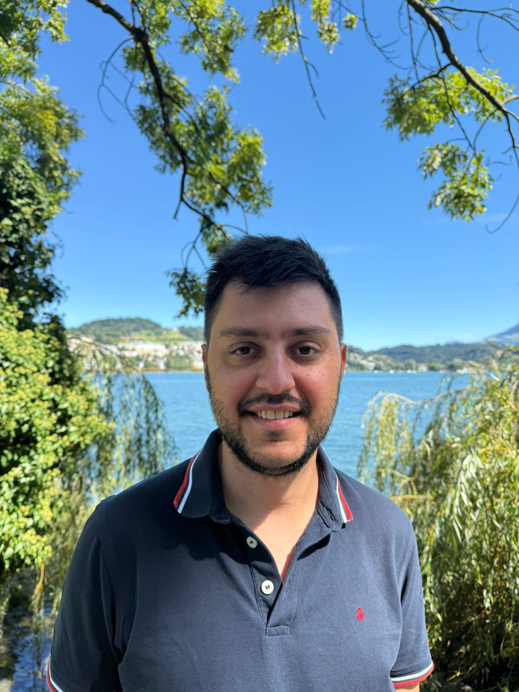
    <div class="meta"><strong>Leonardo Capitani</strong>
      <small><span class="l" lang="it">Fondatore · contatto per l'aceto. Dottorato di ricerca in Ecologia, esperto di analisi dei dati. <a href="https://leomarameo7.github.io">Pagina personale</a></span><span class="l" lang="en">Founder · contact for the vinegar. PhD in Ecology, expert in data analysis. <a href="https://leomarameo7.github.io">Personal page</a></span><span class="l" lang="de">Gründer · Kontakt für den Essig. Promotion in Ökologie, Experte für Datenanalyse. <a href="https://leomarameo7.github.io">Persönliche Seite</a></span><span class="l" lang="es">Fundador · contacto para el vinagre. Doctor en Ecología, experto en análisis de datos. <a href="https://leomarameo7.github.io">Página personal</a></span><span class="l" lang="fr">Fondateur · contact pour le vinaigre. Docteur en écologie, spécialiste de l'analyse de données. <a href="https://leomarameo7.github.io">Page personnelle</a></span><span class="l" lang="pt">Fundador · contato para o vinagre. Doutorado em Ecologia, especialista em análise de dados. <a href="https://leomarameo7.github.io">Página pessoal</a></span></small></div></div>
  <div class="person">
    <div class="meta"><strong>Erika Talita da Silva Gomes</strong>
      <small><span class="l" lang="it">Co-fondatrice · moglie di Leonardo. Laureata in pedagogia; le piace danzare e cucinare.</span><span class="l" lang="en">Co-founder · Leonardo's wife. Degree in pedagogy; she loves dancing and cooking.</span><span class="l" lang="de">Mitgründerin · Leonardos Frau. Abschluss in Pädagogik; sie tanzt und kocht gern.</span><span class="l" lang="es">Cofundadora · esposa de Leonardo. Licenciada en pedagogía; le gusta bailar y cocinar.</span><span class="l" lang="fr">Co-fondatrice · épouse de Leonardo. Diplômée en pédagogie ; elle aime danser et cuisiner.</span><span class="l" lang="pt">Cofundadora · esposa de Leonardo. Formada em pedagogia; gosta de dançar e cozinhar.</span></small></div></div>
  <div class="person">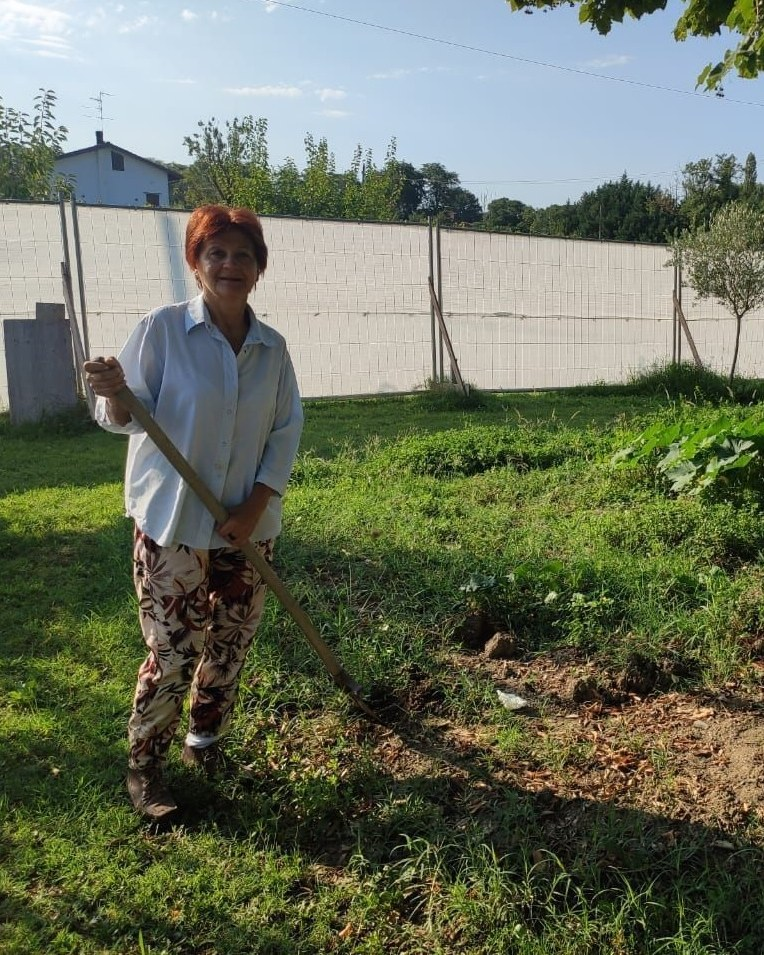
    <div class="meta"><strong>Nara Zanoli</strong>
      <small><span class="l" lang="it">Co-fondatrice · mamma di Leonardo, nonna di Eduardo · contatto per le visite. Insegnante elementare in pensione; le piace leggere, avere cura della campagna e stare in compagnia.</span><span class="l" lang="en">Co-founder · Leonardo's mother, Eduardo's grandmother · contact for visits. Retired primary-school teacher; she loves reading, caring for the countryside and good company.</span><span class="l" lang="de">Mitgründerin · Leonardos Mutter, Eduardos Nonna · Kontakt für Besuche. Grundschullehrerin im Ruhestand; sie liest gern, pflegt das Land und ist gern in Gesellschaft.</span><span class="l" lang="es">Cofundadora · madre de Leonardo, abuela de Eduardo · contacto para las visitas. Maestra de primaria jubilada; le gusta leer, cuidar del campo y estar en compañía.</span><span class="l" lang="fr">Co-fondatrice · maman de Leonardo, grand-mère d'Eduardo · contact pour les visites. Institutrice à la retraite ; elle aime lire, prendre soin de la campagne et être en bonne compagnie.</span><span class="l" lang="pt">Cofundadora · mãe de Leonardo, avó de Eduardo · contato para as visitas. Professora primária aposentada; gosta de ler, de cuidar do campo e de estar em boa companhia.</span></small></div></div>
  <div class="person">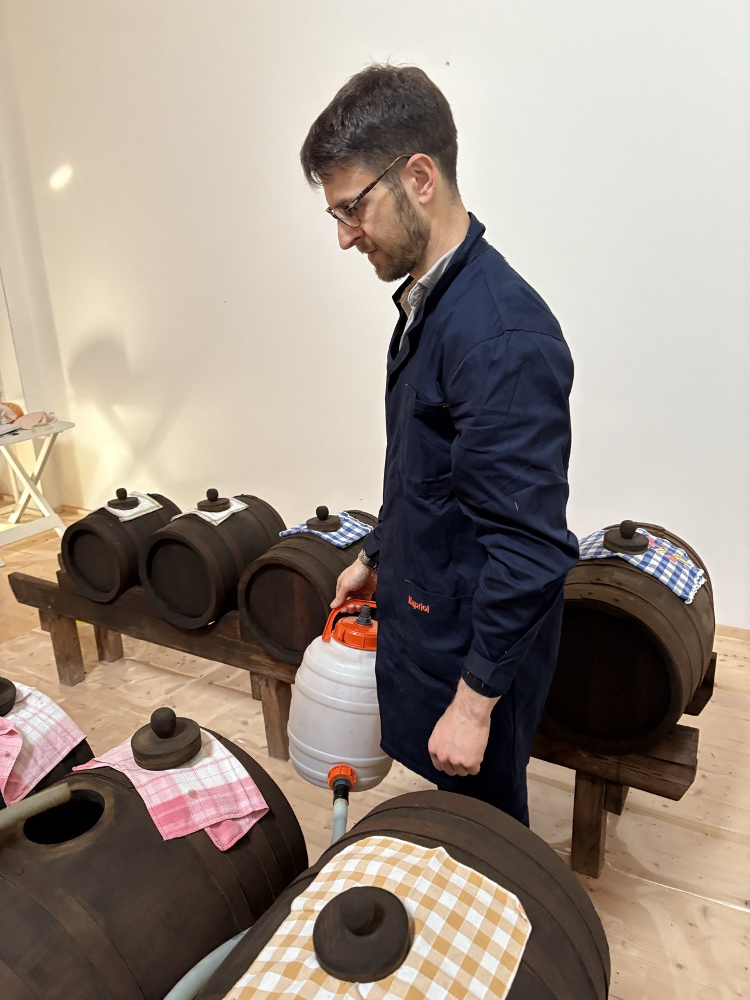
    <div class="meta"><strong>Raffaele Freddi</strong>
      <small><span class="l" lang="it">Amico di famiglia · accompagna ogni passo della produzione</span><span class="l" lang="en">Family friend · accompanies every step of the production</span><span class="l" lang="de">Freund der Familie · begleitet jeden Schritt der Produktion</span><span class="l" lang="es">Amigo de la familia · acompaña cada paso de la producción</span><span class="l" lang="fr">Ami de la famille · il accompagne chaque étape de la production</span><span class="l" lang="pt">Amigo da família · acompanha cada passo da produção</span></small></div></div>
  <div class="person">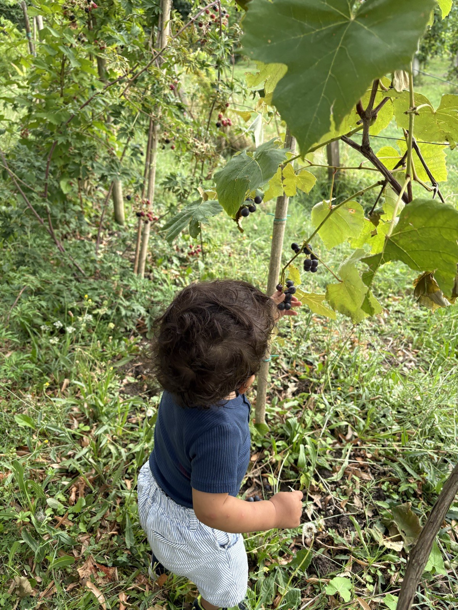
    <div class="meta"><strong>Eduardo</strong>
      <small><span class="l" lang="it">Il più giovane della famiglia</span><span class="l" lang="en">The youngest of the family</span><span class="l" lang="de">Der Jüngste der Familie</span><span class="l" lang="es">El más joven de la familia</span><span class="l" lang="fr">Le plus jeune de la famille</span><span class="l" lang="pt">O mais jovem da família</span></small></div></div>
</div>
```

```{=html}
<p class="eyebrow"><span class="l" lang="it">I nostri valori</span><span class="l" lang="en">Our values</span><span class="l" lang="de">Unsere Werte</span><span class="l" lang="es">Nuestros valores</span><span class="l" lang="fr">Nos valeurs</span><span class="l" lang="pt">Os nossos valores</span></p>
<div class="values">
  <div class="value"><strong><span class="l" lang="it">Insieme l'abbiamo fatta</span><span class="l" lang="en">Together we made it</span><span class="l" lang="de">Gemeinsam gebaut</span><span class="l" lang="es">Juntos la hemos hecho</span><span class="l" lang="fr">Ensemble, nous l'avons créée</span><span class="l" lang="pt">Juntos a construímos</span></strong>
    <span class="l" lang="it">Tre batterie di aceto balsamico acquisite nel 2024 e accudite con pazienza e le mani di tutta la famiglia allargata.</span>
    <span class="l" lang="en">Three batteries of balsamic vinegar acquired in 2024 and cared for with patience and the hands of the whole extended family.</span>
    <span class="l" lang="de">Drei Batterien Balsamessig, 2024 erworben und mit Geduld und den Händen der ganzen erweiterten Familie gepflegt.</span><span class="l" lang="es">Tres baterías de vinagre balsámico adquiridas en 2024 y cuidadas con paciencia y las manos de toda la familia extensa.</span><span class="l" lang="fr">Trois batteries de vinaigre balsamique acquises en 2024 et soignées avec patience et les mains de toute la famille élargie.</span><span class="l" lang="pt">Três baterias de vinagre balsâmico adquiridas em 2024 e cuidadas com paciência e as mãos de toda a família estendida.</span></div>
  <div class="value"><strong><span class="l" lang="it">Insieme la manteniamo</span><span class="l" lang="en">Together we maintain it</span><span class="l" lang="de">Gemeinsam gepflegt</span><span class="l" lang="es">Juntos la mantenemos</span><span class="l" lang="fr">Ensemble, nous l'entretenons</span><span class="l" lang="pt">Juntos cuidamos dela</span></strong>
    <span class="l" lang="it">Misuriamo acidità, densità, temperatura e umidità e registriamo tutto, per capire e migliorare.</span>
    <span class="l" lang="en">We measure acidity, density, temperature and humidity and record everything, to understand and improve.</span>
    <span class="l" lang="de">Wir messen Säure, Dichte, Temperatur und Luftfeuchte und protokollieren alles, um zu verstehen und besser zu werden.</span><span class="l" lang="es">Medimos acidez, densidad, temperatura y humedad, y lo registramos todo, para entender y mejorar.</span><span class="l" lang="fr">Nous mesurons l'acidité, la densité, la température et l'humidité, et nous notons tout, pour comprendre et progresser.</span><span class="l" lang="pt">Medimos acidez, densidade, temperatura e umidade e registramos tudo, para entender e melhorar.</span></div>
  <div class="value"><strong><span class="l" lang="it">Insieme condividiamo e impariamo</span><span class="l" lang="en">Together we share and learn</span><span class="l" lang="de">Gemeinsam teilen und lernen</span><span class="l" lang="es">Juntos compartimos y aprendemos</span><span class="l" lang="fr">Ensemble, nous partageons et apprenons</span><span class="l" lang="pt">Juntos compartilhamos e aprendemos</span></strong>
    <span class="l" lang="it">Con voi e da voi, e con la community del balsamico familiare al vasèl.</span>
    <span class="l" lang="en">With you and from you, and with the al vasèl community of family balsamic makers.</span>
    <span class="l" lang="de">Mit euch und von euch, und mit der al vasèl-Community der Familien-Balsamico-Hersteller.</span><span class="l" lang="es">Con vosotros y de vosotros, y con la comunidad del balsámico familiar al vasèl.</span><span class="l" lang="fr">Avec vous et de vous, et avec la communauté du balsamique familial al vasèl.</span><span class="l" lang="pt">Com vocês e de vocês, e com a comunidade do balsâmico familiar al vasèl.</span></div>
</div>
```

```{=html}
<section class="science">
  <p class="eyebrow"><span class="l" lang="it">Scienza e trasparenza</span><span class="l" lang="en">Science and transparency</span><span class="l" lang="de">Wissenschaft und Transparenz</span><span class="l" lang="es">Ciencia y transparencia</span><span class="l" lang="fr">Science et transparence</span><span class="l" lang="pt">Ciência e transparência</span></p>
  <h2><span class="l" lang="it">La nostra acetaia familiare è anche un laboratorio scientifico</span><span class="l" lang="en">Our family acetaia is also a scientific laboratory</span><span class="l" lang="de">Unsere Familien-Acetaia ist auch ein wissenschaftliches Labor</span><span class="l" lang="es">Nuestra acetaia familiar es también un laboratorio científico</span><span class="l" lang="fr">Notre acetaia familiale est aussi un laboratoire scientifique</span><span class="l" lang="pt">A nossa acetaia familiar também é um laboratório científico</span></h2>
  <p class="l" lang="it">Raccogliamo dati che ci servono per prendere decisioni. Sì, è proprio così: ci basiamo sulla scienza per decidere cosa fare. Siamo convinti che, raccogliendo i dati, possiamo correggere di molto i nostri errori e non ripeterli. Inoltre crediamo nella trasparenza: i dati delle batterie sono a disposizione di tutti, consultabili e scaricabili nell'apposita pagina, e siamo aperti a suggerimenti costruttivi su come migliorare. Crediamo che questo sia il punto peculiare che rende unica e speciale la nostra acetaia.</p>
  <p class="l" lang="en">We collect the data we need to make decisions. Yes, exactly that: we rely on science to decide what to do. We are convinced that by collecting data we can correct our mistakes a great deal and avoid repeating them. We also believe in transparency: the batteries' data are available to everyone, to consult and download on the dedicated page, and we welcome constructive suggestions on how to improve. We believe this is the peculiar trait that makes our acetaia unique and special.</p>
  <p class="l" lang="de">Wir sammeln die Daten, die wir brauchen, um Entscheidungen zu treffen. Ja, genau so: wir stützen uns auf die Wissenschaft, um zu entscheiden, was zu tun ist. Wir sind überzeugt, dass wir durch das Sammeln von Daten unsere Fehler deutlich korrigieren und nicht wiederholen können. Außerdem glauben wir an Transparenz: die Daten der Batterien stehen allen zur Verfügung, einsehbar und herunterladbar auf der eigenen Seite, und wir sind offen für konstruktive Vorschläge, wie wir besser werden können. Wir glauben, dass dies die Besonderheit ist, die unsere Acetaia einzigartig macht.</p><p class="l" lang="es">Recogemos los datos que necesitamos para tomar decisiones. Sí, es exactamente así: nos basamos en la ciencia para decidir qué hacer. Estamos convencidos de que, recogiendo datos, podemos corregir en gran medida nuestros errores y no repetirlos. Además creemos en la transparencia: los datos de las baterías están a disposición de todos, se pueden consultar y descargar en la página correspondiente, y estamos abiertos a sugerencias constructivas sobre cómo mejorar. Creemos que este es el rasgo peculiar que hace única y especial a nuestra acetaia.</p><p class="l" lang="fr">Nous recueillons les données dont nous avons besoin pour prendre nos décisions. Oui, c'est bien cela : nous nous appuyons sur la science pour décider quoi faire. Nous sommes convaincus qu'en recueillant des données, nous pouvons corriger en grande partie nos erreurs et ne pas les répéter. Nous croyons aussi à la transparence : les données des batteries sont à la disposition de tous, consultables et téléchargeables sur la page dédiée, et nous sommes ouverts aux suggestions constructives pour nous améliorer. Nous pensons que c'est là le trait particulier qui rend notre acetaia unique et spéciale.</p><p class="l" lang="pt">Coletamos os dados de que precisamos para tomar decisões. Sim, é isso mesmo: nos baseamos na ciência para decidir o que fazer. Estamos convencidos de que, coletando dados, podemos corrigir em boa parte os nossos erros e não repeti-los. Além disso, acreditamos na transparência: os dados das baterias estão à disposição de todos, podem ser consultados e baixados na página dedicada, e estamos abertos a sugestões construtivas sobre como melhorar. Acreditamos que este seja o ponto peculiar que torna a nossa acetaia única e especial.</p>
  <blockquote class="quote">
    <p>„Un cibo buono, pulito e giusto deve essere trasparente: dobbiamo sapere chi produce il nostro cibo, come lo produce e da dove viene, per restituire valore al lavoro della terra e dignità a chi la coltiva."</p>
    <footer>Carlo Petrini, <a href="https://www.slowfood.it">Slow Food Italia</a> · <span class="l" lang="it">fondatore di Slow Food</span><span class="l" lang="en">founder of Slow Food: "Good, clean and fair food must be transparent: we must know who produces our food, how and where it comes from, to give value back to the work of the land and dignity to those who farm it."</span><span class="l" lang="de">Gründer von Slow Food: „Gutes, sauberes und faires Essen muss transparent sein: wir müssen wissen, wer unser Essen erzeugt, wie und woher es kommt, um der Arbeit auf dem Land ihren Wert und denen, die es bestellen, ihre Würde zurückzugeben."</span><span class="l" lang="es">fundador de Slow Food</span><span class="l" lang="fr">fondateur de Slow Food</span><span class="l" lang="pt">fundador do Slow Food</span></footer>
  </blockquote>
  <p><a class="btn-ai" href="acetaia.qmd#dati"><span class="l" lang="it">Dati aperti: consulta e scarica</span><span class="l" lang="en">Open data: consult and download</span><span class="l" lang="de">Offene Daten: ansehen und herunterladen</span><span class="l" lang="es">Datos abiertos: consulta y descarga</span><span class="l" lang="fr">Données ouvertes : consultez et téléchargez</span><span class="l" lang="pt">Dados abertos: consulte e baixe</span></a></p>
</section>
<div class="callout-ai gold fienile">
  <div class="fienile-icon"><svg viewBox="0 0 64 64" width="56" height="56" aria-hidden="true"><path d="M8 30 L32 10 L56 30 V56 H8 Z" fill="#b98a4b" stroke="#3b2414" stroke-width="2.5" stroke-linejoin="round"/><path d="M8 30 L32 10 L56 30" fill="none" stroke="#3b2414" stroke-width="3"/><rect x="24" y="34" width="16" height="22" rx="2" fill="#5a1e26"/><path d="M24 34 L40 56 M40 34 L24 56" stroke="#f7efe3" stroke-width="2"/><path d="M32 4 v6" stroke="#3b2414" stroke-width="2.5"/><text x="32" y="30" text-anchor="middle" font-size="9" font-weight="700" fill="#2b1a10" font-family="Source Sans 3, sans-serif">6 m</text></svg></div>
  <div><p class="eyebrow"><span class="l" lang="it">Dove stanno le botti</span><span class="l" lang="en">Where the barrels are</span><span class="l" lang="de">Wo die Fässer stehen</span><span class="l" lang="es">Dónde están los barriles</span><span class="l" lang="fr">Où sont les fûts</span><span class="l" lang="pt">Onde ficam os barris</span></p>
  <p><span class="l" lang="it"><strong>Un antico fienile a sei metri di altezza.</strong> L'acetaia è situata a 6 metri di altezza, in un antico fienile ristrutturato. Non è una soffitta, e questo cambia le cose: d'estate non soffre delle temperature estreme, oltre i 35 °C, che si creano nelle soffitte; d'inverno può ricevere più umidità e temperature più basse rispetto a una soffitta. Sono condizioni uniche per l'invecchiamento del balsamico, che seguiamo con le misure di temperatura e umidità.</span><span class="l" lang="en"><strong>An old hayloft six metres up.</strong> The acetaia sits 6 metres above the ground, in an old restored hayloft. It is not an attic, and that changes things: in summer it does not suffer the extreme temperatures, above 35 °C, that build up in attics; in winter it can receive more humidity and lower temperatures than an attic. These are unique conditions for ageing balsamic vinegar, which we follow with temperature and humidity measurements.</span><span class="l" lang="de"><strong>Eine alte Scheune in sechs Metern Höhe.</strong> Die Acetaia liegt 6 Meter über dem Boden, in einer alten, restaurierten Scheune. Es ist kein Dachboden, und das macht den Unterschied: im Sommer leidet sie nicht unter den extremen Temperaturen über 35 °C, die in Dachböden entstehen; im Winter kann sie mehr Feuchtigkeit und niedrigere Temperaturen aufnehmen als ein Dachboden. Das sind einzigartige Bedingungen für die Reifung des Balsamico, die wir mit Temperatur- und Luftfeuchtemessungen verfolgen.</span><span class="l" lang="es"><strong>Un antiguo pajar a seis metros de altura.</strong> La acetaia está situada a 6 metros de altura, en un antiguo pajar restaurado. No es un desván, y eso cambia las cosas: en verano no sufre las temperaturas extremas, por encima de 35 °C, que se crean en los desvanes; en invierno puede recibir más humedad y temperaturas más bajas que un desván. Son condiciones únicas para el envejecimiento del balsámico, que seguimos con las medidas de temperatura y humedad.</span><span class="l" lang="fr"><strong>Une ancienne grange à six mètres de hauteur.</strong> L'acetaia est située à 6 mètres de hauteur, dans une ancienne grange restaurée. Ce n'est pas un grenier, et cela change tout : en été, elle ne subit pas les températures extrêmes, au-delà de 35 °C, qui se créent dans les greniers ; en hiver, elle peut recevoir plus d'humidité et des températures plus basses qu'un grenier. Ce sont des conditions uniques pour le vieillissement du balsamique, que nous suivons avec les mesures de température et d'humidité.</span><span class="l" lang="pt"><strong>Um antigo celeiro a seis metros de altura.</strong> A acetaia fica a 6 metros de altura, em um antigo celeiro restaurado. Não é um sótão, e isso muda tudo: no verão não sofre as temperaturas extremas, acima de 35 °C, que se formam nos sótãos; no inverno pode receber mais umidade e temperaturas mais baixas do que um sótão. São condições únicas para o envelhecimento do balsâmico, que acompanhamos com as medições de temperatura e umidade.</span></p></div>
</div>
```

::: {.l lang=it}
<p class="eyebrow">Il territorio</p>
## Il fiume Secchia e le terre a nord di Modena

L'acetaia si trova a Cavezzo, nella pianura a nord di Modena, lungo il fiume Secchia, simbolo di queste terre. Un tempo qui c'erano paludi e acquitrini; poi le bonifiche hanno disegnato i campi, i filari e gli argini che vediamo oggi, e questa pianura è diventata uno dei centri della produzione del balsamico. Le nostre foto raccontano le stagioni del posto: il Secchia in piena a marzo, i frutteti in fiore, le api sul tarassaco.
:::

::: {.l lang=en}
<p class="eyebrow">The land</p>
## The Secchia river and the plain north of Modena

The acetaia is in Cavezzo, in the plain north of Modena, along the Secchia river, a symbol of this land. This used to be marsh and wetland; land reclamation then drew the fields, vine rows and embankments we see today, and the plain became one of the centres of balsamic vinegar production. Our photos follow the seasons here: the Secchia in flood in March, the orchards in bloom, the bees on dandelions.
:::

::: {.l lang=de}
<p class="eyebrow">Die Gegend</p>
## Der Fluss Secchia und die Ebene nördlich von Modena

Die Acetaia liegt in Cavezzo, in der Ebene nördlich von Modena, am Fluss Secchia, einem Symbol dieser Gegend. Früher waren hier Sümpfe und Feuchtgebiete; die Trockenlegung hat die Felder, Rebzeilen und Deiche gezeichnet, die wir heute sehen, und die Ebene wurde zu einem der Zentren der Balsamico-Produktion. Unsere Fotos zeigen die Jahreszeiten hier: den Hochwasser führenden Secchia im März, die blühenden Obstgärten, die Bienen auf dem Löwenzahn.
:::
::: {.l lang=es}
<p class="eyebrow">El territorio</p>
## El río Secchia y las tierras al norte de Módena

La acetaia se encuentra en Cavezzo, en la llanura al norte de Módena, junto al río Secchia, símbolo de estas tierras. Antaño aquí había pantanos y marismas; después las obras de saneamiento dibujaron los campos, las hileras de viñas y los diques que vemos hoy, y esta llanura se convirtió en uno de los centros de producción del balsámico. Nuestras fotos cuentan las estaciones del lugar: el Secchia en crecida en marzo, los frutales en flor, las abejas sobre el diente de león.
:::
::: {.l lang=fr}
<p class="eyebrow">Le territoire</p>
## Le fleuve Secchia et les terres au nord de Modène

L'acetaia se trouve à Cavezzo, dans la plaine au nord de Modène, le long du fleuve Secchia, symbole de ces terres. Autrefois, il y avait ici des marais et des marécages ; puis les travaux d'assèchement ont dessiné les champs, les rangs de vigne et les digues que nous voyons aujourd'hui, et cette plaine est devenue l'un des centres de la production du balsamique. Nos photos racontent les saisons du lieu : le Secchia en crue en mars, les vergers en fleurs, les abeilles sur les pissenlits.
:::
::: {.l lang=pt}
<p class="eyebrow">O território</p>
## O rio Secchia e as terras ao norte de Módena

A acetaia fica em Cavezzo, na planície ao norte de Módena, ao longo do rio Secchia, símbolo destas terras. Antigamente aqui havia pântanos e brejos; depois as obras de drenagem desenharam os campos, as fileiras de videiras e os diques que vemos hoje, e esta planície se tornou um dos centros da produção do balsâmico. As nossas fotos contam as estações do lugar: o Secchia em cheia em março, os pomares em flor, as abelhas no dente-de-leão.
:::

```{=html}
<div class="gallery">
  <figure class="wide">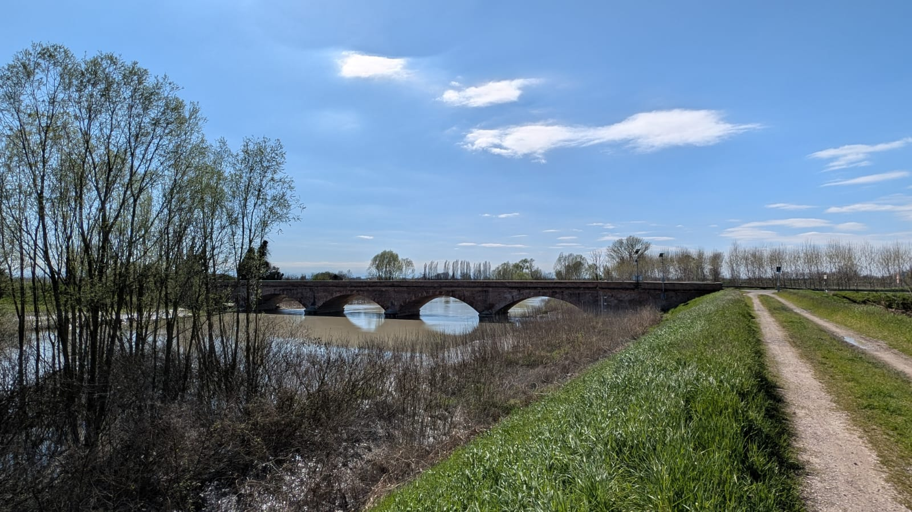<figcaption><span class="l" lang="it">Il Secchia in piena, marzo 2025</span><span class="l" lang="en">The Secchia in flood, March 2025</span><span class="l" lang="de">Der Secchia bei Hochwasser, März 2025</span><span class="l" lang="es">El Secchia en crecida, marzo de 2025</span><span class="l" lang="fr">Le Secchia en crue, mars 2025</span><span class="l" lang="pt">O Secchia em cheia, março de 2025</span></figcaption></figure>
  <figure>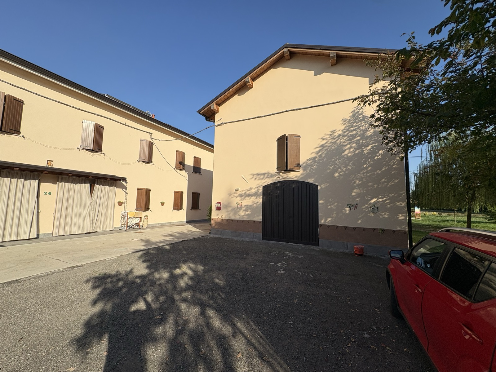<figcaption><span class="l" lang="it">L'acetaia vista dall'esterno</span><span class="l" lang="en">The acetaia from outside</span><span class="l" lang="de">Die Acetaia von außen</span><span class="l" lang="es">La acetaia vista desde fuera</span><span class="l" lang="fr">L'acetaia vue de l'extérieur</span><span class="l" lang="pt">A acetaia vista de fora</span></figcaption></figure>
  <figure>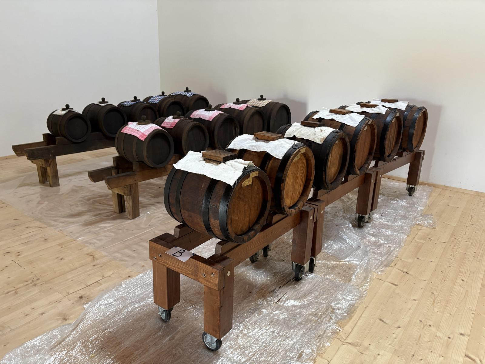<figcaption><span class="l" lang="it">Le batterie nel fienile</span><span class="l" lang="en">The batteries in the hayloft</span><span class="l" lang="de">Die Batterien in der Scheune</span><span class="l" lang="es">Las baterías en el pajar</span><span class="l" lang="fr">Les batteries dans la grange</span><span class="l" lang="pt">As baterias no celeiro</span></figcaption></figure>
  <figure class="tall">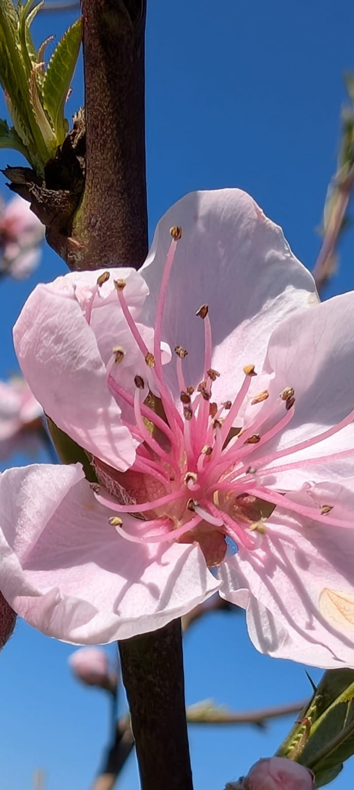<figcaption><span class="l" lang="it">Fiore di pesco</span><span class="l" lang="en">Peach blossom</span><span class="l" lang="de">Pfirsichblüte</span><span class="l" lang="es">Flor de melocotonero</span><span class="l" lang="fr">Fleur de pêcher</span><span class="l" lang="pt">Flor de pessegueiro</span></figcaption></figure>
  <figure>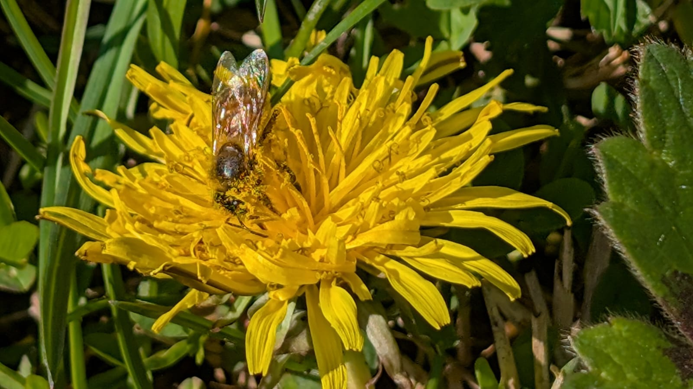<figcaption><span class="l" lang="it">Ape sul tarassaco</span><span class="l" lang="en">Bee on a dandelion</span><span class="l" lang="de">Biene auf Löwenzahn</span><span class="l" lang="es">Abeja sobre el diente de león</span><span class="l" lang="fr">Abeille sur un pissenlit</span><span class="l" lang="pt">Abelha no dente-de-leão</span></figcaption></figure>
  <figure>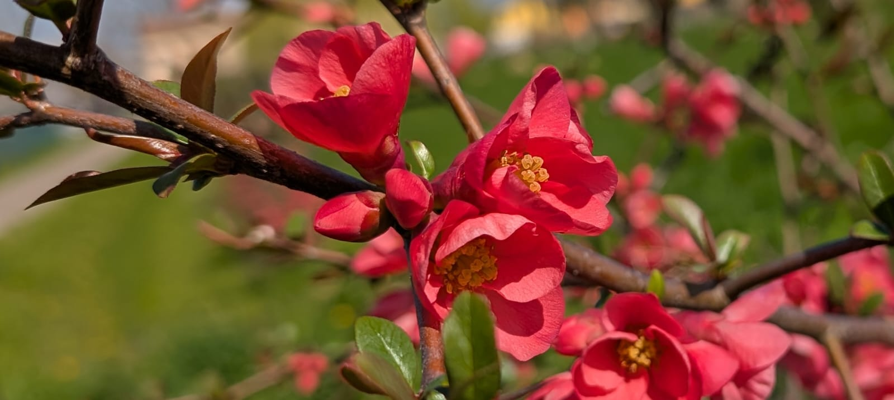<figcaption><span class="l" lang="it">Cotogno in fiore</span><span class="l" lang="en">Flowering quince</span><span class="l" lang="de">Zierquitte in Blüte</span><span class="l" lang="es">Membrillo en flor</span><span class="l" lang="fr">Cognassier en fleurs</span><span class="l" lang="pt">Marmeleiro em flor</span></figcaption></figure>
</div>
```

```{=html}
<div class="callout-ai wwoof">
  <a href="https://wwoof.it/en/host/16611" class="wwoof-logo">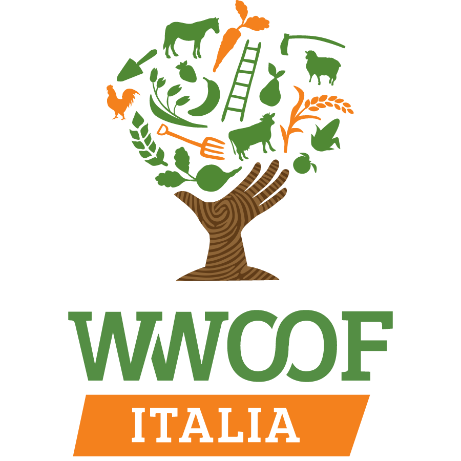</a>
  <div>
  <p class="eyebrow">WWOOF</p>
  <p class="l" lang="it"><strong>Vieni a fare un'esperienza WWOOF da noi.</strong> Siamo host della rete WWOOF Italia: orto, campagna, acetaia e tavola in famiglia. Trovi il nostro profilo e le modalità su <a href="https://wwoof.it/en/host/16611">wwoof.it (host 16611)</a>.</p>
  <p class="l" lang="en"><strong>Come for a WWOOF experience with us.</strong> We are hosts in the WWOOF Italia network: vegetable garden, countryside, acetaia and family table. Our profile and the details are on <a href="https://wwoof.it/en/host/16611">wwoof.it (host 16611)</a>.</p>
  <p class="l" lang="de"><strong>Komm für eine WWOOF-Erfahrung zu uns.</strong> Wir sind Gastgeber im Netzwerk WWOOF Italia: Gemüsegarten, Land, Acetaia und Familientisch. Unser Profil und die Einzelheiten findest du auf <a href="https://wwoof.it/en/host/16611">wwoof.it (Host 16611)</a>.</p><p class="l" lang="es"><strong>Ven a vivir una experiencia WWOOF con nosotros.</strong> Somos anfitriones de la red WWOOF Italia: huerto, campo, acetaia y mesa en familia. Encontrarás nuestro perfil y las condiciones en <a href="https://wwoof.it/en/host/16611">wwoof.it (host 16611)</a>.</p><p class="l" lang="fr"><strong>Venez vivre une expérience WWOOF chez nous.</strong> Nous sommes hôtes du réseau WWOOF Italia : potager, campagne, acetaia et table en famille. Vous trouverez notre profil et les modalités sur <a href="https://wwoof.it/en/host/16611">wwoof.it (hôte 16611)</a>.</p><p class="l" lang="pt"><strong>Venham viver uma experiência WWOOF conosco.</strong> Somos anfitriões da rede WWOOF Italia: horta, campo, acetaia e mesa em família. Vocês encontram o nosso perfil e as condições em <a href="https://wwoof.it/en/host/16611">wwoof.it (host 16611)</a>.</p>
  </div>
</div>
```

```{=html}
<div class="callout-ai gold">
  <p class="eyebrow"><span class="l" lang="it">La community</span><span class="l" lang="en">The community</span><span class="l" lang="de">Die Community</span><span class="l" lang="es">La comunidad</span><span class="l" lang="fr">La communauté</span><span class="l" lang="pt">A comunidade</span></p>
  <p class="l" lang="it">Facciamo parte della <a href="https://www.alvasel.com">community del Balsamico familiare al vasèl</a>, dove condividiamo quello che sappiamo e impariamo dalle altre famiglie che producono aceto. Se vuoi conoscere nel dettaglio come si fa l'aceto balsamico, sul <a href="https://www.youtube.com/c/alvasel">canale YouTube al vasèl</a> Max Forni lo spiega passo per passo (in italiano).</p>
  <p class="l" lang="en">We are part of the <a href="https://www.alvasel.com">al vasèl community of family balsamic makers</a>, where we share what we know and learn from other families who make vinegar. If you want to know in detail how balsamic vinegar is made, on the <a href="https://www.youtube.com/c/alvasel">al vasèl YouTube channel</a> Max Forni explains it step by step (in Italian).</p>
  <p class="l" lang="de">Wir sind Teil der <a href="https://www.alvasel.com">al vasèl-Community des familiären Balsamico</a>, in der wir unser Wissen teilen und von anderen Familien lernen, die Essig herstellen. Wer im Detail wissen möchte, wie Balsamessig entsteht: auf dem <a href="https://www.youtube.com/c/alvasel">YouTube-Kanal al vasèl</a> erklärt es Max Forni Schritt für Schritt (auf Italienisch).</p><p class="l" lang="es">Formamos parte de la <a href="https://www.alvasel.com">comunidad del Balsámico familiar al vasèl</a>, donde compartimos lo que sabemos y aprendemos de las otras familias que producen vinagre. Si quieres conocer en detalle cómo se hace el vinagre balsámico, en el <a href="https://www.youtube.com/c/alvasel">canal de YouTube al vasèl</a> Max Forni lo explica paso a paso (en italiano).</p><p class="l" lang="fr">Nous faisons partie de la <a href="https://www.alvasel.com">communauté du Balsamique familial al vasèl</a>, où nous partageons ce que nous savons et apprenons des autres familles qui produisent du vinaigre. Si vous voulez savoir en détail comment se fait le vinaigre balsamique, sur la <a href="https://www.youtube.com/c/alvasel">chaîne YouTube al vasèl</a> Max Forni l'explique pas à pas (en italien).</p><p class="l" lang="pt">Fazemos parte da <a href="https://www.alvasel.com">comunidade do Balsâmico familiar al vasèl</a>, onde compartilhamos o que sabemos e aprendemos com as outras famílias que produzem vinagre. Se vocês quiserem conhecer em detalhe como se faz o vinagre balsâmico, no <a href="https://www.youtube.com/c/alvasel">canal do YouTube al vasèl</a> Max Forni explica passo a passo (em italiano).</p>
</div>
```

::: {.l lang=it}
### Esplora il sito

- [L'acetaia](acetaia.qmd): le tre batterie A, B e C, i legni, le misure di acidità e densità, il volume stimato delle botti, le condizioni all'interno dell'acetaia e, nella scheda *Cronologia*, il cronogramma delle azioni compiute dal 2024.
- [Imparare](imparare.qmd): che cos'è il balsamico, la mappa di Modena e Reggio Emilia, le formule per il volume delle botti, la luna e le regole per chi vuole vendere.
- [Album](album.qmd): le foto della nostra attività.
- [Contatti](contatti.qmd): per l'aceto e per le visite in acetaia.
:::

::: {.l lang=en}
### Explore the site

- [The acetaia](acetaia.qmd): the three batteries A, B and C, the woods, acidity and density measurements, the estimated barrel volumes, the conditions inside the acetaia and, in the *Timeline* tab, the chronogram of everything done since 2024.
- [Learn](imparare.qmd): what balsamic vinegar is, the map of Modena and Reggio Emilia, the formulas for barrel volume, the moon and the rules for those who want to sell.
- [Album](album.qmd): photos of our activity.
- [Contact](contatti.qmd): for the vinegar and for visits to the acetaia.
:::

::: {.l lang=de}
### Die Seite entdecken

- [Die Acetaia](acetaia.qmd): die drei Batterien A, B und C, die Hölzer, Säure- und Dichtemessungen, das geschätzte Fassvolumen, die Bedingungen im Inneren der Acetaia und, im Reiter *Chronik*, das Chronogramm aller Arbeiten seit 2024.
- [Lernen](imparare.qmd): was Balsamessig ist, die Karte von Modena und Reggio Emilia, die Formeln für das Fassvolumen, der Mond und die Regeln für den Verkauf.
- [Album](album.qmd): Fotos unserer Tätigkeit.
- [Kontakt](contatti.qmd): für den Essig und für Besuche in der Acetaia.
:::
::: {.l lang=es}
### Explora el sitio

- [La acetaia](acetaia.qmd): las tres baterías A, B y C, las maderas, las medidas de acidez y densidad, el volumen estimado de los barriles, las condiciones en el interior de la acetaia y, en la pestaña *Cronología*, el cronograma de las acciones realizadas desde 2024.
- [Aprender](imparare.qmd): qué es el balsámico, el mapa de Módena y Reggio Emilia, las fórmulas para el volumen de los barriles, la luna y las reglas para quien quiera vender.
- [Álbum](album.qmd): las fotos de nuestra actividad.
- [Contacto](contatti.qmd): para el vinagre y para las visitas a la acetaia.
:::
::: {.l lang=fr}
### Explorez le site

- [L'acetaia](acetaia.qmd) : les trois batteries A, B et C, les bois, les mesures d'acidité et de densité, le volume estimé des fûts, les conditions à l'intérieur de l'acetaia et, dans l'onglet *Chronologie*, le calendrier des actions menées depuis 2024.
- [Apprendre](imparare.qmd) : ce qu'est le balsamique, la carte de Modène et Reggio Emilia, les formules pour le volume des fûts, la lune et les règles pour qui veut vendre.
- [Album](album.qmd) : les photos de notre activité.
- [Contacts](contatti.qmd) : pour le vinaigre et pour les visites de l'acetaia.
:::
::: {.l lang=pt}
### Explore o site

- [A acetaia](acetaia.qmd): as três baterias A, B e C, as madeiras, as medidas de acidez e densidade, o volume estimado dos barris, as condições no interior da acetaia e, na aba *Cronologia*, o cronograma das ações realizadas desde 2024.
- [Aprender](imparare.qmd): o que é o balsâmico, o mapa de Módena e Reggio Emilia, as fórmulas para o volume dos barris, a lua e as regras para quem quer vender.
- [Álbum](album.qmd): as fotos da nossa atividade.
- [Contatos](contatti.qmd): para o vinagre e para as visitas à acetaia.
:::
